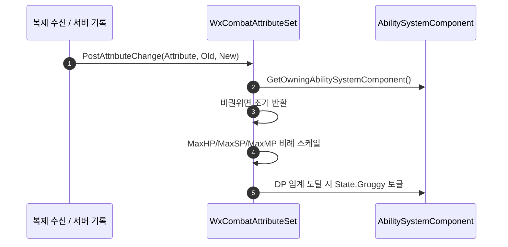

# PostAttributeChange 권위 게이트 통일 + AbilitySet 어트리뷰트 초기화 순서 정정

## 계획

### 목표

WxCombat 모듈 리뷰의 두 발견을 함께 고친다. `PostAttributeChange`의 권위 게이트를 훅 단위로 통일해 파생 갱신이 서버에서만 일어나게 하고, `GiveToAbilitySystem`의 어트리뷰트 초기화 순서를 Max 선행으로 바꿔 재부여 시 테이블 값이 덮어써지는 문제를 없앤다.

### 수정 범위

| 파일 | 수정할 내용 | 구분 |
|---|---|---|
| `Plugins/WxCombat/Source/WxCombat/Private/AbilitySystem/Attribute/WxCombatAttributeSet.cpp` | `PostAttributeChange` 상단에 ASC·권위 검사 후 조기 반환을 두고, DP 분기 안의 개별 게이트를 제거 | 수정 |
| `Plugins/WxCombat/Source/WxCombat/Private/AbilitySystem/WxAbilitySet.cpp` | `GiveToAbilitySystem`의 어트리뷰트 초기화에서 각 쌍의 Max를 현재값보다 먼저 세팅하도록 순서 교환 | 수정 |

### 접근 방식

- **분기별 게이트 → 훅 단위 게이트**: `Super::PostAttributeChange` 직후 ASC를 한 번 얻고 비권위면 조기 반환한다. Max HP/SP/MP 비례 스케일 세 분기가 권위 측에서만 돌고, DP 분기는 확보한 ASC를 재사용해 중첩이 한 단계 풀린다.

  반대 방향(DP 분기의 게이트 제거)은 채택하지 않았다. DP 분기는 어트리뷰트가 아니라 `EGameplayTagReplicationState::TagOnly` 루즈 태그를 건드리고, 그 태그는 이미 서버에서 복제돼 온다. 게이트를 빼면 클라가 서버 소유 상태의 두 번째 저자가 되어 `State.Groggy` 깜빡임을 만들고, 그 깜빡임이 `WxExecCalc_Damage`의 그로기 배율과 `WxAbility_Ultimate`의 `ActivationBlockedTags`까지 샌다.

- **Max 먼저 세팅**: Vital·Resource 초기화를 쌍 단위로 뒤집는다(MaxHP→HP, MaxSP→SP, MaxDP→DP, MaxMP→MP, MaxUP→UP). 짝이 없는 Combat 계열은 그대로 둔다. 쌍끼리는 서로 참조하지 않으므로 블록 재배치 없이 쌍 안에서만 교환한다.

---

## 완료

### 수정한 파일
| 파일 | 수정한 내용 | 구분 |
|---|---|---|
| `Plugins/WxCombat/Source/WxCombat/Private/AbilitySystem/Attribute/WxCombatAttributeSet.cpp` | `PostAttributeChange` 상단에 ASC·권위 검사 조기 반환 추가, DP 분기의 개별 게이트 제거 | 수정 |
| `Plugins/WxCombat/Source/WxCombat/Private/AbilitySystem/WxAbilitySet.cpp` | `GiveToAbilitySystem`의 Vital·Resource 다섯 쌍을 Max 선행으로 교환 | 수정 |

### 구현·결정과 그 이유
- **게이트를 빼는 대신 다는 쪽으로 통일**: 두 분기가 다루는 상태의 종류가 다르다. Max 분기는 복제되는 어트리뷰트를 써서 클라의 오차가 다음 rep로 자가 치유되지만, DP 분기는 이미 서버에서 복제돼 오는 루즈 태그를 건드린다. 게이트를 빼면 클라가 서버 소유 상태의 두 번째 저자가 되어 태그 깜빡임이 생기고, 그것이 그로기 피해 배율과 궁극기 발동 차단까지 샌다.
- **게이트를 훅 단위로**: 분기마다 같은 검사를 반복하는 대신 한 곳에 두어, 네 분기가 하나의 규칙 아래 놓이고 DP 분기의 중첩도 풀렸다.
- **null ASC도 조기 반환**: `Set*` 접근자가 `GetOwningAbilitySystemComponentChecked()`를 타므로 ASC가 null이면 원래 check 실패였다. 조기 반환은 그 경로를 무해한 no-op으로 바꾼다.
- **`GetMaxDP() > 0.f`를 `else if` 조건으로 흡수**: 뒤따르는 분기가 없어 동작이 같고, 중첩이 한 단계 줄어든다.
- **쌍 안에서만 교환**: Max 전체를 앞으로 몰지 않았다. 쌍끼리는 서로 참조하지 않아 필요가 없고, Vital/Resource 묶음의 가독성이 유지된다.

### 계획 대비 달라진 점
- 계획대로.

### 후속 과제
- 리뷰 발견 7의 나머지(데드 코드인 `RemoveFromAbilitySystem`, `GiveToAbilitySystem` 재진입 가드)는 별건으로 남겼다.
- 런타임 확인 미실시(빌드 검증만). 리슨 서버 2인 PIE에서 ① 적 DP를 최대까지 채워 클라 화면의 그로기 진입·해제가 깜빡임 없이 한 번씩만 일어나는지, ② 리스폰 등으로 `InitAbilitySystem`이 두 번 도는 상황에서 HP/MaxHP가 데이터테이블 값 그대로 복구되는지 확인이 남았다.
