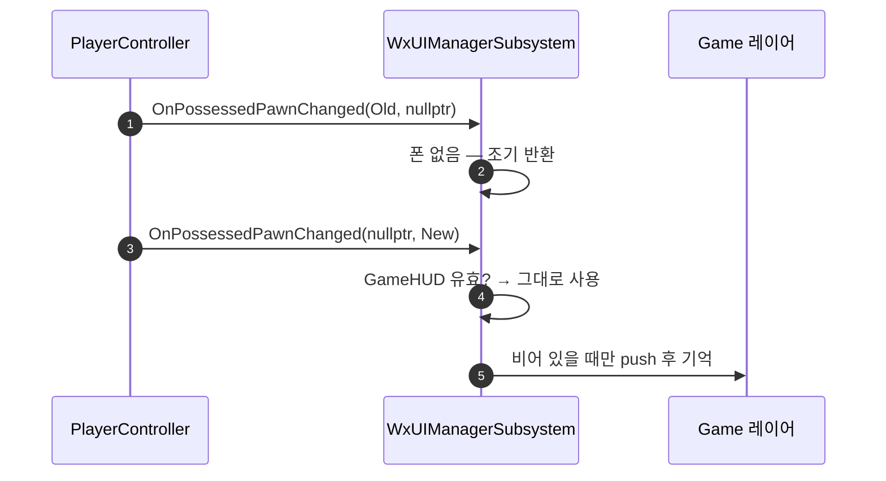

# WxUI 인디케이터 매 틱 해석·HUD 중복 push 수정

## 계획

### 목표

WxUI 모듈 리뷰의 발견 5·2를 고친다. 인디케이터가 이미 등록된 대상까지 매 틱 로케이터를 다시 해석하는 비용을 없애고, 폰 재빙의마다 HUD가 Game 레이어에 쌓이는 누적을 없앤다. (발견 4 — 어빌리티 VM 재평가 — 는 이번 범위에서 제외한다.)

### 수정 범위

| 파일 | 수정할 내용 | 구분 |
|---|---|---|
| `Plugins/WxUI/Source/WxUI/Private/Indicator/WxIndicatorStateTreeNodes.cpp` | `RefreshIndicators`에서 등록증·대상이 모두 유효하면 해석을 건너뛰도록 순서 교체 | 수정 |
| `Plugins/WxUI/Source/WxUI/Private/System/WxUIManagerSubsystem.cpp` | push한 HUD 인스턴스를 기억해 재빙의 시 재사용, layout 재생성 시 기억 해제 | 수정 |
| `Plugins/WxUI/Source/WxUI/Public/System/WxUIManagerSubsystem.h` | `GameHUD` 약참조 멤버 추가 | 수정 |

### 접근 방식

- **인디케이터 — 무효할 때만 해석**: 루프를 "등록증과 그 대상이 모두 살아 있으면 곧장 다음 대상으로" 순서로 바꾼다. 등록증 유효성만으로는 부족하다 — 매니저는 대상이 파괴돼도 표시만 접고 등록증은 남기므로, 공개 접근자 `GetTargetComponent()`로 대상 컴포넌트까지 확인한다. 정상 표시 중에는 `SyncFind`가 아예 돌지 않고, 미해석 대상만 지금처럼 매 틱 재시도한다.

  부수 효과로 스트리밍 아웃됐다 돌아온 대상이 다시 등록된다 — 지금은 낡은 등록증이 유효하다는 이유로 건너뛰어 죽은 컴포넌트를 영영 가리킨다.

- **HUD — push한 인스턴스 기억**: `DialogueScreen`과 같은 모양으로 `GameHUD` 약참조를 둔다. 유효하면 push하지 않고 그대로 쓰고, 비어 있을 때만 push하고 반환값을 기억한다. layout 파기 지점에서는 `GameHUD.Reset()` — 위젯이 곧바로 GC되지 않아 약참조가 한동안 유효할 수 있는데, 그대로 두면 새 layout에 HUD를 push하지 않아 HUD가 통째로 사라진다.

---

## 완료

### 수정한 파일
| 파일 | 수정한 내용 | 구분 |
|---|---|---|
| `Plugins/WxUI/Source/WxUI/Private/Indicator/WxIndicatorStateTreeNodes.cpp` | `RefreshIndicators` 루프를 유효성 검사 선행으로 교체, `Components/SceneComponent.h` 추가, 함수 주석 정정 | 수정 |
| `Plugins/WxUI/Source/WxUI/Private/System/WxUIManagerSubsystem.cpp` | HUD push를 `GameHUD`가 비었을 때로 한정하고 반환값을 기억, layout 파기 시 `GameHUD.Reset()` | 수정 |
| `Plugins/WxUI/Source/WxUI/Public/System/WxUIManagerSubsystem.h` | `GameHUD` 약참조 멤버 추가 | 수정 |

### 구현·결정과 그 이유
- **등록증만이 아니라 대상 컴포넌트까지 확인**: 매니저는 대상이 파괴돼도 표시만 접고 등록증은 남긴다(등록증 제거는 등록한 쪽의 몫). 등록증 유효성만 보면 죽은 대상을 살아 있다고 오판해 재등록 기회를 영영 놓친다.
- **해석 전에 낡은 등록증을 먼저 해제**: 해제와 재발급을 한 흐름에 두어, 스트리밍 아웃됐다 돌아온 대상이 새 컴포넌트로 다시 등록된다. 기존 코드는 낡은 등록증이 유효하다는 이유로 건너뛰어 죽은 컴포넌트를 계속 가리켰다.
- **`!Target || !Manager` 를 한 조건으로 병합**: 해제를 앞으로 뺐으므로 두 실패가 같은 처리(다음 대상으로)로 수렴한다.
- **`Components/SceneComponent.h` 명시 포함**: `IsValid(USceneComponent*)` 의 기반 클래스 변환에 완전한 타입이 필요한데, 등록증 헤더는 전방 선언만 한다.
- **layout 파기 지점에서 `GameHUD.Reset()`**: 위젯이 곧바로 GC되지 않아 약참조가 한동안 유효할 수 있다. 그대로 두면 새 layout에 HUD를 push하지 않아 HUD가 통째로 빠진다.

### 계획 대비 달라진 점
- 계획대로.

### 후속 과제
- 리뷰 발견 4(어빌리티 VM의 발동 가능 재평가가 제네릭 태그 이벤트·매 틱 GE 질의에 얹힌 문제)는 이번 범위에서 제외했다. 참고로 `ActivationRequiredTags`/`ActivationBlockedTags`는 `UGameplayAbility`에서 protected라 뷰모델이 직접 읽을 수 없고, 같은 판정을 하는 공개 함수는 `DoesAbilitySatisfyTagRequirements` 다.
- 런타임 확인 미실시(빌드 검증만). ① 인디케이터 대상이 스트리밍 아웃/인될 때 표시가 사라졌다 돌아오는지, ② 탈것 등으로 언포제스→포제스를 왕복해도 Game 레이어의 HUD가 하나만 남는지 확인이 남았다.
