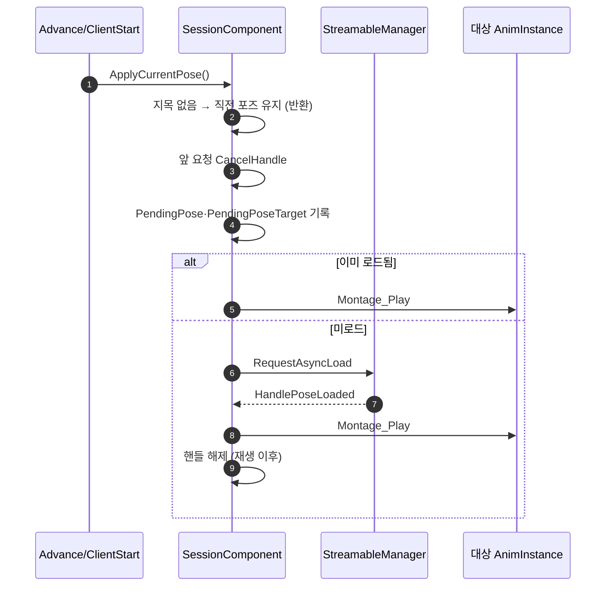

# 대화 행의 포즈 몽타주를 소프트 참조 + 비동기 스트리밍으로 전환

## 계획

### 목표
`FWxDialogueTableRow::TargetPose` 가 `TObjectPtr<UAnimMontage>` 하드 참조라, 대화 테이블이 로드되는 순간 그 테이블 모든 행의 포즈 몽타주(와 그것이 끌고 오는 스켈레톤·애님 시퀀스)가 함께 로드된다. 테이블은 배치 NPC 의 `UWxDialogueComponent::StartRow` 핸들이 하드로 붙잡아 레벨과 함께 상주하므로, 말을 걸기 전부터 전부 메모리에 있다. 소프트 참조로 떼어내고 재생 시점에 비동기 스트리밍한다.

### 수정 범위
| 파일 | 수정할 내용 | 구분 |
|---|---|---|
| `Plugins/WxDialogue/.../Public/WxDialogueTableRow.h` | `TargetPose` 를 `TSoftObjectPtr<UAnimMontage>` 로 전환, 주석 갱신 | 수정 |
| `Plugins/WxDialogue/.../Public/WxDialogueSessionComponent.h` | `HandlePoseLoaded`·`PlayPendingPose` 선언, `PendingPose`·`PendingPoseTarget`·`PoseLoadHandle` 멤버 추가 | 수정 |
| `Plugins/WxDialogue/.../Private/WxDialogueSessionComponent.cpp` | `ApplyCurrentPose` 를 비동기 요청으로 재구성, 완료 콜백·재생 헬퍼 추가 | 수정 |
| `Plugins/WxDialogue/README.md` | 확장 포인트 "새 대화" 항에 포즈 지연 로드 명시 | 수정 |

### 접근 방식
- **기존 스트리밍 패턴을 그대로 따른다**: `UWxViewModel::RequestImageAsync`(`Plugins/WxUI/.../MVVM/WxViewModel.cpp:26-72`)가 이미 같은 문제를 푼다 — 재요청 시 이전 핸들 `CancelHandle`, 요청 대상을 `Pending` 에 기억해 완료 콜백이 그것을 해석, 이미 로드돼 있으면 스트리밍 없이 즉시 반영. 세션도 같은 모양으로 만든다.
- **요청이 대상까지 기억한다**: 완료 콜백은 인자를 받지 않으므로 `PendingPose`(무엇을)와 `PendingPoseTarget`(누구에게)을 요청 시점에 남긴다. 이래야 세션이 닫힌 뒤 늦게 도착한 포즈도 제 대상에 얹힌다.
- **세션 종료가 스트리밍을 취소하지 않는다**: 포즈는 대화가 끝나도 거두지 않는 것이 설계이고(`WxDialogueSessionComponent.h:37`), 실제로 `DT_Dialogue` 의 마지막 행이 `AM_Death` 를 지목한다. 종료 시 취소하면 마지막 자세가 영영 안 나올 수 있다. 취소는 다음 대사가 포즈를 새로 지목할 때만 한다.
- **GC**: 재생 중인 몽타주는 `UAnimInstance::AddReferencedObjects` → `FAnimMontageInstance::AddReferencedObjects` 가 잡으므로(엔진 `AnimInstance.cpp:4551`, `AnimMontage.cpp:1735`) 세션이 수명을 들 필요가 없다. 다만 스트리밍 핸들은 재생을 **시작한 뒤에** 놓는다 — 그 전까지 몽타주를 붙잡는 것은 핸들뿐이다.
- **데이터·쿠킹**: `FSoftObjectProperty::ConvertFromType` 이 `NAME_ObjectProperty` 를 명시적으로 변환하므로(엔진 `PropertySoftObjectPtr.cpp:220-226`) `DT_Dialogue` 의 `AM_Death` 링크는 보존된다. UPROPERTY 소프트 참조는 애셋 레지스트리 의존이라 쿠커가 따라가며, 이 프로젝트는 이미 같은 모양에 의존한다(`DT_Reward` 의 `FWxItemRewardEntry::Item`).

---

## 완료

### 수정한 파일
| 파일 | 수정한 내용 | 구분 |
|---|---|---|
| `Plugins/WxDialogue/.../Public/WxDialogueTableRow.h` | `TargetPose` 를 `TSoftObjectPtr<UAnimMontage>` 로 전환, 소프트인 이유를 주석에 명시 | 수정 |
| `Plugins/WxDialogue/.../Public/WxDialogueSessionComponent.h` | `HandlePoseLoaded`·`PlayPendingPose` 선언, `PendingPose`·`PendingPoseTarget`·`PoseLoadHandle` 멤버 추가, `UAnimMontage`·`FStreamableHandle` 전방 선언 | 수정 |
| `Plugins/WxDialogue/.../Private/WxDialogueSessionComponent.cpp` | `ApplyCurrentPose` 를 취소→기록→(로드됨 즉시 / 미로드 비동기)로 재구성, 완료 콜백·재생 헬퍼 추가, `EndDialogue` 주석 보강 | 수정 |
| `Plugins/WxDialogue/README.md` | 확장 포인트 "새 대화" 항에 포즈 지연 로드 명시 | 수정 |
| `Content/DesignerTables/DT_Dialogue.uasset` | `ResavePackages` 커맨드릿으로 재저장 — 하드 임포트를 소프트 의존으로 전환 | 수정 |
| `.claude/asset_dump/DataTables/DT_Dialogue.json` | 검증용 재덤프 결과 반영 | 수정 |

### 구현·결정과 그 이유
- **기존 스트리밍 패턴을 그대로 가져왔다**: `UWxViewModel::RequestImageAsync` 가 같은 문제(재요청·취소·완료 해석)를 이미 풀어 뒀다. 새 구조를 만들 이유가 없고, 그쪽 주석이 근거로 든 "CancelHandle 은 지연 콜백 큐까지 취소한다"가 여기서도 그대로 필요하다.
- **요청이 대상까지 든다(`PendingPoseTarget`)**: 완료 콜백은 인자를 받지 않는다. 현재 행을 다시 읽어 해석하면 그 사이 대사가 넘어갔을 때 엉뚱한 포즈를 집고, `CurrentTarget` 을 읽으면 세션이 닫힌 뒤 도착한 포즈가 갈 곳을 잃는다. 요청 시점의 "무엇을·누구에게"를 그대로 들고 있는 편이 두 경우 모두 옳다.
- **세션 종료가 스트리밍을 취소하지 않는다**: 포즈를 거두지 않는 것이 설계이고, 실제로 `DT_Dialogue` 의 마지막 행이 `AM_Death` 를 지목한다 — 종료 시 취소하면 마지막 자세가 안 나올 수 있다. 취소는 다음 대사가 포즈를 새로 지목할 때만 한다.
- **지목 없는 대사에서 앞 요청을 살려 둔다**: `TargetPose` 가 비면 `ApplyCurrentPose` 가 취소 이전에 반환한다. 그 대사의 규약이 "직전 포즈 유지"이고, 스트리밍 중인 포즈가 곧 그 직전 포즈이기 때문이다.
- **핸들은 재생 이후에 놓는다**: 그 전까지 몽타주를 붙잡는 것은 핸들뿐이다. 재생이 걸리면 `UAnimInstance::AddReferencedObjects` 가 수명을 넘겨받으므로(엔진 `AnimInstance.cpp:4551`) 세션은 더 들 필요가 없다.

### 계획 대비 달라진 점
- 최초 계획은 `LoadSynchronous()` 시점 로드였다. 사용자 지시로 비동기 스트리밍으로 전환했다.

### 후속 과제
- 실동작 확인(마지막 행 `BP_Npc_5` 에서 `AM_Death` 포즈 재생, 빠른 대사 넘김 시 앞 포즈가 뒤 포즈를 덮지 않는지)은 미수행 — 아래 정적 검증까지만 마쳤다.
- 앞으로 포즈를 지목하는 대화 테이블을 새로 만들면, 그 테이블도 저장되는 순간부터 소프트 의존으로 잡히므로 별도 조치는 필요 없다.

### 검증 결과
- WxEditor(Development) 빌드 성공.
- **데이터 보존**: 재덤프 결과 `BP_Npc_5` 행의 `TargetPose` 가 `/Game/AbilitySystem/Ability/AM_Death.AM_Death` 로 남았다. 하드 오브젝트 표기에서 소프트 경로 표기로 바뀐 것이 `FSoftObjectProperty::ConvertFromType` 이 동작했다는 증거다.
- **패키지 의존 전환**: 프로퍼티 타입 변환은 로드 시점에 일어나므로 `.uasset` 에 구워진 의존은 재저장 전까지 하드로 남는다. `ResavePackages` 커맨드릿으로 재저장했고, 애셋 레지스트리 조회로 전후를 대조했다.

  | | 재저장 전 | 재저장 후 |
  |---|---|---|
  | hard | `AM_Death`, `/Script/WxDialogue` | `/Script/WxDialogue` |
  | soft | (없음) | `AM_Death` |

  즉 대화 테이블을 로드해도 더 이상 몽타주가 함께 딸려 오지 않는다 — 이 작업의 목적이 실제로 달성됐다.
