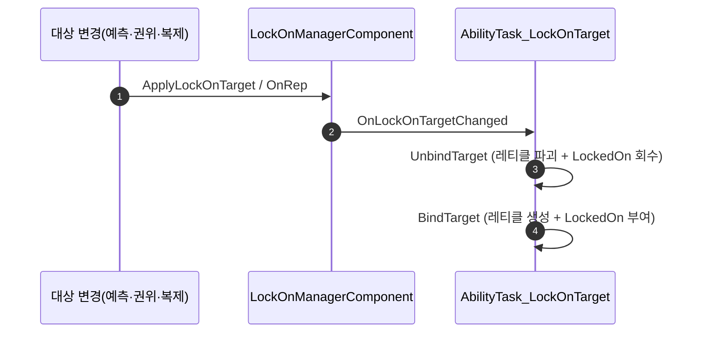

# 락온 표시 태그(State.LockedOn)를 태스크 소유로 이관

## 계획

### 목표
복제 수신 경로(`OnRep_LockOnTarget`)가 `State.LockedOn` 태그 이관을 건너뛰어 이전 대상에 태그가 영구히 남는 문제를 없앤다. 태그를 컴포넌트에서 걷어내고, 이미 대상 전이를 정확히 다루는 락온 태스크가 소유하게 한다.

### 수정 범위
| 파일 | 수정할 내용 | 구분 |
|---|---|---|
| `Plugins/WxCombat/.../Private/Targeting/WxLockOnManagerComponent.cpp` | `ApplyLockOnTarget()` 의 태그 블록·`IsLocallyControlled` 게이트 제거, 불필요해진 include 정리 | 수정 |
| `Plugins/WxCombat/.../Private/AbilitySystem/Task/WxAbilityTask_LockOnTarget.cpp` | `BindTarget()` 에서 대상 ASC 에 `State.LockedOn` 부여, `UnbindTarget()` 에서 회수 | 수정 |

헤더 변경 없음. 새 멤버·새 함수 없음.

### 접근 방식
- **전이를 아는 쪽이 태그를 쥔다**: 컴포넌트는 네트 레이어가 값을 이미 대입한 뒤 OnRep 을 호출하므로 이전 값을 알 수 없다(캐시 멤버를 새로 두지 않는 한). 반면 태스크는 `BindTarget`/`UnbindTarget` 쌍으로 레티클이라는 동일 성격의 로컬 표시물을 이미 붙였다 떼며, `BoundTargetActor` 로 소유 액터도 캐시해 둔다.
- **로컬 게이트 불필요**: 태스크는 `IsLocallyControlled()` 안에서만 생성되므로, 태스크의 존재 자체가 "로컬 플레이어의 락온"이다.
- **경로 단일화**: 예측·권위·복제 어느 경로든 `OnLockOnTargetChanged` → `HandleLockOnTargetChanged` → Unbind/Bind 로 모인다. 태스크 파괴(`OnDestroy`)까지 회수가 보장된다. 컴포넌트는 값 대입 + 브로드캐스트만 남아 비대칭이 사라진다.

---

## 완료

### 수정한 파일
| 파일 | 수정한 내용 | 구분 |
|---|---|---|
| `Plugins/WxCombat/.../Private/Targeting/WxLockOnManagerComponent.cpp` | 태그 부여/회수 블록과 `IsLocallyControlled` 게이트 제거, ASC/Pawn/태그 include 정리 | 수정 |
| `Plugins/WxCombat/.../Private/AbilitySystem/Task/WxAbilityTask_LockOnTarget.cpp` | `BindTarget()`/`UnbindTarget()` 에서 `State.LockedOn` 부여/회수 | 수정 |

### 구현·결정과 그 이유
- **컴포넌트 대신 태스크가 태그를 쥔다**: 복제 수신 시 값 대입은 네트 레이어가 먼저 하므로 컴포넌트는 이전 대상을 알 수 없다. 태스크는 이미 이전→새 대상 전이를 Unbind/Bind 로 처리하고 있어 추가 상태 없이 이관이 성립한다.
- **회수 지점은 `BoundTargetActor`**: 대상 부위 컴포넌트가 파괴돼 약참조가 풀려도 캐시한 소유 액터로 태그를 거둘 수 있다. `OnDestroyed` 바인딩 해제와 같은 자리라 누락 가능성이 낮다.
- **로컬 게이트 삭제**: 태스크는 어빌리티의 `IsLocallyControlled()` 분기 안에서만 생성되므로 태스크 존재 자체가 로컬 플레이어의 락온이다. 중복 판정을 두지 않았다.
- **레티클과 같은 수명**: 표시 태그와 레티클은 같은 성격의 로컬 표시물이라 생성/파괴 지점을 나란히 두어 한쪽만 남는 상태를 구조적으로 막았다.

### 계획 대비 달라진 점
- 계획대로. 컴포넌트의 브로드캐스트 주석 문구("서버 태스크" → "구독자")만 실제 동작에 맞게 정정했다.

### 후속 과제
- 리슨 서버 2인 세션에서 A→B 재탐색·락온 해제 시 이전 대상 네임플레이트가 남지 않는지 실기 확인(정적 수정이라 빌드까지만 검증).
