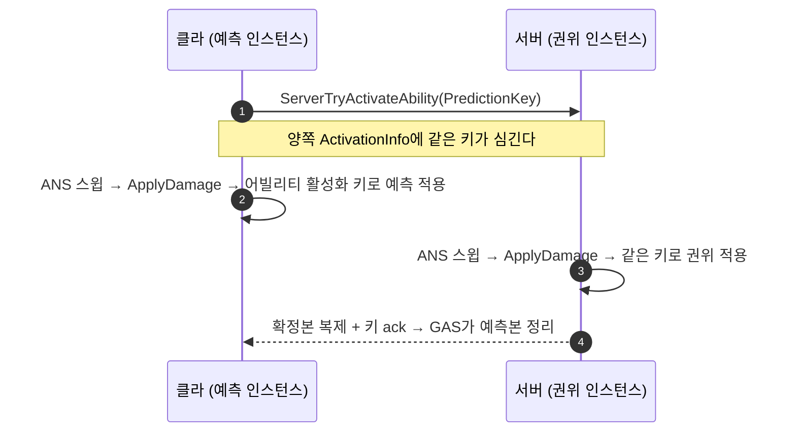

# 무기 대미지 GE 예측 도입

## 계획

### 목표
`UWxCombatLibrary::ApplyDamage`가 예측 키 없이 GE를 적용해, 비권위 머신의 무기 스윕 결과가 예측이 아니라 통째로 버려지고 있었다. 몽타주를 재생 중인 어빌리티의 활성화 예측 키를 GE 적용까지 전달해 클라이언트 적용이 실제 예측이 되게 한다. (module_review_WxCombat #4)

### 수정 범위
| 파일 | 수정할 내용 | 구분 |
|---|---|---|
| `Plugins/WxCombat/Source/WxCombat/Private/WxCombatLibrary.cpp` | 애님 중인 어빌리티에서 활성화 예측 키를 꺼내 `ApplyGameplayEffectSpecToTarget`에 전달, 반환값을 실제 적용 여부로 판정 | 수정 |
| `Plugins/WxCombat/Source/WxCombat/Public/WxCombatLibrary.h` | `ApplyDamage` 주석에 예측 동작·반환 의미 명시 | 수정 |
| `Plugins/WxCombat/Source/WxCombat/Private/Weapon/WxWeaponBase.cpp` | `ProcessHit`의 사실과 다른 예측 주석 정정 | 수정 |

### 접근 방식
- **예측 키 출처는 어빌리티 활성화 키**: 애님 노티파이 시점의 `ASC->ScopedPredictionKey`는 무효지만, 몽타주를 재생 중인 어빌리티의 `GetCurrentActivationInfo().GetActivationPredictionKey()`는 클라·서버 양쪽에 심겨 있고 서로 같은 값이다. 클라는 `InternalTryActivateAbility`의 `SetPredicting`으로, 서버는 같은 함수의 `ServerSetActivationPredictionKey`로 받는다. UE 5.8에서 `IsValidForMorePrediction()`은 `IsLocalClientKey()`와 동일해 몽타주 진행 중에도 유효하다.
- **적용 가능 여부 판정은 엔진에 위임**: 별도 role 게이트를 두지 않는다. 시뮬레이티드 프록시는 복제 몽타주라 `GetAnimatingAbility()`가 null → 키 무효 → 엔진의 `HasNetworkAuthorityToApplyGameplayEffect`가 그대로 걸러낸다.
- **`ApplyDamage`가 이미 `GetAnimatingAbility()`를 호출**해 `Context.SetAbility`에 쓰고 있으므로, 같은 어빌리티에서 키만 더 꺼낸다.

### 예측되는 것 / 안 되는 것
- **예측됨**: `FWxDamageInfo::AdditionalEffects`의 지속형 GE(디버프 등) — 모디파이어·부여 태그·OnActive Cue까지 클라에 실제 적용되고, 서버 확정본이 오면 GAS가 예측본을 정리한다.
- **예측 안 됨(엔진 제약)**: `UWxEffect_Damage`는 Instant + Execution이라 클라에서 `bTreatAsInfiniteDuration` 경로로 들어가 execution을 건너뛴다. 어트리뷰트 변화와 ExecCalc 부수효과(히트리액트·히트스톱·대미지 Cue)는 서버 권위 그대로다. 주기형 GE(`UWxEffect_Burn`)도 엔진이 예측을 금지한다.
- **Cue 유실 없음**: 예측 키가 실린 GE는 서버 멀티캐스트 Cue를 예측 클라에서 스킵시키지만, `UWxEffect_Damage`는 `GameplayCues` 배열이 비어 있고 타격 Cue는 ExecCalc가 `TargetASC->ExecuteGameplayCue`로 직접 발행한다(타겟 ASC의 `ScopedPredictionKey`를 쓰므로 스킵 대상이 아니다).

---

## 완료

### 수정한 파일
| 파일 | 수정한 내용 | 구분 |
|---|---|---|
| `Plugins/WxCombat/Source/WxCombat/Private/WxCombatLibrary.cpp` | 애님 중인 어빌리티를 지역 변수로 뽑아 Context와 예측 키에 함께 쓰고, `ApplyGameplayEffectSpecToTarget`에 예측 키 전달. 반환값을 `WasSuccessfullyApplied()` 누적으로 변경 | 수정 |
| `Plugins/WxCombat/Source/WxCombat/Public/WxCombatLibrary.h` | `ApplyDamage` 주석에 예측 키 출처·예측 범위·반환 의미 명시 | 수정 |
| `Plugins/WxCombat/Source/WxCombat/Private/Weapon/WxWeaponBase.cpp` | `ProcessHit`의 사실과 다른 예측 주석 정정 | 수정 |
| `Plugins/WxCombat/Source/WxCombat/Private/AnimNotify/WxAnimNotify_FinisherDamage.cpp` | "클라에선 캐스팅 실패로 무동작" 주석 정정 | 수정 |

### 구현·결정과 그 이유
- **예측 키 출처를 어빌리티 활성화 키로**: 애님 노티파이는 어빌리티 활성화 스코프 밖이라 `ASC->ScopedPredictionKey`가 무효다. 반면 `GetCurrentActivationInfo().GetActivationPredictionKey()`는 클라(`SetPredicting`)와 서버(`ServerSetActivationPredictionKey`)에 같은 값이 심겨 있어 양쪽 적용이 correlate된다. UE 5.8에서 `IsValidForMorePrediction()`이 `IsLocalClientKey()`와 동일해져 몽타주 진행 중 내내 유효하다.
- **role 게이트를 두지 않음**: 시뮬레이티드 프록시는 복제 몽타주라 `GetAnimatingAbility()`가 null → 키가 무효 → 엔진의 `HasNetworkAuthorityToApplyGameplayEffect`가 그대로 걸러낸다. 별도 분기는 같은 판정을 중복 구현하는 것이라 넣지 않았다.
- **`bAppliedAny`를 `WasSuccessfullyApplied()`로**: 기존 `= true` 하드코딩은 no-op에도 성공을 반환해 의미가 없었다. Instant GE는 `GetInstantExecutedHandle()`이 이 플래그를 세우고, 필터·권위 검사에 막히면 기본 핸들이라 false가 되어 반환값이 실제 동작과 일치한다.
- **처형 노티파이 주석 정정**: `ClientActivateAbilitySucceedWithEventData_Implementation`이 ServerInitiated 어빌리티를 클라에서도 `CallActivateAbility`로 활성화하므로 클라에 인스턴스가 있고 캐스팅이 성공한다("캐스팅 실패로 무동작"은 틀린 설명). 실제로 서버에서만 대미지가 성립하는 이유는 활성화 키가 서버 발행 키(`bIsServerInitiated`)라 `IsValidForMorePrediction()`이 false이기 때문이다. 결과는 같지만 근거가 달라 이번 예측 키 도입 후에도 동작이 바뀌지 않는다.
- **Cue 유실 위험 사전 확인**: 예측 키가 실린 GE는 서버 멀티캐스트 Cue를 예측 클라에서 스킵시킨다. 그러나 `UWxEffect_Damage`는 `GameplayCues` 배열이 비어 있고(엔진 Cue 발행에 `Def->GameplayCues.Num()` 가드 있음), 타격 Cue는 ExecCalc가 `TargetASC->ExecuteGameplayCue`로 직접 발행하며 이 경로는 타겟 ASC의 `ScopedPredictionKey`(서버에서 무효)를 쓴다. 따라서 공격한 클라에서도 타격 이펙트가 그대로 나온다.

### 계획 대비 달라진 점
- 계획대로.

### 후속 과제
- 런타임 검증 미완: PIE 2인(Play As Client)에서 ① 적 HP가 스윙당 1회만 감소 ② 지속형 `AdditionalEffects` 디버프가 클라에 즉시 붙고 중복되지 않음 ③ 공격한 클라에서 타격 Cue 정상 표시 를 확인해야 한다. 현재 컴파일까지만 확인했다.
- 대미지 수치·히트리액트·히트스톱은 여전히 서버 권위다. `UWxEffect_Damage`가 Instant+Execution이라 엔진이 예측 시 execution을 건너뛰는 구조적 제약이며, 이를 예측하려면 별도 설계(연출 예측 또는 `PredictivelyExecuteEffectSpec`)가 필요하다.
- `WxAbility_Finisher`의 "앞잡 그로기 해제(DP 0)는 WxAbility_HitReact 가 처리한다"는 낡은 주석(`.h:29`·`.cpp:213`)은 별도 커밋으로 정정했다 — 실제 주체는 `HandleFinisherMontageCompleted`의 `UWxEffect_ResetDP`다(module_review_WxCombat #11).
- 그 과정에서 나온 설계 우려는 미결이다: 공격자가 대상 DP를 직접 덮는 구조라 ① 처형 대미지로 죽은 대상(시체)에도 적용된다(`UWxEffect_ResetDP`엔 `State.Dead` 차단이 없다) ② 처형 중 그로기가 자연 종료되고 다른 공격자가 DP를 다시 채우면 새 그로기를 즉시 취소한다 ③ `OnCompleted`만 리셋하고 중단 경로는 리셋하지 않는다. 메커니즘 자체는 `HandleGroggySafetyTimeout`과 동일 경로라 동작하지만, 그로기 수명의 소유자가 피해자 `WxAbility_Groggy`인 점과 어긋난다.
