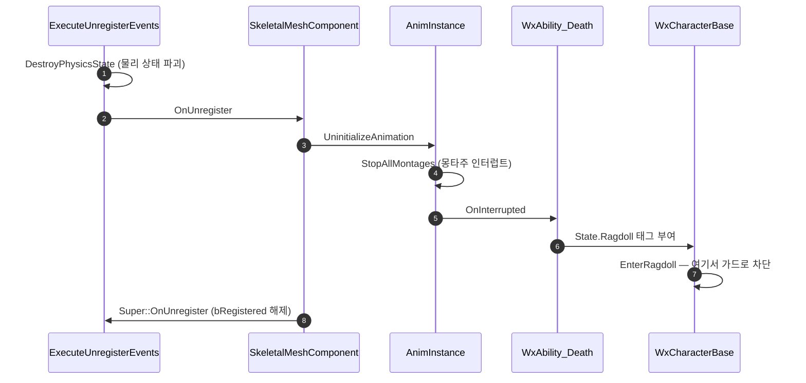

# 사망 래그돌 처리를 엔진 정석으로 정리 + 물리 상태 ensure 수정

## 계획

### 목표

플레이어 사망 후 월드가 정리될 때 `ActorComponent.cpp:2491`의 `ensureMsgf(bRegistered || IsPreRegistered(), "Component has physics state when not registered")`가 걸린다. 등록 해제 도중 사망 어빌리티가 재진입해 메시 물리 상태를 다시 만드는 것이 원인이다. 이를 막고, 겸사겸사 래그돌 처리를 엔진 샘플 방식으로 맞춘다.

`Saved/Logs/Wx_2.log:9730`의 콜스택으로 대상과 시점이 확정된다.

- 대상: `SkeletalMeshComponent ... BP_Player_C_0.CharacterMesh0` — 캐릭터 바디 메시
- 시점: 사망 → 사망 화면 → 세이브 로드(`TravelFromSaveFile` → `ServerTravel`) → `CleanupWorld` → GC의 `BeginDestroy`

사망하는 순간이 아니라 사망 직후 리로드로 월드가 정리될 때 터진다. 같은 로그에서 사망 몽타주가 이미 끝난 뒤 나간 세션은 ensure가 없다 — 몽타주가 아직 재생 중일 때만 재현된다.

**원인**: `USkeletalMeshComponent::OnUnregister()`는 맨 끝에서야 `Super::OnUnregister()`를 부르고, 그 전에 `AnimScriptInstance->UninitializeAnimation()`을 부른다(엔진 `SkeletalMeshComponent.cpp:1097~1148`). 그 안의 `StopAllMontages(0.f)`(엔진 `AnimInstance.cpp:457`)가 재생 중이던 사망 몽타주를 끊고, 몽타주가 인터럽트로 끝나며 사망 어빌리티의 폴백 경로가 래그돌 태그를 붙인다. 태그 이벤트가 `EnterRagdoll()`로 이어지고, 거기서 콜리전 프로필이 바뀌며 물리 상태가 새로 생긴다. 이 시점 `bRegistered`는 아직 참이라 통과하지만, 곧 `Super::OnUnregister()`가 등록만 풀어 물리 상태가 orphan 으로 남는다. `IsRegistered()`로는 못 거른다.

### 수정 범위

| 파일 | 수정할 내용 | 구분 |
|---|---|---|
| `Plugins/WxCombat/.../Ability/WxAbility_Death.cpp` | 사망 진입 시 메시 `SetCollisionEnabled(NoCollision)` → 공격 채널 응답 해제로 교체, `WxCollisionChannels.h` include | 수정 |
| `Source/WxGame/Character/WxCharacterBase.cpp` | `EnterRagdoll()`에 정리 중 가드 추가, 래그돌 진입 세트 정석화, 프로필 교체 후 공격 채널 응답 재적용, `Engine/World.h` include | 수정 |

### 접근 방식

엔진 샘플(ShooterGame `AShooterCharacter::OnDeath`/`SetRagdollPhysics`, Lyra `ALyraCharacter::DisableMovementAndCollision`) 기준으로 세 가지를 함께 정리한다.

- **사망 시 메시의 `CollisionEnabled`를 내리지 않는다**: 두 샘플 다 캡슐만 끄고 메시는 프로필만 바꾼다. 메시를 `NoCollision`으로 내리면 `ShouldCreatePhysicsState()`가 false가 되어 피직스 애셋 바디가 통째로 파괴되고, 래그돌에서 다시 만드는 왕복이 생긴다. 시체 피격 차단은 채널 응답만 끄면 되고, 그건 물리 상태를 건드리지 않는다.

- **래그돌 진입 세트를 맞춘다**: `Ragdoll` 프로필은 응답 컨테이너를 통째로 덮으므로(스톡 프로필은 `Pawn`/`Visibility`만 override, 나머지는 채널 기본값) 사망 때 건 override를 다시 적용해야 한다. 기존 카메라 재적용과 같은 이유로 공격 채널도 재적용한다 — 공격 채널 기본 응답이 Block(`Config/DefaultEngine.ini:39`)이라 재적용하지 않으면 래그돌 시체가 다시 맞는다. 물리 진입은 모든 바디 시뮬 + 블렌드 물리 + 깨우기, 이동은 즉시 정지 후 해제 순서다. 모든 바디를 도는 쪽과 블렌드 플래그를 켜는 쪽은 역할이 달라 둘 다 필요하다(`SkeletalMeshComponentPhysics.cpp:1439`, `:362`).

- **정리 중 가드**: 월드가 정리 중이거나 액터가 파괴 중이면 물리 전환을 건너뛴다. 가드를 `EnterRagdoll()`에 두는 이유는 컴포넌트 상태를 실제로 건드리는 유일한 지점이고, 진입점 둘(태그 이벤트, 초기 확인)이 한 곳에서 모두 막히기 때문이다. 정리 중 태그 부여나 어빌리티 종료 자체는 무해하므로 어빌리티 쪽은 손대지 않는다. 두 조건 모두 실재 경로다 — 월드 정리는 `ServerTravel`·PIE 종료를, 액터 파괴는 사망 몽타주 중인 에너미의 스포너 리스폰을 덮는다.

앞의 두 항목만으로는 ensure가 안 없어진다. `ExecuteUnregisterEvents`가 물리 상태 파괴를 `OnUnregister()`보다 먼저 부르므로, 재진입 시점엔 물리 상태가 이미 없고 프로필 교체가 그걸 다시 만든다. 실제 수정은 가드이고 앞의 둘은 정석화다.

---

## 완료

### 수정한 파일
| 파일 | 수정한 내용 | 구분 |
|---|---|---|
| `Plugins/WxCombat/.../Ability/WxAbility_Death.cpp` | 사망 진입 시 메시 콜리전 차단을 공격 채널 응답 해제로 교체, `WxCollisionChannels.h` include | 수정 |
| `Source/WxGame/Character/WxCharacterBase.cpp` | `EnterRagdoll()`에 정리 중 가드 추가, 래그돌 진입 세트 정석화, 프로필 교체 후 공격 채널 응답 재적용, `Engine/World.h` include | 수정 |

### 구현·결정과 그 이유

- **가드를 어빌리티가 아니라 `EnterRagdoll()`에 뒀다**: 컴포넌트 상태를 실제로 건드리는 유일한 지점이라 진입점 둘(태그 이벤트, 초기 확인)이 한 곳에서 모두 막힌다. 정리 중에 태그가 붙거나 어빌리티가 끝나는 것 자체는 무해하므로 어빌리티 쪽은 손대지 않았다.

- **판정 조건을 등록 여부가 아니라 월드·액터 정리 여부로 잡았다**: 재진입 시점엔 등록 플래그가 아직 참이라 그걸로는 못 거른다. 월드 정리 플래그는 맵 이동·PIE 종료를, 액터 파괴 플래그는 사망 몽타주 중인 에너미의 스포너 리스폰을 덮는다. 전자는 엔진 게임플레이 코드가 같은 목적으로 쓰는 관용구다.

- **사망 시 메시 콜리전을 통째로 끄지 않는다**: 끄면 물리 상태 생성 조건이 무너져 피직스 애셋 바디가 파괴되고 래그돌에서 다시 만드는 왕복이 생긴다. 엔진 샘플도 캡슐만 끄고 메시는 프로필만 바꾼다. 시체 피격 차단은 채널 응답만으로 충분하고 물리 상태를 건드리지 않는다.

- **프로필 교체 후 공격 채널 응답을 재적용한다**: 프로필은 응답 컨테이너를 통째로 덮고 공격 채널의 기본 응답이 Block이라, 재적용하지 않으면 래그돌 시체가 다시 맞는다. 기존 카메라 재적용과 같은 이유다.

- **모든 바디 시뮬과 블렌드 물리를 둘 다 호출한다**: 앞은 모든 바디를 돌리고 뒤는 블렌드 플래그를 켜되 기본 타입 바디만 건드려서 역할이 겹치지 않는다. 엔진 샘플이 둘 다 부르는 이유다.

### 계획 대비 달라진 점
- 계획대로.

### 후속 과제
- 없음. 빌드 통과, PIE 실동작 확인 완료(2026-08-07) — 사망 몽타주 재생 중 맵 이동에서 ensure 재발 없음.
