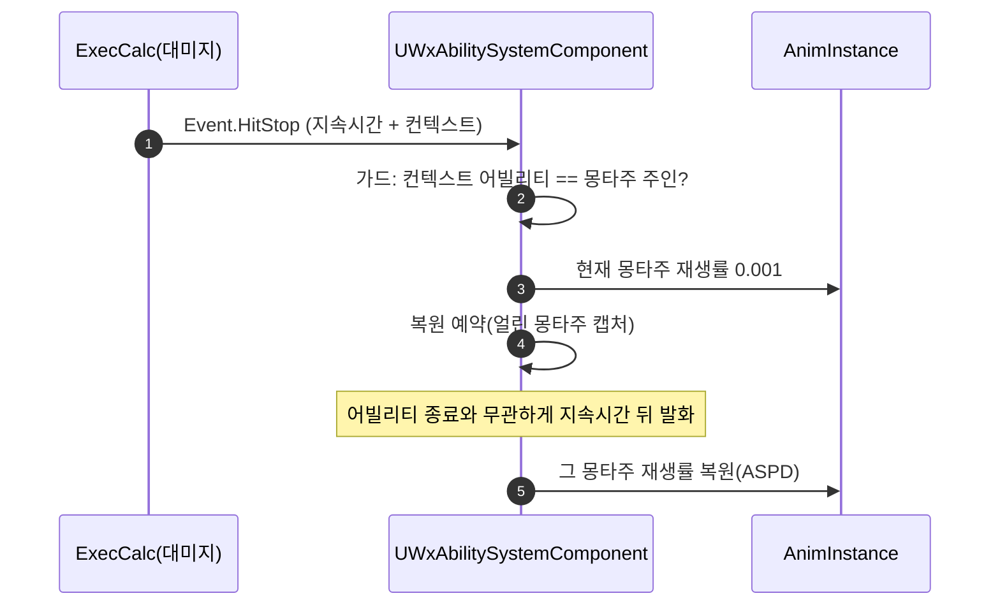

# 히트스톱 ASC 이관 — 영구 정지 근본 수정

## 계획

### 목표

공격 적중 히트스톱과 동시에 피격되면 몽타주가 0.001 재생률로 영구히 남는 버그를 근본 해결한다. 원인은 히트스톱의 주인이 어빌리티라는 것 — 복원 타이머가 어빌리티 수명에 묶여 종료 시 복원 없이 증발하고, 복원 대상도 "그때의 현재 몽타주"라 피격 몽타주가 가로채면 엉뚱한 곳에 간다. 업계 조사 결론(소유자는 액터 수준 서비스, 정지·복원은 원자적 짝)에 따라 히트스톱을 ASC로 통째 이관한다.

### 수정 범위

| 파일 | 수정할 내용 | 구분 |
|---|---|---|
| `WxExecCalc_Damage.cpp` | 히트스톱 이벤트 페이로드에 이펙트 컨텍스트(누구의 적중인지) 추가 | 수정 |
| `WxAbilitySystemComponent.h/.cpp` | 히트스톱 수신(HandleGameplayEvent 오버라이드)·정지·복원 예약, ASPD 재생률 접근자 이동 | 수정 |
| `WxAbilityBase.h/.cpp` | 히트스톱 리스너·핸들러·타이머·EndAbility 오버라이드 전부 삭제, 재생률 접근자는 ASC 위임 | 삭제·수정 |
| `WxAbility_Attack/Skill/Pattern.cpp` | 히트스톱 리스너 opt-in 호출 삭제 | 삭제 |

### 접근 방식

- **소유 이관**: 히트스톱은 "이 액터의 몽타주를 잠깐 얼렸다 되돌린다"는 액터 수준 애니메이션 제어이므로, 이벤트 수신과 몽타주 제어의 주체인 ASC가 갖는다. ASC 수명 = 액터 수명이라 어빌리티 종료와 복원이 구조적으로 무관해진다.
- **대상 캡처**: 복원 예약(타이머)이 지금 얼린 몽타주를 델리게이트 페이로드로 들고 간다. 피격 등이 현재 몽타주를 가로채도 복원은 얼렸던 그 몽타주에 정확히 닿고, 이미 소멸했으면 무동작이다. 클래스 상태·정리 코드가 필요 없다.
- **가드 보존**: 대미지를 준 어빌리티가 여전히 몽타주 주인일 때만 얼린다(이벤트에 실린 컨텍스트와 대조). 패리 반응이 몽타주를 가로챈 경우 히트스톱을 건너뛰는 07-19 의도와, Attack/Skill/Pattern만 해당하는 opt-in 범위가 그대로 재현된다.
- **메커니즘 유지**: 몽타주 재생률 방식(07-18)은 타임 딜레이션 계열의 물리·복제 함정을 피하고, 얼어 있는 동안 날아온 피격 반응이 즉시 정상 재생되는 몽타주 단위 granularity가 우리 전투의 반응성 요구에 맞아 유지한다. 적용 범위도 공격자만 유지(피격자 임팩트는 히트리액트+퍼펙트 가드 SlowTime이 담당).

---

## 완료

### 수정한 파일
| 파일 | 수정한 내용 | 구분 |
|---|---|---|
| `WxExecCalc_Damage.cpp` | 히트스톱 이벤트 페이로드에 이펙트 컨텍스트 추가, 수신 주체 주석 갱신 | 수정 |
| `WxAbilitySystemComponent.h/.cpp` | HandleGameplayEvent 오버라이드 + ApplyHitStop/HandleHitStopElapsed + 복원 타이머 핸들, GetMontagePlayRate 이동 | 수정 |
| `WxAbilityBase.h/.cpp` | 히트스톱 리스너·핸들러·멤버·EndAbility 오버라이드 삭제, GetMontagePlayRate를 ASC 위임으로 교체, include 정리 | 삭제·수정 |
| `WxAbility_Attack/Skill/Pattern.cpp` | StartHitStopListener 호출 삭제 | 삭제 |

### 구현·결정과 그 이유
- **ASC가 히트스톱 소유**: 이벤트 수신과 몽타주 제어의 주체가 원래 ASC이고 수명이 액터와 같아, 어빌리티 종료가 복원을 증발시키는 구조가 사라진다. 어빌리티 쪽은 리스너 태스크·타이머·EndAbility 정리가 전부 불필요해져 통째로 삭제됐다.
- **복원 예약이 대상을 캡처**: 얼린 몽타주를 타이머 델리게이트 페이로드로 넘겨, 복원이 항상 그 몽타주에만 닿는다. 피격 몽타주가 현재를 가로채도 오염이 없고, 이미 소멸했으면 무동작이라 별도 상태·정리 코드가 없다.
- **가드는 컨텍스트 대조로 재현**: "대미지를 준 어빌리티 == 현재 몽타주 주인"일 때만 얼려, 패리 반응이 가로챈 경우 건너뛰는 07-19 의도와 Attack/Skill/Pattern 한정 opt-in 범위가 리스너 없이도 유지된다.
- **복원 직접 지정의 복제 안전성**: 권위 ASC 틱이 매 프레임 몽타주 복제 데이터를 라이브 상태에서 갱신하므로(5.8 엔진 확인), ASC 순정 API를 거치지 않는 복원도 프록시에 반영된다.

### 계획 대비 달라진 점
- 계획대로

### 후속 과제
- PIE 실플레이 검증: 교차 피격 시 히트스톱 해제, 적 패턴 정지 잔존 없음, 콤보·패리 회귀 없음 (사용자 확인 필요)
- 피격자 쪽 히트스톱(업계 다수 관례)은 불채택 — 원하면 ExecCalc에서 피격자 ASC로 이벤트 한 줄 추가로 도입 가능
