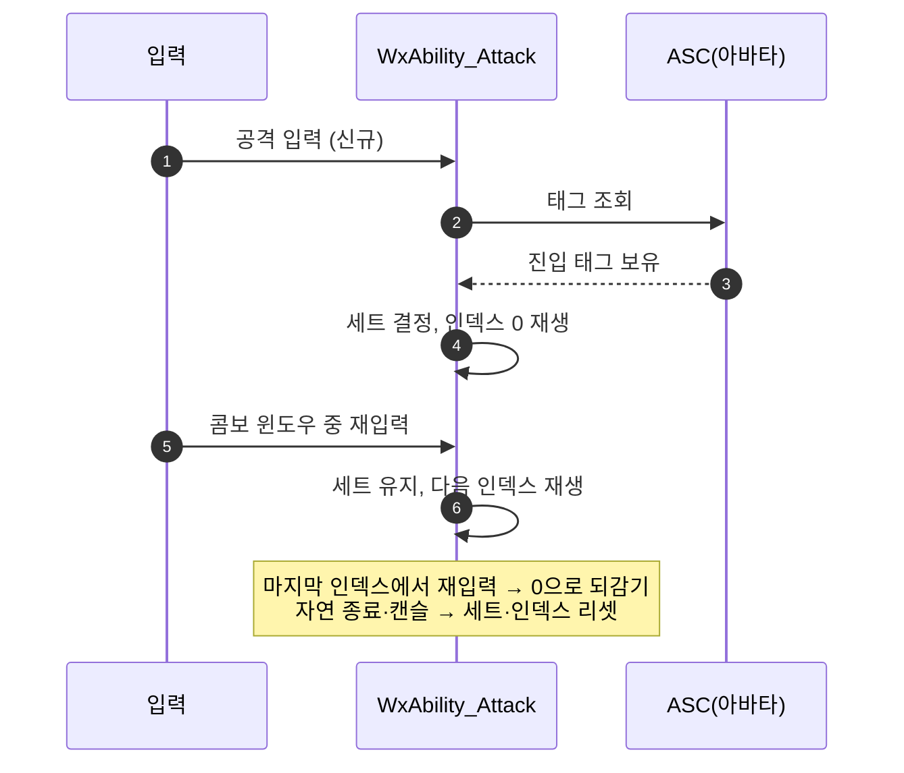

# 공격 콤보 재설계 — 태그로 고르는 몽타주 세트

## 계획

### 목표

공격 콤보의 분기 축을 입력 종류(약/강)에서 태그로 옮긴다. 지금은 L/H 입력을 문자열 경로로 누적해 맵에서 몽타주를 찾는 구조라 규격서가 요구하는 상태 기반 변형(강화 버프·공중·회피 반격)을 표현할 수 없고, 트리를 넓힐수록 경로 키 조합이 폭발한다. 콤보 진입 시 태그로 세트를 하나 고르고 그 안에서 인덱스만 전진하는 구조로 바꾼다.

### 수정 범위

| 파일 | 수정할 내용 | 구분 |
|---|---|---|
| `Plugins/WxCombat/.../Public/AbilitySystem/Ability/WxAbility_Attack.h` | `FWxAbilityMontageSet` 구조체 신설, `MontageSets` 배열로 `ComboMap` 대체, `HeavyInputAction`·`IsActivationInput`·`GetInputActions`·`HasNextCombo`·`ResolveNextComboPath`·`CurrentPath` 제거, 세트/몽타주 인덱스 멤버 추가, 클래스 주석 재작성 | 수정 |
| `Plugins/WxCombat/.../Private/AbilitySystem/Ability/WxAbility_Attack.cpp` | 경로 문자열 로직 전량 삭제 → 세트 해석 + 인덱스 전진으로 재작성, `CanActivateAbility` 단순화 | 수정 |
| `Docs/Programmer/Ability_Activation_Flow.md` | Attack 행의 "경로 누적" 서술과 `HeavyInputAction` 언급 갱신(2곳) | 수정 |

### 접근 방식

- **데이터**: 진입 태그 하나와 몽타주 배열을 묶은 `FWxAbilityMontageSet`을 어빌리티가 배열로 들고, 배열 순서가 곧 우선순위다. 실사용처가 공격뿐이라 새 파일 없이 공격 헤더에 둔다.
- **세트 선택**: 배열을 위에서부터 훑어 아바타 ASC가 진입 태그를 가진 첫 세트를 채택한다. 태그가 비어 있으면 조건 없이 매칭되므로 기본 세트는 배열 맨 아래에 둔다. 검사는 `HasMatchingGameplayTag`라 부모 태그로 자식 상태들을 한 세트에 묶을 수 있다.
- **콤보 진행**: 세트가 정해지면 인덱스만 전진하고, 마지막에서 재입력하면 0으로 되감아 첫 단부터 재시작한다(기존 터미널 재시작·스킬 어빌리티와 동일). 진행 신호는 지금처럼 엔진 순정 재발동이라 콤보 윈도우 판정·단계별 재커밋은 그대로다.
- **활성화 분기**: 재발동 여부는 진행 중 세트 인덱스가 유효한지로 가른다 — 유효하면 세트 유지·인덱스 전진, 무효하면 신규 진입이라 태그로 세트를 새로 고른다.
- **게이트 단순화**: "이 입력으로 이을 경로가 있는가" 검사가 사라져(다음 인덱스는 항상 존재) 콤보 윈도우 + 사망 차단 + 쿨다운/코스트만 보는 형태가 된다.
- **세트 고정**: 세트는 콤보 진입 시 1회 정하고 콤보가 끝날 때까지 유지한다. 도중에 버프가 끝나도 남은 단은 그 세트로 이어진다.

---

## 완료

### 수정한 파일
| 파일 | 수정한 내용 | 구분 |
|---|---|---|
| `Plugins/WxCombat/.../Public/AbilitySystem/Ability/WxAbility_Attack.h` | `FWxAbilityMontageSet` 신설(진입 조건은 `FGameplayTagRequirements`), `MontageSets` 배열이 `ComboMap`을 대체. `HeavyInputAction`과 입력 오버라이드 2개, 경로 헬퍼 2개, 경로 문자열 멤버 삭제. 세트·몽타주 인덱스 멤버와 세트 해석 함수 추가, 클래스 주석 재작성 | 수정 |
| `Plugins/WxCombat/.../Private/AbilitySystem/Ability/WxAbility_Attack.cpp` | 경로 문자열 로직 전량 삭제 → 세트 해석 + 인덱스 전진으로 재작성. `CanActivateAbility` 재발동 분기에서 경로 유효성 검사 제거, 종료·캔슬 리셋이 두 인덱스를 함께 되돌림 | 수정 |
| `Docs/Programmer/Ability_Activation_Flow.md` | Attack 행의 "경로 누적" 서술을 세트 선택 + 인덱스 전진으로 갱신, 설정 표에서 `HeavyInputAction` 언급 삭제 | 수정 |

### 구현·결정과 그 이유
- **태그 조회 주체는 아바타 자신**: 규격서가 요구하는 변형 조건(강화 버프·공중·회피 성공)이 전부 자기 상태라, 공격 대상이 아니라 아바타의 ASC를 본다.
- **첫 매칭 채택 + 빈 요구사항은 무조건 매칭**: 우선순위를 별도 필드로 두지 않고 배열 순서에 맡겼다. 기본 콤보를 맨 아래에 두면 위쪽 특수 세트가 먼저 걸리므로, 데이터만 보고도 우선순위가 읽힌다.
- **진입 조건은 단일 태그가 아니라 `FGameplayTagRequirements`**: 세트가 늘면 "강화 상태이면서 공중이 아닐 때" 같은 AND·NOT 조건이 필요해지는데 배열 순서만으로는 만들 수 없다. GE가 쓰는 엔진 순정 타입이라 디테일 패널 모양도 익숙하고, 빈 요구사항이 항상 참이라 기본 세트 규칙이 그대로 유지된다.
- **세트는 콤보 진입 시 1회 결정**: 진행 중 세트 인덱스가 유효한지로 신규 발동과 재발동을 가른다. 별도 플래그 없이 이미 필요한 상태값으로 분기가 서고, 콤보 도중 태그가 사라져도 재생 중인 콤보가 다른 애니메이션으로 튀지 않는다.
- **게이트 단순화**: 다음 인덱스가 항상 존재하게(터미널은 0으로 되감김) 만들어, 재발동 판정에서 "이을 경로가 있는가" 검사가 통째로 사라졌다. 결과적으로 스킬 어빌리티와 같은 형태의 게이트가 됐다.
- **구조체 위치는 공격 헤더**: 이름은 범용이지만 실사용처가 공격뿐이라 새 파일을 만들지 않았다. 스킬도 세트를 갖게 되는 시점에 옮긴다.

### 계획 대비 달라진 점
- 세트의 진입 조건을 계획의 단일 `FGameplayTag`에서 `FGameplayTagRequirements`로 바꿨다. 조합 조건이 곧 필요해질 것으로 보여 구현 도중 상향했다.

### 후속 과제
- **`GA_Attack` 재저작(필수)**: `ComboMap`이 사라져 콤보 데이터가 비어 있다. `MontageSets`에 기본 세트(진입 태그 비움, `AM_Attack_L → LL → LLL → LLLL`)를 채워야 공격이 동작한다. 새 프로퍼티가 리플렉션에 들어가려면 에디터 재시작이 필요하다(현재 떠 있는 에디터는 DebugGame 구 바이너리).
- **강공격 분리**: `HeavyInputAction`이 사라졌으므로 강공격은 자기 입력·자기 세트를 가진 별도 BP 서브클래스로 만든다. `AM_Attack_H/HH/HHH/LLLH`는 그때까지 미사용.
- **강화 버프 태그**: `UWxEffect_Exceed`가 큐만 발행하고 상태 태그를 주지 않아, 강화 콤보 세트를 실제로 태울 진입 태그가 아직 없다.
- **PIE 미검증**: 컴파일까지만 확인했다. 콤보 진행·터미널 재시작·피격 캔슬 후 1단 재시작은 에셋 재저작 뒤 확인이 필요하다.
