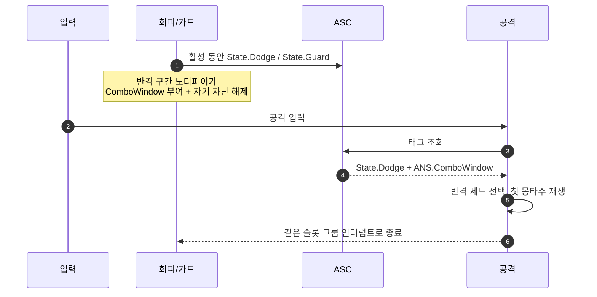

# 어빌리티의 추가 InputAction 제거 — 반격은 태그 세트로, 시선은 발행으로

## 계획

### 목표

어빌리티가 자기 발동 키 외에 InputAction을 더 들고 있는 세 곳(회피·가드의 반격 입력, 락온의 시선 입력)을 없앤다. 앞의 둘은 남의 발동 키를 자기가 또 들고 감시하는 구조라 공격 키를 바꾸면 회피·가드 BP까지 따라 고쳐야 하고, 반격이 공격 콤보와 분리돼 규격서 §2.4의 연계를 표현할 수 없다. 마지막은 캐릭터가 이미 억제한 시선 입력을 태스크가 다시 읽는 이중 조회다.

### 수정 범위

| 파일 | 수정할 내용 | 구분 |
|---|---|---|
| `Plugins/WxCombat/.../Ability/WxAbility_Dodge.h/.cpp` | 반격 입력·몽타주·대기 태스크·핸들러 제거, `ActivationOwnedTags`에 `State.Dodge` 추가 | 수정 |
| `Plugins/WxCombat/.../Ability/WxAbility_Guard.h/.cpp` | 같은 제거 + 반격 몽타주·재생 함수, `InputReleased`의 카운터 페이즈 분기 정리 | 수정 |
| `Plugins/WxCombat/.../Ability/WxAbility_LockOn.h/.cpp` | `LookAction`·`RetargetLookThreshold` 전달 제거 | 수정 |
| `Plugins/WxCombat/.../Task/WxAbilityTask_LockOnTarget.h/.cpp` | EnhancedInput 조회 대신 락온 매니저의 누적 시선 델타를 읽음 | 수정 |
| `Plugins/WxCombat/.../Targeting/WxLockOnManagerComponent.h/.cpp` | 시선 델타 누적·소비 추가 | 수정 |
| `Plugins/WxCombat/.../Task/WxAbilityTask_WaitInputActionTriggered.h/.cpp` | 사용처 소멸 | 삭제 |
| `Plugins/WxCombat/.../WxAbilitySystemComponent.h/.cpp` | `OnInputActionTriggered`·`LastPressedInputAction` 일체·`AbilityInputActionStarted` 제거 | 수정 |
| `Plugins/WxCombat/.../Ability/WxAbilityBase.h/.cpp` | `GetInputActions` 제거, `IsActivationInput`에서 `virtual` 제거 | 수정 |
| `Plugins/WxCombat/.../AbilitySystem/WxAbilitySet.cpp` | CDO의 `ActivationInputAction`을 직접 수집 | 수정 |
| `Plugins/WxCore/.../WxGameplayTags.h/.cpp` | `State.Dodge` 추가 | 수정 |
| `Source/WxGame/Character/WxPlayerCharacter.h/.cpp` | `Look`이 락온 중 델타를 매니저에 전달, `Started` 바인딩·핸들러 제거 | 수정 |
| `Docs/Programmer/Ability_Activation_Flow.md` | 설정 표의 `CounterInputAction` 언급 갱신 | 수정 |

### 접근 방식

- **반격 주체를 뒤집는다**: 회피·가드가 공격 키를 감시하는 대신, 공격이 발동 때 회피·가드 상태 태그를 보고 반격 세트를 고른다. 가드는 이미 `State.Guard`를 발행하고, 회피는 `State.Dodge`를 신설해 `ActivationOwnedTags`로 발행한다.
- **허용 구간은 몽타주가 계속 소유한다**: 반격 세트의 진입 요구사항이 상태 태그와 `ANS.ComboWindow`를 함께 요구한다. 진입 조건을 `FGameplayTagRequirements`로 올려 둔 덕에 이 AND가 데이터로 표현된다. 차단 해제는 기존 `StartRecovery` 노티파이가 맡으므로 코드가 늘지 않는다.
- **시선은 원천이 발행한다**: 락온 중 시선 입력을 버리던 캐릭터가 그 델타를 락온 매니저에 넘기고, 태스크는 그 값을 소비한다. 태스크에서 EnhancedInput 의존이 사라진다.
- **호출자를 잃는 배관은 함께 지운다**: 입력 대기 태스크, ASC의 입력 방송, `LastPressedInputAction` 일체(공격 재설계로 마지막 호출자가 사라졌다), `Started` 바인딩, 베이스의 `GetInputActions`와 `IsActivationInput`의 `virtual`.

---

## 완료

### 수정한 파일
| 파일 | 수정한 내용 | 구분 |
|---|---|---|
| `Plugins/WxCombat/.../Ability/WxAbility_Dodge.h/.cpp` | 반격 입력·몽타주·대기 태스크·리스너·핸들러 제거, `ActivationOwnedTags`에 `State.Dodge` 추가, 클래스 주석에 반격 이관 명시 | 수정 |
| `Plugins/WxCombat/.../Ability/WxAbility_Guard.h/.cpp` | 같은 제거 + 반격 몽타주·재생 함수, `InputReleased`의 카운터 페이즈 분기 정리 | 수정 |
| `Plugins/WxCombat/.../Ability/WxAbility_LockOn.h/.cpp` | `LookAction` 필드와 태스크 전달 제거 | 수정 |
| `Plugins/WxCombat/.../Task/WxAbilityTask_LockOnTarget.h/.cpp` | 시선 축을 EnhancedInput 조회 대신 락온 컴포넌트에서 소비, `LookAction`·관련 인클루드 제거 | 수정 |
| `Plugins/WxCombat/.../Targeting/WxLockOnManagerComponent.h/.cpp` | 시선 입력 기록·소비 추가(비복제) | 수정 |
| `Plugins/WxCombat/.../Task/WxAbilityTask_WaitInputActionTriggered.h/.cpp` | 사용처 소멸 | 삭제 |
| `Plugins/WxCombat/.../WxAbilitySystemComponent.h/.cpp` | 입력 방송 델리게이트·`AbilityInputActionStarted`·`LastPressedInputAction` 일체(게터·세터·서버 RPC·필드) 제거, 라우팅 두 곳이 `ActivationInputAction`을 직접 대조 | 수정 |
| `Plugins/WxCombat/.../Ability/WxAbilityBase.h/.cpp` | `GetInputActions`·`IsActivationInput` 제거, `ActivationInputAction` 주석 갱신 | 수정 |
| `Plugins/WxCombat/.../AbilitySystem/WxAbilitySet.cpp` | CDO의 `ActivationInputAction`을 직접 수집 | 수정 |
| `Plugins/WxCore/.../WxGameplayTags.h/.cpp` | `State.Dodge` 추가 | 수정 |
| `Source/WxGame/Character/WxPlayerCharacter.h/.cpp` | `Look`이 락온 중 델타를 컴포넌트에 전달, `Started` 바인딩과 핸들러 제거 | 수정 |
| `Docs/Programmer/Ability_Activation_Flow.md` | 설정 표에서 추가 입력 필드 언급 삭제, 파생 함수명 정정 | 수정 |

### 구현·결정과 그 이유
- **반격의 주체를 뒤집었다**: 회피·가드가 남의 발동 키를 들고 감시하던 것을 없애고, 공격이 자기 발동 때 상태 태그를 보고 반격 세트를 고르게 했다. 공격 키를 바꿔도 회피·가드 BP가 따라 바뀌지 않고, 반격 뒤의 콤보 연계가 같은 세트 안의 다음 인덱스로 자연히 표현된다.
- **허용 구간은 그대로 몽타주가 소유한다**: 진입 요구사항이 상태 태그와 `ANS.ComboWindow`를 함께 요구하고, 차단 해제는 기존 `StartRecovery` 노티파이가 맡는다. 새 노티파이도 새 판정 코드도 필요 없었다.
- **회피는 `ActivationOwnedTags`, 가드는 기존 loose 태그 그대로**: 회피는 활성 구간이 곧 태그 구간이라 엔진 자동 부여가 맞고, 가드는 가드 브레이크 시점에 태그만 먼저 떼야 해서 수동 관리가 필요하다. 통일하려다 가드의 페이즈 처리를 건드리지 않았다.
- **시선 입력은 계산 원천이 발행한다**: 캐릭터가 락온 중 버리던 값을 컴포넌트에 넘기고 태스크가 소비한다. 같은 입력을 두 곳에서 각자 조회하던 구조가 하나로 합쳐졌다.
- **`IsActivationInput`은 게터로 바꾸지 않고 없앴다**: 오버라이드가 사라져 술어 형태를 유지할 이유가 없어졌는데, `ActivationInputAction`이 이미 public이라 게터를 새로 두면 필드 직접 접근과 중복된다. 호출자 세 곳이 필드를 그대로 비교·수집하는 쪽이 짧고 일관된다.

### 계획 대비 달라진 점
- 계획에는 `IsActivationInput`의 `virtual`만 떼는 것으로 적었으나, 함수 자체를 없애고 호출자가 필드를 직접 대조하도록 바꿨다(작업 중 논의).

### 후속 과제
- **에셋 재저작(필수)**: `GA_Dodge`/`GA_Guard`의 반격 몽타주·반격 입력 필드가 사라졌다. 쓰던 반격 몽타주를 `GA_Attack`의 `MontageSets` 반격 세트(`State.Dodge`+`ANS.ComboWindow` / `State.Guard`+`ANS.ComboWindow`)로 옮기고, 회피·가드 몽타주의 반격 구간 시작에 `StartRecovery` 노티파이를 배치해야 반격이 다시 동작한다. `GA_LockOn`의 `LookAction`은 별도 조치 불필요.
- **PIE 미검증**: 컴파일까지만 확인했다. 특히 공격 몽타주가 가드 몽타주를 인터럽트해 `State.Guard`가 정상 해제되는지는 슬롯 그룹에 따라 갈리므로 실측이 필요하다.
