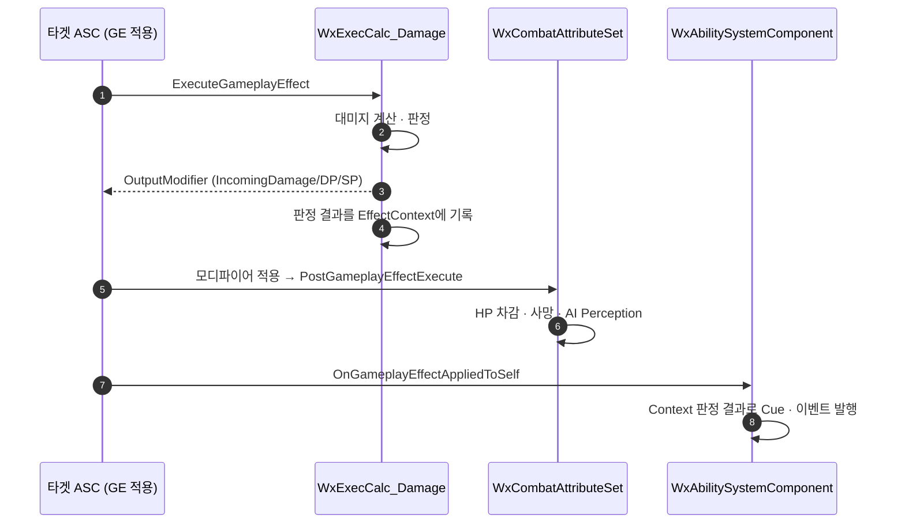

# 대미지 ExecCalc의 연출·반응 부수효과 분리

## 계획

### 목표
`UWxExecCalc_Damage::Execute_Implementation`이 대미지 산출을 넘어 GameplayEvent 5종·GameplayCue 2종을 GE 실행 스코프 한가운데에서 발행하는 부수효과 허브가 되어 있다(module_review_WxCombat #6). 그 결과 수신자가 실행 순서에 암묵적으로 결합됐다 — `UWxAbility_Guard::HandleGuardHitReact`는 "이벤트 수신 시점의 `GetSP()`는 차감 전 값"을 전제로 가드 브레이크를 판정한다. 판정과 발행을 분리해, ExecCalc는 계산하고 결과를 EffectContext에 남기며 발행은 GE 적용이 끝난 뒤 `UWxAbilitySystemComponent`가 한 곳에서 맡게 한다.

### 수정 범위
| 파일 | 수정할 내용 | 구분 |
|---|---|---|
| `Plugins/WxCombat/Source/WxCombat/Public/Damage/WxCombatEffectContext.h` | `EWxDamageResult`, `FWxCombatEffectContext`(DamageResult·bCritical·FinalDamage·HitReactTag) | 신규 |
| `Plugins/WxCombat/Source/WxCombat/Private/Damage/WxCombatEffectContext.cpp` | `GetScriptStruct`/`Duplicate`/`NetSerialize` | 신규 |
| `Plugins/WxCombat/Source/WxCombat/Public/AbilitySystem/WxAbilitySystemGlobals.h`·`.cpp` | `AllocGameplayEffectContext` 오버라이드 | 신규 |
| `Config/DefaultGame.ini` | `AbilitySystemGlobalsClassName` 등록 | 수정 |
| `.../Effect/WxExecCalc_Damage.h`·`.cpp` | 이벤트·Cue 발행 제거, 판정 결과를 Context에 기록 | 수정 |
| `.../AbilitySystem/WxAbilitySystemComponent.h`·`.cpp` | 적용 완료 콜백 구독 + 발행 핸들러 | 수정 |
| `.../Ability/WxAbility_Guard.cpp` | 가드 브레이크 판정을 차감 후 기준으로 정정 | 수정 |

### 접근 방식
- **발행 지점은 GE 적용 완료 콜백**: `ApplyGameplayEffectSpecToSelf`는 `ExecuteGameplayEffect`에 넘긴 것과 동일한 spec 인스턴스를 `OnGameplayEffectAppliedToSelf`에 전달한다(엔진 `AbilitySystemComponent.cpp:1161`·`:1170`). 어트리뷰트가 확정된 뒤라 수신자가 "차감 전 값"을 역산할 필요가 없다.
- **권위 게이트를 두지 않음**: 클라 예측 경로는 `bTreatAsInfiniteDuration`으로 들어가 ExecCalc 자체를 건너뛰므로 Context에 판정 결과가 없다. 콜백은 클라에서도 불리지만 `Outcome == None`으로 자연히 걸러진다.
- **결과 운반은 커스텀 EffectContext**: `FGameplayEffectSpec::GetContext()`가 핸들을 값으로 반환하므로 const spec에서도 `const_cast` 없이 쓸 수 있다. `HitReactTag`를 ExecCalc가 확정해 실어, 그로기 진입 히트의 Knock→Normal 치환이 DP 적용 순서에 흔들리지 않게 한다.
- **Context 할당은 전역 등록**: 대미지 GE의 컨텍스트 생성 경로 셋(`ApplyDamage`·`WxProjectileBase`·`WxCheatManager`)이 모두 `MakeEffectContext()`를 타므로, `UWxAbilitySystemGlobals` 전역 등록이면 새 진입점이 생겨도 놓치지 않는다.
- **범위 한정**: DP 반사·자원 회복·Guard 취소 같은 게임플레이 부수효과는 이번 범위 밖으로 두고 ExecCalc에 남긴다.
- **유지보수 방어책**: 세 파일에 서로를 가리키는 계약 주석, ini 미등록 시 `ensureMsgf`로 즉시 노출, 발행 분기는 한 함수에 모음, 별도 파일·주입 인프라 신설 없음.

### 예상되는 동작 변화
- 치명타 히트에서 히트리액트가 생략된다 — 사망 태그가 콜백보다 먼저 붙어 `UWxAbility_HitReact`가 차단된다. 현재는 잠깐 떴다가 사망 어빌리티에 취소되던 것. Cue·히트스톱은 그대로.
- 가드 브레이크 판정이 예상치가 아니라 실제 SP를 본다.

---

## 완료

### 수정한 파일
| 파일 | 수정한 내용 | 구분 |
|---|---|---|
| `Public/Damage/WxCombatEffectContext.h` | `EWxDamageResult`(None/Evaded/PerfectGuard/Damaged), `FWxCombatEffectContext`. 결과별 setter 3종으로 어떤 필드가 채워지는지 강제 | 신규 |
| `Private/Damage/WxCombatEffectContext.cpp` | `GetScriptStruct`/`Duplicate`/`NetSerialize`, 접근자·setter | 신규 |
| `Public/AbilitySystem/WxAbilitySystemGlobals.h`·`.cpp` | `AllocGameplayEffectContext` 오버라이드 | 신규 |
| `Config/DefaultGame.ini` | `AbilitySystemGlobals` 섹션에 `AbilitySystemGlobalsClassName` 등록 | 수정 |
| `.../Effect/WxExecCalc_Damage.h`·`.cpp` | Cue 2종·이벤트 5종·히트 위치 계산 제거. `HandleInvincible`은 태그 검사 한 줄로 인라인, `ApplyHitReaction`은 `ResolveHitReaction`으로 바꿔 이벤트 대신 태그를 반환. 359→약 250줄 | 수정 |
| `.../AbilitySystem/WxAbilitySystemComponent.h`·`.cpp` | 생성자에서 `OnGameplayEffectAppliedDelegateToSelf` 구독, `HandleGameplayEffectAppliedToSelf`에서 Cue·이벤트 발행 | 수정 |
| `.../Ability/WxAbility_Guard.cpp` | 가드 브레이크 판정을 `GetSP() <= 0`으로 정정 | 수정 |

### 구현·결정과 그 이유
- **발행 지점을 GE 적용 완료 콜백으로**: `ApplyGameplayEffectSpecToSelf`가 `ExecuteGameplayEffect`에 넘긴 것과 동일한 spec 인스턴스를 `OnGameplayEffectAppliedToSelf`에 전달하므로(엔진 `AbilitySystemComponent.cpp:1161`·`:1170`), ExecCalc가 컨텍스트에 쓴 판정이 손실 없이 도착한다. 어트리뷰트가 확정된 뒤라 수신자가 차감 전 값을 역산할 필요가 사라진다.
- **권위 게이트를 두지 않음**: 클라 예측 경로는 `bTreatAsInfiniteDuration`으로 들어가 ExecCalc를 건너뛰므로 `DamageResult`가 `None`으로 남는다. 별도 role 검사는 같은 판정의 중복이라 넣지 않았다.
- **HitReact 태그를 ExecCalc가 확정**: 그로기 진입 히트의 Knock→Normal 치환은 DP 적용 전 상태를 봐야 하는데 발행 시점엔 이미 `State.Groggy`가 붙어 있다. 태그를 미리 정해 실으면 이 순서 의존이 없어진다.
- **컨텍스트 할당은 전역 등록**: 대미지 GE의 컨텍스트 생성 경로 셋(`ApplyDamage`·`WxProjectileBase`·`WxCheatManager`)이 모두 `MakeEffectContext()`를 타므로, 호출부마다 컨텍스트를 만드는 방식보다 누락 위험이 작다. 대신 ini 등록이 빠지면 조용히 무연출이 되므로 ExecCalc에서 `ensureMsgf`로 지목한다.
- **생성자에서 델리게이트 구독**: `InitAbilityActorInfo`는 여러 번 호출돼 중복 바인딩이 된다. CDO도 함께 바인딩되지만 CDO는 GE를 받지 않아 무해하다.
- **이벤트 송출은 `SendGameplayEventToActor` 유지**: 자기 ASC라 `HandleGameplayEvent` 직접 호출도 가능하지만, 순정 함수가 여는 `FScopedPredictionWindow`까지 그대로 두어 동작 변화를 최소화했다.
- **크리티컬 전달은 기존 `AggregatedSourceTags` 경로 유지**: 컨텍스트에도 `bCritical`이 실리지만, Cue BP가 `Damage.Critical` 태그를 읽고 있을 수 있어 발행 형태를 바꾸지 않았다.
- **가드 브레이크 판정 정정**: 이벤트가 SP 차감 후에 오므로 기존 `GetSP() - EventMagnitude`를 그대로 두면 이중 차감이 되어 가드가 한 대 일찍 깨진다.

### 계획 대비 달라진 점
- **컨텍스트 공유로 인한 중복 발행을 막는 이중 방어를 추가**(계획에 없던 것). `FWxDamageInfo::MakeSpecs`가 대미지 GE와 `AdditionalEffects` 전체에 **같은 컨텍스트 핸들**을 넘긴다. 그대로 두면 상태이상 GE가 적용될 때도 컨텍스트에 판정 결과가 남아 있어 Cue·히트리액트·히트스톱이 GE 개수만큼 다시 나간다. ① 발행 측에서 `Spec.Def`가 `UWxEffect_Damage`인지 검사하고, ② ExecCalc가 판정을 시작할 때 `ClearDamageResult()`로 이전 결과를 지운다. ①만으로 대부분 막히지만, 같은 컨텍스트를 쓰는 두 번째 대미지 GE가 대미지 0으로 조기 반환하는 경우는 ②가 막는다.
- `EWxHitOutcome` → `EWxDamageResult`, 컨텍스트 필드 `ResolvedDamage` → `FinalDamage`로 명명 변경(작업 중 요청). 후자는 `FWxDamageResult::FinalDamage`와 같은 이름이라 계산부터 발행까지 한 단어로 이어진다.
- `HandleInvincible`은 이벤트 송출이 빠지자 태그 검사 한 줄만 남아 함수를 없애고 `Execute_Implementation`에 인라인했다.
- 대미지 0 처리를 중첩 `if` 대신 조기 반환으로 바꿔 가드 감소율 이후 흐름의 들여쓰기를 한 단계 줄였다.

### 후속 과제
- **ini 섹션을 정정했다(첫 실행에서 `ensure` 발생 → 수정 완료)**: 처음에는 설정을 클래스 이름 그대로인 `GameplayAbilitiesDeveloperSettings` 섹션에 적었는데, 이 설정 클래스는 구 프로젝트 호환을 위해 `OverrideConfigSection`으로 읽을 섹션을 `AbilitySystemGlobals`로 되돌린다. 그래서 해당 섹션은 통째로 무시돼 전역 클래스가 순정 기본값으로 남았고, 기본값도 유효 클래스라 엔진의 `checkf`에 걸리지 않아 조용히 넘어갔다. 결과는 순정 컨텍스트 → ExecCalc의 `ensure`. 같은 파일에서 `GameplayCueNotifyPaths`가 이미 옳은 섹션에 있어 정상 동작해온 것이 대조군이었다.
- **에디터 재시작 필요**: `AbilitySystemGlobalsClassName`은 `ConfigRestartRequired=true`라 실행 중인 에디터에는 반영되지 않는다. 재시작 전에는 컨텍스트가 순정 타입이라 ExecCalc의 `ensure`가 걸리고 타격 연출이 나오지 않는다.
- **런타임 검증 미완**: 컴파일까지만 확인했다. `AdditionalEffects`가 붙은 대미지 행(앞잡 등)으로 Cue·히트리액트가 한 번만 나가는지도 반드시 함께 본다. PIE에서 ① 평타 피격의 히트리액트·Cue·히트스톱 ② 크리 연출 ③ 가드 연타 시 SP 0 도달 시점에 GuardBreak ④ 퍼펙트 가드의 패링 Cue·DP 반사·MP 회복 ⑤ 회피 무적 중 `DodgeSuccess` 1회·히트스톱 없음 ⑥ 치명타 사망 시 히트리액트 생략·Cue 정상 을 확인해야 한다. 2인 PIE에서 Cue·히트리액트 중복 발행이 없는지도 함께 본다.
- **동작 변화 1건(결정 완료, 조치 없음)**: 죽는 히트에서 히트리액트가 생략된다. 사망 태그가 콜백보다 먼저 붙어 `UWxAbility_HitReact`가 차단되기 때문이다. **최종 화면은 기존과 같다** — `UWxAbility_Death`와 `UWxAbility_HitReact`는 둘 다 `Ability.Exclusive`가 아니라 서로 취소하지 못하고, 기존에도 사망 몽타주가 `PlayMontageAndWait`의 BlendOut으로 히트리액트를 인계받아 결국 사망 몽타주가 재생됐다(`WxAbility_Death.cpp:93` 주석). 달라진 건 히트리액트 어빌리티가 켜졌다 꺼지는 왕복이 사라진 것뿐이라 단순한 쪽을 택했다.
- **`UWxAbility_HitReact`의 `State.Dead` 차단은 이제 필수다**: 순서가 뒤집혀 사망 어빌리티가 먼저 몽타주를 잡으므로, 이 차단을 풀면 히트리액트가 사망 몽타주를 끊고 `HandleMontageInterrupted` → `RagdollAndEnd(true)`로 래그돌 폴백을 유발한다. 예전엔 순서상 걸릴 일이 없는 중복 방어였는데 이번 변경으로 사망 연출을 지키는 유일한 장치가 됐다. 해당 줄에 주석으로 남겼다.
- **범위 밖으로 남긴 것**: `ReflectPerfectGuard`의 `SetNumericAttributeBase` 직접 쓰기(스펙·면역·복제 경로를 우회한다), `UWxEffect_RecoverResource::ApplyTo`, `TargetASC->CancelAbilities(Guard)`는 여전히 ExecCalc 안에 있다. 반사를 Instant GE로 통일하는 건 별도 작업이다(module_review_WxCombat #6의 남은 절반).
- 컨텍스트에 실은 `bCritical`은 아직 아무도 읽지 않는다. Cue BP를 컨텍스트 기반으로 옮기면 `AggregatedSourceTags` 편법을 걷어낼 수 있다 — **다만 그때 함정이 하나 살아난다.** `ExecuteGameplayCue`의 멀티캐스트 RPC는 `FGameplayCueParameters`를 값으로 복사하지만 그 안의 `EffectContext`는 핸들이라 같은 객체를 가리킨다. 같은 컨텍스트로 두 번째 대미지 GE가 오면 `ClearDamageResult()`가 앞선 Cue의 전송 전에 값을 지울 수 있다. 지금은 Cue가 값으로 복사되는 `RawMagnitude`·`AggregatedSourceTags`만 읽어 무해하다. 옮길 때는 Cue 파라미터에 필요한 값을 복사해 넣거나 컨텍스트를 그 시점에 복제해야 한다.
