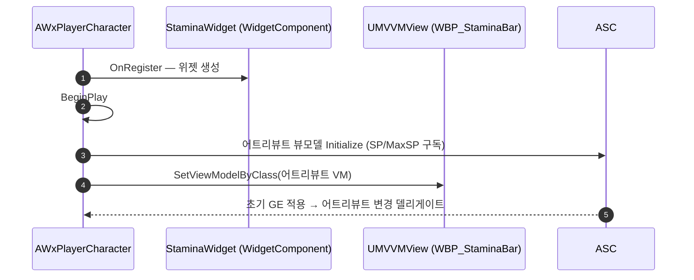

# 스태미나 바를 BP_Player 위젯 컴포넌트로 이전

## 계획

### 목표
WBP_StaminaBar를 HUD에서 떼어 플레이어 캐릭터의 위젯 컴포넌트로 옮긴다. HUD가 밀어주던 Manual 뷰모델을 대신 캐릭터가 주입해 바인딩을 다시 잇는다.

### 수정 범위
| 파일 | 수정할 내용 | 구분 |
|---|---|---|
| `Source/WxGame/Character/WxPlayerCharacter.h` | `StaminaWidget` 위젯 컴포넌트 선언, `BeginPlay` 오버라이드 | 수정 |
| `Source/WxGame/Character/WxPlayerCharacter.cpp` | 생성자에서 컴포넌트 생성(루트 부착·Screen·DrawAtDesiredSize), `BeginPlay`에서 SP/MaxSP 어트리뷰트 뷰모델 생성·주입 | 수정 |
| `Content/Character/Player/BP_Player.uasset` | BP가 추가한 동명 컴포넌트 노드 제거, 상속된 컴포넌트에 위젯 클래스 지정 | 수정 |
| `Content/UI/Widget/WBP_StaminaBar.uasset` | 어떤 바인딩도 쓰지 않는 캐릭터 뷰모델(Resolver) 항목 제거 | 수정 |
| `Content/UI/Widget/WBP_GameHUD.uasset` | 스태미나 바 자식 위젯과 그 바인딩 제거 | 수정 |

### 접근 방식
- **캐릭터가 주입**: 위젯 컴포넌트의 위젯은 오너를 역참조할 수 없고, 리졸버는 위젯이 만들어지는 `OnRegister` 시점에 폰이 아직 빙의 전이라 대상을 찾지 못한 채 재시도도 없다. 그래서 적 네임플레이트와 같은 방식으로 컴포넌트를 소유한 캐릭터가 BeginPlay에서 뷰모델을 밀어 넣는다.
- **BeginPlay가 적절한 시점인 근거**: 위젯은 `OnRegister`에서 이미 만들어져 있고 ASC는 캐릭터의 기본 서브오브젝트라 처음부터 존재한다. 실제 어트리뷰트 값은 그 뒤 초기 GE가 적용될 때 뷰모델이 걸어 둔 변경 델리게이트로 들어온다. 값이 0인 동안에도 현재값과 최대값이 함께 0이라 "가득 참" 판정이 참이 되어 바는 접힌 채로 시작한다.
- **이름 충돌 회피**: BP가 먼저 추가해 둔 동명 컴포넌트를 지운 뒤 C++ 선언으로 대체한다. 위젯 클래스 지정은 네임플레이트와 마찬가지로 BP 몫으로 남긴다.

---

## 완료

### 수정한 파일
| 파일 | 수정한 내용 | 구분 |
|---|---|---|
| `Source/WxGame/Character/WxPlayerCharacter.h` | 위젯 컴포넌트 선언, `BeginPlay` 오버라이드 | 수정 |
| `Source/WxGame/Character/WxPlayerCharacter.cpp` | 생성자에서 컴포넌트 생성(루트 부착·Screen·DrawAtDesiredSize), `BeginPlay`에서 SP/MaxSP 어트리뷰트 뷰모델 생성·주입 | 수정 |
| `Content/Character/Player/BP_Player.uasset` | BP가 추가했던 동명 컴포넌트 제거, 상속 컴포넌트에 위젯 클래스 지정 | 수정 |
| `Content/UI/Widget/WBP_StaminaBar.uasset` | 어떤 바인딩도 쓰지 않던 캐릭터 뷰모델(Resolver) 제거 | 수정 |
| `Content/UI/Widget/WBP_GameHUD.uasset` | 스태미나 바 자식 위젯·바인딩 제거, 소비처가 사라진 플레이어 뷰모델도 제거 | 수정 |

### 구현·결정과 그 이유
- **리졸버 대신 캐릭터 주입**: 위젯 컴포넌트의 위젯은 오너를 역참조할 수 없고, 리졸버는 위젯이 만들어지는 등록 시점에 폰이 아직 빙의 전이라 대상을 찾지 못한 채 재시도도 없다. 적 네임플레이트가 쓰는 주입 방식을 그대로 따랐다.
- **컴포넌트를 BP에서 C++로 옮김**: 위젯 클래스 지정만 BP에 남기면 주입 주체가 컴포넌트를 확실히 손에 쥔다. 이름이 겹쳐 BP 노드는 지웠다.
- **HUD의 플레이어 뷰모델까지 제거**: 스태미나 바인딩이 유일한 소비처였고, 바인딩이 사라지자 "뷰가 생성되지 않아 뷰모델이 초기화되지 않는다"는 컴파일 경고가 남았다. 계획에선 남겨 두려 했으나 경고가 상시 노출되어 함께 걷어냈다.

### 계획 대비 달라진 점
- HUD의 플레이어 뷰모델을 남기려던 계획을 바꿔 제거했다(위 사유).

### 후속 과제
- 스태미나 소모 중 바가 실제로 차고 비는지는 사람이 PIE에서 확인해야 한다. 자동화로 넣은 키·마우스 입력이 게임 뷰포트까지 닿지 않아 소모 상태를 재현하지 못했다. 정지 상태(SP 가득)에서 바가 접혀 있는 것과 로그에 MVVM 경고가 없는 것까지는 확인했다.
- 위젯 컴포넌트가 캡슐 중심에 있어 화면상 위치가 몸 한가운데다. 오프셋 조정은 에셋 몫.
