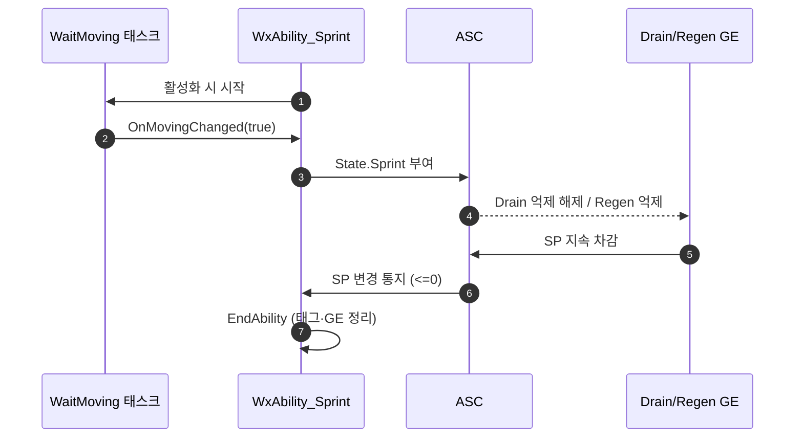

# 스프린트 SP 소모

## 계획

### 목표
SP(스태미나)를 가드 전용 게이지에서 벗어나게 한다. 스프린트 어빌리티가 실제로 이동 중일 때 SP를 지속 소모하고, SP가 모자라면 달리지 못하며, 소모 중에는 SP 자연 회복이 멈춘다.

### 수정 범위
| 파일 | 수정할 내용 | 구분 |
|---|---|---|
| `Plugins/WxCore/.../WxGameplayTags.{h,cpp}` | `State_Sprint` 태그 추가 | 수정 |
| `Plugins/WxCombat/.../Effect/WxEffect_DrainSP.{h,cpp}` | MaxSP 비례 SP 소모 GE. `State.Sprint` 보유 시에만 틱 | 신규 |
| `Plugins/WxCombat/.../Effect/WxEffect_RegenSP.{h,cpp}` | 회복 억제 조건에 `State.Sprint` 추가 | 수정 |
| `Plugins/WxCombat/.../Task/WxAbilityTask_WaitMoving.{h,cpp}` | 아바타 이동 여부를 폴링해 전환 프레임에만 통지 | 신규 |
| `Plugins/WxCombat/.../Ability/WxAbility_Sprint.{h,cpp}` | 발동 게이트, Drain GE 적용/제거, 태그 토글, 고갈 종료 | 수정 |

### 접근 방식
- **태그 하나로 소모 ON + 회복 OFF**: `State.Sprint`는 "스프린트 활성 + 실제 이동 중"일 때만 붙는다. Drain GE는 이 태그를 `OngoingTagRequirements.RequireTags`로 요구하고, Regen GE는 `IgnoreTags`로 억제된다. 정지하면 태그가 빠져 소모가 멎고 회복이 재개된다. 가드가 `State.Guard`로 회복을 억제하는 기존 구조와 같은 결이다.
- **소모량은 MaxSP 비례**: RegenSP와 대칭으로 `FullDrainDuration`(풀 SP 소진까지 걸리는 초)만 상수로 두고 MaxSP를 non-snapshot 캡처해 틱당 값을 계산한다.
- **재발동 임계**: 입력이 Hold라 매 프레임 재발동을 시도한다. `CanActivateAbility`에서 `SP >= MaxSP * MinSPRatioToStart`를 요구해 고갈 직후의 1프레임 스터터를 막는다.
- **이동 여부만 폴링**: SP 고갈은 어트리뷰트 변경 델리게이트로 받고, 이벤트가 없는 이동 여부만 AbilityTask가 틱으로 감시한다.

---

## 완료

### 수정한 파일
| 파일 | 수정한 내용 | 구분 |
|---|---|---|
| `WxCore/.../WxGameplayTags.{h,cpp}` | `State_Sprint` 추가 | 수정 |
| `WxCombat/.../Effect/WxEffect_DrainSP.{h,cpp}` | MaxSP 비례 SP 소모 GE. `State.Sprint` 요구로 억제/재개 | 신규 |
| `WxCombat/.../Effect/WxEffect_RegenSP.{h,cpp}` | 회복 억제 태그에 `State.Sprint` 추가 | 수정 |
| `WxCombat/.../Task/WxAbilityTask_WaitMoving.{h,cpp}` | 수평 속도 폴링, 전환 프레임에만 통지 | 신규 |
| `WxCombat/.../Ability/WxAbility_Sprint.{h,cpp}` | 고갈 게이트, Drain GE, 태그 토글, SP 변경 구독 | 수정 |
| `WxCombat/.../Ability/WxAbilityTableRow.h` | `SPCost` 필드 추가 | 수정 |
| `WxCombat/.../Effect/WxMMC_Cost.{h,cpp}` | `UWxMMC_SPCost` 추가 | 수정 |
| `WxCombat/.../Effect/WxEffect_Cost.cpp` | 공용 코스트 GE에 SP 모디파이어 추가 | 수정 |

### 구현·결정과 그 이유
- **태그 하나로 소모와 회복을 동시에 제어**: 소모 조건("질주 중 실제 이동")과 회복 억제 조건이 동일하므로 신호를 하나로 뒀다. 두 GE가 각각 `RequireTags`/`IgnoreTags`로 같은 태그를 보게 해, 어빌리티는 태그만 여닫고 GE를 다시 걸거나 떼지 않는다.
- **진입 비용은 Row의 SPCost, 지속 소모는 주기 GE**: 코스트 수치를 AbilityDataRow에 모으는 규약을 따랐고, 순정 `CheckCost`가 발동 차단과 고갈 직후 재발동 지연을 함께 처리한다. 다만 Instant인 코스트로는 지속 소모를 표현할 수 없어 그 부분은 주기 GE로 남겼다.
- **고갈 게이트는 별도로 유지**: SPCost가 0인 상태에서도 SP 0이면 발동을 막아야 한다. 막지 않으면 소모 없이 달리면서 회복까지 막히는 상태가 된다.
- **고갈 감지는 폴링이 아닌 어트리뷰트 델리게이트**: SP는 변경 통지가 있으므로 폴링할 이유가 없다. 이벤트가 없는 이동 여부만 태스크가 틱으로 본다.
- **소모량을 MaxSP 비례로**: RegenSP와 같은 형태라 "풀 SP로 N초 질주"라는 한 값(FullDrainDuration=8초)으로 밸런싱된다.

### 계획 대비 달라진 점
- 계획의 `MinSPRatioToStart`(재발동 임계 비율)를 없앴다. 사용자 요청으로 기본값을 0으로 내렸고, 이어서 진입 비용을 Row의 `SPCost`로 옮기면서 같은 역할을 코스트가 대신하게 됐다.
- 그에 따라 `SPCost` 필드·`UWxMMC_SPCost`·공용 코스트 GE의 SP 모디파이어가 계획에 없던 추가분으로 들어갔다.

### 후속 과제
- 에디터 작업 필요 — `DT_Ability`에 `GA_Dodge` Row 추가(`SPCost` 20)와 `GA_Sprint` Row 추가(`SPCost` 미정) 후, 각 BP의 `AbilityDataRow`를 연결해야 코스트가 걸린다. 현재 이 테이블을 참조하는 어빌리티는 GA_Skill_1~4·GA_Ultimate뿐이다.
- 회피에 SP 코스트가 붙으면 SP 20 미만에서는 회피가 발동하지 않는다(순정 CheckCost). 의도된 동작으로 확인받았다.
- 밸런싱 수치(`FullDrainDuration` 8초, 이동 판정 임계 10cm/s)는 플레이 확인 후 조정.
- PIE 실주행 검증 미실시 — 컴파일까지만 확인했다.
