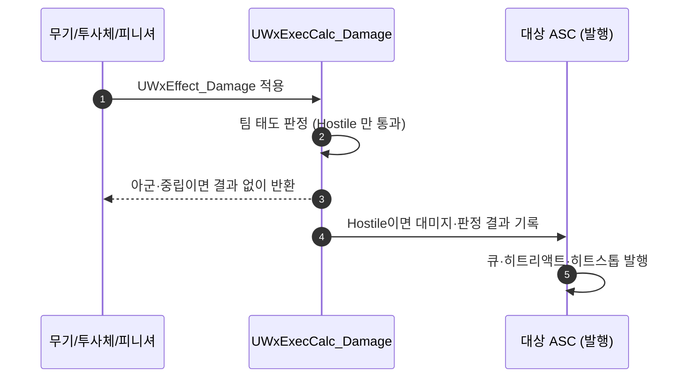

# 아군 피해 차단 — 대미지 ExecCalc에서 적대 관계만 통과

## 계획

### 목표

무기 스윙 히트 판정이 팀을 보지 않아 아군에게 피해가 들어간다. 콜리전이 `ECC_Pawn` 전체를 잡고
적 캐릭터가 전부 같은 팀이라 적끼리도 서로 때린다. 팀 판정을 대미지가 성립하는 시점에 한 번 넣어
적대(Hostile) 관계에만 피해가 성립하게 한다.

### 수정 범위

| 파일 | 수정할 내용 | 구분 |
|---|---|---|
| `Plugins/WxCombat/.../Effect/WxExecCalc_Damage.cpp` | 판정 초기화 직후 팀 태도 게이트 추가 | 수정 |
| `Plugins/WxCombat/.../Effect/WxExecCalc_Burn.cpp` | 사망·무적 검사 옆에 같은 게이트 추가 | 수정 |
| `Plugins/WxCombat/.../Weapon/WxWeaponBase.h` | `ProcessHit` 주석의 "팀 판정 안 함" 서술 정정 | 수정 |

### 접근 방식

- **판정 위치를 대미지 파이프라인으로**: 겨냥 단계(타게팅 프리셋 필터)나 콜리전 단계가 아니라
  대미지가 성립하는 시점에 둔다. 프리셋 필터 재적용안은 안전 규칙이 몽타주 노티파이 저작에 매달려
  스냅 노티파이가 없는 새 공격에서 조용히 뚫리고, `ScreenBounds`·`LineTrace`·`InputDirection`처럼
  관측자 상태에 의존하는 후보 선별 규칙까지 대미지에 끌고 들어온다. Lyra도 대미지 ExecCalc에서
  `ULyraTeamSubsystem::CanCauseDamage`를 물어 차단하고, 엔진 GAS의 `FGameplayTargetDataFilter`와
  GameplayTargetingSystem 기본 태스크에 팀 개념이 아예 없는 것도 같은 전제다.

- **경로별 처리 없음**: 무기 스윙·피니셔·투사체가 모두 `UWxEffect_Damage`를 거치므로
  `UWxExecCalc_Damage` 한 곳으로 전부 덮인다. 판정 결과를 남기지 않고 빠져나가면 컨텍스트가 비어
  `UWxAbilitySystemComponent`의 발행 단계가 큐·히트리액트·히트스톱을 모두 건너뛴다.

- **팀 태도는 기존 엔진 인터페이스 사용**: `AWxCharacterBase::GetTeamAttitudeTowards`를 그대로
  쓴다. 새 팀 시스템·서브시스템·헬퍼 함수를 만들지 않고, 판정이 필요한 자리에 인라인으로 둔다.

- **예외 없음**: 이번 단계에서는 저작 옵션 없이 무조건 차단한다. 자기 자신만 팀 판정에서 제외해
  치트 `WxDamagePlayer`와 향후 자해 대미지 경로를 막지 않는다. 공격별 아군 피해 허용(광역기·오사)은
  필요해질 때 대미지 테이블 행에 플래그를 더해 붙인다.

---

## 완료

### 수정한 파일
| 파일 | 수정한 내용 | 구분 |
|---|---|---|
| `Plugins/WxCombat/.../Effect/WxExecCalc_Damage.cpp` | 판정 초기화 직후 팀 태도 게이트 추가 | 수정 |
| `Plugins/WxCombat/.../Effect/WxExecCalc_Burn.cpp` | 무적 검사 뒤에 같은 게이트 추가 | 수정 |
| `Plugins/WxCombat/.../Weapon/WxWeaponBase.h` | `ProcessHit` 주석의 "팀 판정 안 함" 서술 정정 | 수정 |

### 구현·결정과 그 이유
- **판정을 ExecCalc에 둠**: 무기·피니셔·투사체가 모두 `UWxEffect_Damage`를 거치므로 경로별 코드
  없이 한 곳으로 덮인다. 콜리전·타게팅 단계에 두면 소스마다 반복되고 저작 누락으로 조용히 뚫린다.

- **판정 초기화 뒤, 무적 검사 앞**: 컨텍스트가 여러 스펙에 공유되므로 `ClearDamageResult`는 반드시
  거쳐야 이전 판정이 남지 않는다. 그 뒤 아무 결과도 남기지 않고 반환하면 발행 단계가 큐·히트리액트·
  히트스톱을 전부 건너뛰어, 아군 히트는 물리적으로 닿기만 하고 아무 반응이 없다.

- **아바타 기준 비교**: ASC 소유자 대신 아바타를 보면 ASC가 나중에 PlayerState로 옮겨가도 판정이
  폰 기준으로 유지된다.

- **자기 자신 예외**: 치트 `WxDamagePlayer`가 자기 폰에 대미지 GE를 적용하는데 자기 자신은 Friendly로
  잡혀 막힌다. 향후 자해 대미지도 같은 경로다.

- **팀 정보가 없으면 통과**: 팀 개념이 없는 공격자나 시전자가 사라진 화상 틱은 판정 근거가 없다.
  차단 쪽으로 기울이면 화상이 시전자 사망으로 멈추는 등 무관한 동작이 조용히 죽는다.

### 계획 대비 달라진 점
- 계획대로.

### 후속 과제
- 인게임 확인 미완: 적끼리 피해 없음, 플레이어→적·샌드백 정상, 아군 화상 피해 누적 없음, 투사체
  아군 무피해, 치트 자해 정상.
- GE 자체의 *적용*은 막지 않으므로 아군에게 화상 GE가 붙는다(피해는 0). 상태 표시가 문제가 되면 GE
  적용 요구사항 쪽에서 다룬다.
- 공격별 아군 피해 허용(광역기·오사)이 필요해지면 대미지 테이블 행에 플래그를 더해 두 ExecCalc의
  게이트를 조건화한다.
