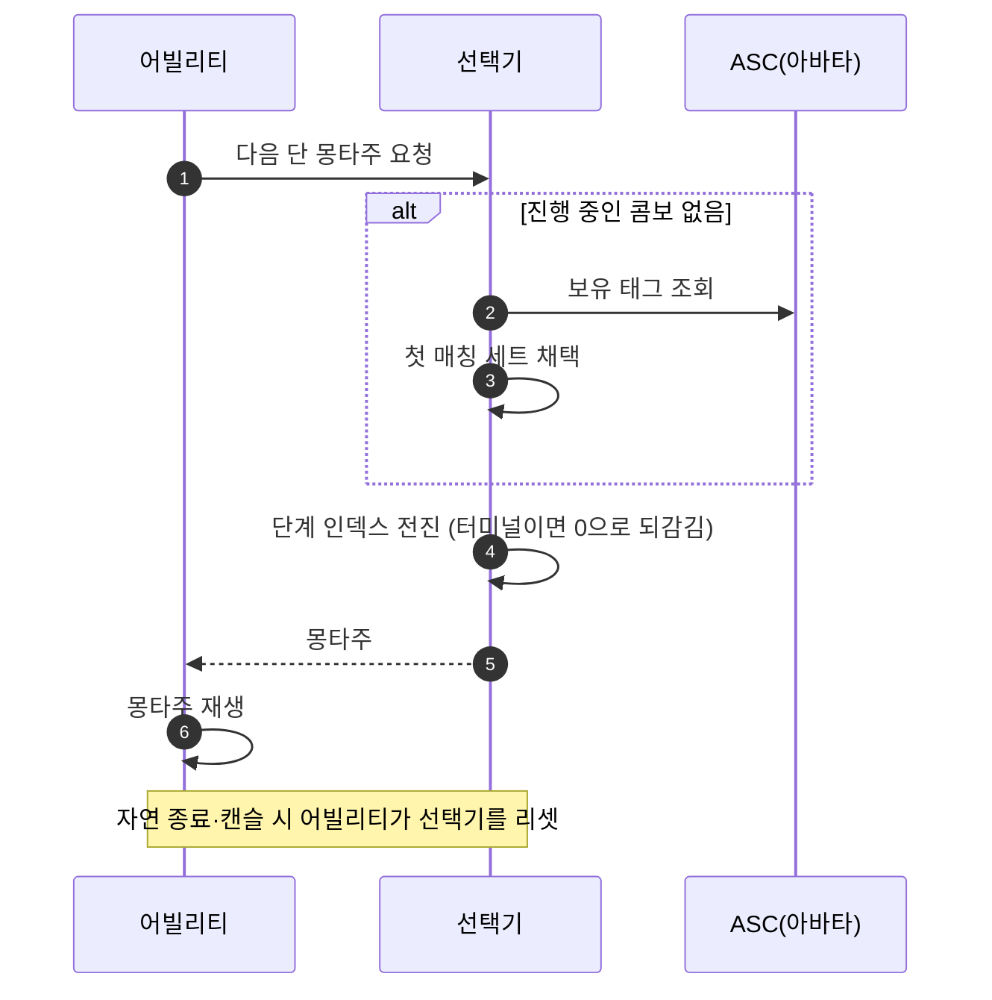

# 콤보 몽타주 선택 로직을 재사용 단위로 분리

## 계획

### 목표

공격 어빌리티에 묶여 있는 몽타주 세트 구조체와 그 선택 로직(세트 해석·단계 전진·리셋)을 재사용 가능한 한 단위로 떼어내고, 같은 콤보 진행을 따로 구현하던 스킬 어빌리티가 그것을 쓰게 한다. 2026-08-10 재설계 때 "스킬도 세트를 갖게 되는 시점에 옮긴다"고 남긴 후속 과제다.

### 수정 범위

| 파일 | 수정할 내용 | 구분 |
|---|---|---|
| `Plugins/WxCombat/.../Public/AbilitySystem/Ability/WxComboMontageSelector.h` | `FWxAbilityMontageSet`(공격 헤더에서 이동)과 선택기 구조체 `FWxComboMontageSelector` 정의 | 신규 |
| `Plugins/WxCombat/.../Private/AbilitySystem/Ability/WxComboMontageSelector.cpp` | 세트 해석·단계 전진·리셋 구현 | 신규 |
| `Plugins/WxCombat/.../Public/AbilitySystem/Ability/WxAbility_Attack.h` | 구조체 정의·`MontageSets`·진행 인덱스 2개·`ResolveMontageSetIndex` 삭제 → 선택기 멤버 1개. `PlayCurrentMontage` → `PlayMontage(UAnimMontage*)` | 수정 |
| `Plugins/WxCombat/.../Private/AbilitySystem/Ability/WxAbility_Attack.cpp` | 선택기에서 몽타주를 받아 재생, 리셋 지점을 선택기 호출로 교체 | 수정 |
| `Plugins/WxCombat/.../Public/AbilitySystem/Ability/WxAbility_Skill.h` | `SkillMontages`·`CurrentIndex` 삭제 → 같은 선택기 멤버. 클래스 주석 갱신 | 수정 |
| `Plugins/WxCombat/.../Private/AbilitySystem/Ability/WxAbility_Skill.cpp` | 공격과 같은 형태로 교체 | 수정 |
| `Docs/Programmer/Ability_Activation_Flow.md` | 공격 행의 `MontageSets` 언급 갱신 | 수정 |

### 접근 방식

- **형태는 USTRUCT**: 세트 배열은 어빌리티 CDO에 얹히는 편집 데이터고 진행 인덱스는 인스턴스의 런타임 상태다. 멤버 하나면 둘 다 자연스럽게 따라붙고 디테일 패널 모양도 그대로다. 인스턴스드 UObject는 어빌리티마다 객체 할당과 인스턴싱 규칙을 더하는데, 같은 모양을 2026-07-23에 YAGNI로 걷어낸 전례가 있다.
- **선택기 표면은 셋**: 진행 중인지 묻기, 한 단 전진해 몽타주 받기, 진행 버리기. 세트 해석은 내부에 숨긴다. 우선순위 규칙(배열 순서가 곧 우선순위, 빈 요구사항은 무조건 매칭)은 그대로 옮긴다.
- **재생은 어빌리티가 유지**: 몽타주 태스크는 소유 어빌리티가 있어야 만들 수 있으므로 선택기는 "무엇을 재생할지"까지만 답한다. 재생 함수는 이미 가드·회피가 쓰는 `PlayMontage(UAnimMontage*)` 모양으로 통일한다.
- **스킬은 덤으로 태그 분기 획득**: 평평한 배열이 세트 배열로 바뀌므로 세트가 하나면 기존과 동작이 같고, 조건부 변형이 필요해지면 세트를 더하기만 하면 된다.
- **에셋 재기입**: 프로퍼티 경로가 바뀌어 GA 6개의 몽타주 데이터가 끊긴다. 값은 미리 읽어뒀고 빌드·에디터 재시작 후 MCP로 새 경로에 되돌려 쓴다.

---

## 완료

### 수정한 파일
| 파일 | 수정한 내용 | 구분 |
|---|---|---|
| `Plugins/WxCombat/.../Public/AbilitySystem/Ability/WxComboMontageSelector.h` | 세트 구조체를 공격 헤더에서 옮기며 `FWxComboMontageSet`으로 개명하고, 세트 배열·진행 인덱스·전진/리셋을 묶은 `FWxComboMontageSelector` 신설 | 신규 |
| `Plugins/WxCombat/.../Private/AbilitySystem/Ability/WxComboMontageSelector.cpp` | 세트 해석(첫 매칭 채택)과 단계 전진·되감기, 리셋 구현 | 신규 |
| `Plugins/WxCombat/.../Public/AbilitySystem/Ability/WxAbility_Attack.h` | 구조체 정의·세트 배열·진행 인덱스 2개·세트 해석 함수 삭제 → 선택기 멤버 1개. 재생 함수를 몽타주 인자를 받는 형태로 교체 | 수정 |
| `Plugins/WxCombat/.../Private/AbilitySystem/Ability/WxAbility_Attack.cpp` | 활성화가 선택기에서 몽타주를 받아 재생하고, 실패는 한 지점에서 캔슬 종료로 모인다. 리셋 지점 정리 | 수정 |
| `Plugins/WxCombat/.../Public/AbilitySystem/Ability/WxAbility_Skill.h` | 평평한 몽타주 배열·진행 인덱스 삭제 → 같은 선택기 멤버. 클래스 주석 갱신 | 수정 |
| `Plugins/WxCombat/.../Private/AbilitySystem/Ability/WxAbility_Skill.cpp` | 공격과 같은 형태로 교체 | 수정 |
| `Docs/Programmer/Ability_Activation_Flow.md` | 공격 행이 선택기를 가리키도록 갱신, 스킬도 같은 것을 쓴다고 명시 | 수정 |
| `Content/AbilitySystem/Ability/GA_Attack_Light·Heavy`, `GA_Skill_1~4` | 몽타주 데이터를 새 프로퍼티 경로로 이관 | 수정 |

### 구현·결정과 그 이유
- **형태는 USTRUCT**: 편집 데이터(세트)와 런타임 상태(진행 인덱스)를 한 멤버로 어빌리티에 얹었다. 인스턴스드 UObject였다면 어빌리티마다 객체 할당과 인스턴싱 규칙이 붙는데, 얻는 건 지금 필요 없는 교체 가능성뿐이다.
- **선택기 표면은 둘뿐**: "진행 중인가"를 묻는 함수도 두려 했으나 전진 함수가 진입과 진행을 스스로 가르면 외부 호출자가 생기지 않아 뺐다.
- **실패 경로 일원화**: 매칭 세트 없음·해당 단 비었음·태스크 생성 실패가 모두 널/false로 모여 활성화의 한 지점에서 캔슬 종료된다. 재생 함수가 널을 스스로 거르므로 호출부에 판정이 두 번 서지 않는다.
- **캔슬 리셋은 한 곳**: 인터럽트·캔슬 핸들러가 직접 하던 리셋은 종료 오버라이드의 캔슬 리셋과 중복이라 지웠다. 이제 되돌림이 필요한 곳은 캔슬 종료 한 곳과, 캔슬이 아니라 그 경로를 타지 않는 자연 종료뿐이다.
- **에셋은 스크립트로 이관**: 프로퍼티가 한 단계 안으로 들어가 경로가 바뀌므로 리다이렉트로 살릴 수 없다. 코드 변경 전에 6개 GA의 값을 읽어두고, 빌드·에디터 재시작 뒤 같은 값을 새 경로에 되돌려 쓴 다음 컴파일·저장했다.

### 계획 대비 달라진 점
- 선택기 공개 API에서 진행 여부 조회 함수를 뺐다(호출자가 생기지 않음).
- 세트 구조체를 "그대로 이동"에서 개명으로 바꿨다. 이름의 "Ability"가 공격 헤더에 살던 시절의 흔적이라 이사한 위치에서 아무것도 가리키지 않고, 짝인 선택기와 어휘도 어긋났다. 어빌리티 멤버 이름도 타입에 맞춰 `ComboSelector`로 통일했다. 안쪽 배열 이름은 패널에서 같은 단어가 층마다 겹치지 않도록 그대로 뒀다.

### 후속 과제
- **PIE 미검증**: 컴파일과 에셋 데이터(저장 후 재조회)까지 확인했다. 공격 4단 진행·터미널 되감기·피격 캔슬 후 1단 재시작, 스킬 3의 3단 진행은 직접 플레이로 확인이 필요하다.
- **스킬 세트 분기 미사용**: 스킬이 태그 기반 세트를 쓸 수 있게 됐지만 현재는 전부 세트 1개다.
- **공격·스킬 클래스 근접**: 두 클래스가 거의 같은 형태가 됐다. 통합하려면 BP 부모 교체가 따라오므로 별건으로 남긴다.
