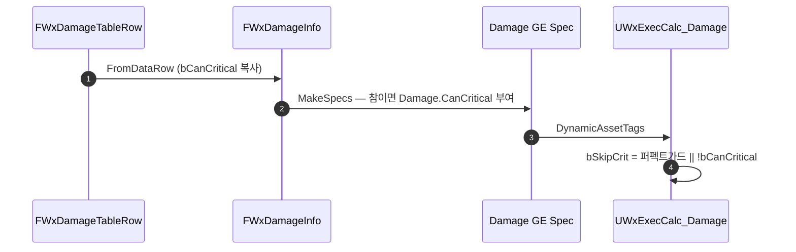

# 대미지에 크리티컬 발생 가능 플래그 추가

## 계획

### 목표
크리티컬이 공격자 어트리뷰트(`CritRate`/`CritDMG`)로만 결정돼 특정 공격만 크리를 막을 수단이 없다. 공격 단위로 크리티컬 발생 가능 여부를 지정할 수 있게 해, 도트·환경 대미지나 고정 수치를 보장해야 하는 연출성 공격에서 꺼 둘 수 있게 한다.

### 수정 범위
| 파일 | 수정할 내용 | 구분 |
|---|---|---|
| `WxCore/Public/WxGameplayTags.h` | `Damage_CanCritical` 선언 + 용도 주석 | 수정 |
| `WxCore/Private/WxGameplayTags.cpp` | `"Damage.CanCritical"` 정의 | 수정 |
| `WxCombat/Public/Damage/WxDamageTableRow.h` | `bCanCritical` 필드(기본 true), `bUnblockable` 앞 | 수정 |
| `WxCombat/Public/Damage/WxDamageInfo.h` | 같은 필드, 같은 위치 | 수정 |
| `WxCombat/Private/Damage/WxDamageInfo.cpp` | `FromDataRow` 복사, `MakeSpecs`에서 참일 때 태그 부여 | 수정 |
| `WxCombat/Private/AbilitySystem/Effect/WxExecCalc_Damage.cpp` | 태그를 `CalcDamage`의 `bSkipCrit`에 합성 | 수정 |

### 접근 방식
- **기존 플래그 형태 답습**: 바로 옆 `bParryHitReact`가 기본 true에 참일 때 태그를 붙인다. 같은 형태를 그대로 따라 `bCanCritical`도 참일 때 `Damage.CanCritical`을 싣는다.
- **계산 로직 재사용**: `CalcDamage`가 이미 퍼펙트 가드용으로 `bSkipCrit`을 받으므로, 호출 인자를 `bPerfectGuardApplied || !bCanCritical`로 합치기만 한다. 인자명은 두 사유를 아우르므로 유지.
- **연출 동반 차단**: 크리가 꺼지면 `bIsCritical`이 false로 남아 `GameplayCue.Damage`에 `Damage.Critical`이 실리지 않아 크리 표시도 함께 꺼진다.
- **로우에도 추가**: 실제 저작 경로가 전부 `DamageDataRow`라, 로우에 필드가 없으면 플래그를 켤 수단이 없다.

---

## 완료

### 수정한 파일
| 파일 | 수정한 내용 | 구분 |
|---|---|---|
| `WxCore/Public/WxGameplayTags.h` | `Damage_CanCritical` 선언, Damage 구획 `Damage_Critical` 다음 | 수정 |
| `WxCore/Private/WxGameplayTags.cpp` | `"Damage.CanCritical"` 정의 | 수정 |
| `WxCombat/Public/Damage/WxDamageTableRow.h` | `bCanCritical` 필드(기본 true) | 수정 |
| `WxCombat/Public/Damage/WxDamageInfo.h` | 같은 필드 | 수정 |
| `WxCombat/Private/Damage/WxDamageInfo.cpp` | `FromDataRow` 복사, `MakeSpecs`에서 참일 때 태그 부여 | 수정 |
| `WxCombat/Private/AbilitySystem/Effect/WxExecCalc_Damage.cpp` | 태그를 읽어 `bSkipCrit`에 합성, 크리 스킵 주석을 호출부로 이동 | 수정 |

### 구현·결정과 그 이유
- **긍정형 필드 + 참일 때 태그**: 처음엔 태그를 억제 표식(`Damage.NoCritical`)으로 두어 태그 누락 시 크리가 조용히 사라지는 걸 막으려 했다. 실제로 확인하니 `UWxEffect_Damage` Spec 생산 경로는 `MakeSpecs` 하나뿐이고, 치트의 RawDamage 경로는 ExecCalc가 이미 크리를 건너뛴다. 없는 위험 때문에 필드명과 태그명을 어긋나게 둘 이유가 없어, 바로 옆 `bParryHitReact`와 같은 형태로 통일했다.
- **주석 없는 필드**: `bCanCritical`은 이름으로 자명해 UPROPERTY 툴팁을 달지 않았다.
- **크리 스킵 주석 이동**: 원래 `EvalParams` 선언 위에 붙어 있었으나 실제 대상은 `CalcDamage` 호출이라, 사유가 둘로 늘어난 김에 호출부 바로 위로 옮겼다.

### 계획 대비 달라진 점
- 계획대로.

### 후속 과제
- 실동작 확인 미완: `Content/DesignerTables/DT_Damage`의 한 행에서 `bCanCritical`을 끄고 크리가 뜨지 않는지(수치 고정·크리 연출 미표시) 확인이 남았다. 기존 행은 구조체 기본값 `true`로 채워지므로 현재 동작은 그대로다.
