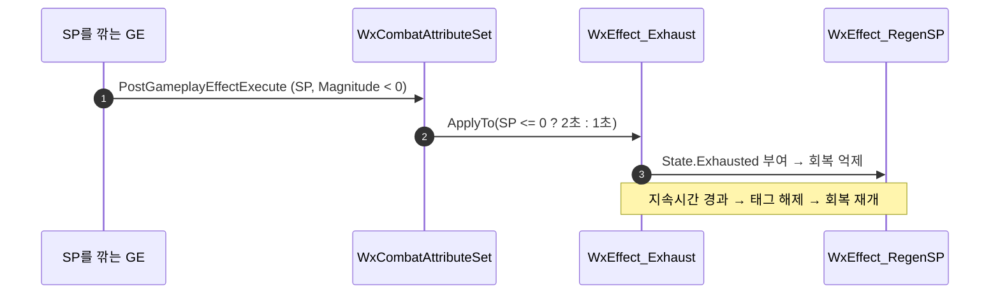

# 탈진 상태 — SP 소모 후 자연 회복 지연

## 계획

### 목표
SP가 0이 되어도 사실상 무한히 달릴 수 있다. 질주는 SP가 0이 되면 스스로 끝나는데, 그때 빠지는 `State.Sprint`가 자연 회복을 막는 유일한 조건이라 회복이 즉시 재개되고, 한 틱(1/30초) 뒤면 SP가 0을 넘어 재발동 조건을 통과한다. 질주 입력이 Hold 트리거의 `Triggered`에 걸려 매 프레임 재발동을 시도하므로 이 루프가 계속 돈다. 회복이 소모보다 2배 빨라 균형점에서 시간의 약 2/3를 질주로 보낸다. SP를 소모하면 일정 시간 회복이 멈추는 탈진 상태를 넣어 막는다.

### 수정 범위
| 파일 | 수정할 내용 | 구분 |
|---|---|---|
| `Plugins/WxCore/.../WxGameplayTags.h`·`.cpp` | `State_Exhausted` 선언·정의 | 수정 |
| `Plugins/WxCombat/.../Effect/WxEffect_Exhaust.h`·`.cpp` | 지속시간 SetByCaller, `State.Exhausted` 부여, 갱신형 단일 스택, `ApplyTo` | 신규 |
| `.../Effect/WxEffect_RegenSP.cpp` | 억제 조건(IgnoreTags)에 `State_Exhausted` 추가 | 수정 |
| `.../Attribute/WxCombatAttributeSet.cpp` | SP 소모 시 탈진 적용 | 수정 |
| `.../Ability/WxAbility_Sprint.h`·`.cpp` | 재발동 SP 문턱 | 수정 |

### 접근 방식
- **규칙 하나로 통일**: "SP를 소모하면 그 시점부터 N초 동안 자연 회복이 멈춘다." N은 평상시 1초, 소모 결과 SP가 0이면 2초. 가드로 막은 히트는 SP를 깎으므로 별도 취급 없이 규칙에 흡수된다.
- **판정은 결과값 기준**: 소모량이 아니라 소모 후 SP를 보고 지속시간을 고른다. 0에서 또 깎여도 2초가 다시 걸리고, 짧은 값이 긴 값을 덮어쓰는 순서 문제가 생기지 않는다.
- **트리거 지점은 어트리뷰트 셋 하나**: `PostGameplayEffectExecute`는 base value가 바뀔 때만 불리므로 SP를 깎는 GE(질주 소모·회피 코스트·가드 피격)가 전부 이 한 지점을 지난다. 호출처를 열거하지 않아도 규칙이 구조로 성립한다.
- **상태는 지속 GE + 태그**: 회복 GE가 이미 `State.Sprint`·`State.Guard`를 억제 조건으로 쓰고 있으므로 조건 한 줄이 느는 형태다. 지속시간·복제·정리를 GE에 맡긴다. 스택은 갱신형 단일 스택이라 질주 중 매 틱 소모에도 인스턴스가 쌓이지 않는다.
- **재발동 문턱**: 탈진만으로는 2초가 끝나는 순간 회복 첫 틱(MaxSP의 1/120)에 질주가 붙고 두 틱 만에 0이 되는 미세 반복이 남는다. 질주 시작에 MaxSP 비율 문턱(기본 10%)을 둔다.
- **조사**: 소울류는 0 도달이 아니라 소모마다 회복을 멈춘다(다크소울 3 실측 0.70초). GAS 진영의 통상 형태도 지금과 같은 "무한 주기 회복 GE + 금지 태그"다. 에픽도 임계 판정을 `PostGameplayEffectExecute`에 둔다(Lyra `ULyraHealthSet`).

---

## 완료

### 수정한 파일
| 파일 | 수정한 내용 | 구분 |
|---|---|---|

### 구현·결정과 그 이유

### 계획 대비 달라진 점

### 후속 과제
