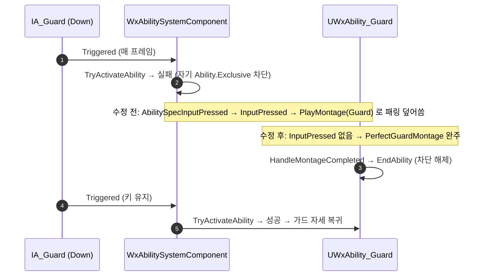

# 퍼펙트 가드 몽타주 조기 종료 수정

## 계획

### 목표
가드 키를 누르고 있는 정상 플레이에서 패링 연출(`PerfectGuardMontage`)이 1프레임 만에 `GuardMontage`로 덮여 사실상 재생되지 않는다. 홀드 중 퍼펙트 가드가 터지면 패링 몽타주가 완주하고, 키를 계속 쥐고 있으면 가드 자세로 자연 복귀하게 만든다.

### 수정 범위
| 파일 | 수정할 내용 | 구분 |
|---|---|---|
| `Plugins/WxCombat/Source/WxCombat/Public/AbilitySystem/Ability/WxAbility_Guard.h` | `InputPressed` 선언 삭제. 클래스 주석의 "가드 재입력 시 GuardMontage 복귀"를 완주 후 가드 재발동으로 정정 | 수정 |
| `Plugins/WxCombat/Source/WxCombat/Private/AbilitySystem/Ability/WxAbility_Guard.cpp` | `InputPressed` 정의 삭제. 도달 불가능한 `bRetriggerInstancedAbility`와 `ActivateAbility` early-return 삭제 | 수정 |
| `Plugins/WxCombat/Source/WxCombat/Public/AbilitySystem/WxAbilitySystemComponent.h` | 입력 라우팅 주석에서 용례로 든 "패링 중 가드 복귀" 제거 | 수정 |

### 접근 방식
- **기능 포기 — `InputPressed` 오버라이드 제거**: `IA_Guard`는 `InputTriggerDown`이라 눌려 있는 동안 매 틱 `Triggered`가 나가고, 어빌리티 입력은 `Triggered`+`Completed`만 바인딩해 엣지 신호가 없다. 게다가 가드는 자기 애셋 태그를 자기 `BlockAbilitiesWithTag`로 막아(엔진 블록 경로에는 취소와 달리 self-exception이 없다) 활성 중 발동 시도가 항상 실패하고, 입력이 매 프레임 `InputPressed`로 떨어진다. 즉 "홀드 중"과 "재입력"이 신호상 구분되지 않아 이 기능은 명세대로 동작할 수 없다.

- **완주 경로는 이미 존재한다**: 패링 몽타주 완주 → `HandleMontageCompleted` → `EndAbility`. 이때 블록이 풀리므로 키를 계속 쥐고 있으면 다음 `Triggered` 프레임에 가드가 새로 발동한다. 오버라이드를 지우는 것만으로 "완주 후 가드 복귀"가 성립하며, 새 상태 멤버도 입력 계층 변경도 필요 없다. 부수 효과로 `State.Guard`가 패링 내내 유지돼 반격 윈도우가 온전해진다.

- **같은 오해에서 나온 죽은 코드 정리**: `bRetriggerInstancedAbility`는 자기 차단 때문에 재발동 분기에 도달 자체가 불가능하다. `ActivateAbility`의 `if (ActiveMontage) return;`은 설령 재발동이 성립하더라도 엔진이 재활성화 직전에 `EndAbility`를 호출하므로 어느 경로로도 참이 될 수 없다.

---

## 완료

### 수정한 파일
| 파일 | 수정한 내용 | 구분 |
|---|---|---|
| `Plugins/WxCombat/.../Public/AbilitySystem/Ability/WxAbility_Guard.h` | `InputPressed` 선언 삭제, 페이즈 주석의 복귀 조건 정정 | 수정 |
| `Plugins/WxCombat/.../Private/AbilitySystem/Ability/WxAbility_Guard.cpp` | `InputPressed` 정의 삭제, `bRetriggerInstancedAbility` 삭제, `ActivateAbility` early-return 삭제, 자기 차단 의도 주석 추가 | 수정 |
| `Plugins/WxCombat/.../Public/AbilitySystem/WxAbilitySystemComponent.h` | 입력 라우팅 주석에서 "패링 중 가드 복귀" 용례 제거 | 수정 |

### 구현·결정과 그 이유
- **기능을 되살리지 않고 포기**: 가드 입력은 Down 트리거라 "홀드 중"과 "재입력"이 신호상 같다. 살리려면 입력 계층에 엣지 경로를 새로 깔아야 하는데, 그 경로는 락온 토글이 같은 프레임에 해제→재발동으로 되살아나는 문제를 함께 안고 온다. 얻는 것("패링 도중 뗐다 다시 눌러 일찍 끊기")에 비해 대가가 커서 단순한 새 동작을 택했다.

- **완주 후 복귀를 새로 만들지 않음**: 몽타주 완주 → 종료 → 차단 해제 → 키를 쥐고 있으면 재발동이라는 경로가 이미 있었다. 오버라이드를 지우는 것만으로 성립하므로 상태 멤버를 새로 두지 않았다.

- **죽은 코드를 함께 제거**: 재발동 플래그와 재진입 방어는 둘 다 도달 불가였다. 리뷰가 이 지점에서 오독했던 만큼, 남겨 두면 다음 사람이 같은 함정에 빠진다. 대신 자기 차단이 의도된 장치라는 사실을 생성자에 주석으로 남겼다.

- **부수 효과(주의)**: 홀드 중 패링이 이제 종료→재발동을 거치므로 `State.Guard`에 1프레임 공백이 생긴다. 종전에는 패링이 즉시 가드로 덮여 어빌리티가 끊기지 않았고 태그가 연속이었다. 그 프레임에 도달한 공격은 가드 판정을 못 받는다. 재발동 자체는 공짜다 — `DT_Ability`에 `GA_Guard` 행이 없고 GA_Guard에 `AbilityDataRow`가 걸려 있지 않아 쿨다운·코스트가 모두 0이다.

### 계획 대비 달라진 점
- 계획대로. 다만 생성자의 자기 차단에 의도 주석을 한 줄 덧붙였다 — 플래그를 지우고 나면 그 차단이 왜 있는지가 코드에서 안 읽히기 때문이다.

### 후속 과제
- **인게임 확인 미완**: 빌드만 검증했다. 홀드 상태로 퍼펙트 가드를 받아 패링 몽타주가 완주하는지, 완주 후 가드로 복귀하는지 PIE에서 확인해야 한다.
- **패링 페이즈 탈출 경로**: 이제 이 페이즈를 빠져나가는 유일한 경로가 몽타주 완주다(`InputReleased`는 이 페이즈에서 조기 반환하므로 키를 떼도 끝나지 않는다). `AM_Parry`가 비루핑임을 확인해 `OnCompleted`가 보장되므로 문제 없다. 다만 이 어빌리티의 종료가 몽타주 완주 한 지점에만 걸려 있다는 점은, 나중에 패링 몽타주를 루핑으로 바꾸면 즉시 소프트락이 된다는 뜻이다.
- **BP 그래프 재실행**: GA_Guard에 `K2_ActivateAbility`·`K2_OnEndAbility` 그래프가 있다. 홀드 중 패링 후 재발동이 새로 생기므로 그 그래프가 한 번 더 돈다. 그래프 내용은 확인하지 않았다.

- **1프레임 갭의 실제 위험도(판단: 당분간 방치)**: 갭에서는 `State.Guard`뿐 아니라 `Ability.Exclusive` 차단도 풀린다. `AM_Guard`에 `StartRecovery` 노티파이가 없어 가드 중 차단이 내내 유지되므로, 이 프레임이 다른 배타 어빌리티가 끼어들 수 있는 유일한 창이다. 다만 실질 피해는 "가드+강공격 동시 홀드" 한 경우뿐이다(가드가 공격 종료까지 복귀 못 함). 질주 홀드는 코스트가 0이고 가드가 즉시 취소해 무해하며, 나머지는 16ms 정밀도를 요구한다. 제대로 닫으려면 입력 상태를 서버로 보내야 하는데 — 지금 설계가 네트워크 정합적인 이유가 패링 페이즈의 종료 조건이 입력과 무관하기 때문이라, 입력 의존 종료를 넣으면 클라·서버가 갈린다. 플레이테스트에서 "패링 직후 가드가 풀린다"·"패링 끝에 경직" 제보가 나오면 여기를 먼저 본다.

- **선행 의심 건(이번 수정과 무관)**: `WxAbility_Guard.h`는 가드 반격 진입 시점을 "가드 몽타주의 StartRecovery가 차단을 푸는 때"로 적어 뒀지만 `AM_Guard`에 그 노티파이가 없다. 반격이 아예 발동하지 못하고 있을 가능성이 있다.
- 가드 홀드 중 `InvokeReplicatedEvent(InputPressed)`가 매 프레임 RPC로 나간다. 같은 레벨-신호 뿌리에서 나온 대역폭 문제지만 별건이다.
