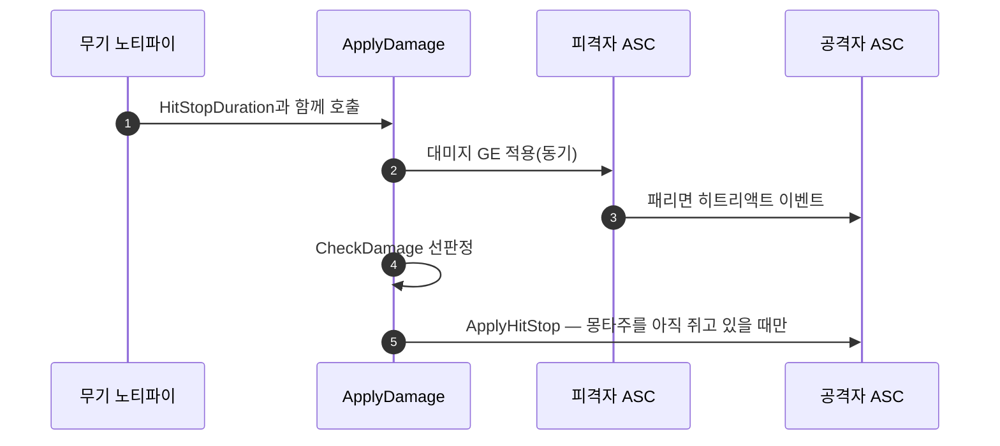

# SetByCaller.HitStop을 없애고 히트스톱을 공격자 쪽에서 발동한다

## 계획

### 목표

`SetByCaller.HitStop`은 값 하나를 대미지 GE 스펙에 태워 피격자 ASC를 거쳐 다시 공격자 ASC로 돌려보내는 통로일 뿐이고, 그 네 지점이 전부 `ApplyDamage`에서 시작된 같은 동기 호출 스택 안이다. 히트스톱 조건이 순수 선판정 하나로 정리된 지금은 공격자가 스스로 판정할 수 있으므로, 태그와 전송 경로를 걷고 발동을 `ApplyDamage`로 옮긴다.

### 수정 범위
| 파일 | 수정할 내용 | 구분 |
|---|---|---|
| `WxCombat/.../Private/WxCombatLibrary.cpp` | SetByCaller 부착 제거, 스펙 루프 뒤에서 히트스톱 직접 발동, include 교체 | 수정 |
| `WxCombat/.../Public/WxCombatLibrary.h` | `HitStopDuration` 파라미터 문구 정정 | 수정 |
| `WxCombat/.../Private/AbilitySystem/WxAbilitySystemComponent.cpp` | 히트스톱 수신 블록 제거, 연출 가드를 조기 반환으로 환원, include 정리, 정의 순서 이동 | 수정 |
| `WxCombat/.../Public/AbilitySystem/WxAbilitySystemComponent.h` | `ApplyHitStop`을 public으로, 주석 정정 | 수정 |
| `WxCore/.../Public/WxGameplayTags.h` `.cpp` | `SetByCaller_HitStop` 선언·정의 제거 | 수정 |

### 접근 방식

- **발동을 공격자 쪽으로 되돌린다**: 히트스톱을 가르는 조건은 이제 `CheckDamage(Source, Target)` 하나뿐이고, `ApplyDamage`는 두 ASC와 애님 중인 어빌리티, 지속시간을 전부 들고 있다. 값을 실어 보내고 되받을 이유가 없다.

- **호출 위치는 스펙 루프 뒤**: `ApplyHitStop`의 "몽타주를 이미 가로챘으면 건너뛴다" 가드가 패리 히트리액트보다 나중에 돌아야 성립한다. GE 적용이 동기라 루프를 빠져나온 시점엔 그 이벤트가 이미 나간 뒤다.

- **적용 성공 여부는 조건에 넣지 않는다**: 예측 키가 무효한 머신에서는 GE 적용이 실패하므로, 그걸 조건에 넣으면 서버와 클라이언트의 결론이 갈려 직전 작업이 없앤 비대칭이 되살아난다.

- **수신 쪽이 홀가분해진다**: 피격자 핸들러는 연출만 내는 함수가 되고, 히트스톱 때문에 조기 반환을 못 하던 연출 덩어리도 원래 형태로 돌아간다.

---

## 완료

### 수정한 파일
| 파일 | 수정한 내용 | 구분 |
|---|---|---|
| `WxCombat/.../Private/WxCombatLibrary.cpp` | SetByCaller 부착 제거, 스펙 루프 뒤에서 선판정 후 히트스톱 직접 발동, include 교체 | 수정 |
| `WxCombat/.../Public/WxCombatLibrary.h` | `HitStopDuration` 파라미터 문구 정정 | 수정 |
| `WxCombat/.../Private/AbilitySystem/WxAbilitySystemComponent.cpp` | 히트스톱 수신 블록 제거, 연출 가드를 조기 반환으로 환원, include 정리, `ApplyHitStop` 정의 이동 | 수정 |
| `WxCombat/.../Public/AbilitySystem/WxAbilitySystemComponent.h` | `ApplyHitStop`을 public으로, 주석 정정 | 수정 |
| `WxCore/.../Public/WxGameplayTags.h` `.cpp` | `SetByCaller_HitStop` 선언·정의 제거 | 수정 |
| `WxCombat/.../Effect/WxExecCalc_Damage.cpp` `.h` | 선판정에 사망 검사 추가, 반환 설명 정정 | 수정 |
| `WxCombat/.../Effect/WxExecCalc_Burn.cpp` | 선판정으로 흡수된 사망 검사 제거 | 수정 |
| `WxCombat/README.md`, `WxCore/README.md` | 이미 사라진 `Event.HitStop` 서술 정정 | 수정 |

### 구현·결정과 그 이유

- **값을 태워 보내는 대신 원천이 직접 부른다**: 히트스톱을 가르는 조건이 순수 선판정 하나로 정리된 뒤로, 지속시간을 GE 스펙에 실어 피격자를 경유시킬 이유가 없어졌다. 출발점이 두 ASC와 애님 중인 어빌리티, 지속시간을 모두 들고 있으므로 그 자리에서 판정하고 발동한다. 모디파이어가 읽지 않는 값을 SetByCaller 키로 나르던 용법도 함께 사라졌다.

- **호출 위치는 스펙 루프 뒤**: 몽타주를 이미 빼앗겼으면 양보하는 가드가 패리 반응보다 나중에 돌아야 성립한다. GE 적용이 동기라 루프를 빠져나온 시점엔 그 이벤트가 이미 도착해 있어 순서가 유지된다.

- **적용 성공 여부는 조건에서 뺐다**: 예측 키가 무효한 머신에서는 GE 적용이 실패하므로, 그걸 조건에 넣으면 서버와 클라이언트의 결론이 갈려 직전 작업이 없앤 비대칭이 되살아난다.

- **어빌리티 참조가 한 겹 짧아졌다**: 컨텍스트에서 비복제 어빌리티 인스턴스를 꺼내 쓰던 자리가 호출부의 애님 중인 어빌리티 직접 전달로 바뀌었다.

- **수신 쪽이 연출 전용이 됐다**: 히트스톱 때문에 조기 반환을 못 하고 판정 결과를 조건 블록으로 감싸고 있던 연출 덩어리가 원래의 조기 반환 형태로 돌아갔다.

- **사망 검사를 선판정 안으로 들였다**: 대미지 GE는 사망 대상에 적용 자체가 막히므로 예전엔 시체를 때려도 수신 경로가 돌지 않아 조용히 걸러졌는데, 발동을 옮기고 나니 그 우연한 방어막이 사라져 시체 타격에도 역경직이 붙었다. 화상이 선판정 바로 앞에서 같은 검사를 따로 하고 있던 것도 "이 함수는 사망을 안 본다"를 호출처가 각자 메우던 흔적이라, 함수 안으로 들여 둘을 함께 정리했다. 대미지 경로는 애초에 그 지점에 닿지 않아 영향이 없다.

- **선판정은 대미지 적용 전에 내린다**: 사망 검사를 넣고 보니 마무리 일격이 문제가 됐다. 어트리뷰트 처리가 GE 실행 도중 동기로 사망 태그를 붙이므로, 적용 뒤에 판정하면 방금 죽인 대상이 이미 시체로 보여 정작 가장 손맛이 필요한 한 방에 역경직이 빠진다. 판정은 앞에서 내리고 발동만 뒤에 남겨, 반응 양보 순서와 마무리 일격을 모두 지켰다.

- **`ApplyHitStop`만 public으로 올렸다**: 호출자가 대미지 진입점으로 옮겨졌기 때문이다. 복원 타이머와 그 콜백은 내부 사정이라 private에 남겼고, 선언이 옮겨진 만큼 정의 순서도 헤더에 맞췄다.

### 계획 대비 달라진 점
- 사이드이펙트 점검에서 시체 타격 역경직이 드러나 선판정에 사망 검사를 추가했고, 그 여파로 판정 시점을 대미지 적용 앞으로 옮겼다. 계획 단계에선 대미지 GE의 사망 차단이 히트스톱까지 가려 주고 있었다는 걸 보지 못했다.
- READMEs 두 줄을 함께 고쳤다. 이미 없어진 `Event.HitStop`을 ASC의 역할로 적고 있어, 이번에 바뀐 곳을 그대로 잘못 설명하고 있었다.

### 후속 과제
- PIE 실동작 미확인. 컴파일까지만 봤고, 역경직 체감·패리 시 양보 동작은 아직 눈으로 확인하지 않았다.
