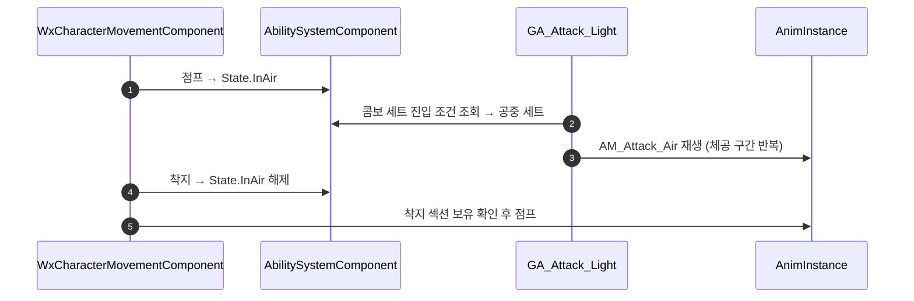

# 공중 공격

## 계획

### 목표
GA_Attack_Light에 공중 공격을 붙인다. `State.InAir`로 콤보 세트를 갈라 공중 전용 몽타주를 재생하고, 착지하면 그 몽타주의 마무리 섹션으로 넘긴다.

### 수정 범위
| 파일 | 수정할 내용 | 구분 |
|---|---|---|
| `Source/WxGame/Character/WxCharacterMovementComponent.cpp` | 낙하를 벗어날 때 재생 중인 몽타주를 착지 섹션으로 점프 | 수정 |
| `Content/AbilitySystem/Ability/GA_Attack_Light.uasset` | 콤보 세트 맨 앞에 공중 세트(AM_Attack_Air) 추가 | 수정 |

### 접근 방식
- **전환 주체는 이동 컴포넌트**: 착지를 아는 쪽이 직접 섹션을 넘긴다. 어빌리티가 착지를 관찰하고 콤보 세트가 섹션 이름을 들고 다니면 같은 일이 세 곳에 흩어진다.
- **섹션의 존재가 곧 옵트인**: 착지 섹션을 가진 몽타주만 반응하므로 별도 데이터 필드가 없고, 강공격·스킬 몽타주도 섹션만 만들면 같은 동작을 얻는다. 없는 섹션에 점프하면 엔진이 경고를 남기므로 존재 검사는 필수다.
- **복제 불필요**: 착지는 전 머신에서 각자 일어나 RPC가 필요 없고, 서버는 ASC가 매 틱 몽타주 위치를 복제하므로 프록시도 어긋나지 않는다.

---

## 완료

### 수정한 파일
| 파일 | 수정한 내용 | 구분 |
|---|---|---|
| `Source/WxGame/Character/WxCharacterMovementComponent.h` | 착지 섹션 전환 함수 선언 | 수정 |
| `Source/WxGame/Character/WxCharacterMovementComponent.cpp` | 낙하 이탈 시 재생 중인 몽타주를 착지 섹션으로 점프, 섹션 이름 파일 상수 | 수정 |
| `Content/AbilitySystem/Ability/GA_Attack_Light.uasset` | 콤보 세트 맨 앞에 공중 세트(State.InAir → AM_Attack_Air) 추가 | 수정 |

### 구현·결정과 그 이유
- **전환을 이동 컴포넌트가 직접**: 착지를 아는 쪽이 곧바로 처리하면 어빌리티가 착지를 관찰할 필요도, 콤보 세트가 섹션 이름을 들고 다닐 필요도 없다. 대안이던 세트 데이터+대기 태스크 구성은 같은 한 가지 일을 세 곳에 나눠 놓는다.
- **섹션의 존재가 곧 옵트인**: 착지 섹션을 가진 몽타주만 반응하므로 별도 플래그가 없고, 강공격·스킬도 섹션만 만들면 같은 동작을 얻는다. 없는 섹션에 점프하면 엔진이 경고를 남기는 터라 존재 검사는 어차피 필요했고, 그 검사가 판정을 겸한다.
- **섹션 이름은 파일 상수**: 캐릭터마다 달라지면 규약이 깨지므로 BP에서 만질 수 있는 프로퍼티로 열지 않았다.
- **복제 경유 없음**: 착지는 전 머신에서 각자 일어나 RPC가 필요 없고, 서버는 ASC가 매 틱 몽타주 위치를 복제하므로 시뮬레이션 프록시도 어긋나지 않는다.

### 계획 대비 달라진 점
- 계획대로. 다만 에셋 편집 도구가 배열 크기 변경과 값 변경을 동시에 못 받아, 세트 배열을 비우고 원하는 순서로 다시 채우는 두 단계로 넣었다. 태그 원소는 문자열이 아니라 이름 필드를 가진 객체로 줘야 한다(문자열로 주면 조용히 None이 된다).

### 후속 과제
- **AM_Attack_Air에 노티파이가 하나도 없다** — 지상 몽타주가 갖는 무기 판정·콤보 윈도우·타겟 스냅이 없어 현재는 재생만 되고 적을 때리지 않는다. MCP로 배치가 안 돼 몽타주 에디터에서 직접 넣어야 한다.
- PIE 실동작 미검증 — 빌드와 에셋 반영까지만 확인했다. 체공 구간 반복(Loop 섹션 자기 링크) 여부도 이때 함께 본다.
