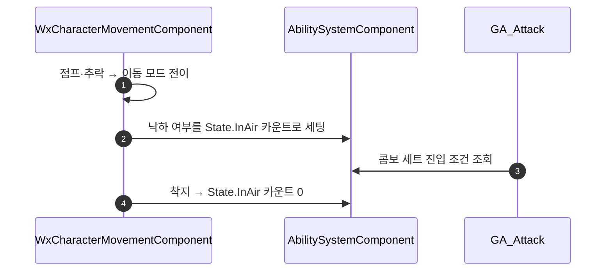

# 공중 상태 태그 발행

## 계획

### 목표
GA_Attack에 점프 공격을 붙일 수 있도록, 캐릭터가 공중에 있는 동안 ASC에 상태 태그를 세워 둔다.
공격 어빌리티의 콤보 세트는 아바타 태그로만 갈리므로, 이 태그 하나면 BP 데이터만으로 점프 공격 세트를 진입시킬 수 있다.

### 수정 범위
| 파일 | 수정할 내용 | 구분 |
|---|---|---|
| `Plugins/WxCore/.../Public/WxGameplayTags.h` | State 구획에 `State_InAir` 선언 추가 | 수정 |
| `Plugins/WxCore/.../Private/WxGameplayTags.cpp` | `"State.InAir"` 정의 추가 | 수정 |
| `Source/WxGame/Character/WxCharacterMovementComponent.h` | `OnMovementModeChanged` override 선언 | 수정 |
| `Source/WxGame/Character/WxCharacterMovementComponent.cpp` | 낙하 여부를 loose 태그 카운트로 반영 | 수정 |

### 접근 방식
- **발행 주체는 이동 컴포넌트**: 공중 여부를 계산하는 원천이 직접 태그를 세운다. 폰이나 어빌리티가 이동 상태를 훔쳐보는 relay를 만들지 않는다.
- **진입점은 `OnMovementModeChanged` 한 곳**: 점프로 뜨든 걸어서 떨어지든 낙하 모드 전이 한 곳을 지나고, 착지도 지상 모드 복귀로 같은 함수를 다시 탄다. 착지 훅을 따로 두면 발행 지점이 둘로 갈린다.
- **절대값 세팅**: 부여/제거 짝 대신 현재 이동 모드에서 값을 다시 계산해 카운트에 넣으므로 새거나 겹치지 않는다. 수영·비행은 낙하가 아니라 자연히 제외된다.
- **복제 불필요**: 이동 모드는 시뮬레이션 프록시까지 복제되므로 이 함수가 전 머신에서 돌고, 각 머신이 로컬 태그를 독립적으로 맞춘다.

---

## 완료

### 수정한 파일
| 파일 | 수정한 내용 | 구분 |
|---|---|---|
| `Plugins/WxCore/.../Public/WxGameplayTags.h` | State 구획에 `State_InAir` 선언 | 수정 |
| `Plugins/WxCore/.../Private/WxGameplayTags.cpp` | `"State.InAir"` 정의 | 수정 |
| `Source/WxGame/Character/WxCharacterMovementComponent.h` | `OnMovementModeChanged` override 선언(엔진과 같은 protected) | 수정 |
| `Source/WxGame/Character/WxCharacterMovementComponent.cpp` | 낙하 여부를 태그 카운트로 반영 | 수정 |

### 구현·결정과 그 이유
- **태그 이름은 `State.InAir`**: 점프 상승과 낙하를 함께 덮는 구간이라 낙하만 가리키는 이름은 좁다.
- **`OnMovementModeChanged` 하나로 부여·제거를 다 처리**: 뜨는 경로가 점프든 추락이든 낙하 모드 전이 한 곳으로 모이고, 착지는 지상 모드 복귀로 같은 함수를 다시 탄다. 착지 훅을 따로 붙이면 같은 상태를 두 곳에서 쓰게 된다.
- **카운트 절대값 세팅**: 부여/제거 짝을 맞추는 대신 매 전이마다 현재 모드에서 값을 다시 계산한다. 짝이 어긋나 태그가 시체처럼 남는 경우 자체가 성립하지 않는다.
- **복제·권위 분기 없음**: 이동 모드는 시뮬레이션 프록시까지 복제되므로 이 함수가 전 머신에서 돌고, 각 머신이 로컬 태그를 스스로 맞춘다.

### 계획 대비 달라진 점
- 계획대로. (계획 코드 조각의 ASC 포인터에 붙여 둔 const만 뗐다 — 태그 세팅이 비const 함수다.)

### 후속 과제
- 점프 공격 콤보 세트 구성(GA_Attack BP에 `State.InAir` 진입 조건 세트를 기본 세트보다 위에 추가)과 공중 공격 몽타주.
- PIE 실동작 미검증 — 빌드까지만 확인했다.
