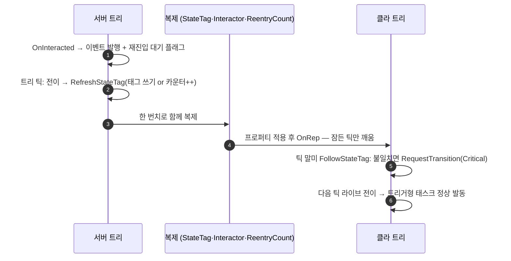

# 기믹 상태를 서버 권위 단일 경로로 수렴시키기

## 계획

### 목표
`OnRep_StateTag` 가 「아직 못 따라온 피어」를 「어긋난 피어」로 오판해 `RestartLogic()` 을 부르는 바람에, 대기 중이던 `StateTree.Interact` 이벤트가 폐기되고 재진입이 초기 진입이 되어 클라에서 트리거형 연출이 통째로 스킵되는 문제를 고친다. 원인은 판정 한 줄이 아니라 상태 결정 경로가 둘(멀티캐스트 이벤트 / `StateTag` 복제)이라는 것이므로, 기믹 상태는 서버 권위라는 정책을 세우고 클라 경로를 복제 프로퍼티 하나로 일원화한다.

### 수정 범위
| 파일 | 수정할 내용 | 구분 |
|---|---|---|
| `Plugins/WxWorld/.../Public/Gimmick/WxGimmickStateTreeComponent.h` | `Multicast_Interact` 제거, `InteractingCharacter` 복제화, `StateReentryCount`·`OnRep_StateReentryCount`·`FollowStateTag`·`bPendingInteractResolve` 추가, 상태 구동 패턴 주석 개정 | 수정 |
| `Plugins/WxWorld/.../Private/Gimmick/WxGimmickStateTreeComponent.cpp` | 위 선언들의 구현, `OnRep_StateTag` 판정 제거, `TickComponent` 권위/비권위 분기, `RefreshStateTag` 재진입 카운터 | 수정 |
| `.../Gimmick/WxStateTreeTask_MoveInteractorToTarget.cpp`, `WxStateTreeTask_PlayInteractorMontage.cpp`, `WxStateTreeTask_EnablePlayerInput.h` | 당사자 전달 경로를 멀티캐스트로 서술한 주석 정정 | 수정 |
| `Docs/Programmer/Gimmick_State_Authority.md`, `Docs/Programmer/Interaction_System.md`, `Plugins/WxWorld/README.md` | 서버 권위 단일 경로로 계약 문서 개정 | 수정 |

### 접근 방식

- **전이 소스 일원화**: `Multicast_Interact` 를 없애고 권위 측만 자기 트리에 `StateTree.Interact` 를 발행한다. 전이 조건은 서버에서만 평가되므로 `FWxGimmickInteractEvent` 와 ST 에셋은 그대로다. 당사자(`InteractingCharacter`)는 RPC 대신 복제 프로퍼티로 나른다 — 같은 오브젝트의 프로퍼티는 한 번치로 전부 적용된 뒤 RepNotify 가 돌므로 `StateTag` 와 원자적으로 맞아떨어지고, 이벤트를 놓친 피어가 낡은 당사자로 이동 태스크를 돌리는 위험도 사라진다.

- **교정은 재시작이 아니라 라이브 전이**: `RestartLogic()`(인스턴스 데이터·이벤트 큐 리셋 + 초기 진입) 대신 `FStateTreeExecutionContext::RequestTransition(Target, Critical)`. 전이 처리 밖에서 부르면 요청이 버퍼링되고 실행 확장을 통해 컴포넌트 틱이 깨어나며, 다음 틱의 `TriggerTransitions` 맨 앞에서 유효한 `SourceStateID` 로 소비되어 각 태스크가 라이브 전이로 본다. `RestartLogic` 은 세이브 복원·레이트조인·스트리밍 인 전용으로 남긴다.

- **판정 시점을 트리 틱 뒤로**: `TickComponent` 가 트리 틱 직후 권위는 `RefreshStateTag()`, 비권위는 `FollowStateTag()` 를 부른다. `OnRep_StateTag` 는 판정하지 않고 잠든 컴포넌트를 깨우기만 한다. 대기 이벤트를 소화한 뒤 비교하므로 오판이 사라지고, 남은 불일치는 원인을 가리지 않고 매 틱 자가 수렴한다.

- **같은 상태 재진입은 카운터로 관측**: 값 복제는 「상태가 안 바뀐 반응」(자기 자신으로 가는 전이)을 나르지 못한다. `StateReentryCount` 를 더해, 권위가 상호작용을 받았는데 결과적으로 태그가 그대로일 때만 `RefreshStateTag` 에서 증가시킨다(태그 쓰기와 같은 자리라 헛재진입이 없다). 클라는 OnRep 에서 현재 `StateTag` 로 재선택을 요청하고, 무엇을 다시 돌릴지는 각 태스크의 `bShouldStateChangeOnReselect` 가 정한다.

---

## 완료

### 수정한 파일
| 파일 | 수정한 내용 | 구분 |
|---|---|---|
| `Plugins/WxWorld/.../Public/Gimmick/WxGimmickStateTreeComponent.h` | `Multicast_Interact` 삭제, `InteractingCharacter` 복제화, `Multicast_ReenterState` 추가, 내부 함수 3종(`PublishAuthorityState`/`FollowAuthorityState`/`EnterReplicatedState`)과 `bPendingInteractResolve` 선언, 상태 구동 패턴 주석 개정 | 수정 |
| `Plugins/WxWorld/.../Private/Gimmick/WxGimmickStateTreeComponent.cpp` | 위 구현. `OnRep_StateTag` 는 판정 대신 틱 깨우기, `TickComponent` 가 권위/클라로 갈라 게시·추종, 교정은 `RequestTransition(Critical)`, 진단 로그 추가 | 수정 |
| `.../Gimmick/WxStateTreeTask_MoveInteractorToTarget.cpp`, `WxStateTreeTask_PlayInteractorMontage.cpp`, `WxStateTreeTask_EnablePlayerInput.h` | 당사자 전달 경로 서술 정정(멀티캐스트 → 복제) | 수정 |
| `Docs/Programmer/Gimmick_State_Authority.md` | 서버 권위 단일 경로로 계약 개정, 「어긋났을 때 무엇을 보는가」 진단 절 신설 | 수정 |
| `Docs/Programmer/Interaction_System.md`, `Plugins/WxWorld/README.md` | 같은 취지로 서술 갱신 | 수정 |

### 구현·결정과 그 이유
- **오판을 고치는 대신 경로를 하나로 줄였다**: 판정 시점만 미루면 발현 1은 막히지만, 뒤늦게 도착한 멀티캐스트가 이미 목적지에 있는 클라를 한 상태 더 밀어내는 경로(발현 2)가 남는다. 그 경로는 클라가 이벤트를 처리하는 한 사라지지 않으므로 클라의 이벤트 처리를 없앴다. 이후 남는 어긋남은 원인을 가리지 않고 추종 한 자리로 수렴한다.
- **교정에 `RequestTransition` 을 쓴 이유**: `Start` 는 `InstanceData.Reset()` → `EventQueue->Reset()` 을 무조건 수행해 대기 이벤트를 버리고, 진입이 `SourceStateID` 무효라 초기 진입으로 잡혀 트리거형 태스크가 전부 스킵된다. 전이 요청은 둘 다 피하면서 우선순위 `Critical` 로 에셋 전이보다 앞선다.
- **당사자를 RPC 가 아니라 복제 프로퍼티로**: 같은 오브젝트의 프로퍼티는 한 번치로 전부 적용된 뒤 RepNotify 가 돌아 `StateTag` 와 원자적으로 맞는다. RPC 였다면 이벤트를 놓친 피어가 직전 상호작용의 당사자로 이동 태스크를 돌릴 수 있었다.
- **재진입만 RPC 로 남긴 이유**: 처음엔 복제 카운터로 만들었는데, 리뷰에서 늦게 관련성을 얻은 피어(스트리밍 인·레이트조인)에게는 카운터 **초기값이 통째로 「변화」로 보인다**는 구멍을 찾았다 — 마침 같은 상태에서 시작했으면 체크포인트 몽타주가 헛발동한다. 초기 번치와 이후 변경을 OnRep 안에서 구분할 방법이 없어 `Multicast_ReenterState(Tag)` 로 바꿨다. RPC 는 늦게 온 피어에 재생되지 않고(그 사이의 재진입은 볼 필요가 없다), 페이로드가 자기 목적지를 들고 있어 순서에도 강하다. 상태를 정하는 것이 아니라 「권위가 정한 그 상태를 다시 열라」만 나르므로 클라 판단은 여전히 없다.
- **재진입 판정을 `PublishAuthorityState` 에서 한 이유**: `OnInteracted` 시점엔 이 상호작용이 상태를 바꾸는지 알 수 없다. 트리가 이벤트를 소화한 뒤인 틱 말미라야 「태그가 그대로」를 근거로 판정할 수 있다.
- **멈춘 트리에서의 상호작용은 조기 반환**: 이벤트가 큐에 들어가지 않는데 재진입 판정만 예약되면, 트리가 다시 시작한 첫 틱에 그 플래그가 살아남아 헛재진입 통지로 새어 나간다.
- **태그 없는 구간은 양쪽 모두 판단 보류**: 권위는 활성 Tag 가 무효면 `StateTag` 를 마지막 유효 값으로 유지한다. 클라도 같은 조건에서 대조를 멈추지 않으면, 클라가 태그 없는 구간에 들어간 순간 「과거 값」인 `StateTag` 로 되감긴다(리뷰에서 발견). 두 함수의 무효 태그 처리를 대칭으로 맞췄다.
- **클라의 로컬 완료 전이는 그대로 뒀다**: 클라는 언제나 권위보다 늦게 진입하므로 앞서갈 수 없고, 막으려면 태스크·에셋을 모두 손대야 한다. 어긋나면 추종이 끌어온다.

### 정리한 것
- 태그→핸들 조회가 세 곳에 같은 긴 식으로 반복돼 `ResolveStateTag()` 로 접었다.
- 시작 직후 상태 기록이 `BeginPlay` 와 `StartTreeAtSavedState` 폴백 분기에 갈려 있었다. `StartTreeAtSavedState` 두 분기 끝으로 모아, 저장 상태 분기만 기록을 빠뜨리던 비대칭(`module_review_WxWorld.md` 발견 8)도 함께 해소했다.
- `TickComponent` 의 오너 널 조기 반환 블록을 조건에 합쳤다.

### 계획 대비 달라진 점
- 사용자 요청으로 디버깅 편의를 더했다 — 내부 함수 이름을 데이터 흐름 방향이 드러나게 `PublishAuthorityState`/`FollowAuthorityState`/`EnterReplicatedState` 로 바꾸고, 권위·클라 양쪽 상태 이동에 `LogWxWorld` Verbose 로그를, 권위 태그를 로컬 에셋에서 못 찾는 경우에 Warning 을 넣었다. Warning 은 매 틱 도는 추종이 아니라 값이 바뀐 그 한 번(`OnRep_StateTag`)에만 남겨 로그가 잠기지 않게 했다.
- 그 밖에는 계획대로.

### 후속 과제
- **PIE 2 클라이언트 실측 미완**: 컴파일까지만 확인했다. `BP_Door`(연출 재생), `BP_Elevator`(단계 경계), `BP_CheckPoint`(재진입 카운터), 이동/몽타주 태스크의 당사자를 리모트 클라 화면에서 확인해야 한다.
- 권위에서 한 틱 안에 지나가는 중간 상태는 값 복제에 잡히지 않아 클라에서 생략된다. 현행 저작 규약에서는 발생하지 않으며 문서에 명시했다.
- `module_review_WxWorld.md` 의 발견 1 은 해소됐으나 리뷰 문서 자체는 갱신하지 않았다(다음 `module-review` 회차에 반영).
