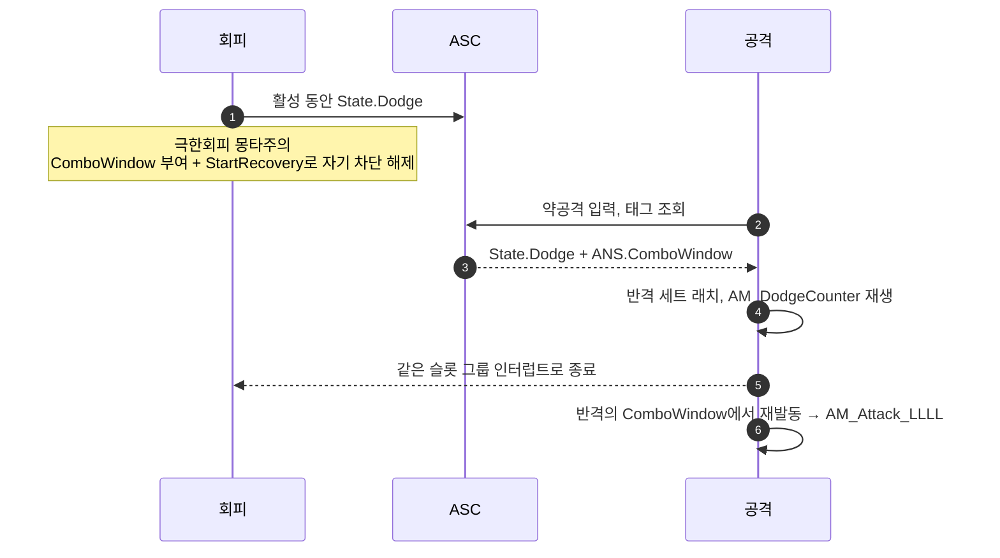

# 회피 반격을 GA_Dodge에서 GA_Attack으로 흡수

## 계획

### 목표

2026-08-10 리팩터에서 반격의 주체를 회피에서 공격으로 뒤집었으나 후속 에셋 재저작이 남아, 지금 회피 반격은 아예 동작하지 않고 `AM_DodgeCounter`는 아무도 참조하지 않는 고아 에셋이다. 마지막 배선을 채워 반격을 되살린다. C++ 변경은 없고 전부 에셋 작업이다.

### 수정 범위
| 파일 | 수정할 내용 | 구분 |
|---|---|---|
| `Content/AbilitySystem/Ability/GA_Attack_Light.uasset` | `ComboSelector.MontageSets` 맨 앞에 반격 세트 삽입 | 수정 |
| `Content/AbilitySystem/Ability/AM_DodgeSuccess.uasset` | 콤보 윈도우 시작 지점에 `AN_StartRecovery` 배치 | 수정 |
| `Content/AbilitySystem/Ability/AM_DodgeCounter.uasset` | `ANS_ComboWindow` 추가, `ANS_Invincible` 제거 | 수정 |

### 접근 방식

- **진입 조건은 태그 조합이 데이터로 표현한다**: 반격 세트의 `EntryTagRequirements`에 `State.Dodge`와 `ANS.ComboWindow`를 함께 요구하고, `ComboMontages`를 `[AM_DodgeCounter, AM_Attack_LLLL]`로 둔다. 배열 순서가 우선순위이므로 공중·기본 세트보다 앞에 놓는다. 세트는 콤보 진입 때 한 번만 정해져 유지되므로, 반격 뒤 `State.Dodge`가 사라져도 다음 입력이 같은 세트의 4단으로 이어진다(기획서 §2.4).
- **차단 해제는 몽타주가 소유한다**: 회피가 건 `Ability.Exclusive` 하드 차단은 `AM_DodgeSuccess`에 놓는 `StartRecovery` 노티파이만 푼다. 공격의 `CancelAbilitiesWithTag`를 채우는 안은 기각했다 — 그 경로는 차단 검사를 통째로 건너뛰어 회피 시작 프레임부터 아무 때나 캔슬되므로 허용 구간이라는 개념이 사라진다.
- **회피 종료는 슬롯 그룹 인터럽트에 맡긴다**: 반격 몽타주가 같은 그룹의 회피 몽타주를 끊어 회피 어빌리티가 `Interrupted`로 끝난다. 별도 캔슬 선언이 필요 없다.
- **반격 몽타주의 무적은 뗀다**: 회피가 재생하던 시절의 잔재다. 이제 재생 주체가 공격인데 무적 잔존분 청소는 회피 종료 경로에만 있어, 반격이 도중에 끊기면 무적이 영구히 남는다. 공격에 리스크를 부여한다는 전투 정책과도 어긋난다.

---

## 완료

### 수정한 파일
| 파일 | 수정한 내용 | 구분 |
|---|---|---|
| `Content/AbilitySystem/Ability/GA_Attack_Light.uasset` | `ComboSelector.MontageSets[0]`에 반격 세트 삽입(`State.Dodge`+`ANS.ComboWindow` → `AM_DodgeCounter`, `AM_Attack_LLLL`), 컴파일·저장 | 수정 |

### 구현·결정과 그 이유
- **반격 세트를 배열 맨 앞에 뒀다**: 선택기가 첫 매칭을 채택하므로 기본 세트보다 위여야 하고, 공중 세트보다도 위에 둬 공중에서 극한회피가 성립하는 경우에도 반격이 이긴다.
- **전용 반격 모션을 살렸다**: 기획서 §2.4는 반격 모션을 "일반 공격 3단과 동일"로 적었지만, 반격 몽타주는 3단과 다른 전용 애니메이션으로 이미 저작돼 있었고 대미지 행도 4단 행에 물려 있었다. 기획서 문구가 전용 에셋보다 앞선 서술로 보여 실물을 택했다.
- **`CancelAbilitiesWithTag`는 비운 채로 뒀다**: 여기에 회피를 지목하면 공격의 "끊고 들어가는" 분기가 차단 검사를 통째로 건너뛰어, 허용 구간과 무관하게 회피 시작 프레임부터 캔슬된다. 진입 시점은 몽타주가 소유한다는 설계를 지켰다.

### 계획 대비 달라진 점
- **애님 노티파이 세 건을 넘겼다**: `Notifies`는 리플렉션 스키마에 노출되지 않아 unreal-mcp의 프로퍼티 도구로 읽지도 쓰지도 못하고, 스크립트 실행 도구는 샌드박스라 `unreal` 모듈이 없다. UI 자동화도 이 세션에서는 에디터 창이 잡히지 않아(창 목록 비어 있음·화면 캡처 실패) 쓸 수 없었다. 애초에 전투 타이밍은 애니메이션을 보며 잡는 작업이라 손으로 배치하는 편이 맞다.

### 후속 과제
- **노티파이 배치(필수, 이게 없으면 반격은 여전히 동작하지 않는다)**
  - `AM_DodgeSuccess`: `ANS_ComboWindow` 구간이 시작되는 프레임에 `WxAnimNotify_StartRecovery` 배치. 회피가 건 `Ability.Exclusive` 하드 차단을 푸는 유일한 경로다.
  - `AM_DodgeCounter`: 후반부에 `ANS_ComboWindow` 추가. 없으면 재발동 판정이 `ANS.ComboWindow`를 요구하는 탓에 4단으로 이어지지 않는다.
- **반격 몽타주의 무적은 의도된 설계다**(사용자 확정). 다만 잔존분 청소는 회피 종료 경로에만 있어, 반격이 무적 구간 도중 캔슬되면(홀드 강공격·피니셔 등) 무적 태그가 영구히 남을 여지가 있다. 실제로 새면 그때 공격 쪽에도 같은 안전장치를 단다.
- **PIE 미검증**: 반격 발동, 4단 연계, 창 밖 차단, 일반 회피에서 무반응, 무적 누수, 지상·공중 평타 회귀.
- **가드 반격**: `AM_GuardCounter`도 같은 처지의 고아 에셋이고 `GA_Guard.uasset`은 리팩터 이전 저장이라 삭제된 필드의 스테일 임포트가 남아 있다. 이번 범위 밖.
