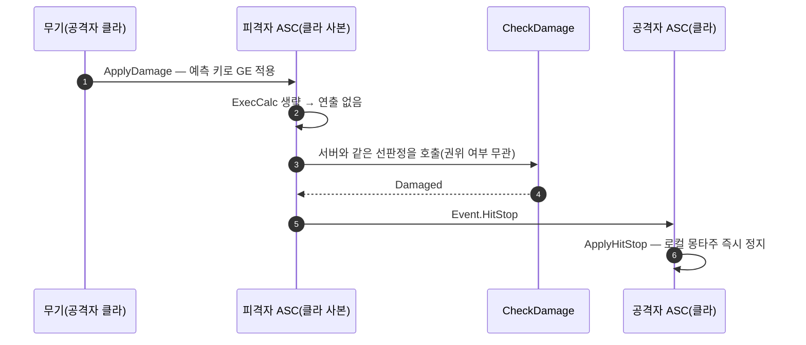

# 히트스톱을 공격자 클라이언트에서도 보이게 한다

## 계획

### 목표

히트스톱이 권위 머신에서만 발동해, 데디케이티드 서버에서는 정작 때린 플레이어 본인 화면만 역경직이 빠진다. 클라이언트가 서버와 같은 판정을 직접 내려 즉시 얼도록 고친다.

### 수정 범위

| 파일 | 수정할 내용 | 구분 |
|---|---|---|
| `.../Public/AbilitySystem/Effect/WxExecCalc_Damage.h` | `CheckDamage` 선언 | 수정 |
| `.../Private/AbilitySystem/Effect/WxExecCalc_Damage.cpp` | 인라인 선판정을 정적 함수로 분리하고 호출로 대체 | 수정 |
| `.../Private/AbilitySystem/Effect/WxExecCalc_Burn.cpp` | 위와 동일 | 수정 |
| `.../Private/AbilitySystem/WxAbilitySystemComponent.cpp` | 히트스톱 조건을 `CheckDamage`로 교체 | 수정 |

### 접근 방식

- **판정을 분리해 서버·클라가 같이 부른다**: 대미지 계산부는 캡처 어트리뷰트 애그리게이터에 묶여 ExecCalc 밖에서 돌릴 수 없지만, 계산 앞단의 선판정(팀 적대·무적)은 두 ASC만 있으면 되는 순수 판정이고 그게 정확히 히트스톱을 가르는 조건 전부다. 이걸 `UWxExecCalc_Damage::CheckDamage`로 뽑아 ExecCalc와 히트스톱 발행이 함께 쓴다.

- **클라이언트도 같은 결론에 이른다**: 팀은 `EditDefaultsOnly` 클래스 기본값이라 모든 머신에서 같고, `State.Invincible`은 애님 노티파이가 붙이는 루즈 태그라 몽타주를 재생하는 모든 머신에 붙는다. 서버가 예측 클라이언트에서 Instant 대미지 GE를 무한지속으로 바꿔 적용하면서 `OnGameplayEffectAppliedToSelf`는 그대로 브로드캐스트하므로, 공격자 클라이언트는 이미 발행 함수 안에 들어와 있다.

- **무피해 타격도 얼린다**: 지금 서버가 최종 대미지 0에서 히트스톱을 거르는 건 의도가 아니라 `None`이 "판정을 안 했다"와 "대미지가 0이다" 두 뜻을 겸해서 생긴 부작용이다. 적중은 성립했으므로 함께 바로잡는다. 그러면 히트스톱 조건이 판정 결과와 무관해져 권위 분기 없이 한 줄로 통일되고 오예측이 사라진다.

- **발행 위치는 함수 끝 그대로 둔다**: 패리 히트리액트를 공격자에게 보낸 뒤 히트스톱을 보내는 순서에 `ApplyHitStop`의 몽타주 가로채기 가드가 의존한다.

- **덤으로 중복이 준다**: 같은 선판정이 두 ExecCalc에 복붙돼 있어, 분리하면 호출처가 셋이 되면서도 코드 총량은 줄어든다.

---

## 완료

### 수정한 파일
| 파일 | 수정한 내용 | 구분 |
|---|---|---|
| `.../Public/AbilitySystem/Effect/WxExecCalc_Damage.h` | `CheckDamage` 정적 함수 선언 | 수정 |
| `.../Private/AbilitySystem/Effect/WxExecCalc_Damage.cpp` | 인라인 선판정을 정적 함수로 분리하고 호출로 대체 | 수정 |
| `.../Private/AbilitySystem/Effect/WxExecCalc_Burn.cpp` | 위와 동일 | 수정 |
| `.../Private/AbilitySystem/WxAbilitySystemComponent.cpp` | 연출 블록을 판정 조건으로 감싸고, 히트스톱 조건을 `CheckDamage`로 교체 | 수정 |
| `.../Public/AbilitySystem/WxAbilitySystemComponent.h` | 발행 함수 주석 정정 | 수정 |
| `.../Public/Damage/WxCombatEffectContext.h` | 판정 결과 주석 정정 | 수정 |

### 구현·결정과 그 이유

- **판정을 공유 함수로 분리했다**: 대미지 계산부는 캡처 어트리뷰트 애그리게이터에 묶여 ExecCalc 밖에서 돌릴 수 없지만, 계산 앞단의 선판정은 두 ASC만 있으면 되는 순수 판정이다. 그리고 그게 정확히 히트스톱을 가르는 조건 전부라, 이것만 뽑으면 클라이언트가 서버와 같은 결론에 이른다.

- **선판정의 자리는 대미지 ExecCalc다**: 나머지 대미지 규칙(계산·가드 반응·반사)이 전부 그 클래스의 멤버라 규칙이 한곳에 모인다. 화상과 히트스톱이 그 정적 함수를 부르는 형태라 "대미지 선판정을 그대로 쓴다"로 읽힌다. 블루프린트 함수 라이브러리는 BP 노출이 목적인 자리라 맞지 않았다.

- **서버 통보 대신 클라이언트 예측을 택했다**: 히트스톱은 십수 프레임짜리 손맛이라 RPC로 알리면 왕복 지연만큼 늦게 얼어붙어 오히려 해롭다. 클라이언트는 이미 자기 예측 경로로 발행 함수 안에 들어와 있으므로, 판정만 스스로 내리면 지연 없이 얼릴 수 있다.

- **서버·클라 양쪽 다 얼린다**: 몽타주 재생 속도는 무기 콜리전 구간과 어빌리티 종료 시점까지 끌고 가므로, 한쪽만 얼리면 그쪽 타임라인만 밀려 히트 판정이 어긋나기 시작한다. 같은 양만큼 멈춰야 정렬이 유지된다. 서버가 얼리는 덕에 관전 클라이언트도 복제된 재생 속도로 역경직을 본다.

- **무피해 타격도 얼리도록 바로잡았다**: 판정 결과의 빈 값이 "판정을 안 했다"와 "대미지가 0이다" 두 뜻을 겸한 탓에 서버가 무피해 적중을 걸러 왔는데, 적중 자체는 성립했으므로 의도가 아니었다. 바로잡으니 히트스톱 조건이 판정 결과와 완전히 무관해져 권위 분기 없이 한 줄로 통일됐고, 서버와 클라이언트의 결론이 모든 경우에 일치하게 됐다.

- **발행 위치는 함수 끝 그대로 뒀다**: 패리 히트리액트를 공격자에게 보낸 뒤 히트스톱을 보내는 순서에, 몽타주를 가로챘으면 건너뛰는 가드가 의존한다.

- **화상 ExecCalc도 같은 함수를 쓴다**: 같은 선판정이 두 ExecCalc에 복붙돼 있었다. 사망 검사만 화상 고유로 남기고 나머지를 호출로 대체해, 호출처가 셋으로 늘면서도 코드 총량은 줄었다.

### 계획 대비 달라진 점
- 선판정 함수를 블루프린트 함수 라이브러리에 두려던 계획을 대미지 ExecCalc로 옮겼다. BP에서 쓸 일이 없는 함수라 그 자리가 맞지 않았다.
- 계획을 세우는 도중 무피해 타격 처리와 발행 헬퍼 제거가 추가돼, 최종적으로 권위 분기가 아예 없는 형태가 됐다.

### 후속 과제
- 데디케이티드 서버 실환경 미검증. 컴파일과 코드 경로까지만 확인했고, PIE `Play As Client` 실행 확인은 아직 하지 않았다.
- 스탠드얼론에서도 무피해 타격에 히트스톱이 새로 붙는다. 체감상 어색하면 되돌릴 지점이다.
- 비대칭 지연이 정지 시간을 넘으면 클라이언트의 재생 속도 되쏘기(엔진 순정)가 서버 복원 뒤에 도착해 서버 몽타주가 안 풀릴 수 있다. 순정 동기 장치라 지금은 두고, 발현되면 대응한다.
