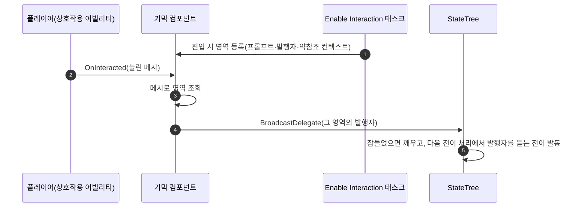

# 기믹 StateTree 전이를 태그 이벤트에서 델리게이트로 전환

## 계획

### 목표
기믹 상호작용을 공용 태그 `StateTree.Interact` 이벤트로 트리에 올리던 것을, 엔진 StateTree 델리게이트로 바꾼다. 발행처가 에셋 안에서 특정되어 오타·미매칭이 사라지고, 발행자를 상호작용 영역마다 두면 "어느 메시가 눌렸나"를 페이로드로 비교하던 조건이 통째로 불요가 된다.

### 수정 범위
| 파일 | 수정할 내용 | 구분 |
|---|---|---|
| `WxWorld/.../Gimmick/WxGimmickStateTreeComponent.h/.cpp` | `FWxGimmickInteractEvent` 삭제, `FWxGimmickInteractionRegion`(프롬프트+발행자+실행 컨텍스트) 신설, 영역 맵 값 타입 교체, `OnInteracted` 를 이벤트 발송 → 영역 발행으로 | 수정 |
| `WxWorld/.../Gimmick/WxStateTreeTask_EnableInteraction.h/.cpp` | 인스턴스 데이터에 발행자 추가, 진입 시 영역(프롬프트+발행자+약참조 컨텍스트) 등록 | 수정 |
| `WxCore/.../WxGameplayTags.h/.cpp` | `StateTree_Interact` 제거(유일 사용처 소멸) | 수정 |
| `Content/WorldObject/Gimmick/ST_TreasureChest` | 전이 1개를 OnDelegate 로, 그 상태의 Enable Interaction 발행자에 연결 | 수정(에셋) |
| `Content/WorldObject/Gimmick/ST_Door` | 전이 1개 동일 | 수정(에셋) |
| `Content/WorldObject/Gimmick/ST_CheckPoint` | 전이 2개 전환 + Lit 에 Enable Interaction 태스크 신설 | 수정(에셋) |
| `Content/WorldObject/Gimmick/ST_Elevator` | 부모 상태의 전이 4개를 Idle 자식으로 내려 6개로 재작성, Object Equals 조건 2개 제거 | 수정(에셋) |

### 접근 방식
- **발행자를 영역마다 둔다**: `Enable Interaction` 태스크가 자기 대상 메시 전용 Dispatcher 를 소유한다. 영역이 여럿인 상태는 이미 노드가 영역 수만큼 있으므로, "이 영역이 눌렸다"가 곧 서로 다른 신호가 되어 전이는 조건 없이 발행자만 지목하면 된다.
- **틱 밖 발행 경로**: 컴포넌트는 트리 틱 밖에서 발행해야 하므로, 태스크가 진입 시 자기 약참조 실행 컨텍스트를 발행자와 함께 넘긴다(엔진이 비동기 발행용으로 두는 표준 경로). 잠든 트리는 발행이 깨우고, 발행 표식은 다음 전이 처리까지 보존되어 기존 이벤트와 타이밍이 같다.
- **새 계약**: OnDelegate 전이는 그 발행자를 소유한 태스크가 있는 상태 또는 그 하위 상태에 두어야 한다. 바인딩 스코프가 루트→전이 상태 경로만 보기 때문이다. 엘리베이터는 이 때문에 부모에 있던 전이를 상호작용을 켜는 Idle 자식으로 내린다(그 사이 상태들은 전부 상호작용을 꺼 두므로 동작은 같다).
- **덤으로 메우는 구멍**: 체크포인트 Lit 에는 상호작용 선언이 없어 세이브가 Lit 인 채 복원되면 다시 쉴 수 없었다. 발행자를 얻으려 태스크를 두면 그 구멍도 함께 닫힌다.

---

## 완료

### 수정한 파일
| 파일 | 수정한 내용 | 구분 |
|---|---|---|
| `WxWorld/.../Gimmick/WxGimmickStateTreeComponent.h/.cpp` | `FWxGimmickInteractEvent` 삭제, `FWxGimmickInteractionRegion`(프롬프트+발행자+약참조 컨텍스트) 신설, 영역 맵 값 타입 교체, `OnInteracted` 를 눌린 영역 조회 후 발행으로, 프롬프트 조회·주석 정정 | 수정 |
| `WxWorld/.../Gimmick/WxStateTreeTask_EnableInteraction.h/.cpp` | 인스턴스 데이터에 발행자 추가, 진입 시 영역 조립·등록, 스코프 제약 주석 | 수정 |
| `WxCore/.../WxGameplayTags.h/.cpp` | `StateTree_Interact` 제거(StateTree 구획 소멸) | 수정 |
| `Content/WorldObject/Gimmick/ST_TreasureChest` | Closed 전이를 OnDelegate 로, Enable Interaction 발행자에 연결 | 수정(에셋) |
| `Content/WorldObject/Gimmick/ST_Door` | Close 전이 동일 | 수정(에셋) |
| `Content/WorldObject/Gimmick/ST_CheckPoint` | Unlit·Lit 전이 전환, Lit 에 Enable Interaction("Rest", 완료판정 제외) 신설 | 수정(에셋) |
| `Content/WorldObject/Gimmick/ST_Elevator` | 부모 3개 상태의 전이 4개 삭제, Idle 자식 3곳에 OnDelegate 전이 6개 신설, Object Equals 조건 2개와 그 바인딩 4개 제거, Idle 의 Enable Interaction 9개에 대상 메시 이름 부여 | 수정(에셋) |

### 구현·결정과 그 이유
- **발행 자리를 컴포넌트가 들고 있게 했다**: 태스크가 컴포넌트의 네이티브 델리게이트를 구독하는 형태는 인스턴스 데이터 주소가 옮겨질 수 있어 원시 바인딩이 불가능하고 결국 람다+해제 관리가 붙는다. 대신 태스크가 진입 시 발행자와 약참조 컨텍스트를 영역 등록에 실어 넘기고 컴포넌트가 눌린 메시로 찾아 발행하면, 람다도 해제 관리도 없이 정확히 그 영역만 울린다.
- **엘리베이터는 전이를 내렸다**: 바인딩이 볼 수 있는 범위가 루트에서 전이가 달린 상태까지의 경로뿐이라, 부모에 달린 전이는 자식의 발행자를 지목할 수 없다. 상호작용을 켜는 Idle 로 내려도 그 사이 상태들은 전부 상호작용을 꺼 두므로 눌릴 일이 없어 동작은 같고, 조건 없이 발행자만 지목하면 되니 Object Equals 두 개가 통째로 사라졌다.
- **체크포인트 Lit 에 태스크를 새로 뒀다**: 발행자를 얻기 위해서였지만, Lit 에는 원래 상호작용 선언이 없어 세이브가 Lit 인 채 복원되면 다시 쉴 수 없는 구멍이 있었다. 태스크 하나가 그 구멍까지 닫는다.
- **한 상태에 영역이 여럿이면 노드에 이름을 달아야 한다**: 전이의 Delegate 드롭다운은 노드 이름으로 발행자를 나열하는데, 이름이 없으면 전부 타입 표시명("Enable Interaction")이라 엘리베이터처럼 한 상태에 영역이 셋이면 분간이 안 된다. Idle 세 상태의 9개 노드에 대상 메시 이름을 달았다(이름을 달면 트리 행 문구가 자동 설명 대신 그 이름이 되므로, 분간이 필요 없는 나머지 상태·기믹은 자동 설명 그대로 뒀다).
- **발행자에 EditCondition 을 걸지 않았다**: 끄는 노드의 발행자는 울릴 일이 없지만, 회색 처리로 얻는 것이 없고 전이 쪽 바인딩 목록과의 상호작용이 불확실해 조건 없이 뒀다.

### 검증
- WxEditor(Development) 빌드 성공(27액션, 에러 0). 인스턴스 데이터 레이아웃이 바뀌어 Live Coding 대신 에디터 종료 후 빌드·재실행.
- ST 4종 컴파일 전부 succeeded. 컴파일러가 OnDelegate 전이의 발행자 바인딩을 검사하므로(미바인딩 시 에러) 10개 전이 모두 발행자에 연결됨이 확인된다. 재조회로 OnEvent 잔존 0건, 미바인딩 0건, 엘리베이터의 Object Equals 잔여 바인딩 0건.
- 4종 모두 디스크 기록 확인(is_dirty→save→mtime·git 상태 대조).
- PIE 로드 실측: LV_DevCombat 의 상자·문·체크포인트·엘리베이터 4기가 모두 트리를 열고 초기 상태를 발행(로그), 에러·ensure 없음.

### 계획 대비 달라진 점
- 계획대로. (엘리베이터 전이는 계획대로 Idle 로 내렸고, 체크포인트 Lit 태스크도 계획대로 신설했다.)

### 후속 과제
- **인게임 버튼 실측이 남았다**: PIE 에서 상자·문·화톳불·엘리베이터에 F 를 눌러 전이가 실제로 도는지 확인이 필요하다. MCP 합성 키 입력이 PIE 뷰포트까지 닿지 않아 자동으로 누르지 못했다(폰 스폰·트리 기동까지는 확인됨).
- MCP 로 ST 배열을 편집할 때의 함정 두 가지를 확인했다 — 인스턴스 구조체 배열은 기존 원소의 타입을 갈아끼우지 못해 중간 삽입이 값을 어긋나게 하므로 끝에 덧붙여야 하고, 전이를 한 번에 둘 이상 추가하면 두 번째부터 ID 가 새로 발급된다(바인딩 전에 재조회 필요).
