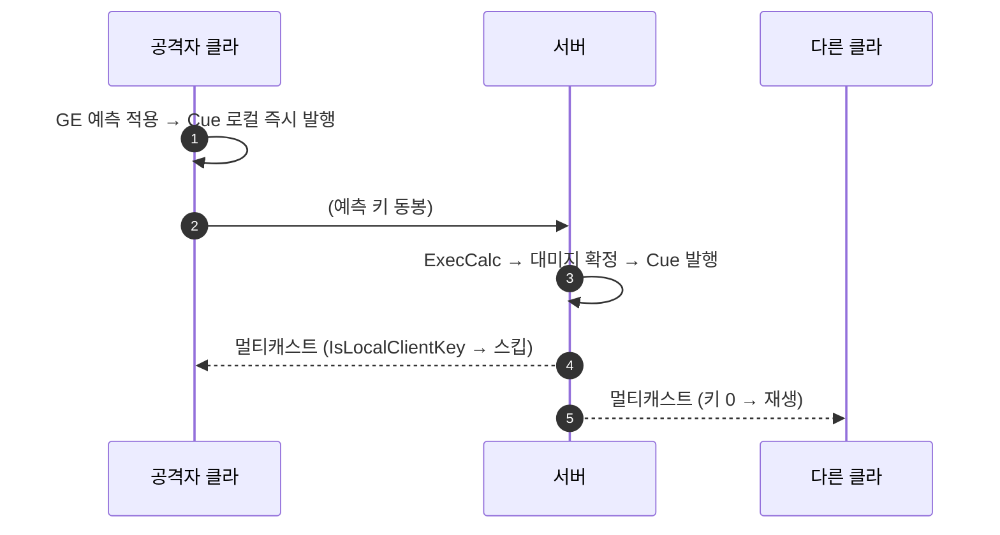

# 타격 Cue를 대미지 GE로 옮겨 클라 선처리

## 계획

### 목표

공격자 화면에서 타격 VFX/사운드가 RTT만큼 늦게 뜬다 — 서버가 대미지 적용 후 `GameplayCue.Damage`를 멀티캐스트로 발행하기 때문이다. 크리티컬은 서버가 정하므로 플로터는 권위를 유지하되, 임팩트 연출만 대미지 GE로 옮겨 엔진의 표준 Cue 예측 경로를 타게 한다.

### 수정 범위

| 파일 | 수정할 내용 | 구분 |
|---|---|---|
| `WxCore/.../WxGameplayTags.h`·`.cpp` | `GameplayCue.Hit` 신규(Damage의 형제), Damage 주석을 플로터 전용으로 정정 | 수정 |
| `WxCombat/.../Effect/WxEffect_Damage.cpp` | 생성자에서 `GameplayCues`에 `GameplayCue.Hit` 추가 | 수정 |
| `WxCombat/.../Cue/WxCueNotify_Damage.h`·`.cpp` | Niagara·사운드 프로퍼티와 재생 코드 제거, 플로터 전용으로 축소 | 수정 |
| `WxCombat/.../Cue/WxCueNotify_Hit.h`·`.cpp` | 임팩트 Cue 노티파이. 걷어낸 재생 코드 이관 + 무적 대상 스킵 | 신규 |
| `Plugins/WxCore/README.md` | GameplayCue 열거에 플로터/임팩트 분리 반영 | 수정 |
| `/Game/AbilitySystem/Cue/GC_Hit` | `UWxCueNotify_Hit` 파생 BP, `NS_Spark_Burst` 지정 | 신규(에디터) |

### 접근 방식

- **GE에 Cue를 달면 예측은 엔진이 해준다**: 무기 대미지 GE는 이미 공격자 어빌리티의 활성화 예측 키를 싣고 적용된다. 예측 클라는 `bTreatAsInfiniteDuration` 분기가 Cue를 로컬 즉시 발행하고, 서버는 정상 경로로 발행 후 멀티캐스트한다. 중복은 멀티캐스트 수신부의 `PredictionKey.IsLocalClientKey()` 스킵이 막는다 — 키가 다른 클라에게 0으로 직렬화되므로 자동으로 갈린다. 새 장치 없이 예측 키 전달만으로 성립하는 표준 경로다.
- **AI 공격은 무변경**: 서버 발행 키라 예측 분기가 성립하지 않고 전 클라가 멀티캐스트로 받는다.
- **무적 스킵은 예측 화면 전용 보정**: 서버는 출력 모디파이어가 없으면 Cue를 발행하지 않아(`bRequireModifierSuccessToTriggerCues`) 회피 히트에 원래 스파크가 없다. 반면 예측 클라는 ExecCalc을 건너뛰고 낙관 발행하므로 게이트가 없으면 공격자 화면에만 헛스파크가 뜬다. 시체는 GE가 `Ability.Death`를 IgnoreTags로 막으므로 별도 조건이 불필요하다.

---

## 완료

### 수정한 파일
| 파일 | 수정한 내용 | 구분 |
|---|---|---|
| `WxCore/.../WxGameplayTags.h`·`.cpp` | `GameplayCue.Hit` 추가(Damage의 형제), Damage 주석을 플로터 전용으로 정정 | 수정 |
| `WxCombat/.../Effect/WxEffect_Damage.cpp` | 생성자에서 `GameplayCues`에 `GameplayCue.Hit` 선언 | 수정 |
| `WxCombat/.../Cue/WxCueNotify_Damage.h`·`.cpp` | Niagara·사운드 프로퍼티와 재생 블록 제거, include 정리, 플로터 전용으로 축소 | 수정 |
| `WxCombat/.../Cue/WxCueNotify_Hit.h`·`.cpp` | 임팩트 Cue 노티파이 — 재생 코드 이관 + 무적 대상 스킵 | 신규 |
| `Plugins/WxCore/README.md` | GameplayCue 열거에 플로터/임팩트 분리 반영 | 수정 |

### 구현·결정과 그 이유
- **Cue를 GE에 얹어 예측을 엔진에 맡김**: 대미지 GE가 이미 공격자 어빌리티의 예측 키를 싣고 적용되므로, `GameplayCues`에 태그만 넣으면 예측 클라는 `bTreatAsInfiniteDuration` 분기에서 즉시 발행하고 서버는 정상 경로로 발행·멀티캐스트한다. 중복은 멀티캐스트 수신부의 `IsLocalClientKey()` 스킵이 막는다 — 예측 키가 다른 클라에겐 0으로 직렬화되기 때문이다. 수동 로컬 발행이나 중복 방지 장치를 새로 만들 필요가 없었다.
- **플로터를 옮기지 않음**: 수치와 크리 여부가 서버 `FRand` 판정이라 예측할 수 없다. 발행 위치(대미지 확정 후 `HandleGameplayEffectAppliedToSelf`)도 그대로 두었다.
- **형제 태그로 분리**: Cue 매니저가 핸들러를 못 찾으면 부모로 폴백하므로 `GameplayCue.Damage.Hit`으로 두면 임팩트 큐에 플로터가 딸려 온다.
- **무적 스킵을 노티파이에 둠**: GE에 달린 큐는 ExecCalc보다 먼저 발행된다. 서버는 출력 모디파이어가 없으면 큐를 내지 않아(`bRequireModifierSuccessToTriggerCues`) 회피 히트가 자연히 걸러지지만, 예측 클라는 ExecCalc을 건너뛰어 낙관 발행하므로 공격자 화면에만 헛스파크가 남는다. 시체는 GE의 `Ability.Death` IgnoreTags가 적용 자체를 막아 별도 조건이 필요 없었다.

### 계획 대비 달라진 점
- 계획대로.

### 후속 과제
- **콘텐츠 작업 필수**: `/Game/AbilitySystem/Cue/GC_Hit`(`UWxCueNotify_Hit` 파생 BP)을 만들고 `HitNiagaraSystem`에 `NS_Spark_Burst`를 지정해야 한다. 만들기 전까지는 타격 스파크가 나오지 않는다(플로터는 정상). 기존 `GC_Damage`의 같은 값은 C++ 프로퍼티가 사라지며 버려진다.
- 인게임 회귀 미검증(빌드까지만). PIE 2인에서 ① 클라 공격 시 스파크 즉시 재생 ② 스파크 1회만(예측+멀티캐스트 스킵) ③ AI 공격도 정상 ④ 회피 성공 시 공격자 화면에도 미재생 ⑤ 화상 틱은 플로터만 을 확인해야 한다.
