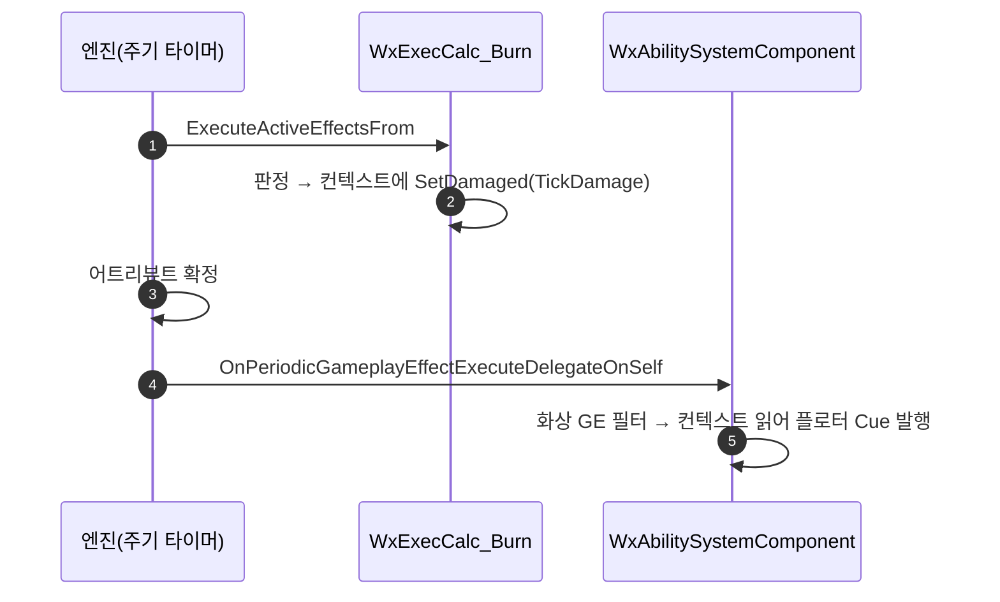

# 화상 틱 플로터 발행을 ExecCalc 밖 주기형 훅으로 이관

## 계획

### 목표

이 프로젝트는 「ExecCalc은 판정만, 발행은 적용이 끝난 뒤 ASC 훅이」라는 규칙을 쓴다(`WxExecCalc_Damage.h:30~32`). `UWxExecCalc_Burn`만 계산 도중 직접 Cue를 발행해 그 규칙에서 벗어나 있다. 발행을 주기형 실행 훅으로 옮겨 예외를 없앤다. 동작은 그대로고 순서만 「판정 → 적용 → 발행」으로 정렬된다.

### 수정 범위

| 파일 | 수정할 내용 | 구분 |
|---|---|---|
| `WxCombat/.../Effect/WxExecCalc_Burn.cpp` | Cue 발행 제거, 컨텍스트에 판정 기록(맨 위 Clear 포함) | 수정 |
| `WxCombat/.../Effect/WxExecCalc_Burn.h` | 클래스 주석에 발행 금지 규칙 명시 | 수정 |
| `WxCombat/.../AbilitySystem/WxAbilitySystemComponent.h`·`.cpp` | 주기형 실행 훅 신규 + 생성자 바인딩 | 수정 |

### 접근 방식

- **엔진의 주기형 훅을 쓴다**: `OnPeriodicGameplayEffectExecuteDelegateOnSelf`는 `ExecuteActiveEffectsFrom` 뒤에 브로드캐스트되고(`GameplayEffect.cpp:4784~4788`) 서버에서만 불린다. 어트리뷰트 확정 후 + 서버 권위라는 플로터의 두 조건이 그대로 맞는다. 시그니처도 적용 훅과 같은 `FOnGameplayEffectAppliedDelegate`다.
- **GE 종류 필터가 필수**: 화상 컨텍스트는 원본 대미지 GE와 공유된다(`FWxDamageInfo::MakeSpecs`가 같은 핸들을 넘김). 거르지 않으면 같은 컨텍스트를 쓰는 다른 주기형 AdditionalEffect의 틱마다 남의 판정으로 플로터가 뜬다.
- **맨 위 `ClearDamageResult()`**: 팀 판정·틱 대미지 0으로 조기 반환하는 틱에서 이전 틱 결과가 남아 플로터가 또 뜨는 것을 막는다. 대미지 ExecCalc과 같은 처리다.

---

## 완료

### 수정한 파일
| 파일 | 수정한 내용 | 구분 |
|---|---|---|
| `WxCombat/.../Effect/WxExecCalc_Burn.cpp` | 컨텍스트 확보 + 맨 위 `ClearDamageResult`, 말미 Cue 발행을 `SetDamaged(TickDamage, false, {})`로 교체, 컨텍스트 헤더 include | 수정 |
| `WxCombat/.../Effect/WxExecCalc_Burn.h` | 클래스 주석에 발행 금지·컨텍스트 경유 규칙 명시 | 수정 |
| `WxCombat/.../AbilitySystem/WxAbilitySystemComponent.h`·`.cpp` | `HandlePeriodicGameplayEffectExecuted` 신규 + 생성자 바인딩, `WxEffect_Burn.h` include | 수정 |
| `WxCombat/.../Effect/WxEffect_Kill.h` | 플로터 미발행 근거를 실제(발행 훅의 GE 종류 필터)로 정정 | 수정 |

### 구현·결정과 그 이유
- **엔진의 주기형 훅을 그대로 씀**: `OnPeriodicGameplayEffectExecuteDelegateOnSelf`는 실행 뒤에 브로드캐스트되고 서버에서만 불려, 적용 훅과 같은 전제(어트리뷰트 확정·서버 권위)를 공짜로 만족한다. 타이머나 별도 통지를 만들 이유가 없었다.
- **GE 종류 필터**: 화상 컨텍스트는 원본 대미지 GE와 같은 핸들이라, 거르지 않으면 같은 컨텍스트를 공유하는 다른 주기형 AdditionalEffect의 틱에 남의 판정이 새어 나간다. 적용 훅이 같은 이유로 쓰는 방식을 그대로 따랐다.
- **맨 위 Clear**: 팀 판정·틱 대미지 0으로 조기 반환하는 틱에서 이전 결과가 남으면 플로터가 계속 뜬다. 대미지 ExecCalc과 같은 처리를 같은 위치에 뒀다.
- **컨텍스트 추출 6줄 중복 허용**: 적용 훅과 겹치지만 헬퍼로 빼지 않고 호출부에 인라인으로 뒀다.

### 계획 대비 달라진 점
- 계획대로. (첫 빌드에서 지역 변수 `AvatarActor`가 ASC 멤버를 가려 C4458이 났고, 적용 훅과 같은 `TargetAvatar`로 이름을 맞춰 해결.)

### 후속 과제
- 인게임 회귀 미검증(빌드까지만). PIE에서 ① 화상 틱마다 플로터 1회·수치 동일 ② 화상에 타격 스파크 없음 ③ 화상 중 대상이 무적·사망이 되면 플로터 정지 ④ 일반 타격 회귀 없음 을 확인해야 한다.
