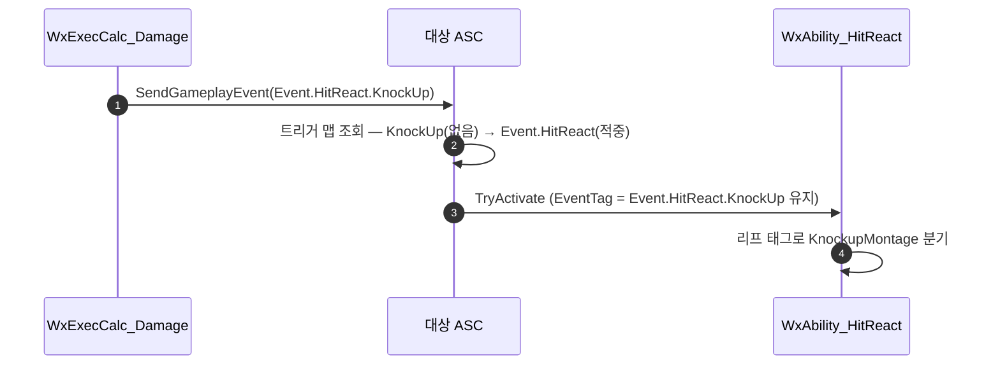

# 히트리액트 트리거를 Event.HitReact 부모 태그 하나로 일원화

## 계획

### 목표

`UWxAbility_HitReact`가 `Event.HitReact.*` 자식 7종에 트리거를 개별 등록하던 것을 부모 태그 `Event.HitReact` 하나로 줄인다. 근거 주석 「AbilityTriggers는 정확한 태그 매칭」이 사실과 다르며, 새 피격 종류를 추가할 때 트리거 등록을 빠뜨리면 이벤트가 조용히 무시되는 함정이 있다.

### 수정 범위

| 파일 | 수정할 내용 | 구분 |
|---|---|---|
| `WxCombat/.../WxAbility_HitReact.cpp` | 생성자의 트리거 등록 7건을 부모 태그 단일 등록으로 교체, 틀린 주석 정정 | 수정 |
| `WxCore/.../WxGameplayTags.h` | `Event_HitReact` 주석에 HitReact 어빌리티의 부모 트리거 등록 명시 | 수정 |
| `Docs/Programmer/Ability_Activation_Flow.md` | 「종류별 트리거 개별 등록(정확 매칭)」 서술 2곳 정정 | 수정 |
| `Plugins/WxCore/README.md` | `Event.HitReact` 설명에 트리거 등록 태그임을 추가 | 수정 |

### 접근 방식

- **부모 체인 조회 활용**: `UAbilitySystemComponent::HandleGameplayEvent`는 `RequestDirectParent()`로 조상을 거슬러 올라가며 트리거 맵을 조회한다(UE 5.8 `AbilitySystemComponent_Abilities.cpp:2564`). 부모 하나만 등록해도 자식 이벤트가 전부 걸린다.
- **분기 로직 무변경**: `TriggerAbilityFromGameplayEvent`가 페이로드에 넣는 것은 등록 태그가 아니라 원본 리프 태그(`TempEventData.EventTag = EventTag`)다. `ActivateAbility`의 몽타주 선택 if/else는 그대로 동작한다.
- **부모·자식 동시 등록 금지**: 루프가 조상마다 한 번씩 도므로 둘 다 등록하면 한 이벤트에 트리거가 2회 발화하고, `bRetriggerInstancedAbility = true` 탓에 몽타주가 즉시 재시작한다. 추가가 아니라 교체다.
- **선례**: `WxAbility_Guard`는 이미 부모 태그 `Event.HitReact`로 `WaitGameplayEvent`를 걸어 자식 전체를 수신한다.

---

## 완료

### 수정한 파일
| 파일 | 수정한 내용 | 구분 |
|---|---|---|
| `WxCombat/.../WxAbility_HitReact.cpp` | 생성자 트리거 등록 7건(35줄)을 `Event_HitReact` 단일 등록(6줄)으로 교체, 틀린 매칭 주석 정정 | 수정 |
| `WxCore/.../WxGameplayTags.h` | `Event_HitReact` 주석에 HitReact도 이 부모로 구독함과 부모 직접 dispatch 시 폴백 동작 명시 | 수정 |
| `Docs/Programmer/Ability_Activation_Flow.md` | 「종류별 개별 등록(정확 매칭)」 서술 2곳을 부모 단일 등록으로 정정 | 수정 |
| `Plugins/WxCore/README.md` | `Event.HitReact` 설명에 어빌리티 수신 태그임을 추가 | 수정 |

### 구현·결정과 그 이유
- **부모 단일 등록**: `HandleGameplayEvent`가 `RequestDirectParent()`로 조상을 훑으며 트리거 맵을 조회하므로 자식 등록이 불필요하다. 종전 주석의 「정확 매칭」 전제가 틀렸다.
- **분기 코드 무변경**: 페이로드에 실리는 건 등록 태그가 아니라 원본 리프 태그라 종류별 몽타주 선택이 그대로 성립한다. 폴백까지 이미 있어 손댈 곳이 없었다.
- **미등록 자식 폴백을 막지 않음**: 이제 알려지지 않은 `Event.HitReact.*`와 맨 부모 태그도 일반 피격으로 반응한다. 무반응보다 낫고, 새 종류 추가 시 트리거 등록을 잊어 이벤트가 사라지는 사고를 구조적으로 없앤다.
- **BP 재저장 불필요 확인**: `GA_HitReact`·`GA_HitReact_Custer` 모두 `AbilityTriggers` 델타를 직렬화하지 않아 CDO 변경이 그대로 전파된다.

### 계획 대비 달라진 점
- 계획대로.

### 후속 과제
- 인게임 회귀 미검증(빌드 검증만 수행). 7종 경로가 한 트리거로 합쳐졌으므로 일반·Knock 3종·패리·앞잡/뒤잡 짝 피격을 한 번씩 확인하면 좋다.
