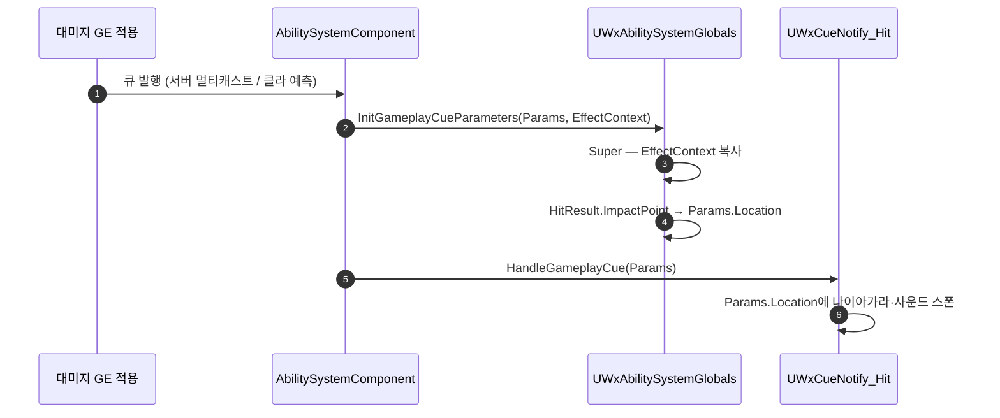

# GameplayCue Location이 항상 0으로 오는 문제 수정

## 계획

### 목표
`UWxCueNotify_Hit::HandleGameplayCue`가 받는 `Parameters.Location`이 항상 원점이라 타격 스파크·사운드가 월드 0,0,0에서 난다. 타격 Cue를 대미지 GE로 옮긴 뒤 엔진이 큐 파라미터를 만들게 되면서 생긴 회귀로, 임팩트 지점을 다시 실어 보낸다.

### 수정 범위
| 파일 | 수정할 내용 | 구분 |
|---|---|---|
| `Plugins/WxCombat/.../Public/AbilitySystem/WxAbilitySystemGlobals.h` | `InitGameplayCueParameters` 컨텍스트 오버로드 오버라이드 선언, 클래스 주석 갱신 | 수정 |
| `Plugins/WxCombat/.../Private/AbilitySystem/WxAbilitySystemGlobals.cpp` | Super 호출 후 컨텍스트 히트 결과의 `ImpactPoint`를 `CueParameters.Location`에 채움 | 수정 |

### 접근 방식
- **파라미터 생성 지점에서 채운다**: 큐 안에서 컨텍스트를 뒤지는 대신 `UWxAbilitySystemGlobals`에서 채운다. 엔진이 `GameplayCueNotifyTypes.cpp` 주석으로 명시해 둔 프로젝트 확장 지점이고, GE 경유 큐 전부가 같은 혜택을 받아 앞으로 GE에 큐를 붙일 때 같은 함정을 다시 밟지 않는다.
- **한 곳으로 충분한 이유**: 엔진의 두 오버로드(`FGameplayEffectSpecForRPC`용, `FGameplayEffectSpec`용)가 모두 컨텍스트 오버로드로 수렴한다. 서버 멀티캐스트와 클라 예측 발행이 같은 가상 함수를 탄다.
- **`ImpactPoint`를 쓰는 이유**: 표면 접점이라야 임팩트 연출이 맞는 자리에 난다. 스윕의 `Location`은 형상 중심이라 어긋난다.
- 수동 `ExecuteGameplayCue` 경로(퍼펙트 가드)는 파라미터를 직접 만들어 넘기므로 이 함수를 타지 않아 영향이 없고, `UWxCueNotify_Hit`은 손대지 않는다.

---

## 완료

### 수정한 파일
| 파일 | 수정한 내용 | 구분 |
|---|---|---|
| `Plugins/WxCombat/.../Public/AbilitySystem/WxAbilitySystemGlobals.h` | `InitGameplayCueParameters` 컨텍스트 오버로드 오버라이드 선언 | 수정 |
| `Plugins/WxCombat/.../Private/AbilitySystem/WxAbilitySystemGlobals.cpp` | Super 호출 후 히트 결과의 `ImpactPoint`를 `CueParameters.Location`에 채움 | 수정 |

### 구현·결정과 그 이유
- **큐가 아니라 파라미터 생성 지점을 고쳤다**: 큐마다 컨텍스트를 뒤지게 하면 GE에 큐를 붙일 때마다 같은 함정을 다시 밟는다. 발행 경로가 어디로 바뀌든 `Location`이 채워져 온다는 성질 자체를 세우는 편이 낫다.
- **`Normal`은 채우지 않았다**: 지금 읽는 곳이 없고, 엔진의 방향 계산이 `Normal`을 먼저 보기 때문에 값을 넣으면 아무도 요청하지 않은 동작 변화가 생긴다.

### 계획 대비 달라진 점
- 헤더 클래스 주석은 손대지 않았다. 이 클래스가 GAS 정책 확장 지점이라는 서술은 이미 있는 문장으로 충분했고, 오버라이드 이름이 하는 일을 그대로 말한다.

### 후속 과제
- 실기 확인 미완: 근접·투사체·처형 명중 지점 연출과 PIE 리슨 서버에서 클라 예측 발행분. 컴파일까지만 확인했다.
