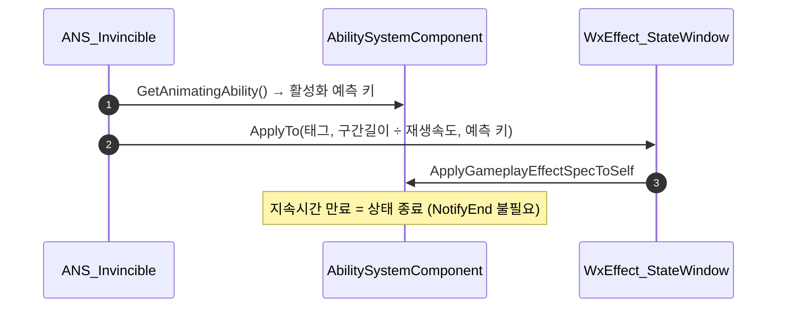

# 게임 로직 State 태그를 지속시간 GameplayEffect로 전환

## 계획

### 목표

`State.Invincible` / `State.Guard` / `State.PerfectGuard`는 대미지 파이프라인의 판정 입력인데도 루스 태그 짝(Add/Remove)으로 관리돼, 몽타주가 끊기면 태그가 영구히 남는다. 그 누수를 어빌리티가 대신 치우는 임시 코드가 `WxAbility_Dodge`·`WxAbility_Guard`의 `EndAbility`에 붙어 있다. 상태의 수명을 GE 안으로 닫아 누수를 원천 차단하고, GE 부여 태그가 갖는 복제(`SimulatedTagOnly`)를 함께 얻는다.

### 수정 범위

| 파일 | 수정할 내용 | 구분 |
|---|---|---|
| `WxCombat/.../Effect/WxEffect_StateWindow.h/.cpp` | `HasDuration` GE. 부여 태그는 `Spec.DynamicGrantedTags`로 호출자가 지정, 스택 정책 없음(적용마다 별개 인스턴스 = 루스 태그 레퍼런스 카운트 의미 유지). `static ApplyTo(ASC, StateTag, Duration, PredictingAbility)` | 신규 |
| `WxCombat/.../Effect/WxEffect_Guard.h/.cpp` | `Infinite` GE. `UTargetTagsGameplayEffectComponent`로 `State.Guard` 정적 부여 | 신규 |
| `WxCombat/.../AnimNotify/WxAnimNotifyState_Invincible.h/.cpp` | `NotifyBegin`에서 구간 길이만큼 GE 적용, `NotifyEnd` 오버라이드 삭제 | 수정 |
| `WxCombat/.../AnimNotify/WxAnimNotifyState_PerfectGuard.h/.cpp` | 위와 동일, 태그만 `State.PerfectGuard` | 수정 |
| `WxCombat/.../Task/WxAbilityTask_PlaySkillCutscene.h/.cpp` | `AddInvincibleTag`/`RemoveInvincibleTag`/`bInvincibleTagAdded` 제거, 시퀀스 길이 기반 GE + 핸들 해제 | 수정 |
| `WxCombat/.../Ability/WxAbility_Guard.cpp` | 루스 태그 → `ApplyGameplayEffectToOwner` / `RemoveActiveEffectsWithGrantedTags`, `State.PerfectGuard` 잔존 정리 블록 삭제 | 수정 |
| `WxCombat/.../Ability/WxAbility_Dodge.cpp` | `State.Invincible` 잔존 정리 블록 삭제 | 수정 |
| `WxCombat/.../Cue/WxCueNotify_Hit.cpp` | "ANS가 각 머신에 로컬로 붙인다" 주석을 GE 기준으로 정정 | 수정 |
| `WxCore/Public/WxGameplayTags.h` | 3개 태그의 부여 주체 주석 정정 | 수정 |

### 접근 방식

- **윈도우형 상태(Invincible·PerfectGuard)**: 노티파이 구간 길이를 그대로 GE 지속시간으로 두고 `NotifyEnd`에서 제거하지 않는다. `UAnimNotifyState` 객체는 애니메이션 에셋 단위로 공유돼 액터별 핸들을 들 수 없으므로, 지속시간에 맡기는 편이 유일한 상태 없는 구현이다. 구간 길이는 애니메이션 시간이라 `Montage_GetEffectivePlayRate`로 나눠 실시간으로 환산한다.
- **가드**: 키를 쥔 동안 유지돼 고정 지속시간이 없으므로 `Infinite` GE를 어빌리티 수명에 묶는다. 해제는 핸들이 아니라 부여 태그로 찾는다 — 예측 GE는 서버본으로 교체될 때 핸들이 무효화된다.
- **클라 예측**: ANS는 어빌리티 활성화 스코프 밖이라 `ScopedPredictionKey`가 무효다. `WxCombatLibrary::ApplyDamage`와 같은 방식으로 `GetAnimatingAbility()`의 활성화 예측 키를 꺼내 스펙에 태운다.

---

## 완료

### 수정한 파일
| 파일 | 수정한 내용 | 구분 |
|---|---|---|
| `WxCombat/.../Effect/WxEffect_StateWindow.h/.cpp` | 지속시간 GE + `ApplyTo(ASC, 태그, 지속시간, 예측 어빌리티)` | 신규 |
| `WxCombat/.../Effect/WxEffect_Guard.h/.cpp` | `State.Guard`를 부여하는 Infinite GE | 신규 |
| `WxCombat/.../AnimNotify/WxAnimNotifyState_Invincible.h/.cpp` | `NotifyBegin`에서 구간 길이만큼 GE 적용, `NotifyEnd` 삭제 | 수정 |
| `WxCombat/.../AnimNotify/WxAnimNotifyState_PerfectGuard.h/.cpp` | 위와 동일 | 수정 |
| `WxCombat/.../Task/WxAbilityTask_PlaySkillCutscene.h/.cpp` | 루스 태그 짝 → 시퀀스 길이 기반 GE + 핸들 해제 | 수정 |
| `WxCombat/.../Ability/WxAbility_Guard.cpp` | 가드 GE 적용/해제, `State.PerfectGuard` 잔존 정리 삭제, 죽은 ASC 널 가드 삭제 | 수정 |
| `WxCombat/.../Ability/WxAbility_Dodge.cpp` | `State.Invincible` 잔존 정리 삭제 | 수정 |
| `WxCombat/.../Cue/WxCueNotify_Hit.cpp` | 무적 태그 출처 주석 정정 | 수정 |
| `WxCore/Public/WxGameplayTags.h` | 3개 태그의 부여 주체 주석 정정 | 수정 |
| `WxWorld/.../WxStateTreeTask_WaitForInteraction.cpp`, `WxStateTreeTask_WaitSpawnersKilled.cpp` | 익명 namespace의 `NextWaitHandle` 이름 충돌 해소 (범위 밖 선행 버그) | 수정 |

### 구현·결정과 그 이유
- **윈도우형 상태는 `NotifyEnd`를 아예 없앴다**: `UAnimNotifyState`는 애니메이션 에셋 단위로 공유돼 액터별 GE 핸들을 들 수 없다. 부여 태그로 지우면 컷신 등 다른 무적 출처까지 걷어가므로, 제거를 지속시간에 맡기는 편이 유일한 상태 없는 구현이다. 덕분에 회피·가드의 누수 방어 코드 2곳이 사라졌다.
- **구간 길이를 재생 속도로 나눈다**: `TotalDuration`은 애니메이션 시간이고 GE 지속시간은 월드 시간이다. 공격·스킬 몽타주는 ASPD로 배속이 붙으므로 `Montage_GetEffectivePlayRate`로 환산해야 구간이 맞는다.
- **가드만 Infinite**: 가드는 키를 쥔 동안 유지돼 고정 지속시간이 없다. 해제는 핸들이 아니라 부여 태그로 찾는데, 예측 GE가 서버본으로 교체될 때 핸들이 무효해져 클라에서 태그가 남기 때문이다. `State.Guard` 발행처가 가드뿐이라 대상이 모호하지 않다.
- **한 GE 클래스에 `DynamicGrantedTags`**: Invincible·PerfectGuard·컷신은 태그만 다르고 형태가 같다. 스펙이 태그를 들면 클래스 하나로 끝나고, 이 태그도 정의의 부여 태그와 똑같이 복제된다.
- **스택 정책을 두지 않았다**: 적용마다 별개 인스턴스가 살아 태그 카운트가 쌓이고 따로 만료되므로, 구간이 겹칠 때의 의미가 기존 루스 태그 레퍼런스 카운트와 같다.
- **컷신은 핸들 해제를 남겼다**: 컷신 길이는 상황마다 달라 지속시간이 안전망 역할만 한다. 시퀀스가 딜레이션을 상쇄한 배속으로 도는 만큼, 월드 시간 기준 지속시간은 `시퀀스 길이 × GlobalTimeDilation`이다.

### 계획 대비 달라진 점
- 가드 `ActivateAbility`의 ASC 널 가드를 함께 지웠다. GE 적용을 엔진 API로 옮기면서 지역 변수가 쓰이지 않게 됐고, ASC 없이 활성화되는 어빌리티는 애초에 없다.
- `WxWorld`의 유니티 빌드 이름 충돌을 고쳤다. 소스 파일 추가로 makefile이 무효화되며 드러난 선행 버그로, 이걸 두면 이번 변경을 빌드로 검증할 수 없었다.

### 후속 과제
- PIE 동작 확인은 미검증이다(빌드만 통과). 확인할 항목: 회피 i-frame 중 대미지 무효 + `Event.DodgeSuccess` 보상, 판정 캡슐의 태그 연동, 가드 감소율·SP 고갈 브레이크, 퍼펙트 가드 반사, 가드 취소 후 `State.PerfectGuard` 잔존 없음, 스킬 컷신 무적, 가드 반격 몽타주 세트 선택.
- 구간 도중 재생 속도가 바뀌면(히트스톱 등) GE와 애니메이션이 어긋난다. 히트스톱은 공격자에게만 걸리고 퍼펙트 가드의 슬로우는 글로벌 딜레이션이라 현재 경로에는 문제가 없지만, 무적 구간이 있는 몽타주에 히트스톱이 걸리는 패턴이 생기면 재검토가 필요하다.
