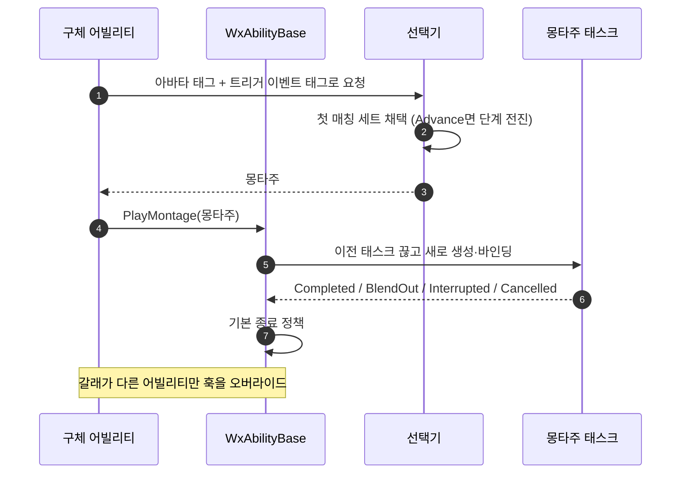

# 몽타주 선택기를 어빌리티 공용 구조로 승격

## 계획

### 목표

콤보 전용이던 몽타주 선택기를 어빌리티 전반이 쓰는 구조로 넓힌다. 재생 축(태스크 소유·콜백·종료 정책)은 `UWxAbilityBase`로 올려 9개 클래스에 복제된 보일러플레이트를 걷고, 선택 축은 선택기에 남기되 콤보 가정을 없애 이벤트로 깨어나는 어빌리티도 세트를 고를 수 있게 한다.

### 수정 범위

| 파일 | 수정할 내용 | 구분 |
|---|---|---|
| `Plugins/WxCombat/.../Ability/WxMontageSelector.h·.cpp` | `WxComboMontageSelector`에서 개명·이동. 세트에 `TriggerEventTags` 추가, `SelectMontage`/`AdvanceMontage` 2진입 | 신규 |
| `Plugins/WxCombat/.../Ability/WxComboMontageSelector.h·.cpp` | 위로 대체 | 삭제 |
| `Plugins/WxCombat/.../Ability/WxAbilityBase.h·.cpp` | `PlayMontage`·`GetActiveMontage`·가상 핸들러 4종·태스크/활성 몽타주 멤버 추가, `GetMontagePlayRate`를 virtual로, `EndAbility`에 태스크 정리 | 수정 |
| `.../WxAbility_Attack.h·.cpp`, `WxAbility_Skill.h·.cpp` | 재생 함수·핸들러 4종·태스크 멤버 삭제, 선택기 멤버를 `MontageSelector`로, `HandleMontageCompleted`만 오버라이드, `EndAbility`는 캔슬 리셋만 남김 | 수정 |
| `.../WxAbility_HitReact.h·.cpp` | 몽타주 7필드 → 선택기 1개(`SelectMontage`). 부수 효과 분기는 코드에 유지. 재생 함수·핸들러 3종 삭제, 재생 속도 1.0 오버라이드 | 수정 |
| `.../WxAbility_Finisher.h·.cpp` | 몽타주 2필드 → 선택기(트리거 태그로 갈림). 태스크·핸들러 삭제, 재생 속도 1.0 오버라이드 | 수정 |
| `.../WxAbility_Guard.h·.cpp` | 재생 함수·핸들러 4종·태스크·`ActiveMontage` 삭제(베이스 것 사용), BlendOut·Completed 오버라이드로 페이즈 복귀·루핑 무시 유지, 재생 속도 1.0 오버라이드 | 수정 |
| `.../WxAbility_Dodge.h·.cpp` | 재생 함수·핸들러 4종·태스크 삭제(섹션 인자는 베이스가 받는다), 재생 속도 1.0 오버라이드 | 수정 |
| `.../WxAbility_Pattern.h·.cpp`, `WxAbility_Ultimate.h·.cpp`, `Source/WxGame/.../WxAbility_UseItem.h·.cpp` | 태스크 생성·바인딩·핸들러 4종 → `PlayMontage` 호출 한 줄 | 수정 |
| `.../WxAbility_Death.h·.cpp` | 태스크 생성 삭제. 핸들러 3종은 오버라이드로 유지(Super 미호출) | 수정 |
| `Content/.../GA_Attack_Light·Heavy`, `GA_Skill_1~4`, `GA_HitReact`, `GA_Finisher` | 몽타주 데이터를 새 프로퍼티 경로로 이관(8개) | 수정 |

### 접근 방식

- **두 축 분리**: 복제량이 큰 쪽은 "무엇을 재생할지"가 아니라 "어떻게 재생하고 언제 끝낼지"다. 재생은 베이스가 갖고, 선택기는 몽타주 하나를 답하는 데까지만 관여한다.
- **종료 정책은 가상 훅**: 베이스가 기본 정책(완주=정상 종료, 중단·캔슬=캔슬 종료, 블렌드아웃=무시)을 제공하고 파생은 갈래가 다른 것만 오버라이드한다. `UFUNCTION`은 베이스에만 붙인다 — UHT thunk가 가상 호출이라 파생 override가 그대로 불린다.
- **재생 속도는 가상 함수**: 프레임 싱크·루트모션 고정은 BP에서 뒤집히면 안 되는 코드 계약이라 데이터 bool로 빼지 않는다.
- **선택 조건 확장**: 아바타 태그 요구사항에 트리거 이벤트 태그를 AND로 더한다. 빈 조건은 통과이므로, 배열 마지막의 무조건 세트가 곧 폴백이 된다.
- **진행 규칙은 함수로 가른다**: 재발동을 콤보로 볼지 새 발동으로 볼지는 어빌리티의 성질이므로 모드 bool 대신 `AdvanceMontage`/`SelectMontage`로 나눈다.
- **선택기 채택은 후보가 여럿인 어빌리티만**: Guard·Dodge는 몽타주마다 코드가 아는 역할(페이즈 판별·방향 섹션)이 있어 배열 원소가 되면 이름을 잃는다. 단일 몽타주 어빌리티는 재생 축만 공유한다.
- **에셋 재기입**: 구조체·프로퍼티 경로가 바뀌어 리다이렉트로 못 살린다. 코드 변경 전에 현재 값을 읽어두고, 빌드·에디터 재시작 후 새 경로에 되쓴다.

---

## 완료

### 수정한 파일
| 파일 | 수정한 내용 | 구분 |
|---|---|---|
| `Plugins/WxCombat/.../Ability/WxMontageSelector.h·.cpp` | 콤보 어휘를 걷은 선택기. 세트 조건이 아바타 태그와 트리거 이벤트 태그의 AND가 되고, 진입점이 새로 고르는 쪽과 이어가는 쪽으로 갈렸다 | 신규 |
| `Plugins/WxCombat/.../Ability/WxComboMontageSelector.h·.cpp` | 위로 대체 | 삭제 |
| `Plugins/WxCombat/.../Ability/WxAbilityBase.h·.cpp` | 재생 진입점·재생 중인 몽타주 조회·가상 종료 훅 4종·태스크 소유를 얹고, 재생 속도를 가상으로 바꿨다. 종료가 태스크를 먼저 끊는다 | 수정 |
| `.../WxAbility_Attack`, `WxAbility_Skill` | 재생 함수·핸들러 4종·태스크 멤버 삭제. 선택기 멤버를 새 이름으로 바꾸고 완주 훅만 오버라이드해 콤보를 되감는다 | 수정 |
| `.../WxAbility_HitReact` | 몽타주 7필드를 선택기 하나로 접고, 부수 효과 분기만 코드에 남겼다. 재생 속도 오버라이드 | 수정 |
| `.../WxAbility_Finisher` | 몽타주 2필드를 선택기로. 태스크 멤버·전용 종료 핸들러·종료의 태스크 정리 삭제, 재생 속도 오버라이드 | 수정 |
| `.../WxAbility_Guard` | 페이즈 판별을 베이스의 재생 중 몽타주로 옮기고, 블렌드아웃·완주만 오버라이드. 종료 오버라이드 자체가 필요 없어져 삭제 | 수정 |
| `.../WxAbility_Dodge` | 재생 함수·핸들러·태스크 삭제(섹션은 베이스가 받는다), 재생 속도 오버라이드 | 수정 |
| `.../WxAbility_Pattern`, `WxAbility_Ultimate`, `Source/WxGame/.../WxAbility_UseItem` | 태스크 생성·바인딩·핸들러 4종이 재생 호출 한 줄로 | 수정 |
| `.../WxAbility_Death` | 태스크 생성 삭제, 핸들러 3종은 오버라이드로 유지(부모 미호출). 재생 속도 오버라이드 | 수정 |
| `Content/.../GA_Attack_Light·Heavy`, `GA_Skill_1~4`, `GA_HitReact`, `GA_Finisher` | 몽타주 데이터를 새 프로퍼티 경로로 이관(8개) | 수정 |

### 구현·결정과 그 이유
- **재생 축을 베이스로**: 중복의 대부분은 선택이 아니라 재생·종료였다. 어빌리티 9개가 같은 태스크 생성과 같은 네 콜백을 글자 단위로 복제하고 있었고, 재발동 때 콜백을 먼저 끊어야 한다는 함정 계약도 그만큼 흩어져 있었다. 이제 그 계약이 한 곳에만 있다.
- **종료 정책은 가상 훅**: 기본 정책을 베이스가 쥐고 파생은 갈래가 다른 것만 연다. 실제로 갈래를 바꾼 건 셋뿐이다 — 콤보를 되감는 공격·스킬, 페이즈를 도는 가드, 종료 자체를 하지 않는 사망. 나머지 여섯은 오버라이드가 0개다. 델리게이트 매크로는 베이스에만 두고, UHT가 만드는 진입점이 가상 호출이라 파생 구현이 그대로 불린다.
- **재생 속도도 가상으로**: 프레임 싱크(처형 짝 피격), 루트모션 이동 거리(회피), 연출 길이(가드·사망)는 BP에서 뒤집히면 안 되는 코드 계약이라 데이터 플래그로 빼지 않았다. 다섯 클래스가 한 줄씩 오버라이드하면서 "왜 고정인가"가 그 클래스 주석에 남는다.
- **선택 조건에 이벤트 태그를 더함**: 이벤트로 깨어나는 어빌리티가 세트를 고를 수 있게 되면서, 피격 반응의 종류별 몽타주 7필드가 세트 배열로 접혔다. 조건 없는 세트가 무조건 매칭되므로 폴백이 별도 개념 없이 배열 마지막 자리로 표현된다. 새 피격 종류를 추가할 때 더 이상 C++을 건드리지 않아도 된다.
- **진행 규칙은 모드 값이 아니라 함수로**: 재발동을 콤보로 볼지 새 발동으로 볼지는 어빌리티의 성질이다. 데이터로 뒀다면 피격 반응이 콤보 모드로 설정되는 순간 옛 세트를 물고 엉뚱한 몽타주가 나오는데, 함수를 가르면 그 조합이 애초에 표현되지 않는다.
- **선택기 채택은 후보가 여럿인 곳만**: 가드와 회피는 몽타주마다 코드가 아는 역할(페이즈 판별·방향 섹션)이 있어 배열 원소가 되면 이름을 잃는다. 이 둘은 재생 축만 공유하고 몽타주 필드를 유지했다.
- **에셋은 값을 먼저 떠 두고 이관**: 구조체·프로퍼티 경로가 바뀌어 리다이렉트로 살릴 수 없으므로, 코드에 손대기 전에 8개 GA의 값을 읽어 두고 빌드·에디터 재시작 뒤 새 경로에 되썼다.
- **태스크 정리는 엔진에 맡긴다**: 어빌리티가 끝날 때 재생 중인 몽타주를 멈추는 건 엔진이 소유자 종료로 태스크를 끝내는 그 경로뿐이다. 종료에서 태스크를 미리 끊으면 그 정리가 통째로 건너뛰어져, 스스로 끝나지 않는 루핑 몽타주(가드)가 어빌리티가 사라진 뒤에도 계속 돈다. 그래서 베이스 종료는 참조만 버리고, 다음 단이 곧바로 이어받는 콤보 어빌리티만 종료 전에 몽타주를 태스크에서 떼어낸다.

### 계획 대비 달라진 점
- 재생 속도 오버라이드 대상에 사망이 추가됐다(넷 → 다섯). 사망 몽타주도 원래 고정 재생이었는데 계획에서 셈에 빠져 있었다.
- 가드는 종료 오버라이드가 통째로 사라졌다. 하던 일이 자기 태스크와 재생 중 몽타주를 비우는 것뿐이라 베이스 종료가 그대로 흡수했다.
- 처형은 중단·캔슬도 정상 종료로 취급하던 것을 기본 정책(캔슬 종료)에 맡겼다. 종료 사유를 보는 구독자는 AI의 어빌리티 실행 태스크 하나뿐이고 그쪽은 패턴 어빌리티만 지목하므로, 이 어빌리티에서는 아무 갈래도 만들지 않는다.
- 공격·스킬이 하던 종료 시 태스크 끊기를 베이스로 올렸다가 되돌렸다(회귀 수정, 커밋 `17fb0dbd` 직후). 그 둘은 다음 단이 몽타주를 이어받으므로 끊는 게 맞지만, 나머지 어빌리티는 엔진의 종료 정리에 기대 몽타주를 멈추고 있었다. 일괄 적용하니 가드 키를 떼도 루핑 가드 몽타주가 계속 돌아 어빌리티가 안 풀린 것처럼 보였다.

### 후속 과제
- **PIE 미검증**: 컴파일과 에셋 데이터(저장 후 재조회, 세트 순서·태그·몽타주 전부 일치)까지 확인했다. 공격 콤보와 회피 반격 세트, 가드 페이즈 순환, 회피 8방향·극한 회피, 피격 종류별 몽타주와 처형 짝 피격 프레임 싱크, 사망 완주·중단 폴백은 직접 플레이로 확인이 필요하다.
- **공격·스킬 근접 심화**: 두 클래스에 남은 차이가 생성자 태그와 끊고 들어가는 발동 분기뿐이다. 통합하려면 BP 부모 교체가 따라오므로 여전히 별건이다.
- **단일 몽타주 어빌리티 미전환**: 패턴·궁극기·아이템 사용·사망은 몽타주 필드를 유지했다. 변형이 필요해지는 시점에 선택기로 바꾸면 되고, 그때 에셋 이관이 따라온다.
