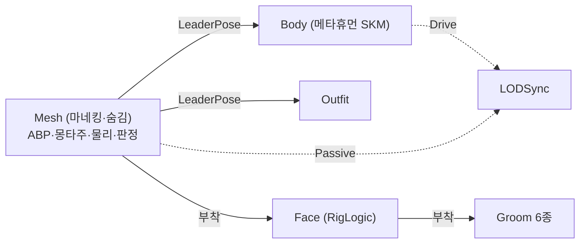

# 메타휴먼 바디를 리더 포즈 팔로워로 전환 (BodyMesh 슬롯 추가)

## 계획

### 목표
메타휴먼 바디 SKM이 곧 `ACharacter::GetMesh()`인 구조를 접고, 오너 메시를 애니메이션 구동 전용(숨김) 리더로 되돌린다. 바디는 `UWxMetaHumanVisualComponent`가 만드는 리더 포즈 팔로워로 붙여, 캐릭터마다 반복하던 Compatible Skeletons 등록·ik 본 이식 절차 없이 슬롯만 채우면 되게 한다.

### 수정 범위
| 파일 | 수정할 내용 | 구분 |
|---|---|---|
| `Source/WxGame/Character/WxMetaHumanVisualComponent.h` | `BodyMesh` 슬롯 + `BodyComponent` 트랜지언트 멤버 추가, `ResolveBodyMesh`→`ResolveLeaderMesh` 개명, 클래스 주석 갱신 | 수정 |
| `Source/WxGame/Character/WxMetaHumanVisualComponent.cpp` | 바디 팔로워 생성·리더 은닉·부착 대상 평탄화·LODSync 역할 조정·MetaHuman 바디 이름 갱신·해제 정리 | 수정 |
| `Content/Character/Player/BP_Player.uasset` | Mesh를 `SKM_Quinn`으로 되돌리고 상속 컴포넌트의 `BodyMesh`에 `SKM_MH_Player_BodyMesh` 지정 | 수정(에셋) |

### 접근 방식
- **오너 메시 = 리더(구동 전용)**: `ResolveLeaderMesh()`가 돌려주는 오너 메시가 ABP·몽타주·물리·피격 판정·무기 소켓을 계속 담당한다. `BodyMesh`가 지정된 경우에만 리더를 `SetVisibility(false)`로 숨겨, 표시 책임이 팔로워로 넘어갔다는 불변식을 컴포넌트가 직접 세운다. 엔진 기본값(`AlwaysTickPoseAndRefreshBones`)이라 숨겨도 포즈·본은 계속 갱신되고, URO는 액터의 스킨드 컴포넌트를 묶어 판정하므로 화면 밖 스로틀링도 유지된다.
- **부착 구조는 평탄하게**: 바디·페이스·복장 모두 리더에 부착하고 리더 포즈 소스도 항상 리더로 준다(엔진이 리더 체인을 금지하므로 복장이 바디를 따라가면 안 된다). `BodyMesh`가 비면 지금 동작과 완전히 같아져 분기가 사라진다.
- **LODSync 역할 교체**: 숨긴 리더는 렌더된 적이 없어 LOD 판단 소스로 못 쓴다(엔진은 `WasRecentlyRendered()`인 Drive를 우선). 바디 팔로워가 있으면 그쪽을 Drive로, 리더는 Passive로 넣어 동기 LOD를 강제받게 한다.
- **`BodyMesh`는 선택 슬롯**: 비워두면 오늘 동작 그대로(오너 메시가 바디). NPC·비메타휴먼 BP는 손대지 않아도 되고 준비되는 순서대로 전환한다.
- **MetaHuman 컴포넌트 배선**: `BodyComponentName`은 실제 메타휴먼 바디 컴포넌트를 가리킨다. 페이스 ABP의 Copy Pose From Mesh는 소스가 팔로워면 엔진이 리더로 자동 우회하므로 페이스 포즈는 그대로 성립한다.

### 감수하는 손실
바디 메시의 포스트프로세스 ABP(`ABP_Body_PostProcess` — 프로시저럴 컨트롤 리그, 팔·손가락 포즈 드라이버)가 평가되지 않는다. 리더 포즈 팔로워는 컴포넌트 스페이스 트랜스폼을 할당받지 않아 자기 그래프를 돌리지 않기 때문이다. 되살리려면 엔진이 의상 파트에 쓰는 방식(Copy Pose From Mesh를 물린 전용 ABP)이 필요한데 이번 범위 밖이다. 피격 판정·래그돌도 리더(마네킹 PHYS)에 남아 보이는 바디와 판정 볼륨이 체형만큼 미세하게 어긋난다.

---

## 완료

### 수정한 파일
| 파일 | 수정한 내용 | 구분 |
|---|---|---|
| `Source/WxGame/Character/WxMetaHumanVisualComponent.h` | `BodyMesh` 슬롯·`BodyComponent` 멤버 추가, `ResolveBodyMesh` 삭제, 클래스·슬롯 주석 갱신 | 수정 |
| `Source/WxGame/Character/WxMetaHumanVisualComponent.cpp` | 바디 팔로워 생성·오너 메시 은닉, 부착·리더 포즈 대상을 오너 메시로 통일, LODSync에 바디 항목 추가, MetaHuman 바디 이름·해제 정리, 메시 해석 인라인화 | 수정 |
| `Content/Character/Player/BP_Player.uasset` | Mesh를 `SKM_Quinn`으로 교체(ABP_Unarmed 유지), `BodyMesh`에 `SKM_MH_Player_BodyMesh` 기입 | 수정 |
| `Source/WxGame/Character/WxNpc.h` | 더 이상 성립하지 않는 컴포넌트 주석 문장 제거 | 수정 |

### 구현·결정과 그 이유
- **부착 대상을 리더 하나로 평탄화**: 페이스·복장을 바디 밑에 두면 계층은 어셈블 BP를 닮지만, 복장이 팔로워를 리더로 삼는 잘못된 배선을 부르기 쉽다(엔진은 리더 체인을 금지한다). 전부 리더에 붙이니 분기가 사라지고, `BodyMesh`가 빈 기존 캐릭터는 종전과 완전히 같은 결과가 된다. 페이스는 부착 부모에서 포즈를 복사하는데, 소스가 팔로워여도 엔진이 리더로 우회하므로 어느 쪽에 붙든 성립한다.
- **리더 은닉은 컴포넌트 책임**: 표시 주체가 바뀌는 불변식을 BP 체크박스에 맡기면 한 번 빠뜨렸을 때 메시 두 벌이 겹쳐 보인다. `BodyMesh`가 있을 때만 코드가 리더를 숨기고, 물리·피격 판정·무기 소켓은 그대로 리더에 남긴다.
- **LOD 동기는 이 컴포넌트가 만든 표시용 메시끼리만**: 오너 메시는 구동·리더 포즈 전용이므로 동기 대상에서 뺐다. 숨긴 메시는 씬에 등록되지 않아 MeshObject가 없어 LOD 판단 소스가 되지 못하고(드라이버로 두면 동기가 통째로 무효가 된다), 렌더러 피드백이 없어 예측 LOD가 0에 머문다. 본이 줄지 않으니 팔로워가 읽을 트랜스폼도 온전해 강제할 이유가 없다.
- **`BodyMesh`는 선택 슬롯**: 비워두면 오너 메시가 곧 바디라는 종전 계약이 유지돼, NPC·비메타휴먼 BP를 건드리지 않고 준비된 캐릭터부터 옮길 수 있다.

- **오너 메시 해석을 인라인으로**: `ACharacter`가 아닌 오너에서 첫 스켈레탈 메시를 찾던 폴백을 없애고 `GetMesh()`를 바로 쓴다. 폴백을 쓰는 `AWxNpc`는 메타휴먼 슬롯을 하나도 채우지 않아 실동작이 없었고, 리더가 캐릭터 메시로 고정되면 이 컴포넌트의 계약도 한 문장으로 줄어든다.

### 계획 대비 달라진 점
- **오너 메시를 LODSync에서 제외 (리뷰 반영)**: 계획은 리더를 Passive로 넣어 바디가 정한 LOD를 강제받게 하는 것이었다. 숨긴 리더가 최저 LOD로 떨어져 본이 줄 것을 우려했으나 MeshObject가 없으면 예측 LOD가 0을 유지함을 엔진 코드로 확인했고, 오너 메시는 표시 주체가 아니라는 원칙에 따라 동기 대상에서 완전히 뺐다. `BodyMesh`가 빈 캐릭터는 LOD 동기가 페이스·복장에만 걸린다.
- **`ResolveLeaderMesh` 삭제 (리뷰 반영)**: 리더를 캐릭터 메시로 고정하면서 해석 함수 자체가 필요 없어졌다. `AWxNpc`(AActor 직상속)는 이제 이 컴포넌트로 부착물을 만들 수 없다 — 현재 쓰는 슬롯이 없어 무영향이지만, NPC를 메타휴먼화하려면 계보를 옮기거나 컴포넌트를 걷어내야 한다.
- 그 외는 계획대로.

### 검증 결과
- WxEditor(Development) 빌드 성공(경고 0).
- PIE 실동작 확인은 남아 있다 — 외형·부착·LOD 전환·래그돌을 실플레이로 봐야 한다.

### 후속 과제
- ABP_Unarmed의 Control Rig Alpha를 0→1로 되돌려 FootIK 복구 시도(리더가 ik 본을 가진 마네킹이라 이제 성립해야 한다).
- 정착되면 SK_Mannequin의 Compatible Skeletons 등록과 `Tools/AddMetaHumanIkBones.py` 절차는 불필요해진다.
- 바디 포스트프로세스 ABP(`ABP_Body_PostProcess`)의 팔·손가락 보정이 꺼진 상태의 실사 품질 확인 — 거슬리면 엔진이 의상 파트에 쓰는 Copy Pose From Mesh 방식으로 승격.
