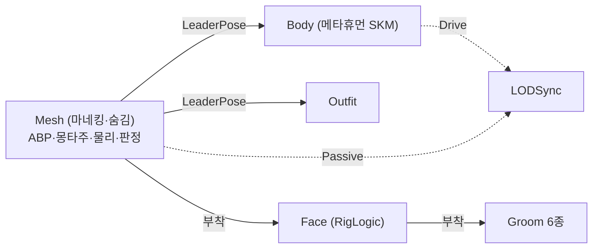

# 메타휴먼 바디를 리더 포즈 팔로워로 전환 (BodyMesh 슬롯 추가)

## 계획

### 목표
메타휴먼 바디 SKM이 곧 `ACharacter::GetMesh()`인 구조를 접고, 오너 메시를 애니메이션 구동 전용(숨김) 리더로 되돌린다. 바디는 `UWxMetaHumanVisualComponent`가 만드는 리더 포즈 팔로워로 붙여, 캐릭터마다 반복하던 Compatible Skeletons 등록·ik 본 이식 절차 없이 슬롯만 채우면 되게 한다.

### 수정 범위
| 파일 | 수정할 내용 | 구분 |
|---|---|---|
| `Source/WxGame/Character/WxMetaHumanVisualComponent.h` | `BodyMesh` 슬롯 + `BodyComponent` 트랜지언트 멤버 추가, `ResolveBodyMesh`→`ResolveLeaderMesh` 개명, 클래스 주석 갱신 | 수정 |
| `Source/WxGame/Character/WxMetaHumanVisualComponent.cpp` | 바디 팔로워 생성·리더 은닉·부착 대상 평탄화·LODSync 역할 조정·MetaHuman 바디 이름 갱신·해제 정리 | 수정 |
| `Content/Character/Player/BP_Player.uasset` | Mesh를 `SKM_Quinn`으로 되돌리고 상속 컴포넌트의 `BodyMesh`에 `SKM_MH_Player_BodyMesh` 지정 | 수정(에셋) |

### 접근 방식
- **오너 메시 = 리더(구동 전용)**: `ResolveLeaderMesh()`가 돌려주는 오너 메시가 ABP·몽타주·물리·피격 판정·무기 소켓을 계속 담당한다. `BodyMesh`가 지정된 경우에만 리더를 `SetVisibility(false)`로 숨겨, 표시 책임이 팔로워로 넘어갔다는 불변식을 컴포넌트가 직접 세운다. 엔진 기본값(`AlwaysTickPoseAndRefreshBones`)이라 숨겨도 포즈·본은 계속 갱신되고, URO는 액터의 스킨드 컴포넌트를 묶어 판정하므로 화면 밖 스로틀링도 유지된다.
- **부착 구조는 평탄하게**: 바디·페이스·복장 모두 리더에 부착하고 리더 포즈 소스도 항상 리더로 준다(엔진이 리더 체인을 금지하므로 복장이 바디를 따라가면 안 된다). `BodyMesh`가 비면 지금 동작과 완전히 같아져 분기가 사라진다.
- **LODSync 역할 교체**: 숨긴 리더는 렌더된 적이 없어 LOD 판단 소스로 못 쓴다(엔진은 `WasRecentlyRendered()`인 Drive를 우선). 바디 팔로워가 있으면 그쪽을 Drive로, 리더는 Passive로 넣어 동기 LOD를 강제받게 한다.
- **`BodyMesh`는 선택 슬롯**: 비워두면 오늘 동작 그대로(오너 메시가 바디). NPC·비메타휴먼 BP는 손대지 않아도 되고 준비되는 순서대로 전환한다.
- **MetaHuman 컴포넌트 배선**: `BodyComponentName`은 실제 메타휴먼 바디 컴포넌트를 가리킨다. 페이스 ABP의 Copy Pose From Mesh는 소스가 팔로워면 엔진이 리더로 자동 우회하므로 페이스 포즈는 그대로 성립한다.

### 감수하는 손실
바디 메시의 포스트프로세스 ABP(`ABP_Body_PostProcess` — 프로시저럴 컨트롤 리그, 팔·손가락 포즈 드라이버)가 평가되지 않는다. 리더 포즈 팔로워는 컴포넌트 스페이스 트랜스폼을 할당받지 않아 자기 그래프를 돌리지 않기 때문이다. 되살리려면 엔진이 의상 파트에 쓰는 방식(Copy Pose From Mesh를 물린 전용 ABP)이 필요한데 이번 범위 밖이다. 피격 판정·래그돌도 리더(마네킹 PHYS)에 남아 보이는 바디와 판정 볼륨이 체형만큼 미세하게 어긋난다.

---

## 완료

### 수정한 파일
| 파일 | 수정한 내용 | 구분 |
|---|---|---|
| `Source/WxGame/Character/WxMetaHumanVisualComponent.h` | `BodyMesh` 슬롯·`BodyComponent` 멤버 추가, `ResolveBodyMesh` 삭제, 클래스·슬롯 주석 갱신 | 수정 |
| `Source/WxGame/Character/WxMetaHumanVisualComponent.cpp` | 바디 팔로워 생성·오너 메시 은닉, 부착·리더 포즈 대상을 오너 메시로 통일, LODSync에 바디 항목 추가, MetaHuman 바디 이름·해제 정리, 메시 해석 인라인화 | 수정 |
| `Content/Character/Player/BP_Player.uasset` | Mesh를 `SKM_Quinn`으로 교체(ABP_Unarmed 유지), `BodyMesh`에 `SKM_MH_Player_BodyMesh` 기입 | 수정 |
| `Source/WxGame/Character/WxNpc.h` | 더 이상 성립하지 않는 컴포넌트 주석 문장 제거 | 수정 |

### 구현·결정과 그 이유
- **부착 대상을 리더 하나로 평탄화**: 페이스·복장을 바디 밑에 두면 계층은 어셈블 BP를 닮지만, 복장이 팔로워를 리더로 삼는 잘못된 배선을 부르기 쉽다(엔진은 리더 체인을 금지한다). 전부 리더에 붙이니 분기가 사라지고, `BodyMesh`가 빈 기존 캐릭터는 종전과 완전히 같은 결과가 된다. 페이스는 부착 부모에서 포즈를 복사하는데, 소스가 팔로워여도 엔진이 리더로 우회하므로 어느 쪽에 붙든 성립한다.
- **리더 은닉은 컴포넌트 책임**: 표시 주체가 바뀌는 불변식을 BP 체크박스에 맡기면 한 번 빠뜨렸을 때 메시 두 벌이 겹쳐 보인다. `BodyMesh`가 있을 때만 코드가 리더를 숨기고, 물리·피격 판정·무기 소켓은 그대로 리더에 남긴다.
- **LOD 동기는 이 컴포넌트가 만든 표시용 메시끼리만**: 오너 메시는 구동·리더 포즈 전용이므로 동기 대상에서 뺐다. 숨긴 메시는 씬에 등록되지 않아 MeshObject가 없어 LOD 판단 소스가 되지 못하고(드라이버로 두면 동기가 통째로 무효가 된다), 렌더러 피드백이 없어 예측 LOD가 0에 머문다. 본이 줄지 않으니 팔로워가 읽을 트랜스폼도 온전해 강제할 이유가 없다.
- **`BodyMesh`는 선택 슬롯**: 비워두면 오너 메시가 곧 바디라는 종전 계약이 유지돼, NPC·비메타휴먼 BP를 건드리지 않고 준비된 캐릭터부터 옮길 수 있다.

- **오너 메시 해석을 인라인으로**: `ACharacter`가 아닌 오너에서 첫 스켈레탈 메시를 찾던 폴백을 없애고 `GetMesh()`를 바로 쓴다. 폴백을 쓰는 `AWxNpc`는 메타휴먼 슬롯을 하나도 채우지 않아 실동작이 없었고, 리더가 캐릭터 메시로 고정되면 이 컴포넌트의 계약도 한 문장으로 줄어든다.

### 계획 대비 달라진 점
- **오너 메시를 LODSync에서 제외 (리뷰 반영)**: 계획은 리더를 Passive로 넣어 바디가 정한 LOD를 강제받게 하는 것이었다. 숨긴 리더가 최저 LOD로 떨어져 본이 줄 것을 우려했으나 MeshObject가 없으면 예측 LOD가 0을 유지함을 엔진 코드로 확인했고, 오너 메시는 표시 주체가 아니라는 원칙에 따라 동기 대상에서 완전히 뺐다. `BodyMesh`가 빈 캐릭터는 LOD 동기가 페이스·복장에만 걸린다.
- **`ResolveLeaderMesh` 삭제 (리뷰 반영)**: 리더를 캐릭터 메시로 고정하면서 해석 함수 자체가 필요 없어졌다. `AWxNpc`(AActor 직상속)는 이제 이 컴포넌트로 부착물을 만들 수 없다 — 현재 쓰는 슬롯이 없어 무영향이지만, NPC를 메타휴먼화하려면 계보를 옮기거나 컴포넌트를 걷어내야 한다.
- 그 외는 계획대로.

### 검증 결과
- WxEditor(Development) 빌드 성공(경고 0).
- PIE 실동작 확인은 남아 있다 — 외형·부착·LOD 전환·래그돌을 실플레이로 봐야 한다.

### 후속 과제
- ABP_Unarmed의 Control Rig Alpha를 0→1로 되돌려 FootIK 복구 시도(리더가 ik 본을 가진 마네킹이라 이제 성립해야 한다).
- 정착되면 SK_Mannequin의 Compatible Skeletons 등록과 `Tools/AddMetaHumanIkBones.py` 절차는 불필요해진다.
- 바디 포스트프로세스 ABP(`ABP_Body_PostProcess`)의 팔·손가락 보정이 꺼진 상태의 실사 품질 확인 — 거슬리면 엔진이 의상 파트에 쓰는 Copy Pose From Mesh 방식으로 승격.

---

## 추가 작업 — 코스메틱 전용 점검

부착물이 게임플레이 판정에 끼어들 여지가 있는지 훑었다. 피격(ECC_WxAttack)·래그돌·무기 부착·큐는 모두 `Character::GetMesh()`를 명시적으로 쓰고, 스켈레탈 부착물은 `NoCollision`이라 물리 바디조차 생기지 않는다(엔진이 콜리전 활성일 때만 물리 상태를 만든다). 상호작용 스캐너는 오브젝트 쿼리를 AllObjects로 돌리므로 이 `NoCollision`이 실질적인 방어선이고, 대상 판정도 메시 동일성 비교라 이중으로 막힌다.

두 곳을 고쳤다.

| 파일 | 수정한 내용 | 구분 |
|---|---|---|
| `Source/WxGame/Character/WxMetaHumanVisualComponent.cpp` | 그룸에 `NoCollision` 명시, 데디케이티드 서버에서 조립 생략 | 수정 |

- **그룸 프리셋 명시**: `UGroomComponent` 생성자가 엔진 기본으로 `PhysicsActor`를 건다. 형상(BodySetup)이 없어 실제로 쿼리에 잡히지는 않지만, 표시 전용이라는 의도를 프리셋으로도 못박아 두면 나중에 형상이 생기는 변경이 와도 조용히 게임플레이에 끼어들지 않는다.
- **데디케이티드 서버 생략**: 서버에는 그릴 대상이 없고 판정·물리·소켓은 전부 오너 메시가 맡는다. 지금도 페이스는 렌더될 때만 포즈를 돌리고 바디·복장은 팔로워라 포즈를 돌리지 않아 틱 비용은 거의 없었지만, 컴포넌트 등록과 메모리는 그대로 들었다. 판정은 넷 모드로 하며(`IsRunningDedicatedServer`는 PIE 데디 인스턴스를 잡지 못한다), 오너 메시 가시성은 복제되지 않으므로 서버가 숨기지 않아도 클라이언트 표시에 영향이 없다.

보류한 것: `UWxDialogueSessionComponent`가 대화 포즈 대상을 `FindComponentByClass<USkeletalMeshComponent>()`로 찾는데, `OwnedComponents`가 TSet이라 스켈레탈 메시가 여럿인 액터에서는 어느 것이 뽑힐지 보장이 없다. 현재 대화 대상(`AWxNpc`)은 메시가 하나라 증상이 없어 이번 범위에서 뺐다.

### 검증 결과
- WxEditor(Development) 빌드 성공.

---

## 추가 작업 — UWxMetaHumanComponent 흡수

세터 하나짜리 파생 클래스와 그것을 런타임에 만들어 붙이던 배선을 걷어냈다. 조립 컴포넌트가 엔진 `UMetaHumanComponentUE`를 직접 상속한다.

| 파일 | 수정한 내용 | 구분 |
|---|---|---|
| `Source/WxGame/Character/WxMetaHumanVisualComponent.h` | `UWxMetaHumanComponent` 삭제, 베이스를 `UMetaHumanComponentUE`로 교체, `MetaHumanComponent` 멤버 삭제 | 수정 |
| `Source/WxGame/Character/WxMetaHumanVisualComponent.cpp` | 세터·컴포넌트 생성·파괴 삭제, 부착물을 만든 자리에서 이름 필드 직접 대입 | 수정 |

- **파생을 별도 클래스로 둘 이유가 없었다**: 대상 지목 프로퍼티가 접근자 없는 protected라 파생이 필요했던 것뿐인데, 조립 컴포넌트 자신이 파생이면 그 값을 자기 멤버로 채운다. 클래스 하나와 런타임 컴포넌트 하나(생성·`CreationMethod` 전파·해제 정리)가 함께 사라졌다.
- **이름 대입을 LOD 동기 앞으로**: 부착물을 다 만든 직후에 채운다. 종전 위치(메타휴먼 컴포넌트 생성 자리)는 LOD 동기 조기 반환 뒤라, 바디만 있고 페이스·복장이 없는 구성에서는 이름이 기본값으로 남았을 것이다. 페이스가 없으면 빈 문자열을 넣어 "가리키는 대상 없음"을 명시한다.
- **시점은 그대로**: 엔진 쪽 작업은 `BeginPlay`에서 이름으로 대상을 찾아 하므로, `OnRegister`에서 만든 부착물이 이미 있다.

부작용으로 엔진 프로퍼티(바디 보정·RigLogic LOD 임계·의상 파트)가 캐릭터 BP 디테일 패널에 함께 노출된다. 이름 프로퍼티도 보이지만 런타임에 덮어쓰므로 편집은 무시된다.

### 검증 결과
- WxEditor(Development) 빌드 성공.
- 에디터 재실행 후 BP_Player 슬롯 값 유지 확인과 PIE 실동작은 아직 안 했다.

---

## 추가 작업 — 구조 점검 반영

| 파일 | 수정한 내용 | 구분 |
|---|---|---|
| `Source/WxGame/Character/WxMetaHumanComponent.h/.cpp` | `WxMetaHumanVisualComponent`에서 개명, 오너 메시 가시성 복구, 바디 LOD 독립, 생성·LOD 동기 헬퍼 도입 | 수정(파일명 변경) |
| `Source/WxGame/Character/WxCharacterBase.h/.cpp`, `WxNpc.h/.cpp` | 클래스 이름·인클루드 갱신 | 수정 |
| `Config/DefaultEngine.ini` | 개명 클래스 리다이렉트 | 수정 |

- **가시성은 숨긴 쪽이 되돌린다**: 조립할 때 오너 메시를 숨기면서 해제 때는 그대로 뒀던 탓에, 언레지스터 상태에서 캐릭터가 통째로 보이지 않고 그 사이 `BodyMesh`를 비우면 숨은 채로 굳었다. 바디의 존재가 곧 "우리가 숨겼다"는 기록이므로 별도 플래그 없이 그 조건으로 되돌린다.
- **바디 LOD를 리더에서 떼어냄**: 팔로워는 리더의 예측 LOD를 물려받는데 숨긴 리더는 렌더러 피드백이 없어 0에 머문다. 페이스·복장이 없는 구성에서는 LOD 동기도 만들지 않으므로 바디가 거리와 무관하게 최고 LOD로 그려진다. `bIgnoreLeaderPoseComponentLOD`로 자기 화면 크기를 보게 했다 — 리더가 항상 가장 상세하다는 성질에 기대는 설정이라, 리더 LOD를 강제하게 되면 함께 재검토해야 한다.
- **상투구를 헬퍼로**: 스켈레탈 부착물 생성 일곱 줄이 세 번, LOD 매핑 루프가 두 번 반복됐다. `CreateGroom`과 짝이 되는 `CreateAttachedMesh`, 항목 하나를 넣는 `AddLODSync`로 접었다. 부수적으로 페이스도 LOD 수가 모자라면 매핑을 얻는다(메타휴먼 구성에선 페이스 LOD가 가장 많아 실제로는 조건이 성립하지 않는다).
- **이름을 전부 개명**: 형제 클래스가 사라져 `Visual` 접미사의 근거가 없어졌다. 클래스는 `[CoreRedirects]` 클래스 리다이렉트로, 액터 멤버는 프로퍼티 리다이렉트로 옮겼다. 서브오브젝트 이름(`CreateDefaultSubobject`의 문자열)까지 바꿨는데, 이건 BP가 네이티브 서브오브젝트 델타를 찾는 열쇠라 리다이렉트로 덮이지 않는다 — BP_Player의 슬롯 값이 초기화될 수 있어 아래 목록으로 복구한다.

### BP_Player 슬롯 복구 목록 (개명 전 값)
| 슬롯 | 값 |
|---|---|
| (오너) Mesh | `/Game/Mannequins/Meshes/SKM_Quinn_Simple` + `ABP_Unarmed` |
| BodyMesh | `/Game/MetaHumans/MH_Player/Body/SKM_MH_Player_BodyMesh` |
| FaceMesh | `/Game/MetaHumans/MH_Player/Face/SKM_MH_Player_FaceMesh` |
| FaceAnimClass | `/Game/MetaHumans/Common/Face/ABP_Face` |
| Hair | `Hair_S_BobLayered` + `Hair_S_BobLayered_Binding` |
| Eyebrows | `Eyebrows_M_SlightArch` + `Eyebrows_M_SlightArch_Binding` |
| Eyelashes | `Eyelashes_L_ThickCurl` + `Eyelashes_L_ThickCurl_Binding` |
| OutfitMesh | `/Game/MetaHumans/MH_Player/Clothing/MH_Player_Outfits` |

Mustache·Beard는 비어 있었다.

### 검증 결과
- WxEditor(Development) 빌드 성공.
- 에디터 재실행 시 확인할 것: BP_Player의 슬롯 값이 남아 있는지(서브오브젝트 개명 때문에 비어 있을 수 있다 — 위 목록으로 복구), 로드 경고가 없는지.

### 후속 과제
- `AWxNpc`는 `AActor` 직상속이라 리더 해석(캐릭터 메시)에 걸리지 않아 조립되지 않는다. NPC 메타휴먼화를 하려면 계보를 캐릭터로 옮기거나 NPC용 리더 메시 경로를 따로 정해야 한다.

---

## 추가 작업 — 개명 잔재(유령 컴포넌트) 정리

BP 컴포넌트 목록에 메타휴먼 컴포넌트가 둘로 보였다. 서브오브젝트 이름을 바꾸면 저장된 옛 이름 서브오브젝트가 짝을 잃는데, 클래스 리다이렉트 덕에 로드는 성공해 액터의 소유 컴포넌트로 그대로 살아남는다. 값도 전부 그쪽에 남아 있었다(새 컴포넌트는 비어 있었다). 방치하면 두 컴포넌트가 각자 조립을 시도한다.

| 파일 | 수정한 내용 | 구분 |
|---|---|---|
| `Tools/RemoveGhostMetaHumanComponent.py` | 유령 서브오브젝트를 트랜지언트 패키지로 옮겨 저장에서 제외하는 스크립트 | 신규 |
| `Content/Character/Player/BP_Player.uasset`, `Content/WorldObject/Npc/BP_Npc.uasset` | 값 이전 + 유령 제거 후 재저장 | 수정 |

- **제거 수단이 제한적이었다**: 컴포넌트 패널 삭제는 네이티브 취급이라 거부되고(`LogSubobjectSubsystem: Cannot delete subobject`), MCP `remove_component`도 실패했다. 패키지 안에 살아 있는 오브젝트는 저장 때 그대로 익스포트되므로, 이름만 바꿔선 소용이 없고 아우터를 패키지 밖으로 옮겨야 사라진다.
- **값은 먼저 옮겼다**: MCP로 유령의 슬롯 9종을 읽어 새 컴포넌트에 기입한 뒤 유령을 제거했다.
- **다른 캐릭터 BP는 무사했다**: BP_Enemy·BP_Boss·BP_Sandbag은 이 컴포넌트에 오버라이드가 없어 서브오브젝트가 직렬화되지 않았고, 유령도 없었다.
- 스크립트는 멱등이라(유령이 없으면 아무 것도 하지 않는다) 남겨 뒀다. 다른 BP에서 같은 증상이 나오면 경로만 추가해 재실행하면 된다.

### 검증 결과
- BP_Player·BP_Npc 모두 메타휴먼 컴포넌트가 하나(`MetaHumanComponent`)로 정리됐고, BP_Player의 슬롯 9종이 그대로 남았다.
- 컴포넌트 패널 스냅샷으로 항목이 하나임을 확인했다.
- PIE 실플레이 확인은 여전히 남아 있다.

---

## 추가 작업 — 개명 마이그레이션 (유령·끊긴 포인터 정리)

앞 절의 유령 제거는 증상만 건드린 것이었다. 유령을 패키지 밖으로 들어내자 **CDO의 컴포넌트 포인터가 그 유령을 가리키고 있었다는 사실**이 드러났다 — 포인터가 끊기면서 디테일 패널이 비고(편집 대상 없음), 값을 써도 CDO에서 도달할 수 없어 저장에 실리지 않았다. 이 포인터는 `VisibleAnywhere`라 MCP·파이썬 모두 거부한다(read-only). C++ 만이 고칠 수 있어 임시 마이그레이션을 넣었다.

| 파일 | 수정한 내용 | 구분 |
|---|---|---|
| `Source/WxGame/Character/WxMetaHumanComponent.h/.cpp` | 임시 `PostLoad` 마이그레이션 추가 → 재저장 후 제거 | 수정(원복) |
| `Config/DefaultEngine.ini` | 개명 리다이렉트 추가 → 참조처 정리 후 제거 | 수정(원복) |
| `Content/Character/Player/BP_Player.uasset`, `Content/WorldObject/Npc/BP_Npc.uasset` | git 복원 후 마이그레이션 결과로 재저장 | 수정 |
| `Content/__ExternalActors__/.../3건` | 배치된 NPC·에너미 인스턴스 재저장 | 수정 |

- **값 복사 대신 이름 인수인계**: 유령이 값과 포인터를 모두 쥐고 있었으므로, 생성자가 만든 빈 동명 오브젝트를 트랜지언트로 비켜 세우고 유령이 `MetaHumanComponent` 이름을 넘겨받게 했다. 값·연결이 그대로 따라와 복사도 재기입도 필요 없다.
- **컴포넌트 자신의 PostLoad 에 둔 이유**: 오너(캐릭터·NPC) 쪽에 두면 두 클래스에 같은 코드가 들어가고 멤버 접근도 필요하다. 컴포넌트가 스스로 자리를 찾게 하면 BP CDO든 레벨에 배치된 인스턴스든 같은 코드가 처리한다 — 실제로 배치 액터 3건도 로드만으로 정리됐다.
- **저장은 더티 표시가 필요했다**: 로드 중 이름만 바꾸면 패키지가 더티가 아니라 `save_assets` 가 조용히 넘어간다. 프로퍼티를 한 번 건드려 더티로 만든 뒤 저장해야 파일에 실린다.
- **정리 순서**: 두 BP 재저장 → 배치 액터 3건 재저장 → 옛 이름 참조 0건 확인 → 마이그레이션 코드·리다이렉트·임시 스크립트 제거.

### 검증 결과
- BP_Player: 컴포넌트 1개(`MetaHumanComponent`), CDO 포인터 정상, 슬롯 9종 유지, 디테일 패널 표시 확인(사용자 확인).
- 파일 검증: 두 BP와 배치 액터 3건 모두 옛 이름 0건·새 이름 존재, BP_Player 에 메타휴먼 에셋 참조 복귀.
- WxEditor Development·DebugGame 빌드 성공.
- 실행 중인 DebugGame 에디터에는 아직 마이그레이션 코드가 들어간 바이너리가 물려 있다 — 다음에 에디터를 닫을 때 DebugGame 을 한 번 다시 빌드하면 된다.

---

## 조사 — 시작 순간 카메라가 캐릭터 안에서 잡히는 현상

게임 시작 직후 한순간 캐릭터 머리를 아주 가까이 보여주다 제자리로 돌아가는 현상을 추적했다. **원인은 폰 스폰과 뷰 타깃 전환 사이의 한 프레임이고, 이번 메타휴먼 전환과는 무관하다.**

- 카메라 랙(`bEnableCameraLag`)을 꺼도, 스프링암 프로브(`bDoCollisionTest`)를 꺼도 그대로였다. 캐릭터 메시·캡슐은 `ECC_Camera`를 Ignore 하고, 이 컴포넌트가 만드는 부착물은 `NoCollision` 이라 물리 바디조차 없다 — 카메라가 걸릴 대상이 애초에 없다.
- PIE 시작과 동시에 스크린샷을 병렬로 던져 첫 프레임을 건졌다. 한 프레임은 카메라가 복장 안쪽에 들어가 있고(자기 그림자가 바닥에 보인다), 다음 캡처에서는 이미 정상 위치다 — 보간이 아니라 한 프레임 점프다.
- `AWxGameMode` 가 Experience 로드 완료까지 폰 스폰을 미루므로(`HandleStartingNewPlayer` 차단 → `HandleExperienceLoaded` 에서 `RestartPlayer`), 그 전 몇 프레임은 뷰 타깃이 PlayerController 자신이고 그 위치가 곧 스폰 지점이다. 폰이 그 자리에 스폰돼 렌더되는 프레임과 뷰 타깃이 폰으로 넘어가는 프레임 사이에 한 프레임이 남는다.
- 해법 후보: 빙의 전까지 시작 페이드(같은 시점에 월드 스트리밍 팝도 함께 가려진다), 또는 폰을 숨겨 스폰하고 빙의 때 노출. **2026-08-19 현재는 그대로 두기로 했다.**
