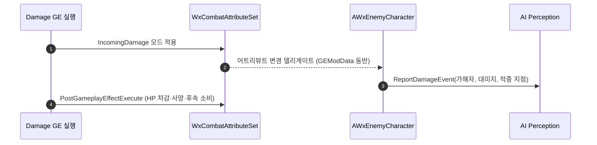

# AI 촉각 보고를 피격자 캐릭터로 이관

## 계획

### 목표
`UWxCombatAttributeSet::PostGameplayEffectExecute` 의 IncomingDamage 분기 한복판에 끼어 있는 `UAISense_Damage::ReportDamageEvent` 를 피격자 쪽으로 옮긴다. HP 차감·사망 이벤트만 다루는 수치 처리 자리에 AI 통지가 섞여 있고, 서버 전용 게이트도 없다.

### 수정 범위
| 파일 | 수정할 내용 | 구분 |
|---|---|---|
| `Plugins/WxCombat/Source/WxCombat/Private/AbilitySystem/Attribute/WxCombatAttributeSet.cpp` | 보고 블록과 `Perception/AISense_Damage.h` 인클루드 제거 | 수정 |
| `Source/WxGame/Character/WxEnemyCharacter.h` | `InitAbilitySystem` 오버라이드와 `HandleIncomingDamageChanged` 선언 추가 | 수정 |
| `Source/WxGame/Character/WxEnemyCharacter.cpp` | IncomingDamage 구독과 촉각 보고 구현 | 수정 |

### 접근 방식
- **피격자가 보고 주체**: `FAIDamageEvent` 는 피격 액터로 리스너를 역추적해 그 컨트롤러의 퍼셉션 컴포넌트에게만 간다. 방송이 아니라 1:1 통지이므로 보고 주체가 피격자 자신인 편이 자연스럽다. 레퍼런스도 같은 방향이다 — ActionRPG 는 어트리뷰트셋이 `TargetCharacter->HandleDamage(...)` 로 넘기고, Lyra 는 어트리뷰트셋이 발행만 하고 `ULyraHealthComponent` 가 서버 전용으로 소비한다.
- **컨트롤러가 아니라 캐릭터**: ASC 가 캐릭터에 있고 어트리뷰트 델리게이트 구독 관용구도 캐릭터에 이미 있다. 컨트롤러에 두면 possess/unpossess 구독 관리만 늘고 얻는 게 없다. 퍼셉션 컴포넌트를 가진 폰은 `AWxEnemyCharacter` 와 그 파생뿐이라 커버리지 손실도 없다.
- **IncomingDamage 어트리뷰트 델리게이트**: 메타 어트리뷰트라 GE 실행으로만 바뀌고, 그때 `FOnAttributeChangeData::GEModData` 에 실행 콜백 데이터가 실려 와 가해자와 HitResult 를 얻을 수 있다. 어트리뷰트셋이 나중에 부르는 `SetHP` / `SetIncomingDamage(0)` 에는 실리지 않으므로 HP 구독으로는 가해자를 알 수 없다.
- **서버 게이트는 구독 위치가 대신한다**: 적의 `InitAbilitySystem` 은 서버에서만 도는 `PossessedBy` 로만 호출된다(`OnRep_PlayerState` 경로는 플레이어 전용). AI Perception 이 도는 곳과 같아 별도 권위 가드가 필요 없다.

---

## 완료

### 수정한 파일
| 파일 | 수정한 내용 | 구분 |
|---|---|---|
| `Plugins/WxCombat/Source/WxCombat/Private/AbilitySystem/Attribute/WxCombatAttributeSet.cpp` | 보고 블록과 촉각 센스 인클루드 제거 | 수정 |
| `Source/WxGame/Character/WxEnemyCharacter.h` | `InitAbilitySystem` 오버라이드와 대미지 콜백 선언 추가 | 수정 |
| `Source/WxGame/Character/WxEnemyCharacter.cpp` | 대미지 어트리뷰트 구독과 촉각 보고 구현 | 수정 |

### 구현·결정과 그 이유
- **피격자 캐릭터가 보고 주체**: 촉각 자극은 피격 액터를 통해 그 컨트롤러의 퍼셉션 컴포넌트로만 전달되는 1:1 통지라, 보고 주체가 피격자 본인인 편이 구조가 곧다. 어트리뷰트셋의 대미지 분기는 수치 처리와 후속 소비만 남았다.
- **컨트롤러 대신 캐릭터**: ASC 와 어트리뷰트 구독 관용구가 캐릭터에 있고, 보고 자체가 컨트롤러를 필요로 하지 않는다. 컨트롤러에 두면 빙의·해제마다 구독을 옮기는 코드만 늘어난다.
- **대미지 메타 어트리뷰트 구독**: 이 어트리뷰트는 GE 실행으로만 바뀌고 그때만 실행 콜백 데이터가 함께 오므로, 가해자와 적중 지점을 여기서만 얻을 수 있다. HP 변화를 구독하면 어트리뷰트셋이 값을 직접 써 넣는 경로라 가해자를 알 수 없다.
- **권위 가드를 두지 않음**: 적의 어빌리티 시스템 초기화는 서버 빙의 경로로만 호출되므로 구독 지점이 곧 서버 게이트다. 조건을 한 번 더 쓰는 대신 호출 경로에 맡겼다.
- **GE 종류 필터 없음**: 지속 대미지도 이전과 같이 보고된다. 어그로 관점에선 중복이지만, 필터가 캐릭터를 대미지 GE 분류에 묶는 대가가 더 커 보였다.

### 계획 대비 달라진 점
- 계획대로. 다만 작업 중 어트리뷰트셋의 후속 소비 함수가 다른 이름으로 바뀌어 있었는데, 이번 변경은 그 함수를 건드리지 않아 영향 없음.

### 후속 과제
- PIE 실동작 확인(등 뒤 피격 시 즉시 응시, 회피 히트에는 인지 없음)은 아직.
