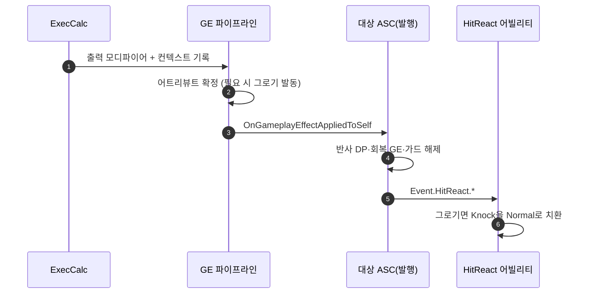

# ExecCalc 순수화 · HitReact 반응 결정 어빌리티 위임

## 계획

### 목표
`UWxExecCalc_Damage`가 출력 모디파이어 외에 세 가지 외부 상태(공격자 DP 직접 기록·공격자 회복 GE 적용·대상 가드 어빌리티 취소)를 GE 실행 콜스택 안에서 바꾸고 있다. 이 부수효과를 결과 소비 지점으로 옮겨 ExecCalc를 순수 계산기로 만들고, 함께 들고 있던 HitReact 반응 결정을 반응하는 어빌리티로 넘긴다.

### 수정 범위
| 파일 | 수정할 내용 | 구분 |
|---|---|---|
| `Plugins/WxCombat/.../Effect/WxEffect_Damage.h/.cpp` | `ReflectPerfectGuard`·`ResolveHitReaction` 제거, 회복 GE 호출 제거, 가드 SP 차감을 Execute 본문으로, 원본 HitReact 태그를 그대로 컨텍스트에 기록 | 수정 |
| `Plugins/WxCombat/.../Effect/WxEffect_AddDP.h/.cpp` | SetByCaller Additive DP 즉발 GE + `ApplyTo` | 신규 |
| `Plugins/WxCore/.../WxGameplayTags.h/.cpp` | `SetByCaller.DP` 태그 | 수정 |
| `Plugins/WxCombat/.../WxAbilitySystemComponent.cpp` | 퍼펙트 가드 반사 DP·공격자 회복·Unblockable 가드 해제·가드 Normal 폴백을 발행 시점에서 수행 | 수정 |
| `Plugins/WxCombat/.../Ability/WxAbility_HitReact.cpp` | 자기 ASC의 `Ability.Groggy`를 보고 Knock 계열을 Normal로 치환 | 수정 |
| `Plugins/WxCombat/.../Damage/WxCombatEffectContext.h` | `GetHitReactTag()` 주석을 "가공 전 원본"으로 정정 | 수정 |

### 접근 방식
- **역할 3분할**: ExecCalc는 계산해서 컨텍스트에 싣기만 하고, 확정된 결과로 GE·이벤트를 내보내는 일은 이미 그 역할을 맡고 있던 `HandleGameplayEffectAppliedToSelf`가, 어떤 반응을 할지는 반응하는 어빌리티가 정한다.
- **반사 DP를 GE로**: 직접 기록은 어트리뷰트 셋의 상한 되밀기를 지나지 않아 클램프를 손으로 들고 있었다. GE 모디파이어로 태우면 그 코드가 없어지고 대상 쪽 DP 가산과 경로가 같아진다.
- **가드 해제 순서**: HitReact 어빌리티가 `Effect.Guard`로 차단되므로, Unblockable 관통은 반응 이벤트를 보내기 전에 가드를 끊어야 한다. 발행 지점은 대상 ASC 자신이라 자기 어빌리티를 끊는 것이 된다.
- **동작 변화 1건(승인됨)**: 그로기를 유발한 히트도 Normal 반응이 된다. DP 적용으로 그로기가 먼저 붙고 반응 이벤트가 뒤에 오므로, 어빌리티 시점에서는 진입 히트와 그로기 중 피격이 구분되지 않는다. 긴 넉다운이 그로기 창을 잠식하던 문제도 함께 사라진다.

---

## 완료

### 수정한 파일
| 파일 | 수정한 내용 | 구분 |
|---|---|---|
| `Plugins/WxCombat/.../Effect/WxEffect_Damage.h/.cpp` | `ReflectPerfectGuard`·`ResolveHitReaction` 제거, 회복 GE 호출 제거, 가드 SP 차감을 Execute 본문으로, 원본 HitReact 태그를 그대로 기록 | 수정 |
| `Plugins/WxCombat/.../Effect/WxEffect_AddDP.h/.cpp` | SetByCaller Additive DP 즉발 GE + `ApplyTo` | 신규 |
| `Plugins/WxCore/.../WxGameplayTags.h/.cpp` | `SetByCaller.DP` 태그 | 수정 |
| `Plugins/WxCombat/.../WxAbilitySystemComponent.h/.cpp` | 맞은 쪽 훅에 Unblockable 가드 해제·Normal 폴백 이관, 때린 쪽 훅(`HandleGameplayEffectAppliedToTarget`) 신설 | 수정 |
| `Plugins/WxCombat/.../Ability/WxAbility_HitReact.h/.cpp` | 자기 ASC의 `Ability.Groggy`로 Knock 계열을 Normal로 치환 | 수정 |
| `Plugins/WxCombat/.../Weapon/WxProjectileBase.h/.cpp` | Spec 캐싱을 걷고 `UWxCombatLibrary::ApplyDamage`로 합류 | 수정 |
| `Plugins/WxCombat/.../Damage/WxCombatEffectContext.h`, `.../Ability/WxAbility_Guard.h` | 옮겨간 책임에 맞춰 주석 정정 | 수정 |

### 구현·결정과 그 이유
- **컨텍스트 필드를 늘리지 않음**: 그로기 진입 히트를 구분하려면 피격 시점 상태를 실어 보내야 하지만, DP 적용이 그로기를 먼저 띄우고 반응 이벤트가 뒤에 오므로 어빌리티 시점에서는 구분이 성립하지 않는다. 필드를 늘리는 대신 진입 히트도 Normal로 낮추기로 했다. 긴 넉 몽타주가 그로기 몽타주를 밀어내는 동안에도 드레인이 돌아 그로기 창이 잘려나가던 문제가 함께 사라진다.
- **때린 쪽 처리는 엔진의 대칭 훅으로**: 처음에는 맞은 쪽 훅에서 공격자에게 GE를 걸었고, 다음에는 적용한 쪽 라이브러리 함수로 옮겼다. 둘 다 소유가 어긋나거나 함수를 부풀렸다. 엔진에 이미 짝이 되는 `OnGameplayEffectAppliedDelegateToTarget`이 있어(스펙 컨텍스트의 Instigator ASC로 찾아 부른다) 그쪽에 붙였다. 공격자가 자기에게 적용하는 형태가 되고, 적용 호출부가 어디든 걸린다.
- **반사 DP를 GE로**: 직접 기록은 상한 되밀기를 지나지 않아 클램프를 손으로 들고 있었다. 대상 쪽 DP 가산과 같은 경로를 타면서 그 코드가 없어졌다.
- **투사체 합류**: 자기 컨텍스트와 캐시 Spec으로 따로 적용하던 것을 공용 진입점으로 보냈다. 대칭 훅 도입으로 필수는 아니게 됐지만, 히트 결과 합성 중복이 줄고 컨텍스트 구성이 무기와 같아진다.

### 계획 대비 달라진 점
- 컨텍스트에 `bWasGroggy`를 추가하려던 1번 항목을 폐기하고, 그로기 진입 히트의 반응이 Knock에서 Normal로 바뀌는 동작 변화를 택했다.
- 공격자 몫의 위치가 두 번 옮겨져 최종적으로 `HandleGameplayEffectAppliedToTarget`에 자리 잡았다. 그 과정에서 투사체를 공용 진입점에 합쳤다.
- 부수 효과로 순서가 하나 뒤집혔다. 퍼펙트 가드 반사가 패리 HitReact 이벤트보다 뒤에 일어난다. 최종 상태(패리 몽타주 후 그로기 몽타주)는 같고 몽타주 교체가 한 번 줄어든다.

### 후속 과제
- PIE 미검증. 퍼펙트 가드 반사로 공격자 그로기, Unblockable 가드 관통, 일반 가드 SP 차감, 그로기 진입/진행 중 Normal 반응, 적중 시 MP·UP 회복, 투사체 적중 전반을 확인해야 한다.
- 리뷰 6번은 이번 조치로 해소됐다. 문서 갱신은 다음 `module-review` 때 반영한다.
