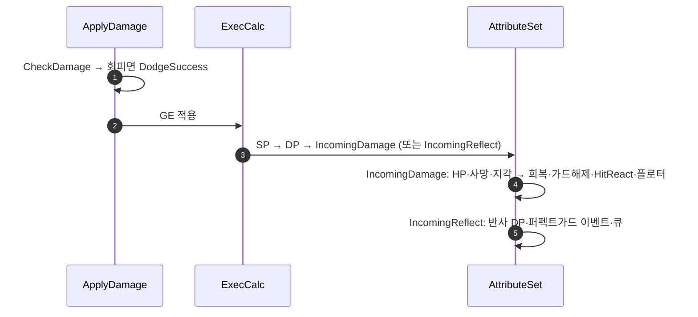

# 대미지 결과 소비를 PostGameplayEffectExecute로 일원화

## 계획

### 목표
대미지 판정 결과 소비가 `UWxAbilitySystemComponent`의 적용 델리게이트 두 짝에 몰려 있다. Lyra가 `ULyraHealthSet::PostGameplayEffectExecute` 하나에서 하는 일이므로, 두 훅을 없애고 어트리뷰트 셋으로 옮긴다.

### 수정 범위
| 파일 | 수정할 내용 | 구분 |
|---|---|---|
| `Plugins/WxCombat/.../Attribute/WxCombatAttributeSet.h/.cpp` | `IncomingReflect` 메타 어트리뷰트 신설, IncomingDamage 분기에 반응·회복·플로터 이관, IncomingReflect 분기 신설 | 수정 |
| `Plugins/WxCombat/.../Effect/WxEffect_Damage.cpp` | IncomingDamage 출력을 맨 뒤로, 퍼펙트 가드를 IncomingReflect 출력으로, SetEvaded 제거 | 수정 |
| `Plugins/WxCombat/.../WxCombatLibrary.cpp` | 적용 전 CheckDamage 결과가 회피면 Event.DodgeSuccess 발행 | 수정 |
| `Plugins/WxCombat/.../WxAbilitySystemComponent.h/.cpp` | 적용 델리게이트 핸들러 두 짝 삭제 | 수정 |
| `Plugins/WxCombat/.../Damage/WxCombatEffectContext.h/.cpp` | `SetEvaded`·`SetPerfectGuard`·`EWxDamageResult::PerfectGuard` 삭제 | 수정 |

### 접근 방식
- **메타 어트리뷰트로 훅을 연다**: 퍼펙트 가드는 대상 어트리뷰트가 하나도 안 바뀌어 `PostGameplayEffectExecute`가 아예 안 돈다. 반사량을 `IncomingReflect`에 실으면 값이 실제 데이터이면서 훅을 여는 통로가 된다. `IncomingDamage`가 이미 같은 패턴이다.
- **IncomingDamage를 출력 순서 맨 뒤로**: 출력 모디파이어는 추가 순서대로 하나씩 적용되고 각각 직후에 훅이 불린다. 맨 뒤에 두면 반응 발행 시점의 SP·DP가 지금 두 훅이 보던 상태와 같아지고(가드 브레이크 판정·그로기 치환 보존), 뒤에 남은 모디파이어가 없어 재진입도 줄어든다.
- **화상 격리**: 화상도 `IncomingDamage`를 쓰고 공유 컨텍스트에 판정까지 기록하므로, 신규 블록은 대미지 GE 클래스로 거른다. 안 그러면 틱마다 플로터 중복·가드 흡수 몽타주 반복이 난다.
- **회피는 적용 전 판정으로**: 히트스톱이 이미 쓰는 `CheckDamage`를 재사용해 발행한다. 단 GE 적용 자체는 건너뛰지 않는다 — 회피여도 상태이상은 지금처럼 걸려야 한다.

---

## 완료

### 수정한 파일
| 파일 | 수정한 내용 | 구분 |
|---|---|---|
| `Plugins/WxCombat/.../Attribute/WxCombatAttributeSet.h/.cpp` | `IncomingReflect` 메타 어트리뷰트 신설, `PublishDamageResult`·`PublishPerfectGuard` 신설, 두 분기를 `PostGameplayEffectExecute`에 연결 | 수정 |
| `Plugins/WxCombat/.../Effect/WxEffect_Damage.h/.cpp` | 출력 순서를 SP → DP → IncomingDamage로, 퍼펙트 가드를 IncomingReflect 출력으로, `SetEvaded` 호출 제거 | 수정 |
| `Plugins/WxCombat/.../WxCombatLibrary.cpp` | 선판정 결과가 회피면 `Event.DodgeSuccess` 발행 | 수정 |
| `Plugins/WxCombat/.../WxAbilitySystemComponent.h/.cpp` | 적용 델리게이트 핸들러 두 짝과 바인딩 삭제 | 수정 |
| `Plugins/WxCombat/.../Damage/WxCombatEffectContext.h/.cpp` | `SetEvaded`·`SetPerfectGuard`·`EWxDamageResult::PerfectGuard` 삭제 | 수정 |
| `Plugins/WxCombat/.../Ability/WxAbility_Guard.h` | 옮겨간 가드 해제 주체로 주석 정정 | 수정 |

### 구현·결정과 그 이유
- **메타 어트리뷰트가 훅을 여는 통로**: 퍼펙트 가드는 대상 어트리뷰트를 하나도 바꾸지 않아 어떤 스톡 훅도 돌지 않는다. 반사량을 실어 보낼 자리를 만들면 값이 실제 데이터이면서 훅이 열린다. 억지로 0을 더해 훅을 깨우는 우회는 쓰지 않았다.
- **출력 순서를 계약으로 삼음**: 모디파이어가 하나씩 적용되며 그때마다 훅이 불리므로, IncomingDamage를 맨 뒤에 두면 반응 발행 시점에 SP·DP가 확정된다. 가드가 이 히트로 깨졌는지, 그로기에 막 들어갔는지를 각각 SP와 DP가 말해 준다. 순서를 뒤집으면 가드가 한 대 늦게 깨지므로 주석으로 못박았다.
- **화상 격리**: 화상도 같은 어트리뷰트를 지나고 공유 컨텍스트에 판정까지 남긴다. GE 종류로 걸러 두지 않으면 틱마다 플로터가 겹치고, 가드 중이면 가드 흡수 몽타주가 반복된다.
- **회피는 적용 전 판정으로**: 무적 회피는 어트리뷰트를 바꾸지 않아 적용 뒤에는 알아낼 수단이 없다. 히트스톱이 이미 쓰던 선판정을 재사용해 알린다. 적용 자체는 계속 진행해 회피 시에도 상태이상이 걸리는 현행 동작을 지켰다.
- **주기형 훅은 유지**: 화상 플로터의 주기형 실행 델리게이트는 별개의 순정 훅이다. 여기까지 합치면 플로터 위치 기준과 치트 킬 처리가 딸려와 이번 범위를 넘는다.

### 계획 대비 달라진 점
계획대로.

### 후속 과제
- PIE 미검증. 가드 브레이크가 한 대 늦지 않는지, 화상 플로터 중복, 회피 이벤트와 상태이상, 퍼펙트 가드(반사량 0 포함), 그로기 반응, 죽는 히트의 히트리액트 차단, 투사체 적중을 확인해야 한다.
- 반응 발행이 여전히 GE 실행 콜스택 안이다. 어빌리티 활성화·취소가 그 안에서 일어나므로 실측에서 순서 이상을 살핀다.
