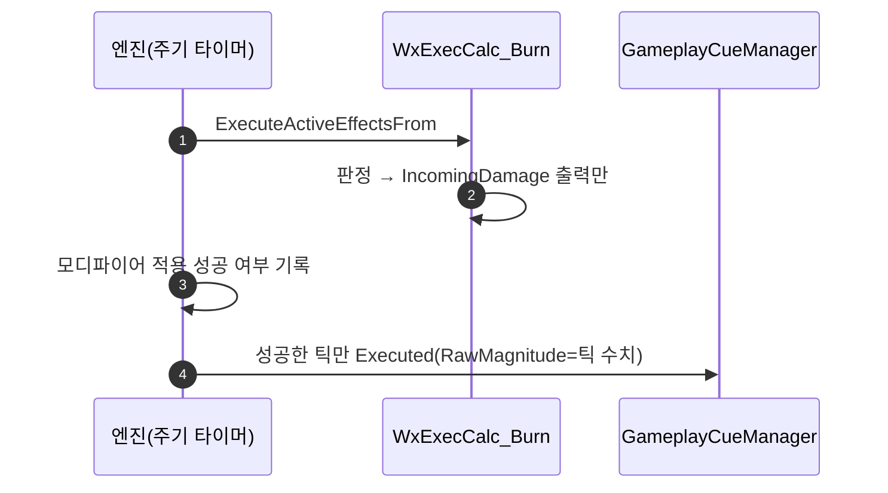

# 주기형 발행 훅을 없애고 화상 틱 플로터를 GE 큐로 넘김

## 계획

### 목표

`UWxAbilitySystemComponent`의 ASC 델리게이트 훅 중 적용 훅은 이미 `UWxCombatAttributeSet::PostGameplayEffectExecute`로 옮겨졌고, 주기형 훅 `HandlePeriodicGameplayEffectExecuted`만 화상 틱 플로터를 위해 남아 있다. 화상 틱도 이미 `IncomingDamage`를 지나 같은 콜백에 도달하므로 이 훅은 같은 시점의 콜백을 한 번 더 받는 중복이다. 훅을 없애고 발행을 엔진 순정 경로로 넘긴다.

### 수정 범위
| 파일 | 수정할 내용 | 구분 |
|---|---|---|
| `WxCombat/.../AbilitySystem/WxAbilitySystemComponent.h`·`.cpp` | 훅 선언·정의·생성자 바인딩 제거, 놀게 되는 include 정리 | 수정 |
| `WxCombat/.../Effect/WxEffect_Burn.cpp` | 플로터 큐를 GE에 얹고, 독자가 사라진 컨텍스트 기록 제거 | 수정 |
| `WxCombat/.../Effect/WxEffect_Burn.h`·`WxEffect_Kill.h` | 없어진 함수를 가리키는 주석 정정 | 수정 |

### 접근 방식
- **GE에 큐를 얹는다**: 주기형 GE는 틱마다 `Executed` 큐 이벤트를 쏘고, `FGameplayEffectCue::MagnitudeAttribute`에 `IncomingDamage`를 걸면 그 틱에 실제로 적용된 양이 `RawMagnitude`로 실려 온다. 플로터에 필요한 게 수치 하나뿐이라 코드 없이 끝난다.
- **0 대미지 틱은 엔진이 막는다**: `bRequireModifierSuccessToTriggerCues`가 기본 참이고 화상 GE는 Execution을 가지므로, ExecCalc이 팀 판정·무적으로 조기 반환해 출력 모디파이어가 없는 틱에는 큐가 아예 나가지 않는다.
- **컨텍스트 왕복을 없앤다**: ExecCalc이 틱 수치를 컨텍스트에 적고 훅이 되읽던 구조가 통째로 필요 없어진다.

---

## 완료

### 수정한 파일
| 파일 | 수정한 내용 | 구분 |
|---|---|---|
| `WxCombat/.../AbilitySystem/WxAbilitySystemComponent.h`·`.cpp` | 훅 선언·정의·생성자 바인딩 제거, 바인딩이 사라져 고아가 된 주석과 include 3종 정리 | 수정 |
| `WxCombat/.../Effect/WxEffect_Burn.cpp` | 플로터 큐 추가(`MagnitudeAttribute`=IncomingDamage), 컨텍스트 추출·기록 블록과 include 제거 | 수정 |
| `WxCombat/.../Effect/WxEffect_Burn.h` | 발행 주체를 GE 큐로 정정 | 수정 |
| `WxCombat/.../Effect/WxEffect_Kill.h` | 플로터 미발행 근거를 어트리뷰트 셋의 GE 종류 필터로 정정 | 수정 |
| `WxCombat/.../Attribute/WxCombatAttributeSet.cpp` | `ProcessDamageTaken`의 죽은 Location 계산·불필요한 삼항·한 번 쓰는 지역 변수 제거, `ProcessPerfectGuard`에 Location을 손으로 채우는 이유 명시 | 수정 |
| `WxCombat/.../Damage/WxCombatEffectContext.h`·`.cpp` | 읽는 곳이 없어진 `DamageResult`·`FinalDamage` 필드와 접근자 제거, `SetDamaged`/`ClearDamageResult`를 `SetCritical` 하나로 통합 | 수정 |
| `WxCombat/.../Effect/WxEffect_Damage.cpp` | 컨텍스트 기록을 `SetCritical` 두 번 호출로 교체 | 수정 |

### 구현·결정과 그 이유
- **어트리뷰트 셋 분기가 아니라 GE 큐로 갔다**: 처음에는 형제 발행 헬퍼를 어트리뷰트 셋에 하나 더 두려 했으나, 플로터가 필요로 하는 게 수치 하나뿐이라 엔진이 이미 주는 경로로 충분했다. 코드가 늘지 않고 화상 GE에서 연출 코드가 완전히 사라진다.
- **`bRequireModifierSuccessToTriggerCues`에 기댄다**: 무적·아군 판정으로 대미지가 안 들어간 틱에 0짜리 플로터가 뜨는 게 유일한 걱정거리였는데, 엔진이 같은 목적의 플래그를 기본값으로 켜 두고 있었다. 큐 노티파이에 별도 가드를 넣지 않았다.
- **`ProcessDamageTaken`에 합치지 않았다**: 그 함수는 공격자 자원 회복·가드 해제·히트리액트까지 하므로 게이트를 넓히면 틱마다 전부 다시 나간다.
- **컨텍스트가 크리 플래그 하나로 줄었다**: 훅을 걷어내고 나니 `GetDamageResult`·`GetFinalDamage`의 호출자가 0이 됐다. 판정 결과는 스펙 태그로, 수치는 IncomingDamage로 소비 지점에 닿으므로 컨텍스트에 남길 이유가 크리 여부뿐이다. 필드 3개·메서드 5개가 필드 1개·메서드 2개가 됐고 NetSerialize도 1바이트만 태운다.
- **`ProcessDamageTaken`은 남긴다**: 공격자 자원 회복은 대상이 아닌 시전자에게 적용돼 순정 `ConditionalGameplayEffects`로 못 옮기고, 히트리액트 태그 결정과 가드 해제는 데이터로 표현되지 않는다. 플로터도 화상처럼 GE 큐로 내리려 했으나 크리 여부를 실을 자리가 없다 — GE 큐의 `AggregatedSourceTags`는 공격자 액터의 캡처 태그라 ExecCalc이 실행 시점에 끼워 넣을 수 없다.
- **플로터 큐의 Location 계산은 죽은 코드였다**: 플로터 노티파이는 대상 액터 위치에서 액터를 스폰하고 `Parameters.Location`을 읽지 않는다(GC 에셋 3종 모두 그래프 없는 데이터 전용 서브클래스라 BP 우회 경로도 없다).
- **이름을 `PublishDamageResult`에서 `ProcessDamageTaken`으로 고쳤다**: 접두사가 발행이라 하는데 네 가지 일 중 발행은 큐 하나뿐이었다 — 자원 회복·반사 DP는 GE 적용, 가드 해제는 어빌리티 취소, 반응 이벤트는 어빌리티를 띄우는 호출이다. 뒤쪽 `Result`도 컨텍스트에서 판정 결과를 걷어낸 순간 가리킬 것이 없어졌다. 형제와 나란히 이 어트리뷰트 셋 주인에게 방금 일어난 일로 이름을 맞췄다.
- **퍼펙트 가드 큐는 컨텍스트 오버로드로 넘겼다**: 그 큐는 Location을 실제로 쓰지만, 손으로 채우던 블록이 `UWxAbilitySystemGlobals::InitGameplayCueParameters`가 하는 일과 같았다. 대미지 스펙을 만드는 곳이 `UWxCombatLibrary::ApplyDamage` 하나뿐이고 거기서 항상 `AddHitResult`를 하므로, 아바타 위치 폴백은 도달할 수 없는 가지였다. 12줄이 1줄이 됐다.

### 계획 대비 달라진 점
- 발행 위치가 어트리뷰트 셋 분기(`PublishBurnTick`)에서 GE 큐로 바뀌었다. 구현 중 엔진 소스를 확인해 순정 경로로 충분하다는 게 확실해졌고, 결과적으로 신규 함수가 0개가 됐다.

### 후속 과제
- 인게임 회귀 미검증(빌드까지만). PIE에서 ① 화상 틱마다 플로터 1회·수치 동일 ② 무적·아군 판정 틱에 0 플로터가 뜨지 않음 ③ 화염 VFX(`GameplayCue_Burn`) 회귀 없음 ④ 일반 타격 회귀 없음 을 확인해야 한다.
