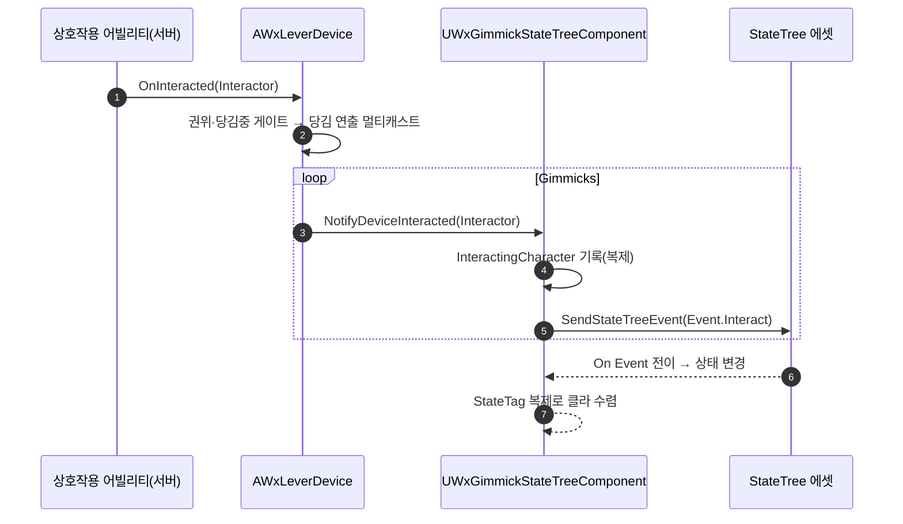

# 레버 → 기믹 참조 방향 반전 (ST 이벤트 발송으로 전환)

## 계획

### 목표

기믹 → 레버였던 배선을 레버 → 기믹으로 뒤집는다. 레버가 자기가 움직일 기믹 액터들을 직접 들고, 눌리면 그 기믹들에게 `Event.Interact` StateTree 이벤트를 보낸다. 각 기믹의 ST 에셋은 `On Event(Event.Interact)` 전이로 처리를 저작한다. Role 어휘·델리게이트 디스패처·구독 역경로가 통째로 사라지고, 배선이 사양서의 1:N / N:1 모양과 같아진다.

### 수정 범위

| 파일 | 수정할 내용 | 구분 |
|---|---|---|
| `WxLeverDevice.h/.cpp` | `Gimmicks` 배열 추가, `OnInteracted`이 각 기믹에 눌림 통지, 구독·`SetDeviceActive`·`PushedPrompt` 제거, 생성자에서 상시 활성으로 시작 | 수정 |
| `WxGimmickStateTreeComponent.h/.cpp` | `NotifyDeviceInteracted(AActor*)`로 축소해 ST 이벤트 발송으로 교체, `DeviceLinks`/`DeviceBindings`/`SetDeviceInteractionEnabled`/링크 구조체·`EndPlay` 제거 | 수정 |
| `WxStateTreeTask_EnableDeviceInteraction.h/.cpp` | Role로 레버를 켜고 발행 자리를 여는 것이 존재 이유 전부라 제거 | 삭제 |
| `Plugins/WxWorld/README.md` | "장치(레버) 연결과 Role 어휘" 항목을 새 배선으로 재작성 | 수정 |

### 접근 방식

- **레버가 대상을 든다**: `TArray<TObjectPtr<AActor>> Gimmicks`(`EditInstanceOnly`)로 레벨에서 지목한다. 눌리면 각 액터에서 기믹 컴포넌트를 찾아 통지한다.
- **전이 배선은 ST 이벤트로**: 디스패처 + 컨텍스트 약참조를 남겨 두던 발행 자리 대신 `SendStateTreeEvent(Event.Interact)` 한 줄이다. 잠든 트리는 엔진의 `ScheduleNextTick` → 실행 컨텍스트 확장 경로로 깨어난다.
- **`bPendingInteractResolve`는 세우지 않는다**: 이 플래그를 세우던 근거는 "발행 자리가 열린 역할"이라는 게이트였다. 이벤트엔 그 게이트가 없어, 반응하지 않는 상태에서 레버를 당길 때마다 클라만 현재 상태를 재진입해 연출을 헛재생하게 된다. 레버가 자기 상태로의 재전이를 노리는 저작이 없으므로 흔한 오작동을 없애는 쪽을 택한다.
- **잠금은 기존 범용 태스크로**: 레버는 상시 활성으로 시작하고, 상태별 잠금이 필요하면 `상호작용 켜기` 태스크의 Target(액터) 갈래가 `IWxInteractable::SetInteractionEnabled`로 처리한다.

---

## 완료

### 수정한 파일

| 파일 | 수정한 내용 | 구분 |
|---|---|---|
| `WxLeverDevice.h/.cpp` | `Gimmicks`(EditInstanceOnly) 추가, `OnInteracted`이 각 기믹 컴포넌트에 눌림 통지, 구독·`SetDeviceActive`·`PushedPrompt` 제거, 생성자에서 `QueryAndPhysics`로 상시 활성 시작, `BeginPlay`에 배선 오류 Error 로그 | 수정 |
| `WxGimmickStateTreeComponent.h/.cpp` | `NotifyDeviceInteracted(AActor*)`가 당사자 기록 후 `SendStateTreeEvent(Event.Interact)`, 링크 구조체 2종·`DeviceLinks`·`DeviceBindings`·`SetDeviceInteractionEnabled`·`EndPlay`·구독 등록 제거 | 수정 |
| `WxStateTreeTask_EnableDeviceInteraction.h/.cpp` | Role로 레버를 켜고 발행 자리를 여는 노드 | 삭제 |
| `Plugins/WxWorld/README.md` | "장치(레버) 연결과 Role 어휘" → 새 배선 설명으로 재작성 | 수정 |

### 구현·결정과 그 이유

- **역경로 제거**: 기믹이 레버를 지목하던 시절엔 눌림을 되돌리기 위해 레버가 구독자 목록을 따로 들어야 했다. 방향이 뒤집히니 그 목록·등록·해제가 통째로 필요 없어졌고, `EndPlay` 오버라이드도 장치 정리 외에 할 일이 없어 사라졌다.
- **발행자 대신 이벤트**: 델리게이트 디스패처는 자리(Role)마다 실행 컨텍스트 약참조까지 남겨야 했다. 이벤트는 `SendStateTreeEvent` 한 줄이고, 잠든 트리도 엔진의 `ScheduleNextTick` → 실행 컨텍스트 확장 경로로 깨어난다.
- **`bPendingInteractResolve`를 걸지 않음**: 이 플래그는 "발행 자리가 열린 역할"이라는 게이트가 있을 때만 안전했다. 이벤트엔 그 자리가 없어 반응하지 않는 상태에서 당길 때마다 클라만 헛재진입한다. 레버로 자기 상태 재전이를 노리는 저작이 없으므로 흔한 오작동을 없애는 쪽을 택했다.
- **레버 상시 활성**: 켜짐을 밀어 주던 주체가 사라졌으므로 생성자에서 켜고 시작한다. 상태별 잠금이 필요하면 기존 `상호작용 켜기` 태스크의 Target(액터) 갈래가 `IWxInteractable` 계약으로 처리하므로 레버 전용 배선을 다시 만들지 않았다.
- **배선 오류 로그**: 지목한 액터에 기믹 컴포넌트가 없으면 "당겨도 아무 일 없음"으로만 드러나 원인을 찾기 어렵다. `BeginPlay`에서 한 번 Error 로 알린다.

### 계획 대비 달라진 점

계획대로.

### 후속 과제

- 콘텐츠 재저작(에디터): `ST_Door`의 `장치 상호작용 켜기` 노드 제거 후 `On Event(Event.Interact)` 전이로 재작성, `BP_LeverDevice`·배치 레버 인스턴스의 `Gimmicks` 배열 채우기(배치 기믹 2개의 `DeviceLinks` 값은 소실).
- 한 기믹에 레버가 여럿 붙으면 `Event.Interact` 하나로는 ST가 어느 레버인지 구분하지 못한다(구 Role 어휘 상실). 엘리베이터처럼 갈라야 할 기믹이 생기면 레버에 이벤트 태그 필드를 두거나 페이로드로 보낸 레버를 실어 조건 분기한다.
- 인게임 동작 미검증 — 빌드 확인까지만 마쳤다.
