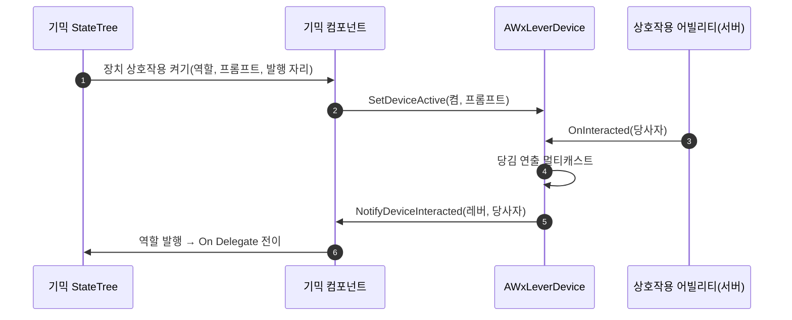

# 레버 장치 AWxLeverDevice 도입

## 계획

### 목표

문·엘리베이터 등 기믹 BP에 직접 포함돼 있던 상호작용 메시를 분리해, 상호작용하면 연결된 기믹을 조작하는 독립 레버 액터를 만든다. 기획서의 레버 요건(1:N·N:1 연결, 1회용/반복 레버, 조작 연출 약 1초와 연출 중 재조작 불가, 세이브 유지)의 기반이며, 향후 상호작용 대상을 메시가 아닌 액터로 바꾸는 방향의 첫 사례다.

### 수정 범위

| 파일 | 수정할 내용 | 구분 |
|---|---|---|
| `Plugins/WxWorld/.../Public/Interaction/WxLeverDevice.h` + cpp | 레버 장치 액터. IWxInteractable 액터 구현, 당김 연출·구독자 통지 | 신규 |
| `Plugins/WxWorld/.../Public/Interaction/WxStateTreeTask_EnableDeviceInteraction.h` + cpp | "장치 상호작용 켜기" ST 태스크(역할 단위) | 신규 |
| `Plugins/WxWorld/.../Gimmick/WxGimmickStateTreeComponent.h` + cpp | 장치 링크 저작 배열, 역할별 발행 자리, 장치 눌림 통지 진입점, EndPlay 정리, 재시작 리셋 스윕 | 수정 |

### 접근 방식

- **참조는 기믹 → 레버 단방향 저작**: 기믹 ST 에셋은 인스턴스 간 공유 자산이라 특정 레버를 가리킬 수 없다. 그래서 인스턴스 배선은 기믹 컴포넌트의 링크 배열(역할 이름 + 레벨 액터 참조, UOL 아닌 일반 하드 참조)이 들고, ST 에셋은 역할 이름만 안다. 하드 참조라 World Partition에서 쌍이 같은 클러스터로 함께 로드되어 늦은 등록 경로가 없다.
- **레버는 완전 수동 장치**: 저작 데이터가 기본 프롬프트뿐이다. 활성/잠금은 별도 플래그 없이 몸체 메시의 쿼리 콜리전(물리 차단은 유지)이고, 기본은 꺼짐이라 켜는 시점을 구독 기믹 ST가 정하면 세이브 복원 정합이 따로 필요 없다(레버 자체 세이브 없음).
- **신호는 기존 영역 발행과 동형, 키만 역할**: ST 태스크가 역할 단위로 장치를 켜며 발행 자리(디스패처+약참조 컨텍스트)를 컴포넌트에 남기고, 레버가 눌리면 구독 컴포넌트가 역할을 역조회해 트리에 발행한다. 당사자 복제·재진입 판정 플래그도 기존 경로와 동일하게 다루되, 발행이 전부 실패하면 플래그를 롤백해 헛 재진입 멀티캐스트를 막는다.
- **당김 연출은 비신뢰 멀티캐스트**: 복제 카운터는 늦게 관련성을 얻은 피어에 헛발동하는 기지의 문제로 기각된 패턴이라, 재진입 통지와 같은 멀티캐스트 RPC로 각 머신에서 핸들 회전·사운드를 재생한다. 재조작 게이트는 서버의 활성 판정이 당김 타임스탬프 파생으로 막는다.
- **재시작 리셋 스윕**: 트리 재시작(세이브 복원·스트리밍 인) 직전에 영역 맵·발행 자리·링크 장치를 모두 끈다 — 이전 상태의 켜짐 잔재가 남는 기존 영역 맵의 잠복 결함도 함께 고친다. 직후 시작이 전 상태를 초기 진입으로 다시 밟으며 필요한 것만 재등록한다.

---

## 완료

### 수정한 파일
| 파일 | 수정한 내용 | 구분 |
|---|---|---|
| `Plugins/WxWorld/.../Public/Interaction/WxLeverDevice.h` + cpp | 레버 장치 액터 — IWxInteractable 액터 구현, 콜리전 잠금, 당김 연출 멀티캐스트, 구독자 통지 | 신규 |
| `Plugins/WxWorld/.../Public/Interaction/WxStateTreeTask_EnableDeviceInteraction.h` + cpp | "장치 상호작용 켜기" ST 태스크 — 역할 단위로 발행 자리와 장치 상태를 함께 토글 | 신규 |
| `Plugins/WxWorld/.../Gimmick/WxGimmickStateTreeComponent.h` + cpp | 장치 링크 배선·역할별 발행 자리·눌림 통지 진입점, EndPlay 정리, 재시작 리셋 스윕 | 수정 |

### 구현·결정과 그 이유

- **당김 게이트는 활성 판정에 흡수**: 연출 중 재조작 차단을 별도 거부 분기 없이 활성 판정이 당김 타임스탬프 파생으로 답하게 했다 — 어빌리티의 서버 활성 검증이 그대로 막아 주고, 클라 프롬프트도 같은 판정으로 숨는다.
- **콜리전은 쿼리만 여닫고 물리는 유지**: 대화 영역과 달리 레버는 실체 프롭이라 완전 무콜리전으로 내리면 플레이어가 몸체를 뚫는다.
- **발행 실패 시 재진입 판정 플래그 롤백**: 발행이 전부 stale로 실패하면 소화될 것이 없는데 플래그가 남으면 다음 기록 지점이 헛 재진입 멀티캐스트를 쏜다. 신규 경로에는 발행 반환값으로 이를 차단했다.
- **재시작 리셋 스윕은 기존 영역 맵까지 포함**: 세이브 복원·스트리밍 인 재시작이 다른 상태로 점프할 때 이전 상태의 켜짐 잔재가 남는 것은 기존 영역 맵의 잠복 결함이기도 해서 함께 걷는다.
- **통지 게이트·당사자 복제·발행 순서는 기존 영역 경로와 동형 유지**: 클라 수렴(상태 태그 추종)과 이동·몽타주 태스크가 기존 계약 그대로 동작하게 하기 위함이다.

### 계획 대비 달라진 점

- 몸체 메시 모빌리티를 Movable로 명시하지 않고 기본(Static)으로 뒀다 — 이동체 위 레버는 이번 범위에서 제외라 스태틱 라이팅을 지키는 쪽이 낫고, 손잡이만 Movable이면 연출이 성립한다.

### 후속 과제

- ~~문 에셋 이관~~ → 같은 날 MCP로 완료: BP_LeverDevice(그레이박스 큐브+실린더, Prompt 기본 "Pull") 신설, ST_Door 양 상태의 메시 갈래를 장치 태스크(Role=Open)로 교체(노드 iD 유지로 전이 디스패처 바인딩 보존, Console 바인딩 제거), BP_Door Console 컴포넌트 제거, LV_DevCombat 문 옆에 레버 배치·DeviceLinks 배선, 전부 저장. PIE 자동 검증: Close 진입 시 레버 콜리전 PhysicsOnly→QueryAndPhysics 켜짐 확인, StateTree/WxWorld 에러·경고 0건.
- 남은 이관: ST_Elevator 콜콘솔 Role=CallToA/CallToB(탑승 영역은 메시 갈래 유지), 퀘스트 스텝 지목 대상 변경. Role 어휘는 UEFN식 명령형 동사 규약(README 확장 규약, 기본값 Activate).
- 사람 손 PIE 검증 대기: 레버 당김→문 열림·당김 연출·1회용 영구 비활성(세이브-로드), 리슨 2인 동기, 스트리밍 왕복 재등록.
- 기존 영역 경로의 발행 실패 플래그 잔류는 미수정(같은 결함, 후속 정리 후보). Role 오타 침묵 no-op에 대한 에디터 검증도 후속.
