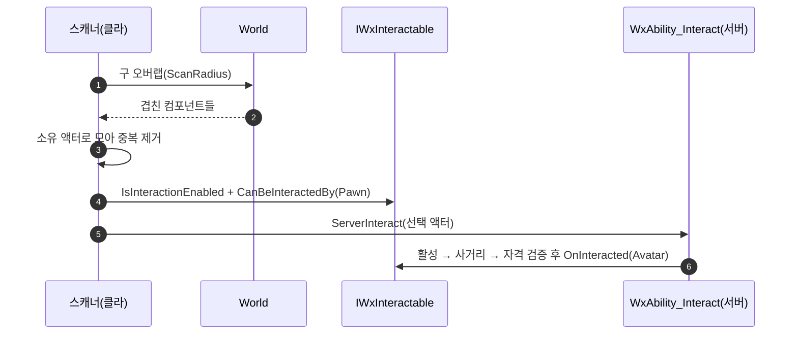

# IWxInteractable 을 액터 단위 계약으로 전환

## 계획

### 목표

상호작용 계약이 "액터 안의 어느 메시가 켜진 영역인가"를 묻던 것을 없애고, 상호작용 대상을 액터 단위로 통일한다. 영역이 여럿 필요하면 레버처럼 액터를 나눠 배치한다. 감지·사거리 판정은 그대로 콜리전 형상 위에서 돌아간다 — 사라지는 것은 계약이 메시를 식별자로 쓰는 것이다.

### 수정 범위

| 파일 | 수정할 내용 | 구분 |
|---|---|---|
| `WxInteractable.h/.cpp` | `IsInteractionMeshActive(Mesh)`→`IsInteractionEnabled()`, `OnInteracted`/`GetInteractionPrompt`/`CanBeInteractedBy` 에서 `Source` 제거, `IsMeshInRange`→`IsActorInRange`, `Find(UActorComponent*)` 삭제 | 수정 |
| `WxInteractionScannerComponent.h/.cpp` | 후보·선택·하이라이트를 액터 단위로(`InRangeActors`, `GetSelectedActor`, `ServerInteract(AActor*)`) | 수정 |
| `WxAbility_Interact.h/.cpp` | `OptionalObject` 를 액터로 받아 활성→사거리→자격→실행 검증 | 수정 |
| `WxGimmickStateTreeComponent.h/.cpp` | 영역 맵을 `bInteractionEnabled` + 단일 `FWxGimmickInteractionBinding` 으로, 계약의 `SetInteractionEnabled` 오버라이드 추가 | 수정 |
| `WxStateTreeTask_EnableInteraction.h/.cpp` | `TargetMesh` 제거, `Target` 이 비면 오너 기믹 자신 | 수정 |
| `WxLeverDevice`, `WxDialogueComponent`, `WxItemPickup`, `WxEnemyCharacter` | 메시 식별 제거, 자기 상태 판정만 남김 | 수정 |
| `Plugins/WxWorld/README.md` | 스캔 대상 서술을 액터 단위로 정정 | 수정 |

### 접근 방식

- **계약만 액터 단위로**: 감지는 계속 구 오버랩, 사거리는 계속 `OverlapComponent` 다. 오버랩 결과를 컴포넌트가 아니라 소유 액터로 모아 중복 제거하는 것이 전환의 전부다.
- **활성 판정은 각자 자기 상태로**: 레버·대화는 이미 자기 콜리전이 상태를 들고 있어 메시 비교만 빼면 되고, 픽업·적은 상시 true 다. 기믹만 맵이 사라지므로 `bInteractionEnabled` 를 새로 든다.
- **`Target` 이 비면 자신**: 기존 에셋에서 `TargetMesh` 만 채운 '상호작용 켜기' 노드가 그대로 자기 갈래로 읽혀 문·상자·체크포인트가 재저작 없이 동작한다.

---

## 완료

### 수정한 파일

| 파일 | 수정한 내용 | 구분 |
|---|---|---|
| `WxInteractable.h/.cpp` | 계약 5개를 액터 단위로(`IsInteractionEnabled`, `OnInteracted(Interactor)`, `GetInteractionPrompt()`, `CanBeInteractedBy(Interactor)`, `IsActorInRange`), `Find(UActorComponent*)` 삭제 | 수정 |
| `WxInteractionScannerComponent.h/.cpp` | `InRangeActors`·`GetSelectedActor`·`ServerInteract(AActor*)`, 오버랩 결과를 액터로 중복 제거, 하이라이트를 액터의 보이는 프리미티브 전부에 | 수정 |
| `WxAbility_Interact.h/.cpp` | `OptionalObject` 를 액터로 받아 활성→사거리→자격→실행 검증, `NotifyInteracted(Selected)` | 수정 |
| `WxGimmickStateTreeComponent.h/.cpp` | `FWxGimmickInteractionRegion`→`FWxGimmickInteractionBinding`, 영역 맵→`bInteractionEnabled`+단일 바인딩, `SetInteractionBinding`, 계약의 `SetInteractionEnabled` 오버라이드 추가 | 수정 |
| `WxStateTreeTask_EnableInteraction.h/.cpp` | `TargetMesh` 제거, `Target` 이 비면 오너 기믹 자신 | 수정 |
| `WxLeverDevice`, `WxDialogueComponent`, `WxItemPickup`, `WxEnemyCharacter` | 메시 식별 제거, 자기 상태 판정만 남김 | 수정 |
| `Plugins/WxWorld/README.md` | 상호작용 항목을 액터 단위로 정정 | 수정 |

### 구현·결정과 그 이유

- **계약만 액터 단위로, 판정은 그대로**: 감지는 여전히 구 오버랩이고 사거리도 `OverlapComponent` 다. 형상 거리로 재는 정확도를 잃지 않으려면 메시를 판정에서까지 빼면 안 된다 — 없앤 것은 계약이 메시를 식별자로 쓰던 것뿐이다.
- **`IsActorInRange` 의 ensure 위치**: 프리미티브마다 나무라면 캡슐·트리거까지 걸려 소음이 된다. "쿼리 콜리전이 켜진 프리미티브가 액터에 하나도 없다"는 조건으로 옮겨 전제가 실제로 깨졌을 때만 드러나게 했다.
- **활성 판정을 각자 자기 상태로**: 레버·대화는 이미 콜리전이 상태를 들고 있어 메시 비교만 뺐고, 픽업·적은 상시 true 다. 기믹만 맵이 사라져 담을 곳이 없어 `bInteractionEnabled` 를 새로 뒀다.
- **대화 잠금의 의미가 바뀐 것**: 예전엔 영역 메시 콜리전을 내리면 감지에서 통째로 빠졌지만, 이제 호스트의 캡슐이 계속 스캔에 걸린다. 값은 그대로 두고 `IsInteractionEnabled` 가 그 값을 명시적으로 답하게 해 잠금의 실질을 옮겼다.
- **`Target` 이 비면 자신**: 기존 에셋에서 `TargetMesh` 만 채운 노드가 그대로 자기 갈래로 읽혀 문·상자·체크포인트가 재저작 없이 동작한다. 퀘스트 스텝처럼 옵션으로 비워 두는 쪽은 오너에 기믹 컴포넌트가 없어 무동작이라 기존 규약도 깨지지 않는다.
- **하이라이트는 보이는 프리미티브만**: 캡슐·트리거는 렌더링되지 않아 켜 봐야 외곽선에 기여하지 않는다.

### 계획 대비 달라진 점

계획대로.

### 후속 과제

- `ST_Elevator` 재저작: 한 액터에 호출 영역 둘이 성립하지 않아 두 '상호작용 켜기' 노드가 같은 자기 바인딩을 덮어쓴다. 층별 호출을 레버 액터 2개로 나눠 각자 엘리베이터를 지목하는 배선으로 옮겨야 한다.
- 적 네임플레이트(WidgetComponent)가 떠 있을 때 그 적을 선택하면 네임플레이트에도 외곽선이 낀다. 거슬리면 제외 규칙을 넣는다.
- `Docs/Programmer/module_review_WxCore.md` 의 상호작용 관련 지적(액터+컴포넌트 구현체 충돌, 메시 인자 타입 불일치)은 이 변경으로 사라졌다 — 다음 `module-review` 실행 때 갱신된다.
- 인게임 동작 미검증 — 빌드 확인까지만 마쳤다.
