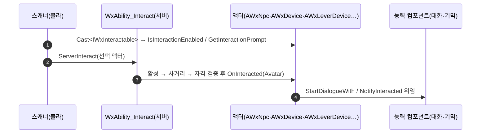

# 상호작용 계약을 컴포넌트에서 액터로 이관

## 계획

### 목표
`IWxInteractable` 을 액터에만 구현한다는 방침(2026-08-21)을 실제 이관으로 완성한다. 컴포넌트가 계약을 드는 둘(`UWxDialogueComponent`, `UWxGimmickStateTreeComponent`)을 호스트 액터 구현으로 옮기고, 그 결과 쓸모가 없어지는 `IWxInteractable::Find` 를 제거해 호출부를 `Cast` 한 줄로 줄인다.

확장 방향도 함께 못박는다 — 상호작용 종류가 늘어도(대화 가능한 물체, NPC 거래) 선택 단위를 컴포넌트로 되돌리지 않는다. 한 대상에 선택지가 여럿 필요해지는 시점의 답은 계약을 옵션 목록으로 키우는 것이고, 그러려면 액터당 계약 구현체가 하나 서 있어야 한다.

### 수정 범위
| 파일 | 수정할 내용 | 구분 |
|---|---|---|
| `Plugins/WxDialogue/Source/WxDialogue/Public/WxDialogueActor.h` / `Private/WxDialogueActor.cpp` | `AWxDialogueActor : AActor, IWxInteractable` — 대화 컴포넌트를 네이티브로 소유하고 계약을 위임 | 신규 |
| `Plugins/WxWorld/Source/WxWorld/Public/Gimmick/WxDevice.h` / `Private/Gimmick/WxDevice.cpp` | `AWxDevice : AActor, IWxInteractable` — 기믹 컴포넌트를 네이티브로 소유하고 계약을 위임, `bReplicates` 보장 | 신규 |
| `Plugins/WxDialogue/.../WxDialogueComponent.h/.cpp` | `IWxInteractable` 상속 제거, `AreaMesh`·`SetAreaMesh` 삭제, `OnInteracted`→`StartDialogueWith`, `GetInteractionPrompt`→`GetTalkPrompt` | 수정 |
| `Plugins/WxWorld/.../Gimmick/WxGimmickStateTreeComponent.h/.cpp` | `IWxInteractable` 상속 제거(`IWxSavable` 은 유지), `OnInteracted`→`NotifyInteracted`, 나머지 셋은 `virtual`/`override` 만 제거 | 수정 |
| `Plugins/WxCore/.../WxInteractable.h/.cpp` | `Find` 삭제, 클래스 주석에서 이관 대기 문구를 걷고 액터 전용 확정 + 옵션 목록 성장 경로 명시 | 수정 |
| `WxInteractionScannerComponent.cpp`(2곳) · `WxStateTreeTask_EnableInteraction.cpp` · `WxAbility_Interact.cpp` | `Find(Actor)` → `Cast<IWxInteractable>(Actor)` | 수정 |
| `Source/WxGame/Character/WxNpc.h/.cpp` | `AWxDialogueActor` 상속으로 전환, 대화 컴포넌트 멤버·생성·`SetAreaMesh` 제거 | 수정 |
| `Plugins/WxSave/.../WxSaveWorldSubsystem.h` | `FindSavable` 주석의 "순수 BP 호스트" 근거를 "상태를 컴포넌트가 든다"로 정정, 사라진 `Find` 참조 제거 | 수정 |
| `Plugins/WxCore/README.md` · `Plugins/WxDialogue/README.md` · `Plugins/WxWorld/README.md` | "붙이면 어느 액터든 대상" · "새 기믹은 C++ 액터를 만들지 않는다" 서술을 액터 상속 방식으로 정정 | 수정 |

### 접근 방식
- **액터가 계약, 컴포넌트가 능력**: 액터는 계약 4개를 받아 컴포넌트로 넘기기만 한다. 컴포넌트는 그대로 남아 대화·기믹 로직을 계속 들며, 계약만 잃는다. 나중에 한 NPC 가 대화+거래를 들 때 각 능력이 자기 컴포넌트로 조립되는 구조가 이것으로 보존된다.
- **네이티브 루트를 만들지 않는다**: 두 액터 모두 `Abstract` 이고 루트를 두지 않는다. 파생(`AWxNpc` 의 캡슐, 기믹 BP 4종의 SCS 루트)이 이미 자기 루트를 갖고 있어, 루트를 얹으면 기존 계층이 한 단 밀린다.
- **컴포넌트 이름을 유지해 BP 오버라이드를 지킨다**: `DialogueComponent` 는 `AWxNpc` 가 쓰던 이름 그대로 베이스로 올린다 — 네이티브 서브오브젝트의 BP 프로퍼티 델타는 이름으로 붙으므로 `BP_Npc` 의 `StartRow`·`SpeakerName` 지정이 보존된다.
- **대화 활성 판정을 불리언으로**: 컴포넌트엔 상태를 담을 곳이 없어 영역 메시의 쿼리 콜리전을 상태로 쓰던 우회였다. 액터 단위 전환 이후로는 메시를 꺼도 캡슐이 스캔에 걸려 그 우회가 이미 실질을 잃었으므로, 액터의 `bInteractionEnabled` 로 대체하고 `AreaMesh` 를 지운다.
- **기믹 호스트를 `AWxDevice` 로**: 상태를 자기 StateTree 로 드는 장치가 `AWxDevice`, 상태 없이 남을 지목해 밀어 주는 장치가 기존 `AWxLeverDevice` 다. 이름 계열만 잇고 상속 관계는 두지 않는다(레버엔 기믹 컴포넌트가 없다).

### 에디터 작업 (코드 밖 — 빌드 후 사용자가)
1. `BP_CheckPoint`·`BP_Door`·`BP_Elevator`·`BP_TreasureChest` 부모를 `Actor` → `WxDevice` 로 리페어런트.
2. **같은 BP 에서** SCS 로 붙어 있던 `WxGimmickStateTreeComponent` 삭제 → 상속된 `GimmickComponent` 에 ST 에셋 지정(`ST_CheckPoint`/`ST_Door`/`ST_Elevator`/`ST_TreasureChest`). 1 만 하고 2 를 빠뜨리면 기믹 컴포넌트가 둘이 되어 `FindSavable`·'상호작용 켜기' 자기 갈래가 엉뚱한 쪽을 잡는다.
3. 기믹이 배치된 맵 저장(`LV_DevCombat`·`LV_OpenWorld`·`LevelInstance/SiegeCannonEmplacement01`) — `PreSave` 가 `SaveId` 를 오너 `ActorGuid` 로 다시 심는다(값이 이전과 같아 기존 세이브 호환).
4. `BP_Npc` 의 대화 활성 체크박스 확인(기본 `true`).

---

## 완료

### 수정한 파일
| 파일 | 수정한 내용 | 구분 |
|---|---|---|
| `Plugins/WxDialogue/.../Public/WxDialogueActor.h` · `Private/WxDialogueActor.cpp` | `AWxDialogueActor` — 대화 컴포넌트를 네이티브로 소유하고 계약 4개를 위임, 활성 상태는 `bInteractionEnabled` | 신규 |
| `Plugins/WxWorld/.../Public/Gimmick/WxDevice.h` · `Private/Gimmick/WxDevice.cpp` | `AWxDevice` — 기믹 컴포넌트를 네이티브로 소유하고 계약 4개를 위임, 생성자에서 `bReplicates` | 신규 |
| `Plugins/WxDialogue/.../WxDialogueComponent.h/.cpp` | `IWxInteractable` 상속·`AreaMesh`·`SetAreaMesh` 제거, `OnInteracted`→`StartDialogueWith`, `GetInteractionPrompt`→`GetTalkPrompt` | 수정 |
| `Plugins/WxWorld/.../Gimmick/WxGimmickStateTreeComponent.h/.cpp` | `IWxInteractable` 상속 제거(`IWxSavable` 유지), `OnInteracted`→`NotifyInteracted`, 나머지 셋은 `virtual`/`override` 제거, 쓰이지 않던 `UPrimitiveComponent` 선언·인클루드 정리 | 수정 |
| `Plugins/WxCore/.../WxInteractable.h/.cpp` | `Find` 삭제, 클래스 주석을 액터 전용으로 확정하고 옵션 목록 성장 경로 명시 | 수정 |
| `WxInteractionScannerComponent.cpp`(2곳) · `WxStateTreeTask_EnableInteraction.cpp` · `WxAbility_Interact.cpp` | `Find(Actor)` → `Cast<IWxInteractable>(Actor)` | 수정 |
| `Source/WxGame/Character/WxNpc.h/.cpp` | `AWxDialogueActor` 상속으로 전환, 대화 컴포넌트 멤버·생성·`SetAreaMesh` 제거 | 수정 |
| `Plugins/WxSave/.../WxSaveWorldSubsystem.h` | `FindSavable` 주석의 근거를 "순수 BP 호스트"에서 "영속 대상이 컴포넌트가 든 상태"로 정정 | 수정 |
| `Plugins/WxCore/README.md` · `Plugins/WxDialogue/README.md` · `Plugins/WxWorld/README.md` | 두 계약의 구현 위치 분기, 새 대화 대상·새 기믹을 액터 상속 방식으로 정정 | 수정 |

### 구현·결정과 그 이유
- **액터가 계약, 컴포넌트가 능력**: 액터는 계약을 받아 컴포넌트로 넘기기만 한다. 컴포넌트는 그대로 남아 대화·기믹 로직을 계속 든다 — 나중에 한 NPC 가 대화+거래를 들 때 능력을 컴포넌트로 조립하는 구조가 이것으로 보존된다. 계약만 옮기는 것이 이번 작업의 전부다.
- **선택 단위를 컴포넌트로 되돌리지 않기로 한 근거**: 하이라이트·사거리가 형상 단위라 컴포넌트마다 프리미티브를 지목해야 하고(직전에 걷어낸 `AreaMesh` 의 부활), 기믹은 컴포넌트 하나가 상태마다 다른 행동을 내놓아 "컴포넌트 = 행동"이 성립하지 않으며, 컴포넌트 참조는 동적 생성분이 원격에서 해소되지 않는다. 한 대상에 선택지가 여럿 필요해지면 계약의 응답을 옵션 목록으로 키우는 쪽이 답이고, 그러려면 액터당 구현체가 하나 서 있어야 한다 — 이번 이관이 그 전제다.
- **네이티브 루트를 만들지 않았다**: 두 액터 모두 `Abstract` 이고 루트가 없다. 파생이 이미 자기 루트를 갖고 있어(`AWxNpc` 의 캡슐, 기믹 BP 의 SCS 루트), 루트를 얹으면 기존 계층이 한 단 밀린다.
- **컴포넌트 이름을 유지해 BP 오버라이드를 지켰다**: `DialogueComponent` 를 `AWxNpc` 가 쓰던 이름 그대로 베이스로 올렸다. 네이티브 서브오브젝트의 BP 프로퍼티 델타는 이름으로 붙으므로 `BP_Npc` 의 `StartRow`·`SpeakerName` 지정이 살아 있다.
- **대화 활성 판정을 불리언으로 바꿨다**: 컴포넌트엔 상태를 담을 곳이 없어 영역 메시의 쿼리 콜리전을 상태로 쓰던 우회였는데, 액터 단위 전환 이후로는 메시를 꺼도 캡슐이 스캔에 걸려 그 우회가 이미 실질을 잃은 상태였다. 액터가 값을 들 수 있으니 우회를 걷고 `AreaMesh` 를 지웠다. NPC 스켈레탈 메시의 `QueryOnly` 는 감지·사거리 형상으로 계속 필요해 그대로 뒀다.
- **`bReplicates` 를 액터가 보장한다**: 꺼지면 클라 장치가 통째로 멈추는데 로컬 플레이에선 정상으로 보여 발견이 늦다. 배치 측 책임으로 두는 대신 호스트가 켠다. 파생 BP 가 되돌릴 수 있어 컴포넌트의 `BeginPlay` Error 로그는 남겼다.
- **레버 배선은 건드리지 않았다**: `AWxLeverDevice::Gimmicks` 는 계속 `TArray<AActor*>` + `FindComponentByClass` 다. 상호작용 계약이 아니라 저작 참조라 이번 이관과 무관하고, 배열 타입을 좁히면 배치 인스턴스의 참조를 건드리게 된다.

### 계획 대비 달라진 점
- 계획 단계에서 `AWxGimmickActor` 로 부르던 신설 액터를 승인 시 `AWxDevice` 로 바꿨다(기존 `AWxLeverDevice` 와 이름 계열).

### 후속 과제
- **에디터 작업이 남아 있다(코드만으로는 기믹이 동작하지 않는다)**:
  1. `BP_CheckPoint`·`BP_Door`·`BP_Elevator`·`BP_TreasureChest` 부모를 `Actor` → `WxDevice` 로 리페어런트.
  2. **같은 BP 에서** SCS 로 붙어 있던 `WxGimmickStateTreeComponent` 삭제 → 상속된 `GimmickComponent` 에 ST 에셋 지정(`ST_CheckPoint`/`ST_Door`/`ST_Elevator`/`ST_TreasureChest`). 1 만 하고 2 를 빠뜨리면 기믹 컴포넌트가 둘이 되어 `FindSavable`·'상호작용 켜기' 자기 갈래가 엉뚱한 쪽을 잡는다.
  3. 기믹이 배치된 맵 저장(`LV_DevCombat`·`LV_OpenWorld`·`LevelInstance/SiegeCannonEmplacement01`) — `PreSave` 가 `SaveId` 를 오너 `ActorGuid` 로 다시 심는다(값이 이전과 같아 기존 세이브 호환).
  4. `BP_Npc` 의 대화 활성 체크(`bInteractionEnabled`) 확인. 기본이 켜짐이라, 예전에 메시 콜리전을 꺼서 잠가 두었던 인스턴스가 있으면 이제 말을 걸 수 있게 된다.
- 인게임 동작 미검증 — 빌드 확인까지만 마쳤다. 위 에디터 작업 후 NPC 말 걸기, 문·상자·체크포인트, 엘리베이터 레버, 세이브 후 상태 복원을 확인해야 한다.
- 두 컴포넌트의 `BlueprintSpawnableComponent` 는 남겨 뒀다. 이제 아무 액터에 붙여도 상호작용 대상이 되지 않으므로 오해를 부르는 표식인데, 지금 떼면 리페어런트 전의 기믹 BP 들이 그 컴포넌트를 든 채 열려야 해서 위 에디터 작업이 끝난 뒤에 떼는 것이 안전하다.
- `Docs/Programmer/module_review_WxCore.md`·`module_review_WxDialogue.md`·`module_review_WxWorld.md` 의 "액터+컴포넌트 구현체 충돌" 계열 지적은 이 변경으로 사라졌다 — 다음 `module-review` 실행 때 갱신된다.
