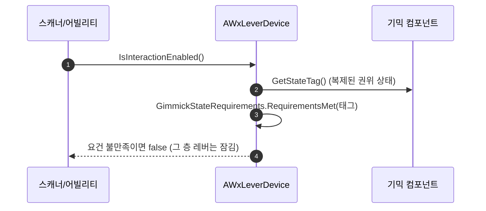

# 엘리베이터 상태 어휘를 1F / 2F / Moving 으로 + 층별 호출 레버 자기 잠금

## 계획

### 목표
엘리베이터의 권위 상태 어휘를 스플라인 끝점 기준(`Closed`/`AtStart`/`AtEnd`)에서 층 기준(`1F`/`2F`)으로 바꾸고, 어떤 상태로도 표현되지 않던 이동을 `Moving` 상태로 승격한다. 곧 층마다 놓을 호출 레버가 "엘리베이터가 이미 그 층에 있으면 비활성"이어야 하므로, 그 잠금을 레버가 스스로 판정하게 한다.

### 수정 범위
| 파일 | 수정할 내용 | 구분 |
|---|---|---|
| `Plugins/WxCore/.../Public/WxGameplayTags.h` | 엘리베이터 태그 선언 3줄 교체 | 수정 |
| `Plugins/WxCore/.../Private/WxGameplayTags.cpp` | 엘리베이터 태그 정의 3줄 교체 | 수정 |
| `Plugins/WxWorld/.../Public/Gimmick/WxGimmickStateTreeComponent.h` + cpp | 복제 상태 태그를 읽는 public const 게터 추가 | 수정 |
| `Plugins/WxWorld/.../Public/Interaction/WxLeverDevice.h` + cpp | `GimmickStateRequirements` 필드, `IsInteractionEnabled` 에 상태 판정 합류, 클래스 doc 갱신 | 수정 |
| `Plugins/WxWorld/Source/WxWorld/WxWorld.Build.cs` | `"GameplayAbilities"` 를 Private → Public 의존으로 이동 | 수정 |

### 접근 방식
- **태그 개명**: `AtStart`→`1F`, `AtEnd`→`2F`, `Closed`→`Moving`. 숫자로 시작하는 태그 이름은 유효하다(엔진 기본 금지 문자는 `"`, `'`, `,` 뿐). 리다이렉트는 만들지 않는다 — 상태 구조가 통째로 재저작되므로 구 값을 이어받을 이유가 없다.
- **레버는 구분하지 않는다**: 층이 둘뿐이라 "켜져 있는 레버가 눌렸다 = 반대 층으로 간다"가 항상 성립한다. 목적지는 전이가 정하고, 레버는 페이로드 없는 `Event.Interact` 하나만 보내던 그대로 둔다.
- **잠금은 레버가 스스로**: `FGameplayTagRequirements GimmickStateRequirements` 를 저작해, 지목한 기믹의 복제 상태 태그가 요건을 만족할 때만 활성이라고 답한다(1F 레버 = Must Have `Gimmick.Elevator.2F`). 어제 세운 레버 → 기믹 한 방향 배선이 유지되고, ST 에셋이 레벨의 레버를 지목할 필요가 없다.
- **상태 소스는 복제된 `StateTag`**: `GetActiveStateTag()` 는 매 호출 실행 컨텍스트를 여는 비-const 로컬 조회라 매 스캔 틱 게이트로 부적합하다. 권위가 틱마다 기록해 복제하는 값을 const 게터로 노출해 읽는다.

---

## 완료

### 수정한 파일
| 파일 | 수정한 내용 | 구분 |
|---|---|---|
| `WxGameplayTags.h`/`.cpp` | 엘리베이터 태그 3종을 `Gimmick.Elevator.1F`/`.2F`/`.Moving` 로 교체 | 수정 |
| `WxGimmickStateTreeComponent.h`/`.cpp` | 복제된 권위 상태를 답하는 `GetStateTag()` const 게터 추가 | 수정 |
| `WxLeverDevice.h`/`.cpp` | `GimmickStateRequirements` 저작 필드 추가, `IsInteractionEnabled` 에 기믹 상태 판정 합류, 클래스 doc 의 잠금 서술을 두 갈래로 정정 | 수정 |
| `WxWorld.Build.cs` | `"GameplayAbilities"` 를 Private → Public 의존으로 이동 | 수정 |

### 구현·결정과 그 이유
- **레버 구분을 만들지 않았다**: 층이 둘이면 "켜져 있는 레버가 눌렸다 = 반대 층으로 간다"가 항상 성립해, 목적지는 상태의 전이가 정하면 된다. 이벤트에 목적지를 실어 갈래를 만드는 안은 예전에 지운 호출 콘솔 태그를 되살리는 꼴이라 택하지 않았다.
- **잠금을 레버 쪽에 둔 이유**: ST 에셋은 인스턴스 간 공유라 레벨의 특정 레버를 지목하려면 `상호작용 켜기` 의 UOL 로 배치를 에셋에 박아야 하고, 그러면 엘리베이터가 둘 이상이거나 다른 레벨에 쓰일 때 깨진다. 레버가 이미 자기 기믹을 들고 있으므로 활성 요건을 레버가 선언하면 배선이 한 방향으로 유지되고 에셋은 배치를 몰라도 된다.
- **요건 구조체(`FGameplayTagRequirements`)**: Must Have / Must Not Have 두 칸을 저작이 골라 쓸 수 있어 "반대 층에 있을 때만" 과 "자기 층·이동 중이면 잠금" 을 같은 필드로 표현한다. 프로젝트에 이미 락온 포인트·네임플레이트·타게팅 필터가 같은 저작 UX 를 쓰고 있어 결이 같다.
- **복제된 `StateTag` 를 읽는다**: `GetActiveStateTag()` 는 매 호출 실행 컨텍스트를 열어 활성 프레임을 훑는 비-const 로컬 조회라 매 스캔 틱 게이트로 부적합하고, 값도 피어별 로컬 트리 기준이다. 권위가 틱마다 기록해 복제하는 값을 쓰면 서버의 활성 검증과 클라의 프롬프트가 같은 답을 낸다.
- **요건이 비면 즉시 통과**: 기존 레버(문 등)는 저작이 비어 있어 상시 활성 동작이 그대로다.
- **태그 리다이렉트 없음**: 상태 구조가 통째로 재저작되므로 구 값을 이어받을 이유가 없다. 재저작 전까지 기존 `ST_Elevator` 의 태그와 기존 세이브의 엘리베이터 상태는 해석되지 않는다(개발 중 데이터).
- **검증**: WxEditor(Development) 빌드 `Result: Succeeded`. WxCore·WxWorld 컴파일·링크 완료, 경고는 변경과 무관한 WxUI 의 기존 C4996 뿐.

### 계획 대비 달라진 점
- 계획대로. (저작 필드는 계획 도중 사용자 지시로 태그 컨테이너에서 `FGameplayTagRequirements` 로 바꿔 승인받은 그대로 구현했다.)

### 후속 과제
- **`ST_Elevator` 재저작(사용자, 에디터)**: `Root` 아래 `1F`(포인트 0 스냅 + 문 열림 + 상호작용 켜기) · `2F`(대칭) · `Moving`(상호작용 끄기 → 문 닫기 → 스플라인 이동 → 도착 층으로), 각 상태 디테일의 `Tag` 에 새 태그 지정. 기존 `Closed`/`Location A`/`Location B` 구조와 무효가 된 태그를 정리한다.
- **함정 — `Moving` 의 방향 선택**: 클라 추종과 세이브 복원은 `StateTag` 한 값으로 재진입하므로, 방향 자식을 조건 없이 나열하면 언제나 첫 자식을 골라 반대로 간다. 진입 조건이나 자식별 태그로 방향이 갈리게 저작해야 한다(위치 기반 조건이 필요하면 지워진 `Wx At Spline Point` 노드 부활을 별건으로).
- **레버 2개 배치(사용자)**: 층마다 하나, `Gimmicks = [엘리베이터]`, 1F 레버 `Must Have = Gimmick.Elevator.2F`(2F 레버는 대칭). 플랫폼 자체 상호작용은 유지.
- **PIE 미검증**: 코드만 빌드 확인했다. 재저작 후 층 이동·자기 층 레버 잠금·이동 중 프롬프트 없음·리슨 2인 추종·세이브 복원을 확인해야 한다.
