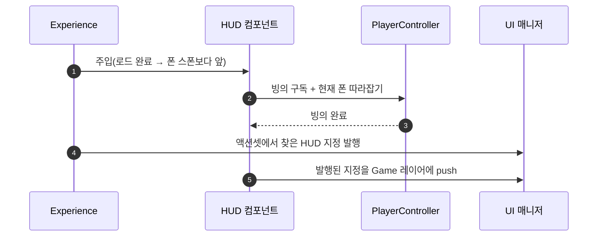

# HUD 지정을 Experience 액션셋으로

## 계획

### 목표
프로젝트 전역 설정에 박혀 있던 게임 HUD 클래스를 Experience 가 고르는 값으로 바꾼다. 콘텐츠마다(전투·프론트엔드) 다른 HUD 를 끼우려면 지정 자리가 게임 전체가 아니라 Experience 여야 한다.

### 수정 범위
| 파일 | 수정할 내용 | 구분 |
|---|---|---|
| `Plugins/WxUI/.../Component/WxHUDComponent.h/.cpp` | 빙의 뒤 HUD 를 띄우는 컨트롤러 컴포넌트 | 신규 |
| `Source/WxGame/Framework/WxExperienceActionSet.h` | `GameHUDClass` 추가 | 수정 |
| `Source/WxGame/Framework/WxExperienceManagerComponent.cpp` | 로드 완료·해제 때 HUD 지정을 UI 매니저에 발행 | 수정 |
| `Plugins/WxUI/.../Public/System/WxUIDeveloperSettings.h` | `GameHUDClass` 삭제 | 수정 |
| `Plugins/WxUI/.../System/WxUIManagerSubsystem.h/.cpp` | HUD 보관·push 책임 제거(폰 태그 관찰만 남김) | 수정 |
| `Config/DefaultGame.ini` | 설정에서 사라진 항목 줄 삭제 | 수정 |
| `Content/Framework/WAS_CoreGameplay` | 주입 목록에 HUD 컴포넌트 추가 + `Game HUD Class` 지정 | 수정 |

### 접근 방식
- **지정 자리**: 액션셋의 데이터 필드. 지급 아이템 목록이 이미 같은 자리에 있고, 액션셋들을 훑어 모으는 규칙도 이미 서 있다. 찾은 값은 UI 매니저에 발행해 UI 쪽이 Experience 를 알지 않아도 되게 한다.
- **띄우는 시점**: 빙의 뒤여야 한다. HUD 의 뷰모델 리졸버가 생성 시점에 빙의한 폰의 어빌리티 시스템을 읽기 때문이다. 컴포넌트는 오너 컨트롤러의 빙의 신호를 구독하고, 주입이 빙의보다 늦은 경우를 위해 붙는 즉시 현재 폰으로 한 번 따라잡는다.
- **걷는 시점**: 띄운 쪽이 걷는다. 컴포넌트가 사라질 때 HUD 도 사라지므로 Experience 를 내리면 화면도 함께 정리된다.

---

## 완료

### 수정한 파일
| 파일 | 수정한 내용 | 구분 |
|---|---|---|
| `Plugins/WxUI/.../Component/WxHUDComponent.h/.cpp` | 로컬 컨트롤러 게이트 + 빙의 구독·따라잡기, push, 해제 시 닫기 | 신규 |
| `Source/WxGame/Framework/WxExperienceActionSet.h` | 지급 목록 옆에 `GameHUDClass` | 수정 |
| `Source/WxGame/Framework/WxExperienceManagerComponent.cpp` | 액션셋에서 찾은 지정을 UI 매니저에 발행(해제 때 비움) | 수정 |
| `Plugins/WxUI/.../System/WxUIManagerSubsystem.h/.cpp` | 발행된 HUD 지정 보관·조회 | 수정 |
| `Plugins/WxUI/.../Public/System/WxUIDeveloperSettings.h` | `GameHUDClass` 삭제(사망·대화 화면은 그대로) | 수정 |
| `Plugins/WxUI/.../System/WxUIManagerSubsystem.h/.cpp` | HUD 약참조와 push 제거, 빙의 콜백은 폰 태그 관찰만 | 수정 |
| `Config/DefaultGame.ini` | `GameHUDClass` 줄 삭제 | 수정 |
| `Plugins/WxUI/README.md` | HUD 지정 자리 갱신 | 수정 |
| `Content/Framework/WAS_CoreGameplay` | 주입 목록 끝에 HUD 컴포넌트, `Game HUD Class` = `WBP_GameHUD` | 수정 |
| `Content/Framework/EXP_FrontEnd` | 주입 액션 복원(아래 사고 참고) | 수정 |

### 구현·결정과 그 이유
- **설정에서 Experience 로 되돌린 근거**: 07-28 에 이 값을 컨트롤러에서 전역 설정으로 옮긴 이유는 Experience 가 하나뿐이라 갈아 끼울 일이 없었고 로드 완료를 알 후크가 없어 경합했기 때문이다. 지금은 둘 다 사라졌다 — Experience 는 둘이고, 로드 파이프라인이 액션 활성을 마친 뒤에 폰을 스폰하므로 컴포넌트는 항상 빙의보다 먼저 붙는다.
- **주입 액션은 손대지 않았다**: 값을 엔트리에 싣는 두 가지를 실제로 만들어 보고 둘 다 접었다. 컴포넌트의 블루프린트 파생은 값 하나에 에셋이 하나 더 생겼고, 엔트리에 컴포넌트 원본을 담는 방식은 (1) 생성자가 세운 내부 역참조까지 원본 것으로 덮여 인벤토리가 첫 지급에서 죽었고 (2) 살려 놓아도 컴포넌트의 상속 프로퍼티가 전부 펼쳐져 편집이 어려웠다. 액션셋의 평범한 필드 하나가 셋 다 해결한다.
- **컴포넌트는 WxUI, 지정은 발행으로**: HUD 를 띄우는 일은 UI 도메인 물건이라 컴포넌트를 WxUI 에 둔다. 대신 컴포넌트가 Experience 를 캐물으면 도메인 플러그인이 게임 모듈을 보게 되므로, 방향을 뒤집어 정하는 쪽(Experience 파이프라인)이 UI 매니저에 값을 실어 준다. 파이프라인은 서버·클라가 각자 주행하므로 양쪽 모두에서 채워진다.
- **읽는 시점은 push 직전**: 컴포넌트 BeginPlay 는 액션 활성 도중일 수 있어 발행보다 이르다. 빙의는 항상 로드 완료 뒤라 그때 읽으면 언제나 확정된 값을 본다.
- **매니저가 세계를 넘어 사는 값**: UI 매니저는 GameInstance 수명이라 지정이 다음 세계로 새지 않도록, Experience 가 내려갈 때 빈 값을 발행해 지운다.
- **UI 매니저에서 HUD 를 뺀 범위**: 레이아웃 생성·게임 정지 재평가·사망/대화 화면은 그대로 두었다. 이들은 Experience 와 무관한 전역 정책이고, HUD 만 콘텐츠마다 다르다.
- **원격 사본 게이트**: 주입 목록에는 사이드 구분이 없어 데디 서버가 든 컨트롤러 사본에도 컴포넌트가 붙는다. 띄울 화면이 없는 쪽을 거르는 것은 컴포넌트 자신의 책임이라는 기존 규칙(인디케이터 매니저)을 따랐다.

### 계획 대비 달라진 점
- 값을 어디에 둘지 세 번 바꿨다(블루프린트 파생 → 주입 엔트리의 컴포넌트 원본 → 액션셋 필드). 앞의 둘에서 만든 코드·에셋은 모두 되돌렸고, 그때 8개 컴포넌트에 붙였던 `EditInlineNew` 도 걷었다.
- 컴포넌트를 한때 WxGame 으로 옮겼다가 WxUI 로 되돌렸다. 대신 Experience 가 UI 매니저에 값을 발행하는 방향으로 의존을 뒤집었다.
- **사고**: 빌드를 위해 에디터를 종료할 때 `EXP_FrontEnd` 의 저장하지 않은 편집(인디케이터 주입 액션)이 사라졌다. 같은 내용으로 복원해 저장했다.

### 후속 과제
- 프론트엔드 Experience 는 액션셋을 쓰지 않아 HUD 지정 자리가 없다. 전용 화면이 정해지면 전용 액션셋을 하나 만들거나, 그때 Experience 정의에도 같은 필드를 둔다.
- 검증은 전투 레벨 PIE(HUD 표시·아이템 지급)까지다. Experience 재활성 경로는 확인하지 않았다.
