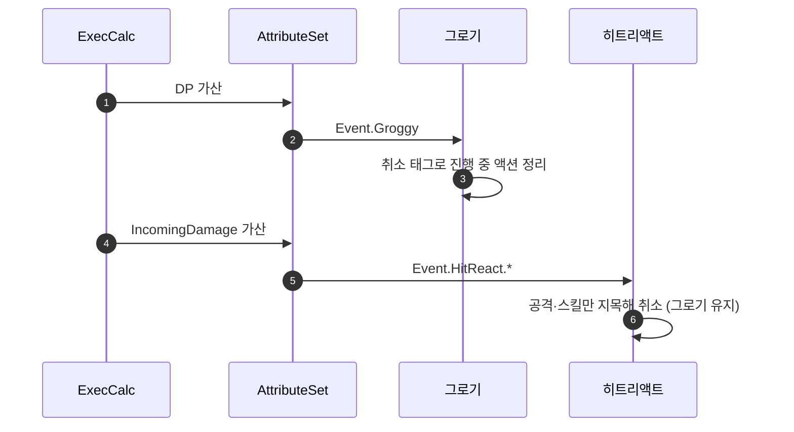

# 그로기가 발동 즉시 취소되는 버그 수정

## 계획

### 목표
적의 DP가 MaxDP에 닿아도 그로기가 실행되지 않는 버그를 고친다. 발동 자체는 되지만 같은 대미지 한 방이 뒤이어 띄우는 히트리액트가 그로기를 곧바로 취소하는 것이 원인이다. 취소 권한이 그룹 일괄 처리로 뭉개진 것을 그룹·태그 분담으로 되돌린다.

### 수정 범위
| 파일 | 수정할 내용 | 구분 |
|---|---|---|
| `Plugins/WxCombat/.../Ability/WxAbilityBase.cpp` | `ActivateAbility`의 Exclusive_Blocking·Reaction 일괄 취소 제거, 후딜 취소만 유지 | 수정 |
| `Plugins/WxCombat/.../Ability/WxAbility_Groggy.cpp` | `CancelAbilitiesWithTag`에 `Ability` 지목 추가 | 수정 |
| `Plugins/WxCombat/.../WxAbilitySystemComponent.h/.cpp` | `FindActivationGroupBlocker` → `IsActivationGroupBlocked(CancelTags)`, 점유자 전부 검사 | 수정 |
| `Plugins/WxCombat/.../Ability/WxAbility_Finisher.cpp` | 일괄 취소에 기대던 낡은 주석 정정 | 수정 |
| `Plugins/WxCombat/.../Ability/WxAbilityBase.h` | 그룹 enum 주석에 그룹·태그 분담 반영 | 수정 |

### 접근 방식
- **원인**: 커밋 `e35bee21`에서 `bCancelsRunningActions` 게이트가 사라지며, Independent가 아닌 모든 어빌리티가 발동 시 점유 그룹(Exclusive_Blocking·Reaction)을 무조건 끊게 됐다. 대미지 출력 모디파이어 순서가 DP → IncomingDamage라 그로기가 먼저 뜨고 히트리액트가 뒤이어 떠서 그로기를 지운다. 대미지 테이블의 플레이어 공격 행이 모두 피격 반응 태그를 들고 있어 예외 없이 재현된다.
- **분담**: 그룹은 발동할 수 있느냐만 가르고, 무엇을 끊느냐는 취소 태그 선언에 맡긴다. 실행은 엔진 PreActivate가 하며 자기 자신은 대상에서 빠진다. 후딜만은 태그로 표현할 수 없는 상태라 그룹 판정으로 남긴다.
- **점유 판정**: 일괄 취소가 사라지면 그로기와 히트리액트가 동시에 살아 있을 수 있어 점유가 하나뿐이라는 전제가 깨진다. 첫 점유자만 보던 판정을 "내가 못 끊는 점유자가 하나라도 있으면 막힌다"로 바꾼다.

---

## 완료

### 수정한 파일
| 파일 | 수정한 내용 | 구분 |
|---|---|---|
| `Plugins/WxCombat/.../Ability/WxAbilityBase.cpp` | `ActivateAbility`의 그룹 취소 세 줄 중 본동작·반응형 두 줄 제거, 후딜 한 줄만 유지 | 수정 |
| `Plugins/WxCombat/.../Ability/WxAbility_Groggy.cpp` | 취소 선언(`Ability`) 추가, 그룹·취소 주석 분리 | 수정 |
| `Plugins/WxCombat/.../Ability/WxAbility_Finisher.cpp` | 일괄 취소에 기대던 주석을 실제 발동 조건으로 정정 | 수정 |
| `Plugins/WxCombat/.../Ability/WxAbilityBase.h` | 그룹 enum 주석에 그룹·태그 분담과 반응형 중첩 명시 | 수정 |
| `Plugins/WxCombat/.../WxAbilitySystemComponent.h` | 점유 조회 주석에서 "점유는 하나뿐" 전제 정정 | 수정 |

### 구현·결정과 그 이유
- **그룹은 가부만, 취소는 태그가**: 일괄 취소는 사망·히트리액트의 취소 선언과 완전히 겹쳐 이중으로 돌고 있었고, 겹치지 않는 부분이 곧 버그였다. 반응형은 서로를 끊지 않아야 그로기 위에 피격 반응이 얹히는 원래 그림이 성립한다. 후딜만 그룹으로 남긴 것은 "후딜에 들었다"를 지목할 태그가 없어서다.
- **그로기는 전부 지목한다**: 사망과 같은 형태로 두었다. 그로기에 빠지면 이동·표적 유지 같은 상시 어빌리티까지 끊기는 게 맞고, 종류를 나열하면 새 액션이 늘 때마다 빠뜨린다.
- **처형에는 선언을 달지 않았다**: 처형은 상호작용 어빌리티가 넘긴 이벤트로 동기 발동하므로 그 시점 점유자는 상호작용 하나뿐인데, 그 어빌리티는 이벤트를 넘긴 다음 줄에서 스스로 끝난다. 앞선 액션은 상호작용이 발동하며 후딜 취소로 이미 정리한 뒤다. 끊을 대상이 없어 지금 다는 선언은 호출자 없는 방어가 된다.
- **점유 조회는 건드리지 않았다**: 반응형이 겹칠 수 있게 되어 "점유는 동시에 하나뿐" 전제가 깨졌지만, 취소 선언을 가진 어빌리티는 전부 반응형(그룹 판정을 건너뛴다)이고 그룹 판정을 받는 Exclusive 계열 중 선언을 가진 것은 강공격뿐이라 첫 점유자만 봐도 답이 갈리지 않는다. 주석만 사실에 맞게 고치고 한계를 후속 과제로 남겼다.

### 계획 대비 달라진 점
- 계획은 `FindActivationGroupBlocker`를 `IsActivationGroupBlocked(CancelTags)`로 되돌려 점유자를 전부 검사하려 했다. 한 번 적용해 빌드까지 확인했으나, ASC가 태그를 모르고 판정은 어빌리티가 조립한다는 직전 작업의 설계와 어긋나고 지금 드러나는 오답도 없어 되돌렸다. 그 결과 점프 판정(`WxCharacterBase`) 호출부도 손대지 않는다.

### 후속 과제
- PIE 실동작 미검증. 컴파일까지만 확인했고, 작업 중 에디터가 종료돼 샌드백·보스 재현은 다음 실행에서 해야 한다.
- 일반 적은 `DT_CharacterAttribute`의 `Enemy` 행이 `MaxHP 100 / MaxDP 100`이라 그로기 창이 사망 순간과 겹친다. DP 가산량이 최종 대미지와 같아 DP가 차는 순간이 곧 HP가 0이 되는 순간이다. 밸런스 판단이라 손대지 않았다.
- 점유 조회가 첫 점유자만 돌려준다. Exclusive 계열 어빌리티에 취소 선언이 늘면(패턴 간 캔슬 등) 반응형과 겹친 상황에서 오답이 난다.
