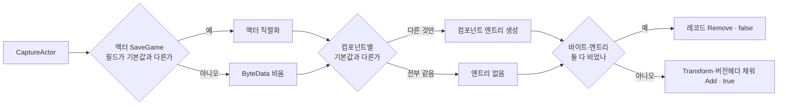

# WxSave — 기본값과 같은 상태는 저장 스킵

## 계획

### 목표
`CaptureActor` 가 IWxSavable 액터를 무조건 레코드로 남기고 그 액터의 모든 컴포넌트에 엔트리를 만드는 탓에, 값이 하나도 안 바뀐 대상까지 슬롯을 차지한다. 기본값 그대로인 상태는 복원해봐야 레벨이 세워 둔 값을 다시 쓰는 것이라 결과가 같으므로 아예 기록하지 않는다.

### 수정 범위
| 파일 | 수정할 내용 | 구분 |
|---|---|---|
| `Plugins/WxSave/Source/WxSave/Public/WxSaveWorldSubsystem.h` | `ShouldSave` 정적 판정 선언, `CaptureActor`/`RestoreActor` doc 갱신 | 수정 |
| `Plugins/WxSave/Source/WxSave/Private/WxSaveWorldSubsystem.cpp` | 판정 구현 + `CaptureActor` 재구성(스킵·기존 레코드 제거) + `RestoreActor` 빈 바이트 가드 + 로그 문구 | 수정 |
| `Plugins/WxCore/Source/WxCore/Public/WxSavable.h` | 계약 doc 한 줄 — 기본값 그대로인 액터는 슬롯에 기록되지 않는다 | 수정 |

### 접근 방식
- **판정 기준은 엔진이 이미 쓰는 그 기준**: 태그 직렬화는 아키타입 기본값과 같은 프로퍼티를 애초에 쓰지 않는다. 따라서 「기본값과 똑같다」 == 「쓸 프로퍼티가 하나도 없다」이고, 이것을 직렬화 **전에** `FProperty::Identical_InContainer` + 아키타입으로 먼저 묻는다(`ShouldSave`). 같은 프리미티브라 직렬화 결과와 판정이 어긋날 수 없고, 안 바뀐 다수 액터에서는 직렬화 작업 자체가 사라진다.
- **`CaptureActor` 재구성**: 맵에 `FindOrAdd` 로 자리를 먼저 잡지 않고 로컬 레코드에 담는다. 액터 본체는 `ShouldSave` 일 때만 직렬화하고, 컴포넌트도 `ShouldSave` 인 것만 엔트리를 만든다. 액터 바이트와 컴포넌트 엔트리가 둘 다 비면 기존 레코드를 제거하고 false — 기본값으로 되돌아온 액터의 옛 레코드까지 스스로 걷힌다.
- **`RestoreActor` 가드**: 컴포넌트만 다른 레코드(장치의 일반적인 모습)는 액터 바이트가 비므로, 비어 있으면 본체 역직렬화를 건너뛴다(컴포넌트 쪽엔 이미 같은 가드가 있다).

### 설계 검증에서 확인한 것
- 줄어드는 것: 살아있는 `AWxSpawner`(`bIsKilled=false`) 레코드가 통째로 사라지고, 모든 장치 레코드에서 SaveGame 필드 없는 컴포넌트 엔트리가 빠져 ST 컴포넌트 하나만 남는다. 장치 레코드 자체는 남는다 — `StateTag` 는 런타임에 초기 상태 태그로 채워져 아키타입 기본값(빈 태그)이 아니다.
- `OnSaveRestored` 는 레코드가 없으면 호출되지 않지만, 두 구현체 모두 기본값 상태에선 조기 return 이라 동작 동일.
- 레코드가 없으면 트랜스폼도 복원하지 않는다 — SaveGame 필드는 그대로인 채 루트만 움직이는 액터는 위치가 저장되지 않는다(현재 savable 중 해당 없음). 계약으로 명시한다.
- `AActor::Serialize` 가 태그 프로퍼티 뒤에 쓰는 `bIsCooked` bool 은 쿠킹 라벨 경로 전용이고, 쓰는 쪽·읽는 쪽을 함께 건너뛰므로 대칭이다.

---

## 완료

### 수정한 파일
| 파일 | 수정한 내용 | 구분 |
|---|---|---|
| `Plugins/WxSave/Source/WxSave/Public/WxSaveWorldSubsystem.h` | `ShouldSave` 선언, `CaptureActor` doc 를 스킵·제거 계약으로 갱신 | 수정 |
| `Plugins/WxSave/Source/WxSave/Private/WxSaveWorldSubsystem.cpp` | `ShouldSave` 구현, `CaptureActor` 를 로컬 레코드 조립으로 재구성, `RestoreActor` 빈 바이트 가드, 캡처 로그 문구 | 수정 |
| `Plugins/WxCore/Source/WxCore/Public/WxSavable.h` | 계약 doc — 전부 기본값이면 미기록이고 트랜스폼도 함께 빠진다 | 수정 |

### 구현·결정과 그 이유
- **판정을 직렬화 앞에 둔 것**: 태그 직렬화의 diff 기준이 아키타입이므로 같은 기준으로 미리 물으면 판정과 결과가 어긋날 수 없고, 안 바뀐 다수 액터에서 직렬화 작업 자체가 사라진다.
- **`FindOrAdd` 대신 로컬 레코드 조립**: 스킵 여부는 컴포넌트 순회까지 끝나야 나오므로 맵에 자리를 먼저 잡으면 만들었다 지웠다 하게 된다. 마지막에 `Add`/`Remove` 로 갈라 두면 이전 캡처가 남긴 컴포넌트 엔트리도 자연히 사라진다.
- **기본값이면 기존 레코드 `Remove`**: 기본값으로 되돌아온 액터가 옛 레코드로 옛 상태를 다시 뒤집어쓰지 않게 한다(이전엔 기본값을 덮어써서 같은 결과였고, 지금은 레코드 부재로 같은 결과다).
- **`RestoreActor` 빈 바이트 가드**: 장치처럼 컴포넌트만 바뀐 레코드는 액터 바이트가 비는데, 빈 배열에 리더를 물리면 EOF 로 아카이브 에러가 난다.

### 계획 대비 달라진 점
계획대로. 판정 함수명만 승인 과정에서 `ShouldSave` 로 확정했다.

### 후속 과제
- 에디터 PIE 실검증(저장 후 `Wx.Save.Dump` 로 살아있는 스포너 레코드 소멸·장치 레코드 컴포넌트 1개 확인, 문 열고 저장→로드 왕복, 스포너 처치 후 왕복) — 빌드까지만 확인함.
- `Plugins/WxSave/README.md` 의 「확장 포인트 / 규약」에 이 규칙 반영 — `/readme-writer` 로 갱신.
