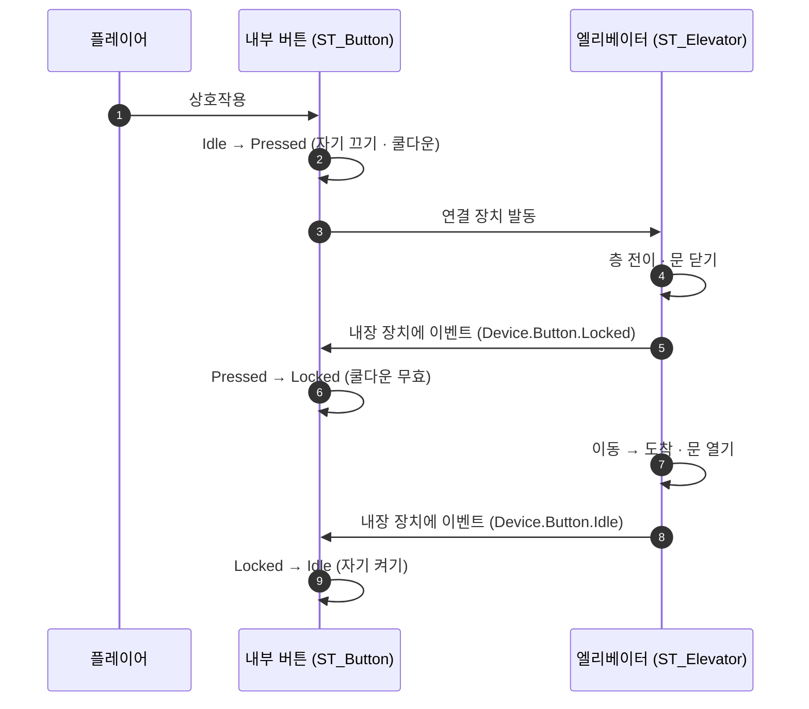

# 내장 버튼 잠금을 이벤트로 — `bInteractionLocked` 제거

## 계획

### 목표
칸과 함께 움직이는 내부 버튼(`ButtonDevice_Lift`)이 이동 도중 자기 쿨다운이 끝나면 다시 눌리는 상태로 돌아온다. 이동 중에는 잠겨 있게 하되, 그 잠금을 `AWxDevice` 의 두 번째 플래그가 아니라 버튼 자신의 상태로 표현한다.

이중 플래그가 있던 진짜 이유는 상호작용을 끌 때 프롬프트·발행자까지 비웠기 때문이다 — 남이 껐다 켜면 빈 바인딩으로 켜졌다. 끌 때 바인딩을 남기면 그 이유가 사라진다(스캐너는 활성 판정을 통과한 후보에만 문구를 묻는다). 플래그를 하나로 합치면 마지막에 쓴 쪽이 이기므로, 장치의 활성은 그 장치의 트리만 쓰고 남이 잠그려면 이벤트로 상태를 옮겨 달라고 요청한다.

### 수정 범위
| 파일 | 수정할 내용 | 구분 |
|---|---|---|
| `Plugins/WxWorld/.../Device/WxDevice.h` · `.cpp` | `bInteractionLocked` 삭제, `SetInteractionEnabled` 가 자기 켜짐을 직접 토글, 끌 때 바인딩 보존, doc 정정 | 수정 |
| `Plugins/WxWorld/.../Device/WxStateTreeTask_SendEventToChildDevice.h` · `.cpp` | 신규 ST 태스크 `내장 장치에 이벤트 보내기` | 신규 |
| `Plugins/WxWorld/.../Interaction/WxStateTreeTask_EnableInteraction.h` · `.cpp` | `ChildDevice` 파라미터·갈래 삭제(self · Target 두 갈래로 환원) | 수정 |
| `Plugins/WxCore/.../WxGameplayTags.h` · `.cpp` | `Device.Button.Locked` 추가 | 수정 |
| `Plugins/WxWorld/README.md` | 내장 장치 잠금 서술을 이벤트 방식으로 정정 | 문서 |
| `Content/WorldObject/Gimmick/ST_Button.uasset` | `Locked` 상태 추가, Root 에 잠금 이벤트 전이, `Locked` 에 해제 이벤트 전이 (MCP) | 수정 |
| `Content/WorldObject/Gimmick/ST_Elevator.uasset` | 층 버튼 끄기·켜기 4개를 이벤트 보내기로 교체, 각 층 `Close`·`Idle` 에 내부 버튼 잠금·해제 추가 (MCP) | 수정 |

### 접근 방식
- **활성의 주인은 언제나 자기 트리 하나다**: 버튼이 쿨다운을 마치고 스스로 켜는 것과 엘리베이터가 그 버튼을 잠그는 것이 같은 값을 다투던 구조를 없앤다. 엘리베이터는 버튼에 잠금 상태 태그를 이벤트로 보내고, 버튼 트리가 자기 잠금 상태로 옮겨 가 스스로 끈다.
- **누름 상태는 잠금 이벤트를 듣고 해제 이벤트는 듣지 않는다**: 전이를 Root 에 잠금 행만, 잠금 상태에 해제 행만 둔다. 그래서 방금 눌러 쿨다운 중인 버튼도 곧바로 잠기고(내부 버튼), 반대편에서 날아온 해제 이벤트가 남의 쿨다운을 취소하지는 못한다(층 버튼).
- **잠금 구간이 곧 이동 구간이다**: 층 상태의 문 닫기에서 잠그고 도착해 문 여는 자리에서 푼다.
- **층 버튼도 같이 옮긴다**: 남의 활성을 직접 쓰는 유일한 경로가 내장 장치 갈래라, 한 에셋에 두 방식이 공존하지 않도록 층 버튼도 이벤트로 바꾸고 그 갈래를 지운다. 남는 액터 지목 갈래는 사용처가 퀘스트 한 곳뿐이고 자기 트리로 켜는 장치가 아니라 다투지 않는다.
- **새 태스크는 연결 장치 발동의 반대 방향이다**: 그쪽이 오너가 지목한 바깥 장치들을 미는 것이라면, 이쪽은 오너 BP 에 심긴 내장 장치를 컴포넌트 이름으로 지목해 저작된 태그를 보낸다. 통로는 기존 장치 이벤트 진입점을 그대로 쓰고 당사자도 오너의 것을 넘긴다.
- **태그는 하나만 는다**: 상태 태그 `Device.Button.Locked`. 이벤트는 목적지 상태 태그를 그대로 쓰는 기존 규칙이라 신설이 없다.

---

## 완료

### 수정한 파일
| 파일 | 수정한 내용 | 구분 |
|---|---|---|
| `Plugins/WxWorld/.../Device/WxDevice.h` · `.cpp` | `bInteractionLocked` 삭제, `SetInteractionEnabled` 가 자기 켜짐을 직접 토글, 끌 때 바인딩 보존, doc 정정 | 수정 |
| `Plugins/WxWorld/.../Device/WxStateTreeTask_SendEventToChildDevice.h` · `.cpp` | ST 태스크 `내장 장치에 이벤트 보내기` | 신규 |
| `Plugins/WxWorld/.../Interaction/WxStateTreeTask_EnableInteraction.h` · `.cpp` | `ChildDevice` 갈래·파라미터 삭제, doc 을 다툼 주의로 정정 | 수정 |
| `Plugins/WxCore/.../WxGameplayTags.h` · `.cpp` | `Device.Button.Locked` | 수정 |
| `Plugins/WxWorld/README.md` | 상태별 잠금 서술을 이벤트 요청 방식으로, 태스크 분류에 새 태스크 | 문서 |
| `Content/WorldObject/Gimmick/ST_Button.uasset` | `Locked` 상태 신설(상호작용 끄기), Root 에 잠금 이벤트 전이, `Locked` 에 해제 이벤트 전이 (MCP) | 수정 |
| `Content/WorldObject/Gimmick/ST_Elevator.uasset` | 층 부모의 층 버튼 끄기·켜기 4개를 이벤트 보내기로 교체, 각 층 `Close`·`Idle` 에 내부 버튼 잠금·해제 추가 (MCP) | 수정 |

### 구현·결정과 그 이유
- **이중 플래그를 없앨 수 있었던 근거**: 잠금을 따로 둔 이유는 끌 때 프롬프트·발행자까지 비워 남이 껐다 켜면 빈 바인딩으로 켜졌기 때문이다. 끌 때 담아 둔 값을 남기면 그 이유가 사라진다. 꺼진 장치의 문구가 새어 나갈 걱정도 없다 — 스캐너는 활성 판정을 통과한 후보만 목록에 넣고 그 목록에만 문구를 묻는다.
- **합친 값의 주인을 하나로 정했다**: 값이 하나면 나중에 쓴 쪽이 이기므로, 누가 쓰는지를 규칙으로 좁혔다. 장치의 활성은 그 장치의 트리만 쓰고, 밖에서는 「그 상태로 가 달라」를 이벤트로 요청한다. 그래서 방금 눌려 쿨다운 중인 버튼도 다투지 않고 잠긴다 — 요청이 그 트리의 상태를 옮겨 놓기 때문이다.
- **전이를 어디에 두느냐가 규칙의 전부다**: 잠금 행은 Root 에, 해제 행은 잠금 상태에만 둔다. 그래서 어느 상태에서든 잠기지만, 이동 중 반대편에서 날아온 해제 이벤트가 남의 쿨다운을 끊지는 못한다.
- **층 버튼까지 옮긴 이유**: 밖에서 남의 활성을 직접 쓰던 경로가 내장 장치 갈래 하나뿐이었다. 내부 버튼만 이벤트로 바꾸면 같은 에셋에 두 방식이 남으므로 넷 다 옮기고 그 갈래를 지웠다. 층 버튼은 「끄는 대상」과 「방금 눌린 버튼」이 언제나 달라 옛 방식으로도 다투지 않았지만, 규칙이 둘로 갈리는 값이 더 크다.
- **새 태스크는 오너 장치를 요구한다**: 당사자를 그대로 넘겨 받는 쪽 태스크가 같은 캐릭터를 보게 하려면 오너가 장치여야 한다. 지목 실패는 저작 실수라 에러 로그와 함께 상태 진입을 실패시킨다(기존 상호작용 켜기와 같은 태도).
- **태그는 하나만 늘었다**: 이벤트로는 목적지 상태의 태그를 그대로 쓰는 기존 규칙 ② 를 따라 `Event.*` 신설이 없다.

### 계획 대비 달라진 점
- **MCP 배열 편집의 결이 기록과 달랐다**: 원소를 덧붙이는 기입(태스크 2→3개)은 기존 원소를 그대로 되돌려 주니 한 번에 됐고, 오히려 **크기가 같은 채로 원소 타입을 바꾸는 기입이 조용히 무시**됐다(층 부모의 상호작용 켜기 → 이벤트 보내기). 그쪽은 배열을 비웠다가 다시 기입해 해결했다. 값이 안 바뀐 것을 알아채려면 기입 후 재조회가 필요하다.
- 첫 빌드는 새 태스크 cpp 의 `GameFramework/Character.h` 누락으로 실패했다(전방 선언만으로는 파생 포인터가 변환되지 않는다). 헤더를 더해 통과.
- **PIE 에서 완료 비트 충돌을 새로 밟아 한 번 더 고쳤다**(아래 참조). 태스크를 더하는 저작이 그 함정을 건드린다는 것을 계획에 넣지 못했다.

### 완료 비트 충돌 — 증상·원인·수정
첫 구현은 PIE 에서 두 갈래로 어긋났다. ① 층 버튼이 잠기지 않고 ② 칸 안 버튼에 프롬프트가 뜨지 않았다. 원인은 하나다 — 판정 태스크가 없는 상태가 형제의 완료 비트를 물려받는 알려진 엔진 버그([[statetree-completion-bit-collision]])를, **태스크를 더하면서 비트 자리가 밀려** 새로 밟았다.

`Log LogStateTree Verbose` 트레이스가 결정적이었다. 층 버튼은 잠금 상태에 **정상 진입한 뒤** 다음 프레임에 완료 판정되어 루트로 되감겼고(`Could not trigger completion transition, jump back to root state`), 이후 매 프레임 대기 상태를 재진입하며 그때마다 상호작용을 다시 켰다. 엘리베이터도 층 부모가 오염되어 문 닫기·이동이 한 프레임에 관통했고, 그래서 칸 안 버튼에 잠금과 해제가 **같은 프레임에 도착**했다(`events: (Locked), (Idle)`). 전이는 한 번에 하나만 고르므로 잠금만 먹고 해제는 버려져 잠긴 채 남았다.

수정은 판정 태스크가 0개이던 일곱 상태(버튼의 대기·잠김, 엘리베이터의 미가동·1F·2F와 각 층 도착)에 **영원히 Running 인 지연 태스크**를 하나씩 둔 것이다. 판정에 참여하는 태스크가 생기면 컴파일러가 「상태 자신」 비트를 붙이지 않아 오염 통로가 닫히고, 머물러야 하는 상태가 스스로 끝나지 않는다는 뜻도 그대로 표현된다. 여기에 더해 최초 가동은 문이 이미 닫혀 있어 문 닫기가 0프레임에 끝나므로, 대기 상태에 자기 재진입 전이를 한 줄 두어 **잠금·해제가 동시에 오면 해제가 이기게** 했다.

### 검증
- `WxEditor(Development)` 빌드 `Result: Succeeded`, 에디터 재시작.
- `ST_Button` · `ST_Elevator` 컴파일 `succeeded`, 저장 실기록. 재조회로 상태·태스크·전이 잔존 확인.
- PIE: 되감기 로그가 사라지고 장치 여덟 개가 시작 상태에 한 번씩만 진입, `LogWxWorld` 에러 0건.
- **사람 PIE 실동작 확인 완료**(사용자): 층 버튼 잠금·해제, 이동 중 칸 안 버튼 잠금이 의도대로 동작한다.

### 후속 과제
- 다른 장치 트리(`ST_Door` · `ST_CheckPoint` · `ST_TreasureChest` · `ST_Piston`)에도 판정 태스크가 0개인 머무는 상태가 남아 있다. 지금은 비트 자리가 우연히 안전할 뿐이라, 그 에셋의 태스크를 더하거나 뺄 때 같은 증상이 나올 수 있다.
- 배치 인스턴스의 내장 버튼 자식 액터 이름에 옛 `TriggerDevice_1F/2F` 흔적이 남아 있다(컴포넌트 이름은 새 이름이라 동작과 무관).
