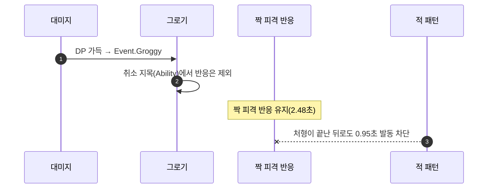

# 반응은 취소 지목의 사정권 밖으로

## 계획

### 목표
뒤잡 처형 도중 적이 반격하는 버그를 부류 규칙으로 없앤다. 발동 차단은 정상 작동했고, 막아 주던 짝 피격 반응이 그로기에게 취소당해 잠금이 사라진 것이 원인이다. 반응끼리는 겹친다는 `EWxAbilityActivationGroup`의 선언을 취소 경로도 지키게 한다.

재현 로그(PIE, `LogWxCombat`·`LogAbilitySystem` Verbose):

```
14.530  Enemy: Activated GA_HitReact_C_0                  ← 짝 피격 반응(2.48초)
14.559~15.631  Ability Failed: GA_Pattern_1/2  40여 회    ← 차단은 정상 작동
15.648  Enemy: Ended GA_HitReact_C_0. WasCancelled: 1     ← 취소당함
15.648  Enemy: Activated GA_Groggy_C_0                    ← 같은 프레임, 범인
16.066  Enemy: Ended GA_Groggy_C_0 / Player: Ended GA_Finisher_C_0
16.083  Enemy: Activated GA_Pattern_1_C_0                 ← 17ms 뒤 반격
```

뒤잡 대미지(계수 3, 약 86)가 적 DP를 MaxDP(50)까지 채워 처형 한복판에 그로기가 새로 뜨고, 그로기의 취소 지목이 `Ability`(전부)라 짝 피격 반응까지 끊었다. 이어 처형 종료가 거는 ResetDP가 그 그로기마저 즉시 끝내, 대상에게 남은 잠금이 하나도 없게 된다.

### 수정 범위
| 파일 | 수정할 내용 | 구분 |
|---|---|---|
| `Plugins/WxCombat/.../Public/AbilitySystem/WxAbilitySystemComponent.h` | `CancelAbilitySpec` 오버라이드 선언 + 규칙 주석 | 수정 |
| `Plugins/WxCombat/.../Private/AbilitySystem/WxAbilitySystemComponent.cpp` | 오버라이드 구현(헤더 선언 순서 위치) | 수정 |
| `Plugins/WxCombat/.../Public/AbilitySystem/Ability/WxAbilityBase.h` | 부류 enum 주석에 취소 규칙 반영 | 수정 |
| `Plugins/WxCombat/.../Private/AbilitySystem/Ability/WxAbility_Groggy.cpp` | 취소 선언 주석을 "액션만"으로 정정 | 수정 |
| `Plugins/WxCombat/.../Private/AbilitySystem/Ability/WxAbility_Death.cpp` | "모든 어빌리티 캔슬" 주석 정정 | 수정 |
| `Plugins/WxCombat/.../Private/AbilitySystem/Ability/WxAbility_HitReact.cpp` | 실재하지 않는 차단 태그를 가리키는 낡은 주석 정정 | 수정 |

에셋 변경은 없다.

### 접근 방식
- **규칙**: 반응은 취소 지목으로 끊기지 않는다. 스스로 끝나거나 다음 몽타주에 밀려 끝난다. 부류가 답하는 질문이 하나 늘어 "발동할 수 있나"에 "취소 지목이 닿는가"가 붙고, 취소 지목은 액션(Exclusive 계열·Independent)에만 닿는다.
- **거는 자리**: 엔진 취소는 전부 가상 함수 `CancelAbilitySpec(Spec, Ignore)`으로 모인다. 발동 시 취소 지목은 `PreActivate → ApplyAbilityBlockAndCancelTags → CancelAbilities(..., this)` 경로라 `Ignore`에 요청한 어빌리티가 실려 오고, 핸들 지정 취소·전체 정리는 비어 온다. 요청자가 실려 온 취소에서만 반응을 건너뛰면 액터 정리·BT 중단은 규칙 밖으로 남는다.
- **부류는 CDO에서 읽는다**: 인스턴스 값은 후딜 전이로 바뀌지만 반응은 후딜에 들지 않고, 취소 대상으로 넘어오는 `Spec.Ability`가 애초에 CDO다.
- **사망이 반응을 못 끊어도 된다**: 그로기는 `Ability.Death` 태그를 직접 구독해 스스로 끝나고, 피격 반응은 사망 몽타주가 밀어내며 끝난다(`PlayDeathMontageOrRagdoll` 주석이 그 인계를 이미 명시한다). 사망의 `BlockAbilitiesWithTag`는 그대로라 죽은 뒤 새 반응이 뜨는 길도 계속 막혀 있다.



---

## 완료

### 수정한 파일
| 파일 | 수정한 내용 | 구분 |
|---|---|---|

### 구현·결정과 그 이유

### 계획 대비 달라진 점

### 후속 과제
