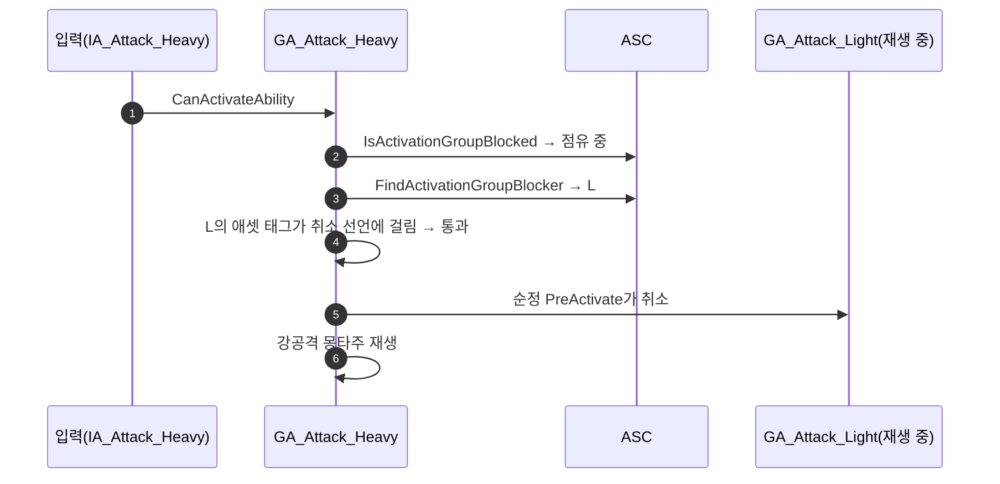

# 약공격 중 강공격이 발동되지 않는 문제

## 계획

### 목표
강공격에 이미 저작된 `CancelAbilitiesWithTag = Ability.Attack.Light`가 실제로 약공격을 끊게 만든다. 지금은 배타 그룹 판정이 그보다 먼저 발동을 거부해 선언이 실행될 기회조차 없다.

원인은 검사 순서다. 엔진은 취소 선언을 `PreActivate`에서 실행하는데, 그 앞의 `CanActivateAbility`에서 이미 거부된다. 약공격·강공격 둘 다 `Exclusive_Blocking`이라 약공격 본동작 중에는 그룹 판정이 강공격을 막고, 후딜(`StartRecovery`)로 넘어가 `Exclusive_Recovery`가 된 뒤에야 통과한다. 지금 후딜 이후에만 강공격이 나가는 것은 태그가 아니라 그룹 전이 덕이다.

### 수정 범위
| 파일 | 수정할 내용 | 구분 |
|---|---|---|
| `Plugins/WxCombat/.../WxAbilitySystemComponent.h` | `FindActivationGroupBlocker` 선언 추가, `IsActivationGroupBlocked` 시그니처는 유지 | 수정 |
| `Plugins/WxCombat/.../WxAbilitySystemComponent.cpp` | 기존 순회를 `FindActivationGroupBlocker`로 옮기고 `IsActivationGroupBlocked`는 그 결과로 판단 | 수정 |
| `Plugins/WxCombat/.../Ability/WxAbilityBase.cpp` | `CanActivateAbility`에서 막힌 경우에만 블로커를 조회해 자신의 취소 선언과 대조 | 수정 |
| `Plugins/WxCombat/.../Ability/WxAbilityBase.h` | 배타 그룹 enum 주석에 취소 선언 예외 명시 | 수정 |

`WxCharacterBase`의 점프 판정 호출부와 에셋은 손대지 않는다.

### 접근 방식
- **판정은 어빌리티가 조립하고, ASC는 점유 사실만 답한다**: ASC의 배타 판정은 태그 개념을 모르고 "지금 누가 점유 중인가"만 돌려준다. "내가 끊겠다고 지목한 상대는 나를 막지 못한다"는 예외는 그 선언을 소유한 어빌리티가 판단한다. 그래서 ASC 시그니처가 그대로라 점프 판정 호출부도 건드리지 않는다.
- **취소는 엔진에 맡긴다**: 게이트는 가부만 정하고 실제 취소는 통과 직후 순정 `PreActivate`가 수행한다. 매칭 기준이 엔진 `CancelAbilities`와 같은 애셋 태그라 부모 태그 확장도 동일하다.
- **전제**: 배타 점유는 동시에 하나뿐이므로(들어온 배타·반응형이 발동 시점에 나머지를 끊는다) 첫 블로커만 조회해도 충분하다.
- **반대 방향 불변**: 약공격에는 취소 선언이 없어 강공격 중 약공격은 계속 막히고, `HasAny`가 빈 컨테이너에 false라 선언 없는 어빌리티의 기존 동작도 그대로다.

---

## 완료

### 수정한 파일
| 파일 | 수정한 내용 | 구분 |
|---|---|---|
| `Plugins/WxCombat/.../WxAbilitySystemComponent.h` | `IsActivationGroupBlocked`를 점유 어빌리티를 돌려주는 `FindActivationGroupBlocker`로 교체 | 수정 |
| `Plugins/WxCombat/.../WxAbilitySystemComponent.cpp` | 같은 순회로 참·거짓 대신 점유 어빌리티를 반환 | 수정 |
| `Plugins/WxCombat/.../Ability/WxAbilityBase.cpp` | 요청자 그룹으로 먼저 거르고, 점유 어빌리티의 애셋 태그를 자신의 취소 선언과 대조해 통과시킨다 | 수정 |
| `Plugins/WxCombat/.../Ability/WxAbilityBase.h` | 배타 그룹 enum과 `CanActivateAbility` 주석에 예외 명시 | 수정 |
| `Source/WxGame/Character/WxCharacterBase.cpp` | 점프 판정도 점유 조회로 교체 | 수정 |
| (위 세 파일 공통) | 후딜 그룹 값을 `Exclusive_Replaceable` → `Exclusive_Recovery`로 개명 | 수정 |

### 구현·결정과 그 이유
- **게이트를 발동 이후로 옮기지 않았다**: 취소가 먼저 돌게 순서를 바꾸는 안을 검토했으나, 엔진에는 `PreActivate`와 `ActivateAbility` 사이에 끼어들 자리가 없다. 게다가 재발동 경로가 게이트보다 먼저 이전 인스턴스를 끝내므로 후딜 창에서만 이어지던 콤보가 매 입력마다 넘어가고, 뒤에서 거부해도 이미 실행된 취소·태그 부착은 되돌릴 수 없으며, 레벨 신호인 입력 라우팅 특성상 홀드 입력이 그 부수효과를 매 프레임 반복한다.
- **취소 여부 판단은 어빌리티가 한다**: ASC는 "지금 누가 점유 중인가"만 답하고 태그 개념을 모른다. 덕분에 점프 판정 호출부는 시그니처째 그대로 두었다.
- **취소 실행은 엔진에 맡겼다**: 게이트는 가부만 정한다. 우리가 취소를 흉내내지 않으므로 매칭 기준이 엔진과 어긋날 여지가 없다.
- **첫 블로커만 조회한다**: 들어온 배타·반응형이 발동 시점에 나머지를 끊어 배타 점유는 동시에 하나뿐이라는 전제이며, 헤더 주석에 남겼다.
- **후딜 그룹 값을 개명했다**: `Replaceable`은 판정 성질을 가리키는 이름인데 그 성질(막지 않는다)은 `Independent`와 공유해 구별에 기여하지 못한다. 이 값이 실제로 하는 일은 취소 대상으로 지목당하는 것 하나뿐이고 그 대상은 곧 후딜에 든 액션이라, 상태를 그대로 부르는 `Exclusive_Recovery`로 바꿨다. 이 값을 선언한 에셋이 없어 직렬화 영향도 없다.
- **배타 판정 함수를 남기지 않고 없앴다**: 요청자 그룹으로 거르는 규칙은 요청자를 아는 어빌리티가 갖고, ASC에는 점유 조회 하나만 남겼다. 점프 판정이 묻던 것도 결국 같은 질문이라 그대로 대체됐고, 판정 함수를 남겼다면 막힌 경우 같은 순회가 두 번 돌았다.

### 계획 대비 달라진 점
- 계획은 `IsActivationGroupBlocked`를 유지하고 그 뒤에 점유 조회를 덧붙이는 형태였다. 그러면 막힌 경우 순회가 두 번 도는 데다 두 함수가 같은 판정을 나눠 갖게 되어, 판정 함수를 없애고 점유 조회 하나로 합쳤다. 그 결과 계획에서 제외했던 `WxCharacterBase`의 점프 판정 한 줄도 함께 바뀌었다.

### 후속 과제
- PIE 실동작 확인은 에디터 재시작 후 필요하다. 지금 떠 있는 에디터는 DebugGame 빌드라 이번 변경이 반영되지 않는다.
- `UWxAbilityBase::ActivateAbility`의 그룹 취소 세 줄 중 Blocking·Reaction 두 줄은 Death·HitReact의 태그 선언과 완전히 겹친다. 반응형이 모두 취소를 태그로 선언하면 걷어낼 수 있으나 Groggy·Finisher는 선언이 없어 지금 걷으면 회귀하므로 별건으로 다룬다.
