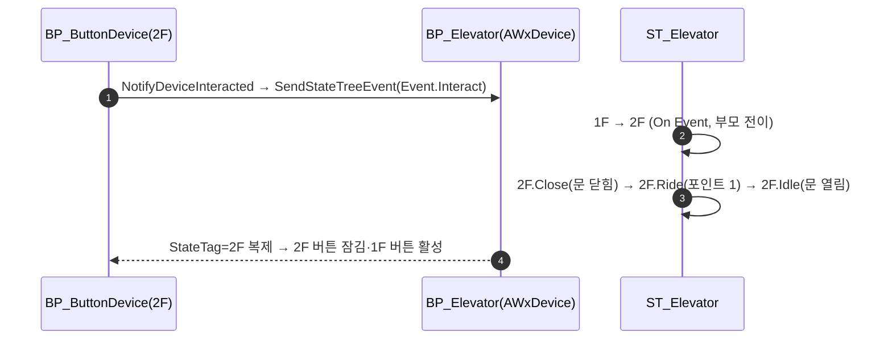

# 엘리베이터 복구 — ST_Elevator 재저작 + 호출 버튼 층별 잠금

## 계획

### 목표
BP_Elevator 가 PIE 에서 통째로 멈춰 있다. ST_Elevator 에 오늘 타입이 바뀐 `TargetComponent` 의 옛 바인딩 4건이 남아 컴파일이 실패하고, 그래서 트리가 아예 열리지 않는다(로그: "failed to link… not usable at runtime" → "State Tree 가 열리지 않았다"). 컴파일이 되더라도 지금 구조(빈 태스크 노드, 전이 없는 고아 상태, 컴포넌트 지목 전부 `None`)로는 움직이지 않는다. ST 를 재저작하고, 내장 호출 버튼 2개에 층별 잠금을 기입해 "버튼을 누르면 그 층으로 이동"을 성립시킨다. C++ 변경은 없다.

### 수정 범위
| 파일 | 수정할 내용 | 구분 |
|---|---|---|
| `Content/WorldObject/Gimmick/ST_Elevator.uasset` | 옛 바인딩 4건 제거, 상태 구조 재저작, 컴파일·저장 (MCP) | 수정 |
| `Content/WorldObject/Gimmick/BP_Elevator.uasset` | CAC 템플릿 `TriggerDevice_1F`/`_2F` 의 `StateTagRequirements` 기입, 컴파일·저장 (MCP) | 수정 |

### 접근 방식
- **층 상태가 "그 층으로 가는 시퀀스"를 품는다**: `Root → 1F[Tag 1F] / 2F[Tag 2F]`, 각 층 아래 `Close(문 닫기) → Ride(스플라인 이동, 층 포인트) → Idle(문 열고 대기)` 자식 셋. `On Event(Event.Interact)` 전이는 층 부모에 두어 이동 중 반대 층 호출도 받는다. 태그는 부모에만 달고, 자식은 `GetActiveStateTag` 가 위로 올라가 읽는다.
- **`Moving` 태그를 쓰지 않는 이유**: 클라 추종·세이브 복원은 태그 한 값으로 `RequestState` 하는데, Moving 아래 방향 자식을 두면 언제나 첫 자식이 골라져 반대로 간다. 층 상태가 시퀀스를 품으면 추종·복원이 같은 안무를 그대로 재생한다.
- **완료 비트 함정 회피**: 판정 태스크 0개 상태는 진입 시 자기 비트(오프셋 N)를 씻지 않는다. Idle 은 태스크 2개·판정 0개라 자기 비트가 오프셋 2이고 형제 Close(비트 0·1)·Ride(비트 0)가 그 비트를 건드리지 않으므로 Idle 은 영원히 Running 이다. `OnStateCompleted → None` 은 컴파일 에러라 쓸 수 없다.
- **버튼 잠금**: 1F 버튼 템플릿 `RequireTags=[Device.Elevator.2F]`, 2F 버튼은 대칭. `LinkedDevices` 는 BeginPlay 의 ChildActor 자동 배선이 채운다. 두 버튼 CAC 는 SceneRoot 에 붙어 층에 고정된다.
- **범위 밖**: 같은 원인으로 ST_CheckPoint·ST_TreasureChest 도 컴파일이 실패해 열리지 않는다 — 이번엔 손대지 않는다.

---

## 완료

### 수정한 파일
| 파일 | 수정한 내용 | 구분 |
|---|---|---|
| `Content/WorldObject/Gimmick/ST_Elevator.uasset` | 옛 `Target Component` 바인딩 4건 제거, Root 아래를 `1F`/`2F` 둘로 정리(고아 상태 3개·빈 태스크 노드 제거), 각 층에 `Close → Ride → Idle` 자식 신설, 컴파일·저장 (MCP) | 수정 |
| `Content/WorldObject/Gimmick/BP_Elevator.uasset` | CAC 템플릿 `TriggerDevice_1F` 에 `RequireTags=[Device.Elevator.2F]`, `TriggerDevice_2F` 에 `[Device.Elevator.1F]`, 컴파일·저장 (MCP) | 수정 |
| `Plugins/WxCore/Source/WxCore/Public/WxGameplayTags.h` · `Private/WxGameplayTags.cpp` | 미사용이 된 `Device_Elevator_Moving` 선언·정의 삭제 (후속 지시) | 수정 |
| `Config/DefaultGameplayTags.ini` | `Gimmick.Elevator.Moving → Device.Elevator.Moving` 리다이렉트 삭제 (대상 태그가 사라져 함께 제거) | 수정 |

### 구현·결정과 그 이유
- **트리가 아예 안 열리던 원인은 컴파일 실패였다**: 오늘 타입이 바뀐 컴포넌트 지목 프로퍼티에 옛 바인딩이 남아 "properties are incompatible" 로 컴파일이 막혔고, 링크에 실패한 에셋은 런타임에 쓸 수 없어 컴포넌트가 시작을 거부했다. 바인딩을 걷어내고 드롭다운 이름(`DoorLeft`·`DoorRight`·`PlatformRoot`·`SplineComponent`)을 직접 기입했다.
- **층 상태가 시퀀스를 품는다**: 버튼이 눌리는 순간 태그가 목적지 층이 되고, 문 닫기 → 이동 → 문 열고 대기가 그 층 안에서 순차로 돈다. 추종·복원이 태그 하나로 같은 안무를 재생하므로 `Moving` 태그 아래 방향 자식을 두는 구조의 함정(언제나 첫 자식 선택)을 피한다. `Device.Elevator.Moving` 태그는 쓰지 않는다.
- **호출 전이는 층 부모에**: 자식 어디에 있든 반대 층 버튼이 닿아, 이동 중 호출이면 현재 지점에서 되돌아온다. 스플라인 이동 태스크가 이미 현 위치 출발·반전을 지원해 추가 코드가 필요 없었다.
- **Idle 이 머무는 근거**: 판정 태스크 0개 상태는 진입 시 자기 완료 비트(오프셋 N)를 씻지 않는 엔진 버그가 있어, 형제가 그 비트를 세우는지 확인했다. Idle(태스크 2·판정 0)의 자기 비트는 오프셋 2, 형제 Close 는 0·1, Ride 는 0 만 쓰므로 안전하다. PIE 에서 LogStateTree Verbose 로 되감김 없음을 확인했다.
- **잠금은 CAC 템플릿에**: 1F 버튼은 엘리베이터가 2F 에 있거나 2F 로 가는 중일 때만 활성이라는 규칙이 BP 고유 값이라 인스턴스가 아니라 템플릿에 뒀다. BP 재컴파일만으로 배치 인스턴스의 차일드 액터에 반영됐고(레벨 재로드 불필요), `LinkedDevices` 는 BeginPlay 자동 배선이 채움을 PIE 로 확인했다.

### 계획 대비 달라진 점
- 계획은 `Close`/`Ride` 의 완료 전이를 `NextState` 로 기입하는 것이었으나, MCP 로 `NextState` 를 넣으면 에디터가 **자기 자신으로 가는 `GotoState`** 로 바꿔치기했다(컴파일은 통과, 런타임엔 무한 재진입). 형제 상태의 ID 로 `GotoState` 를 명시해 해결했다.
- 계획은 `Device.Elevator.Moving` 태그를 "남겨 두되 쓰지 않는다"였으나, 완료 보고 후 사용자 지시로 **정의 자체를 삭제**했다. 이동 중 양쪽 버튼을 다 잠그려면 방향별 태그 2개가 필요해 어차피 이 태그 하나로는 성립하지 않았다.
- 나머지는 계획대로.

### 검증
- `CompileStateTree` succeeded, 두 에셋 저장 실기록 확인(mtime·git).
- PIE: `State Tree 가 열리지 않았다` 가 BP_Elevator 에서 사라짐. 시작 직후 `StateTag=Device.Elevator.1F` 발행, 문 `±200` 으로 열려 유지, 플랫폼 포인트 0, 버튼 2개 `LinkedDevices=[엘리베이터]`·층 요건 적용. Verbose 로그에 전이·되감김 없음.
- 실제 버튼 조작(입력)은 MCP 로 넣을 수 없어 사람 확인이 남았다.
- 태그 삭제 후 WxEditor(Development) 빌드 `Result: Succeeded`(WxCore DLL 에서 `Device.Elevator.Moving` 문자열 소거 확인). 첫 시도는 병행 편집 중이던 `WxCharacterBase.cpp` 의 일시적 오류(`FindActivationGroupBlocker` 미정의)로 실패했으나 이번 변경과 무관하며 재시도에서 통과했다.

### 후속 과제
- **사람 PIE 확인**: 1F 에서 1F 버튼 프롬프트 없음, 2F 버튼 → 문 닫힘·상승(2초)·문 열림, 2F 에서 대칭, 이동 중 반대 층 호출 시 되돌아오는지. 이동 시간(`Ride` 2초)·문 시간(1초)은 취향대로 조정.
- **같은 원인으로 아직 안 열리는 장치**: ST_CheckPoint(나이아가라 스폰 `Attach Component`)·ST_TreasureChest(애니메이션 재생 `Target Mesh`) — 바인딩 제거 + 드롭다운 이름 기입으로 같은 방식으로 고친다. 이번 범위 밖이라 손대지 않았다.
- 첫 플레이 시작 직후 문이 1초간 열리는 연출이 보인다(아키타입이 닫힌 포즈라서). 거슬리면 BP 의 문 기본 위치를 열린 포즈로 두고 `Close` 오프셋을 반대로 주면 스냅된다.
