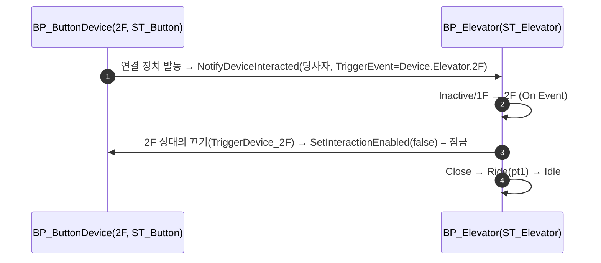

# 엘리베이터 미가동 상태 + 버튼이 목적지 이벤트를 보내고 엘리베이터가 버튼을 잠근다

## 계획

### 목표
엘리베이터에 미가동(Inactive) 상태를 넣어 최초엔 문이 닫힌 아키타입 포즈 그대로 서 있다가 첫 호출에 가동하게 한다. 버튼이 `AWxDevice`+ST_Button 으로 흡수된 구조 위에서, 미가동에선 두 버튼이 다 눌릴 수 있어 "반대 층" 토글로는 갈 층을 정할 수 없다 — 장치가 연결 장치에 보낼 이벤트(`TriggerEvent`)를 저작하게 하고, 자기 층 버튼 잠금은 엘리베이터 트리가 내장 버튼을 상태마다 끄고 켜는 것으로 표현한다.

### 수정 범위
| 파일 | 수정할 내용 | 구분 |
|---|---|---|
| `Plugins/WxCore/.../WxGameplayTags.h` · `.cpp` | `Device_Elevator_Inactive` 추가 | 수정 |
| `Plugins/WxWorld/.../Device/WxDevice.h` · `.cpp` | `TriggerEvent`(기본 `Event.Interact`) 추가, `NotifyDeviceInteracted(Interactor, EventTag)`, 남의 잠금(`bInteractionLocked`)을 자기 켜짐과 분리 | 수정 |
| `Plugins/WxWorld/.../Device/WxStateTreeTask_TriggerLinkedDevices.h` · `.cpp` | 오너의 `TriggerEvent` 를 함께 넘김 | 수정 |
| `Plugins/WxWorld/.../Interaction/WxStateTreeTask_EnableInteraction.h` · `.cpp` | `ChildDevice`(컴포넌트 드롭다운, ChildActorComponent) 갈래 — 오너 BP 의 내장 장치를 잠그고 푼다 | 수정 |
| `Plugins/WxWorld/README.md` | 발동 장치 연결 항목에 `TriggerEvent`·내장 장치 잠금 | 문서 |
| `Content/WorldObject/Gimmick/ST_Elevator.uasset` | Root 첫 자식 `Inactive`[Tag Inactive](태스크 없음), 층 상태에 내장 버튼 끄기/켜기, 전이를 목적지 태그 이벤트로 (MCP) | 수정 |
| `Content/WorldObject/Gimmick/BP_Elevator.uasset` | CAC 템플릿 `TriggerDevice_1F/2F` 의 `TriggerEvent` 를 각 층 상태 태그로 (MCP) | 수정 |

### 접근 방식
- **규칙 하나**: 장치는 연결 장치에 `TriggerEvent` 를 보낸다. 기본 `Event.Interact` 라 문 버튼은 그대로이고, 엘리베이터 버튼만 목적지 층의 상태 태그를 보낸다. ST 는 `On Event(그 태그)` 로 받는다.
- **잠금은 대상 트리가**: README 가 이미 정한 방향("상태별 잠금은 대상 트리의 상호작용 켜기")인데 Target 갈래가 레벨 액터(UOL)뿐이라 공유 에셋이 자기 내장 버튼을 지목할 수 없었다. `FWxComponentName` 으로 ChildActorComponent 를 지목하는 `ChildDevice` 갈래를 더한다.
- **남의 잠금과 자기 켜짐 분리**: `SetInteractionEnabled` 가 자기 바인딩을 비우는 토글이라, 버튼처럼 자기 트리가 바인딩을 든 장치를 남이 껐다 켜면 프롬프트·발행자 없이 켜졌다. 잠금을 별도 값으로 두고 `CanInteract = 켜짐 && !잠김`.
- **ST_Elevator**: `Root → Inactive[Inactive] / 1F[1F] / 2F[2F]`. Inactive 는 태스크 없음·`On Event(1F)→1F`·`On Event(2F)→2F`. 층 부모는 `끄기(자기 층 버튼)`·`켜기(반대 층 버튼)`·`On Event(반대 층)→반대 층`, 자식 Close→Ride→Idle 은 그대로. 전이는 상태마다 목적지만 두어 자기 층 재진입을 구조로 막는다.
- **완료 비트**: 태스크 0개 상태는 진입 시 자기 비트를 제대로 씻고, 층 부모(즉발 2·판정 0)의 자기 비트(오프셋 2)는 형제·자식 누구도 세우지 않는다.

---

## 완료

### 수정한 파일
| 파일 | 수정한 내용 | 구분 |
|---|---|---|
| `Plugins/WxCore/.../WxGameplayTags.h` · `.cpp` | `Device_Elevator_Inactive`, `Event_Device_Triggered` 추가 | 수정 |
| `Plugins/WxWorld/.../Device/WxDevice.h` · `.cpp` | `TriggerEvent`(기본 `Event.Device.Triggered`), `NotifyDeviceInteracted(Interactor, EventTag)`, 남의 잠금 `bInteractionLocked` 분리(`CanInteract = 켜짐 && !잠김`), doc 정정 | 수정 |
| `Content/WorldObject/Gimmick/ST_Door.uasset` | Close/Open 의 수신 전이를 `On Event(Event.Device.Triggered)` 로 (MCP) | 수정 |
| `Plugins/WxWorld/.../Device/WxStateTreeTask_TriggerLinkedDevices.h` · `.cpp` | 오너의 `TriggerEvent` 를 함께 넘김 | 수정 |
| `Plugins/WxWorld/.../Interaction/WxStateTreeTask_EnableInteraction.h` · `.cpp` | `ChildDevice` 갈래(ChildActorComponent 드롭다운) — 내장 장치를 계약으로 잠그고 푼다, 설명문 표시 | 수정 |
| `Plugins/WxWorld/README.md` | 발동 장치 연결 항목에 `TriggerEvent`·내장 장치 잠금 서술 | 문서 |
| `Content/WorldObject/Gimmick/ST_Elevator.uasset` | Root 첫 자식 `Inactive`[Tag Inactive](태스크 없음, On Event 1F/2F), 층 부모에 끄기(자기 층 버튼)·켜기(반대 층 버튼), 전이를 목적지 태그 이벤트로 (MCP) | 수정 |
| `Content/WorldObject/Gimmick/BP_Elevator.uasset` | CAC 템플릿 `TriggerDevice_1F/2F` 의 `TriggerEvent` 를 각 층 상태 태그로 (MCP) | 수정 |
| `Content/__ExternalActors__/Maps/LV_DevCombat/7/M0/VPAJ…AY.uasset` | 배치 엘리베이터의 버튼 CAC 템플릿 재생성 후 재저장 (MCP) | 수정 |

### 구현·결정과 그 이유
- **규칙은 하나, 값만 다르다**: 장치는 연결 장치에 `TriggerEvent` 를 보낸다. 문 버튼은 기본값 그대로라 ST_Door·ST_Button 을 손대지 않았고, 엘리베이터 버튼만 목적지 층의 상태 태그를 보낸다. 이벤트 태그가 곧 페이로드라 전이에 조건·바인딩이 붙지 않는다.
- **잠금은 엘리베이터 트리가 건다**: 자기 층 버튼을 끄는 것은 엘리베이터의 상태이므로 그 상태에 태스크로 적는다. 공유 에셋이 내장 버튼을 지목할 수 있도록 `ChildDevice` 갈래를 더했고, 드롭다운은 기존 커스터마이제이션의 `AllowedClasses` 메타로 ChildActorComponent 만 보인다.
- **남의 잠금과 자기 켜짐을 분리했다**: 기존 `SetInteractionEnabled` 는 자기 바인딩을 비우는 토글이라, 버튼처럼 자기 트리가 프롬프트·발행자를 든 장치를 남이 껐다 켜면 빈 바인딩으로 켜져 눌러도 아무 일이 없었다. 잠금을 별도 값으로 두니 풀면 원래 바인딩으로 돌아온다.
- **Inactive 는 비어 있다**: 잠금 기본값이 "안 잠김"이라 두 버튼이 눌리고, 문·플랫폼은 스폰 포즈다. 태스크 0개 상태는 진입 시 자기 완료 비트를 제대로 씻어 머문다.
- **전이는 상태마다 목적지만**: Root 에 몰면 자기 층 버튼 이벤트로 같은 층을 재진입해 문이 헛여닫힌다. 잠금이 막아 주지만 구조로도 막는다.

### 계획 대비 달라진 점
- **(후속 확정) `TriggerEvent` 태그 규칙을 문서로 못 박았다**: ① 기본 `Event.Device.Triggered`("눌렸다"), ② 갈래가 필요하면 요청하는 상태의 태그를 보내며 그 뜻은 "그 상태로 가 달라" 하나뿐, ③ 상태가 아닌 동작 요청은 그때 `Event.Device.<장치>.<동사>`. 상태 태그를 이벤트로 겸용하는 것은 런타임에 충돌이 없고(상태 키와 이벤트 매칭은 별개 통로) 태그가 늘지 않아 택했다 — 오독은 규칙 문장으로 막는다. WxWorld README 발동 장치 항목·WxCore README 태그 표에 기록.
- **(후속 지시) 장치 기본 이벤트를 `Event.Device.Triggered` 로 분리했다**: `TriggerEvent` 기본값이 `Event.Interact` 라 어빌리티 발동 트리거 태그와 이름이 겹쳤다. 전용 태그를 신설해 생성자 기본값·ST_Door 의 수신 전이 두 곳을 바꾸고, `Event.Interact` 는 스캐너→어빌리티 경로에만 남겼다(그쪽은 손대지 않기로 한 범위).
- **배치 인스턴스의 버튼 CAC 템플릿 재생성이 추가됐다**: 에디터 재시작 후 레벨의 엘리베이터 인스턴스 CAC 가 `ChildActorTemplate=None` 이라 자식 버튼이 ST 없이 스폰됐다(문 인스턴스는 정상). 인스턴스 CAC 의 `ChildActorClass` 를 비웠다 되돌려 BP 템플릿을 다시 가리키게 하고 `save_assets([])` 로 외부 액터를 저장했다.
- 나머지는 계획대로.

### 검증
- WxEditor(Development) 빌드 `Result: Succeeded`, 에디터 재시작, ST_Elevator 컴파일 succeeded, ST·BP·외부 액터 저장 실기록.
- PIE: 엘리베이터 `StateTag=Device.Elevator.Inactive`, 문 `(250,0,0)`·플랫폼 `(0,0,0)`; 버튼 2개 `StateTag=Device.Button.Idle`, `TriggerEvent` 각 층, `LinkedDevices=[엘리베이터]`. 남은 에러는 선행 잔여(ST_CheckPoint·ST_TreasureChest)뿐.
- 태그 분리 후 재빌드·재시작·ST_Door 컴파일·저장, PIE 재확인: 문 `Device.Door.Close`, 문 버튼 `TriggerEvent=Event.Device.Triggered`·`LinkedDevices=[문]`·`Device.Button.Idle`. 장치 코드에 남은 `Event.Interact` 참조는 스캐너→어빌리티 경로뿐.

### 후속 과제
- **사람 PIE 확인**(입력은 MCP 로 못 넣음): 미가동에서 1F 버튼 → 문만 열림, 2F 버튼 → 닫힌 채 상승 후 열림; 가동 후 자기 층 버튼 프롬프트 없음(잠김), 반대 층 버튼으로 이동, 이동 중 되돌아오기; 문 버튼 여닫기 그대로.
- ST_CheckPoint·ST_TreasureChest 는 옛 바인딩 잔존으로 여전히 안 열린다(엘리베이터와 같은 수법으로 고칠 수 있음).
- 옆 세션이 남긴 `Content/DesignerTables/DT_CharacterAttribute.uasset` 무변경 재저장 흔적은 이번 작업과 무관하다.
