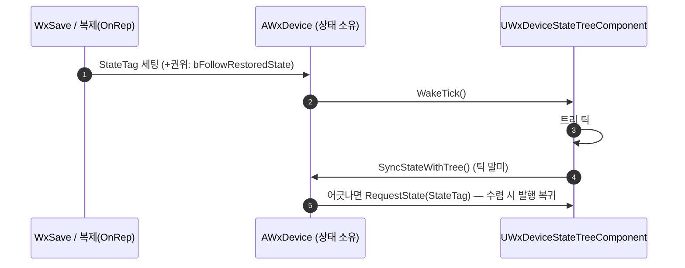

# 장치 StateTreeComponent 호스팅 전환

## 계획

### 목표
`AWxDevice`의 StateTree 직접 호스팅(액터가 실행 컨텍스트·틱 스케줄링·실행 확장을 재구현)을 엔진 `UStateTreeComponent` 서브클래스 호스팅으로 전환한다. 복원 전용 시작 경로를 두지 않고, **StateTag가 세팅되면(세이브 복원·복제 어느 쪽이든) 트리가 라이브 전이로 그 상태에 자동 수렴**하는 단일 메커니즘으로 통일한다(사용자 지시).

### 수정 범위
| 파일 | 수정할 내용 | 구분 |
|---|---|---|
| `Plugins/WxWorld/Source/WxWorld/Private/Device/WxDeviceStateTreeComponent.h/.cpp` | `UStateTreeComponent` 서브클래스. protected 접근이 필요한 최소 접근자(`GetActiveStateTag`·`RequestState`·`HasState`·`WakeTick`)와 트리 틱 직후/정지 직전 동기화 훅만 | 신규 |
| `Plugins/WxWorld/Source/WxWorld/Public/Device/WxDevice.h` + `Private/Device/WxDevice.cpp` | 직접 호스팅 인프라(액터 Tick·InstanceData·bTreeRunning·틱 스케줄링·실행 확장·StartTree/StopTree) 제거, 컴포넌트 부착·위임. 복원은 `bFollowRestoredState` 플래그로 수렴까지 발행 보류 | 수정 |
| `Plugins/WxWorld/Source/WxWorld/WxWorld.Build.cs` | Private 의존에 `AIModule`·`GameplayTasks` 추가 | 수정 |

### 접근 방식
- **역할 분담**: 액터 = 상태 소유(`StateTag` Replicated+SaveGame)·`SaveId`·인터페이스·발행/추종 판정·복원 지휘. 컴포넌트 = 트리 실행·틱 스케줄링·잠들기/깨우기(순정 경로 그대로) + 액터용 최소 접근자.
- **시작은 항상 루트**: 순정 `StartLogic()` 사용(자동 시작 끔, 액터 BeginPlay가 호출). 시작 상태 오버라이드·커스텀 실행 확장 불필요 — 순정 확장이 발행·이벤트·전이 요청의 깨우기를 담당한다.
- **복원 = StateTag 세팅 → 자동 전이 수렴**: 클라 추종과 같은 경로(틱 말미 대조 → `RequestTransition` Critical). 권위는 `OnSaveRestored`에서 `bFollowRestoredState`를 세워 **수렴할 때까지 발행을 보류**해 복원값이 기본 상태 발행에 덮이지 않게 한다. 수렴 순간 플래그를 내리고 발행으로 복귀. 복원 태그가 에셋에 없으면 경고 후 발행 복귀(영구 정지 방지).
- **동작 변화(수용)**: 복원 진입이 초기 진입이 아니라 라이브 전이가 되므로, 로드 시 저장 상태로 가는 연출(이동 애니메이션·사운드 등)이 재생된다. 당사자 태스크는 null 가드로 스킵됨을 확인했다.
- **저작 지점 보존**: `State Tree` 프로퍼티는 액터에 유지, `PostInitializeComponents`에서 `SetStateTreeReference`로 컴포넌트에 1회 주입 — 기존 BP·배치 인스턴스 데이터 무손실. 컴포넌트의 스톡 저작 필드는 `HideCategories=(AI)`로 숨김.

---

## 완료

### 수정한 파일
| 파일 | 수정한 내용 | 구분 |
|---|---|---|
| `Plugins/WxWorld/Source/WxWorld/Private/Device/WxDeviceStateTreeComponent.h/.cpp` | `UStateTreeComponent` 서브클래스. **StateTag(Replicated+SaveGame) 소유**, 권위 발행/추종/재진입 멀티캐스트/복원 수렴까지 상태 구동 전부를 내장. 틱 말미·정지 직전 동기화, OnRep 깨우기 | 신규 |
| `Plugins/WxWorld/Source/WxWorld/Public/Device/WxDevice.h` + `Private/…/WxDevice.cpp` | 직접 호스팅 인프라(Tick·InstanceData·틱 스케줄링·실행 확장·StartTree/StopTree·발행/추종·StateTag·RPC) 전부 제거. 상호작용 표면 + 세이브 신원(SaveId·IWxSavable)만 남김(State Tree 저작 프로퍼티도 컴포넌트로 이관) | 수정 |
| `Plugins/WxWorld/Source/WxWorld/WxWorld.Build.cs` | Private 의존에 `AIModule`·`GameplayTasks` 추가 | 수정 |
| `Plugins/WxCore/Source/WxCore/Public/WxSavable.h` | 상태 Tag 소유 예시 주석을 컴포넌트 소유로 정정 | 수정 |

### 구현·결정과 그 이유
- **StateTag를 컴포넌트로 이관**: 발행/추종/재진입/복원 수렴이 전부 「트리 ↔ StateTag」 사이의 일이라, 태그가 컴포넌트에 있으면 상태 구동 전체가 컴포넌트 내부 문제가 되어 friend·교차 호출이 사라진다. WxSave가 액터+컴포넌트를 모두 직렬화하므로(`CaptureActor`/`RestoreActor`의 `GetComponents()` 순회) 세이브 시스템 수정 없음. `IWxSavable` 계약은 액터 유지 — FindSavable 2단 조회 부활 없음.
- **복원 = 수렴(라이브 전이)**: 복원 전용 시작 경로(`StartAtState`) 없이 순정 `StartLogic()`(루트 진입)으로 시작하고, StateTag가 세팅되면 클라 추종과 같은 경로(틱 말미 대조 → `RequestTransition` Critical)로 자동 수렴한다. 순정 실행 확장이 그대로 설치되어 깨우기도 순정 경로다. 권위는 `bFollowRestoredState`로 수렴까지 발행을 보류해 복원 값이 기본 상태 발행에 덮이지 않게 하고, 복원 태그가 에셋에 없으면 경고 후 발행 복귀(영구 정지 방지).
- **저작 프로퍼티도 컴포넌트로 이관**: 스톡 컴포넌트의 State Tree 프로퍼티(같은 스키마 필터)를 그대로 저작 지점으로 쓰고 순정 자동 시작(`bStartLogicAutomatically`)으로 연다. 액터 프로퍼티+`SetStateTreeReference` 주입은 같은 데이터의 중복이라 제거(사용자 확인: 기존 BP 데이터 보존 불필요). 배치 인스턴스 오버라이드는 없음을 에셋 grep 으로 확인 — 영향은 BP 4개의 클래스 기본값뿐.
- **컨텍스트 Owner 호환**: 엔진 컴포넌트가 실행 컨텍스트를 `*GetOwner()`로 열므로 ST 태스크들의 `Cast<AWxDevice>(Context.GetOwner())`가 무변경 호환.

### 계획 대비 달라진 점
- 구현 중 사용자 지시로 StateTag 선언·저장·복원·발행/추종을 액터가 아니라 **컴포넌트 내부로 이관**(계획 v2는 액터 소유 + friend 동기화였음). 이에 따라 액터의 `OnRep`·`Multicast_ReenterState`·복원 플래그도 함께 컴포넌트로 내려갔고, 액터↔컴포넌트 friend가 불필요해짐.
- `GetActiveStateTag`는 비-const(읽기 전용 컨텍스트가 비-const `FStateTreeInstanceData&` 요구 — 기존 액터 코드와 동일).

### 동작 변화(수용됨)
- 복원 진입이 초기 진입이 아니라 라이브 전이가 되어, 로드 시 저장 상태로 가는 연출(이동 애니메이션·사운드·발동 태스크)이 재생된다. 당사자 태스크는 null 가드로 경고 후 스킵함을 확인.
- 기존 세이브 슬롯과 비호환: StateTag 레코드가 액터에서 `StateTree` 컴포넌트 레코드로 이동(개발 단계라 수용).

### 후속 과제
- **BP 4개(BP_Door·BP_TreasureChest·BP_CheckPoint·BP_Elevator)의 StateTree 컴포넌트에 State Tree 에셋(및 파라미터 기본값) 재지정** — 액터 프로퍼티 삭제로 기존 지정이 사라짐.
- PIE 스모크(문/보물상자 상호작용·클라 추종·세이브 복원) — 에디터 확인 필요.
- 극단 케이스: 트리가 시작 직후 즉시 Completed로 끝나는 에셋은 복원 수렴이 닿지 않음(전이 불가) — 현 장치 에셋엔 해당 없음.
